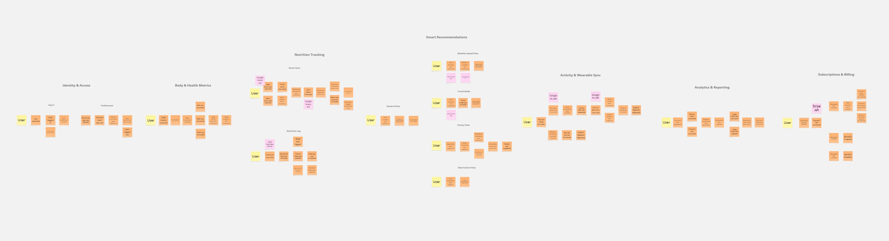

# CAPÍTULO II: REQUIREMENTS ELICITATION & ANALYSIS

## 2.1. Competidores

### 2.1.1. Análisis competitivo

### 2.1.2. Estrategias y tácticas frente a competidores

## 2.2. Entrevistas

### 2.2.1. Diseño de entrevistas

### 2.2.2. Registro de entrevistas

### 2.2.3. Análisis de entrevistas

## 2.3. Needfinding

Para comprender de manera integral las necesidades, comportamientos y motivaciones de los usuarios de nuestra plataforma, se realizaron entrevistas cualitativas y análisis de experiencias relacionadas con el seguimiento nutricional y hábitos de salud. Estas interacciones permiten explorar las dificultades en el registro de alimentos, la interpretación de datos nutricionales y la falta de personalización en las recomendaciones. Asimismo, se identificaron barreras como la desmotivación, la complejidad de uso de aplicaciones existentes y la escasa retroalimentación en tiempo real. Este proceso permitió reconocer tanto necesidades explícitas como implícitas, estableciendo una base sólida para el diseño de una solución centrada en el usuario, eficiente y alineada con sus objetivos de bienestar. 

### 2.3.1. User Personas

**Segmento 1: Pérdida de peso**

.png)

**Segmento 2: Ganancia de masa muscular**

.png)

### 2.3.2. User Task Matrix

**Segmento 1: Pérdida de peso**
<table>
  <thead>
    <tr>
      <th rowspan="2">Task</th>
      <th colspan="2">Jorge Del Aguila</th>
      <th colspan="2">Anthony López</th>
      <th colspan="2">Evelyn Díaz</th>
    </tr>
    <tr>
      <th>Frequency</th>
      <th>Importance</th>
      <th>Frequency</th>
      <th>Importance</th>
      <th>Frequency</th>
      <th>Importance</th>
    </tr>
  </thead>
  <tbody>
    <tr>
      <td>Control the amount of food consumed daily</td>
      <td>Normally</td>
      <td>High</td>
      <td>Sometimes</td>
      <td>Medium</td>
      <td>Normally</td>
      <td>High</td>
    </tr>
    <tr>
      <td>Estimate the calories of food before consuming them</td>
      <td>Normally</td>
      <td>High</td>
      <td>Sometimes</td>
      <td>Medium</td>
      <td>Normally</td>
      <td>High</td>
    </tr>
    <tr>
      <td>Decide what to eat when away from home</td>
      <td>Sometimes</td>
      <td>Medium</td>
      <td>Normally</td>
      <td>High</td>
      <td>Sometimes</td>
      <td>Medium</td>
    </tr>
    <tr>
      <td>Evaluate progress in relation to weight</td>
      <td>Normally</td>
      <td>High</td>
      <td>Sometimes</td>
      <td>Medium</td>
      <td>Normally</td>
      <td>High</td>
    </tr>
    <tr>
      <td>Avoid foods perceived as unhealthy</td>
      <td>Normally</td>
      <td>High</td>
      <td>Sometimes</td>
      <td>Medium</td>
      <td>Normally</td>
      <td>High</td>
    </tr>
    <tr>
      <td>Adapt eating habits according to daily routine</td>
      <td>Normally</td>
      <td>High</td>
      <td>Normally</td>
      <td>High</td>
      <td>Normally</td>
      <td>High</td>
    </tr>
  </tbody>
</table>

 

**Segmento 2: Ganancia de masa muscular**

<table>
  <thead>
    <tr>
      <th rowspan="2">Task</th>
      <th colspan="2">Daphne Vergaray</th>
      <th colspan="2">David Ramos</th>
      <th colspan="2">Maria Roque</th>
    </tr>
    <tr>
      <th>Frequency</th>
      <th>Importance</th>
      <th>Frequency</th>
      <th>Importance</th>
      <th>Frequency</th>
      <th>Importance</th>
    </tr>
  </thead>
  <tbody>
    <tr>
      <td>Calculate the amount of protein consumed daily</td>
      <td>Normally</td>
      <td>High</td>
      <td>Sometimes</td>
      <td>Medium</td>
      <td>Normally</td>
      <td>High</td>
    </tr>
    <tr>
      <td>Plan meals according to muscle gain physical goals</td>
      <td>Normally</td>
      <td>High</td>
      <td>Normally</td>
      <td>High</td>
      <td>Normally</td>
      <td>High</td>
    </tr>
    <tr>
      <td>Adjust nutrition according to physical activity</td>
      <td>Normally</td>
      <td>High</td>
      <td>Normally</td>
      <td>High</td>
      <td>Normally</td>
      <td>High</td>
    </tr>
    <tr>
      <td>Search for suitable options when eating away from home</td>
      <td>Normally</td>
      <td>High</td>
      <td>Normally</td>
      <td>High</td>
      <td>Sometimes</td>
      <td>Medium</td>
    </tr>
    <tr>
      <td>Maintain consistency in nutrition over time</td>
      <td>Sometimes</td>
      <td>Medium</td>
      <td>Normally</td>
      <td>High</td>
      <td>Normally</td>
      <td>High</td>
    </tr>
    <tr>
      <td>Evaluate if foods meet nutritional requirements</td>
      <td>Normally</td>
      <td>High</td>
      <td>Normally</td>
      <td>High</td>
      <td>Sometimes</td>
      <td>Medium</td>
    </tr>
  </tbody>
</table>

**Análisis de User Task Matrix**

El análisis de las matrices permite identificar patrones clave en el comportamiento de los usuarios y extraer información relevante para el desarrollo de nuestra plataforma.
En el segmento de pérdida de peso, las tareas con mayor frecuencia e importancia se centran en el control de la ingesta alimentaria y la toma de decisiones en contextos cotidianos. Destacan especialmente controlar la cantidad de alimentos consumidos y decidir qué comer fuera de casa, lo que evidencia que los principales desafíos no radican únicamente en el conocimiento nutricional, sino en la incertidumbre al momento de elegir en situaciones reales.

En el segmento de ganancia de masa muscular, las tareas críticas están orientadas a la optimización nutricional, principalmente en el cálculo de proteínas y la evaluación de requerimientos nutricionales. Esto refleja un comportamiento más analítico, donde la precisión y la consistencia son determinantes para alcanzar los objetivos físicos.

Al comparar ambos segmentos, se identifican similitudes relevantes: en ambos casos, existe una alta importancia en el control de la alimentación y en la toma de decisiones fuera del entorno controlado. Sin embargo, difieren en su enfoque: el segmento de pérdida de peso tiende a ser más reactivo y contextual, mientras que el de ganancia muscular es más planificado y orientado a métricas específicas.

A partir de ello, se derivan insights clave para nuestra plataforma. En primer lugar, es fundamental diseñar soluciones que brinden soporte en la toma de decisiones en tiempo real, especialmente en contextos como restaurantes o situaciones variables. En segundo lugar, la plataforma debe ofrecer niveles diferenciados de profundidad, combinando simplicidad para usuarios que buscan orientación rápida y precisión para aquellos que requieren control detallado de nutrientes. Finalmente, se valida que el uso de datos contextuales como la ubicación, clima y la disponibilidad que representan un factor crítico para mejorar la relevancia de las recomendaciones y la adherencia del usuario.

En conjunto, estos hallazgos orientan el desarrollo de nuestra plataforma hacia una solución adaptativa, contextual y centrada en el usuario, capaz de responder a necesidades reales y mejorar la toma de decisiones alimenticias de manera efectiva.

### 2.3.3. User Journey Mapping

**Segmento 1: Pérdida de peso**

.png)

**Segmento 2: Ganancia de masa muscular**

.png)

### 2.3.4. Empathy Mapping

**Segmento 1: Pérdida de peso**

.png)

**Segmento 2: Ganancia de masa muscular**

.png)

## 2.4. Big Picture EventStorming

En esta sección se desarrolla el modelado del dominio del sistema mediante la técnica de Big Picture Event Storming, con el propósito de construir una visión integral del negocio de nuestra plataforma bajo los principios de Domain Driven Design. Este proceso permitió identificar los eventos de dominio más relevantes, estableciendo su secuencia temporal y las relaciones de causalidad que definen el comportamiento del sistema a nivel global.

El análisis realizado permitió, además, delimitar los actores que interactúan con el dominio, así como los comandos que representan las intenciones de cambio de estado y los sistemas externos que participan en la ejecución de los procesos de negocio. Esto evidencia una arquitectura orientada a eventos, caracterizada por un alto nivel de desacoplamiento y consistencia eventual entre los distintos componentes del sistema. 

Asimismo, se identificaron eventos de alta relevancia que actúan como mecanismos de propagación, especialmente aquellos asociados al registro de consumo nutricional, los cuales desencadenan procesos en múltiples bounded contexts como analítica, recomendaciones inteligentes y gestión de métricas de salud.

Finalmente, la estructuración del Big Picture Event Storming organiza los elementos del dominio en flujos de negocio coherentes, permitiendo visualizar las interdependencias entre bounded contexts, la secuencia lógica de ejecución y los principales puntos de integración. Este enfoque contribuye a la alineación entre el modelo de dominio y los procesos del negocio, además de facilitar la identificación de oportunidades de mejora en la arquitectura del sistema.

**Big Picture Event Storming**

Para poder apreciar mejor el Big Picture Event Storming, le recomendamos ingresar al siguiente link: [Tablero de Miro: Big Picture Event Storming](https://miro.com/app/board/uXjVGnTlN0E=/?share_link_id=736747337916)

## 2.5. Ubiquitous Language

El presente Ubiquitous Language establece un conjunto estructurado de términos y conceptos clave propios del dominio de nuestra plataforma, con el propósito de definir un lenguaje común, preciso y libre de ambigüedades entre los distintos stakeholders y el equipo de desarrollo. Este glosario se fundamenta en los principios de Domain Driven Design, permitiendo alinear la comprensión del negocio de la nutrición personalizada, el seguimiento de métricas de salud y la generación de recomendaciones contextuales. Cada término ha sido definido considerando su significado específico dentro del dominio, garantizando consistencia semántica, trazabilidad conceptual y una comunicación efectiva que facilite el análisis, diseño e implementación de la solución.

**User & Profile**

| Término | Definición |
| :--- | :--- |
| **User (Usuario)** | Persona que utiliza la plataforma para gestionar su nutrición, actividad física y objetivos de salud. |
| **User Profile (Perfil de Usuario)** | Conjunto de datos personales y de salud del usuario (edad, sexo, peso, altura, nivel de actividad y restricciones). |
| **Goal (Meta)** | Objetivo principal del usuario: perder peso, ganar masa muscular o mantener su condición actual. |
| **Dietary Restrictions** | Limitaciones en la dieta del usuario debido a alergias, intolerancias o condiciones médicas. |
| **Subscription Plan** | Nivel de acceso contratado (Basic, Pro, Premium) que determina las funciones disponibles. |

**Body & Health Metrics**

| Término | Definición |
| :--- | :--- |
| **Weight (Peso)** | Medida corporal del usuario registrada periódicamente para evaluar el progreso. |
| **Height (Altura)** | Medida física utilizada junto con el peso para calcular indicadores de salud. |
| **BMI (IMC)** | Indicador que relaciona peso y altura para estimar el estado físico del usuario. |
| **BMR (Tasa Metabólica Basal)** | Cantidad de calorías que el cuerpo necesita en reposo para funciones vitales. |
| **TDEE (Gasto Calórico Diario)** | Calorías totales que el usuario quema en un día, considerando su actividad física. |
| **Daily Calorie Target** | Número de calorías que el usuario debe consumir diariamente según su meta. |

**Nutrition Tracking**

| Término | Definición |
| :--- | :--- |
| **Meal (Comida)** | Ingesta de alimentos registrada en momentos específicos: desayuno, almuerzo, cena o snack. |
| **Food Item (Alimento)** | Producto individual consumido por el usuario con información nutricional asociada. |
| **Nutrition Log** | Historial de alimentos consumidos por el usuario, organizado por día. |
| **Calories (Calorías)** | Unidad de energía proporcionada por los alimentos consumidos. |
| **Macronutrients (Macros)** | Componentes primarios de los alimentos: proteínas, carbohidratos y grasas. |
| **Daily Intake** | Total de calorías y macronutrientes consumidos por el usuario en un día. |

**Smart Scan**

| Término | Definición |
| :--- | :--- |
| **Smart Scan** | Función que analiza imágenes de comida o menús para estimar su valor nutricional. |
| **Dish Photo (Foto de Plato)** | Imagen de comida tomada por el usuario para identificar componentes y calorías. |
| **Menu Photo (Foto de Menú)** | Imagen de un menú de restaurante utilizada para recomendar opciones saludables. |
| **Food Analysis** | Proceso de estimación de calorías y macronutrientes a partir de una imagen. |
| **Manual Confirmation** | Validación del usuario de los resultados del análisis antes de guardarlos. |

**Recommendations**

| Término | Definición |
| :--- | :--- |
| **Recommendation** | Sugerencia personalizada de alimentos basada en el perfil del usuario. |
| **Context Aware Rec.** | Recomendación que considera factores como clima, ubicación y estado del usuario. |
| **Weather Condition** | Estado del clima (calor, frío, etc.) que influye en las recomendaciones dietéticas. |
| **Travel Mode** | Función que adapta las recomendaciones según la ciudad o país donde se encuentra el usuario. |
| **Pantry (Despensa)** | Lista de ingredientes disponibles en el hogar registrados por el usuario. |
| **Recipe Suggestion** | Sugerencia de preparación basada en ingredientes disponibles y necesidades nutricionales. |
| **Macro Deficit** | Diferencia entre los macronutrientes consumidos y los requeridos para el día. |

**Activity & Energy Balance**

| Término | Definición |
| :--- | :--- |
| **Physical Activity** | Ejercicio realizado por el usuario que contribuye al gasto calórico diario. |
| **Active Calories** | Calorías quemadas a través de la actividad física. |
| **Energy Balance** | Relación entre las calorías consumidas y las calorías quemadas en un día. |

**Progress & Analytics**

| Término | Definición |
| :--- | :--- |
| **Progress (Progreso)** | Evolución del usuario respecto a su meta, basada en métricas corporales y consumo. |
| **Daily Summary** | Visión general del consumo de calorías y macros frente al objetivo diario. |
| **Streak (Racha)** | Número de días consecutivos en los que el usuario registra su información completa. |
| **Alert (Alerta)** | Notificación cuando el usuario supera o no alcanza sus metas nutricionales. |
| **Trend (Tendencia)** | Patrón de cambio en métricas como el peso o el consumo a lo largo del tiempo. |

**Domain Concepts Clave**

| Término | Definición |
| :--- | :--- |
| **Personalized Nutrition** | Enfoque que adapta las recomendaciones a las características y contexto del usuario. |
| **Health Goal Achievement** | Cumplimiento de metas físicas mediante el monitoreo y recomendaciones. |
| **Contextual Awareness** | Capacidad del sistema para considerar factores externos como clima y ubicación. |