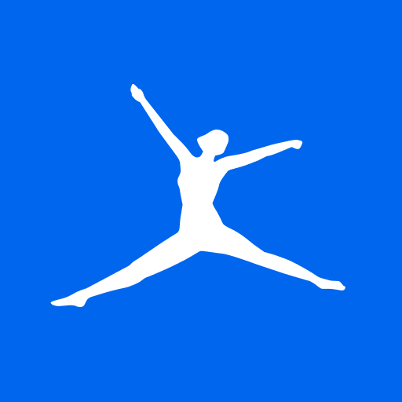
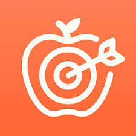

# CAPÍTULO II: REQUIREMENTS ELICITATION & ANALYSIS

## 2.1. Competidores

El mercado de plataformas digitales de nutrición y bienestar personal presenta una oferta consolidada tanto a nivel global como regional, con actores que abordan el seguimiento nutricional desde distintos ángulos: cobertura de base de datos, integración con wearables o detalle micronutricional. Sin embargo, ninguno de los productos existentes combina recomendaciones contextuales en tiempo real con análisis visual personalizado de alimentos, que es precisamente el espacio que NutriSense busca ocupar. Tras un proceso de investigación del landscape competitivo, se identificaron tres competidores directos cuyas propuestas de valor se solapan parcial o totalmente con la de nuestra aplicación.

Fitia es una aplicación SaaS de nutrición de origen peruano con fuerte penetración en Latinoamérica. Su propuesta central es una base de datos de alimentos con amplia cobertura de productos y preparaciones locales (peruanas y latinoamericanas), lo que la posiciona favorablemente en la región. Ofrece registro calórico, seguimiento de macros y planes de alimentación básicos.

MyFitnessPal es la plataforma de seguimiento nutricional más usada a nivel mundial. Cuenta con una base de datos de más de 14 millones de alimentos, integración con wearables y aplicaciones de fitness, registro de ejercicios, y una comunidad activa. Su modelo freemium ofrece funciones básicas gratuitas y un plan premium de pago mensual y anual.

Cronometer es una plataforma SaaS orientada a usuarios con interés en la salud profunda y el detalle micronutricional. Su diferencial es el tracking exhaustivo de vitaminas, minerales y otros micronutrientes. Es favorecida por deportistas, personas con condiciones médicas específicas y usuarios que requieren control nutricional preciso.

### 2.1.1. Análisis competitivo

<table>
  <colgroup>
    <col width="10%"> <col width="10%"> <col width="20%"> <col width="20%"> <col width="20%"> <col width="20%">
  </colgroup>
  <tbody>
    <tr>
      <th colspan="6" style="text-align: left;"><b>Competitive Analysis Landscape</b></th>
    </tr>
    <tr style="border-bottom: 1px solid black;">
      <th colspan="2">¿Por qué llevar a cabo este análisis?</th>
      <td colspan="4">
        ¿Qué ofrecen los principales competidores del mercado de nutrición digital y en qué aspectos NutriSense puede diferenciarse para capturar usuarios en el mercado latinoamericano?
          
      </td>
    </tr>
  </tbody>
</table>

<table>
  <colgroup>
    <col width="10%"> <col width="10%"> <col width="20%"> <col width="20%"> <col width="20%"> <col width="20%">
  </colgroup>
  <thead class="repeat">
    <tr>
      <th colspan="2"><i>Nombre y logo</i></th>
      <th style="text-align: center; vertical-align: top;">
         <b>NutriSense</b>
      </th>
      <th style="text-align: center; vertical-align: top;">
         <b>Fitia</b>
      </th>
      <th style="text-align: center; vertical-align: top;">
         <b>MyFitnessPal</b>
      </th>
      <th style="text-align: center; vertical-align: top;">
         <b>Cronometer</b>
      </th>
    </tr>
  </thead>
  <tbody>
    <tr>
      <td rowspan="2" style="vertical-align: middle; text-align: center;"><b>Perfil</b></td>
      <td>Overview</td>
      <td>Plataforma web SaaS de nutrición inteligente contextual. Combina seguimiento nutricional con recomendaciones personalizadas en tiempo real basadas en clima, ubicación geográfica y disponibilidad de ingredientes.</td>
      <td>Aplicación SaaS de nutrición de origen peruano con amplia base de datos de alimentos latinoamericanos. Fuerte presencia en Perú y países hispanohablantes. Enfocada en registro calórico y planes básicos de alimentación.</td>
      <td>Plataforma SaaS de seguimiento nutricional líder a nivel mundial. Cuenta con más de 14 millones de alimentos en su base de datos, integración con wearables y una comunidad global activa.</td>
      <td>Plataforma SaaS especializada en el tracking exhaustivo de micronutrientes (vitaminas, minerales, aminoácidos). Orientada a usuarios con necesidades nutricionales específicas y control de salud profundo.</td>
    </tr>
    <tr>
      <td>Ventaja competitiva / Valor</td>
      <td>Única plataforma que adapta las recomendaciones según el clima actual, la ubicación geográfica (Modo Viaje) y los ingredientes disponibles en casa. Análisis de menús de restaurante personalizado al perfil del usuario.</td>
      <td>Base de datos nutricional con fuerte cobertura de alimentos peruanos y latinoamericanos. Interfaz en español optimizada para el mercado local. Reconocimiento de marca consolidado en Perú.</td>
      <td>Base de datos masiva (más de 14 millones de alimentos), integración con más de 50 aplicaciones y wearables, y comunidad activa de usuarios. Posicionamiento global como estándar del sector.</td>
      <td>Tracking exhaustivo de más de 80 micronutrientes. Herramienta de referencia para deportistas, personas con condiciones médicas y profesionales de la salud que requieren precisión nutricional.</td>
    </tr>
    <tr>
      <td rowspan="2" style="vertical-align: middle; text-align: center;"><b>Perfil de Marketing</b></td>
      <td>Mercado objetivo</td>
      <td>Adultos de 18 a 60 años en Perú y Latinoamérica con metas físicas definidas (pérdida de peso o ganancia de masa muscular), que comen frecuentemente fuera de casa o viajan con regularidad y buscan recomendaciones nutricionales contextuales.</td>
      <td>Adultos hispanohablantes, principalmente peruanos y latinoamericanos, interesados en controlar su alimentación diaria. Perfil mayoritariamente femenino, rango de 20 a 45 años, con acceso a smartphone.</td>
      <td>Usuarios globales de 18 a 45 años interesados en perder peso, ganar músculo o mantener un estilo de vida saludable. Fuerte presencia en mercados anglófonos (EE.UU., Reino Unido, Australia) con crecimiento en Latinoamérica.</td>
      <td>Usuarios con necesidades nutricionales avanzadas: deportistas de alto rendimiento, personas con condiciones médicas (diabetes, enfermedad celíaca, insuficiencia renal) y profesionales de la salud. Rango de 25 a 50 años.</td>
    </tr>
    <tr>
      <td>Estrategias de marketing</td>
      <td>Marketing de contenido en redes sociales (Instagram, TikTok) dirigido a comunidades fitness y de alimentación saludable en Latinoamérica. Estrategia de referidos entre usuarios. Alianzas con nutricionistas y entrenadores personales como canales de distribución.</td>
      <td>Redes sociales con contenido en español orientado a hábitos saludables. Publicidad digital segmentada en Perú y Latinoamérica. Presencia en tiendas de aplicaciones (App Store y Google Play) como canal principal de adquisición.</td>
      <td>Campañas de publicidad digital masiva a nivel global. Partnerships con marcas de fitness y wearables (Fitbit, Garmin, Apple Health). Programa de referidos y comunidad de usuarios activa. Presencia en medios especializados en salud y bienestar.</td>
      <td>Marketing educativo orientado a comunidades de salud y bienestar avanzado. Presencia en foros especializados (Reddit, comunidades de deportistas). Recomendaciones de profesionales de la salud como canal orgánico principal.</td>
    </tr>
    <tr>
      <td rowspan="3" style="vertical-align: middle; text-align: center;"><b>Perfil de Producto</b></td>
      <td>Productos y servicios</td>
      <td>Plataforma web SaaS con registro nutricional, Smart Scan (análisis de fotos de platos y menús), motor de recomendaciones contextuales por clima y ubicación, Modo Viaje, módulo de despensa, sincronización con Google Fit, dashboard de progreso y exportación de reportes PDF.</td>
      <td>Aplicación móvil y web con registro de alimentos, base de datos nutricional latinoamericana, planes de alimentación básicos, seguimiento de macros y calorías, y versión premium con funciones adicionales.</td>
      <td>Aplicación móvil y web con registro de alimentos, escáner de código de barras, registro de ejercicio, integración con más de 50 aplicaciones y wearables, análisis de macros, recetas y comunidad de usuarios.</td>
      <td>Aplicación móvil y web con tracking exhaustivo de micronutrientes, registro de alimentos, análisis de composición corporal, diarios de salud y reportes detallados para profesionales.</td>
    </tr>
    <tr>
      <td>Precios y costos</td>
      <td>Tres planes de suscripción mensual sin modelo freemium: Basic ($7.99 — registro manual y dashboard), Pro ($14.99/mes — Smart Scan, clima, viaje, wearable, despensa), Premium ($ 19.90/mes — análisis de menú, PDF, historial ilimitado).</td>
      <td>Modelo freemium con plan gratuito limitado y plan premium de aproximadamente S/ 25–30/mes (varía por región). Las funciones avanzadas de planes y seguimiento detallado requieren suscripción paga.</td>
      <td>Modelo freemium con plan gratuito funcional y plan Premium de aproximadamente USD 19.99/mes o USD 79.99/año. El plan gratuito incluye el registro básico y la base de datos completa.</td>
      <td>Modelo freemium con plan gratuito completo en funciones básicas y plan Gold de USD 9.99/mes o USD 49.99/año. El plan gratuito ya incluye el tracking de micronutrientes, lo que reduce la fricción de conversión.</td>
    </tr>
    <tr>
      <td>Canales de distribución</td>
      <td>Plataforma web accesible desde cualquier navegador (desktop y móvil). Sin aplicación nativa en el alcance inicial. Distribución directa vía web y marketing digital.</td>
      <td>Aplicación móvil (iOS y Android) como canal principal. Versión web disponible pero con funcionalidad reducida respecto a la app móvil.</td>
      <td>Aplicación móvil (iOS y Android) y plataforma web completa. Integración como canal de distribución secundario a través de partnerships con wearables y otras aplicaciones de salud.</td>
      <td>Aplicación móvil (iOS y Android) y plataforma web. Distribución orgánica a través de recomendaciones de profesionales de la salud y comunidades especializadas.</td>
    </tr>
    <tr>
      <td rowspan="4" style="vertical-align: middle; text-align: center;"><b>Análisis SWOT</b></td>
      <td>Fortalezas</td>
      <td>Recomendaciones contextuales únicas (clima, ubicación, despensa). Diferenciación clara frente a competidores existentes. Plataforma web sin necesidad de instalación.</td>
      <td>Base de datos con amplia cobertura de alimentos peruanos y latinoamericanos. Marca reconocida en el mercado local. Interfaz completamente en español adaptada al contexto cultural latinoamericano.</td>
      <td>Base de datos más grande del sector (más de 14 millones de alimentos). Reconocimiento de marca global. Integraciones con prácticamente todos los wearables y aplicaciones de fitness del mercado.</td>
      <td>Tracking de micronutrientes más exhaustivo del mercado. Base de usuarios fiel y altamente comprometida. Precio competitivo con plan gratuito robusto que no limita las funciones core.</td>
    </tr>
    <tr>
      <td>Debilidades</td>
      <td>Marca nueva sin reconocimiento en el mercado. Dependencia de APIs de terceros para funciones core (Google Cloud Vision, OpenWeatherMap). Base de datos de alimentos inicial limitada comparada con competidores establecidos. Sin aplicación móvil nativa en el alcance inicial.</td>
      <td>Sin recomendaciones contextuales basadas en clima o ubicación. Sin análisis de fotos de platos o menús. Funcionalidades de wearable limitadas. Cobertura reducida fuera de Latinoamérica.</td>
      <td>Interfaz percibida como sobrecargada por muchos usuarios. Historial de problemas de privacidad y seguridad de datos (brecha de seguridad en 2018). Plan gratuito con publicidad intrusiva. Precio del plan premium elevado para el mercado latinoamericano.</td>
      <td>Curva de aprendizaje alta para usuarios sin conocimientos nutricionales avanzados. Interfaz menos intuitiva para el usuario casual. Sin recomendaciones contextuales ni análisis de imágenes. Comunidad significativamente más pequeña que MyFitnessPal.</td>
    </tr>
    <tr>
      <td>Oportunidades</td>
      <td>Creciente adopción de tecnología de salud en Latinoamérica. Demanda insatisfecha de herramientas nutricionales contextuales. Tendencia creciente de turismo interno en Perú (Modo Viaje). Alianzas potenciales con nutricionistas, gimnasios y cadenas de restaurantes.</td>
      <td>Expansión a otros mercados latinoamericanos con bases de datos locales. Incorporación de funciones de IA para personalización. Alianzas con supermercados y servicios de delivery locales.</td>
      <td>Expansión en mercados emergentes de Asia y Latinoamérica. Incorporación de funciones de IA generativa para recomendaciones. Alianzas con aseguradoras de salud como canal B2B.</td>
      <td>Crecimiento del segmento de salud preventiva y nutrición de precisión. Alianzas con clínicas, hospitales y profesionales de la salud. Expansión de funciones hacia gestión de enfermedades crónicas.</td>
    </tr>
    <tr>
      <td>Amenazas</td>
      <td>Competidores establecidos con mayor presupuesto que podrían replicar las funciones contextuales. Cambios en las políticas de uso o precios de las APIs de terceros. Baja disposición a pagar por aplicaciones de nutrición en el mercado peruano. Dependencia de la confianza del usuario para compartir datos de salud.</td>
      <td>Posible entrada de competidores globales con localización para el mercado latinoamericano. Usuarios que migran a plataformas con mayor integración tecnológica. Dificultad para competir en funciones avanzadas frente a plataformas con mayor inversión en I+D.</td>
      <td>Saturación del mercado de aplicaciones de nutrición. Regulaciones de privacidad más estrictas (GDPR, leyes locales de protección de datos). Nuevos entrantes con propuestas más innovadoras y precios más competitivos.</td>
      <td>Público objetivo de nicho con bajo potencial de crecimiento masivo. Competencia de plataformas médicas especializadas con mayor respaldo clínico. Dificultad para atraer usuarios casuales que representan el mayor volumen del mercado.</td>
    </tr>
  </tbody>
</table>

### 2.1.2. Estrategias y tácticas frente a competidores

### 2.1.2. Estrategias y tácticas frente a competidores

El análisis competitivo revela que los actores establecidos tienen ventajas claras en escala de base de datos, reconocimiento de marca y presupuesto de marketing. Sin embargo, ninguno ha desarrollado recomendaciones contextuales en tiempo real basadas en clima, ubicación geográfica y disponibilidad de ingredientes, que constituye el espacio diferencial que la plataforma busca ocupar.

**Frente a Fitia: aprovechar su debilidad tecnológica**

La principal brecha de Fitia es la ausencia total de análisis visual y recomendaciones contextuales. El posicionamiento apunta a ser su evolución natural: pasar del simple registro calórico a la orientación activa en el momento exacto de la decisión alimentaria. Como táctica concreta, se desarrollará contenido en redes sociales que ilustre escenarios donde la plataforma resuelve problemas que Fitia no puede abordar, como elegir qué pedir en un restaurante desconocido estando de viaje. Paralelamente, se priorizará desde el inicio una cobertura sólida de alimentos peruanos y latinoamericanos para no ceder ese terreno regional.

**Frente a MyFitnessPal: competir en experiencia**

Igualar los 14 millones de alimentos o el reconocimiento global de MyFitnessPal no es viable ni estratégicamente necesario. La apuesta es ofrecer una experiencia más inteligente y menos sobrecargada. En términos tácticos, se enfatizará la sencillez del flujo de registro mediante Smart Scan frente al proceso de búsqueda manual, y se resaltará la política de privacidad transparente frente a los antecedentes públicos de esa plataforma en el tema. En lo económico, el diferencial es significativo para el mercado latinoamericano: el plan Pro cuesta USD 14.99/mes frente a los aproximadamente USD 19.99/mes del Premium de MyFitnessPal, con una propuesta de valor más contextualizada y un plan de entrada (Basic a USD 7.99/mes) que reduce la barrera de conversión inicial.

**Frente a Cronometer: ampliar el segmento objetivo**

Cronometer domina un nicho bien definido pero de volumen reducido. La estrategia no pasa por competir en tracking exhaustivo de micronutrientes, sino por capturar a usuarios que buscan resultados concretos con el menor esfuerzo posible, en contraposición al perfil de usuario de Cronometer, que disfruta del análisis nutricional detallado como fin en sí mismo. La accesibilidad de precios refuerza este posicionamiento: el plan Premium a USD 19.99/mes es comparable al Gold de Cronometer, pero incluye funciones contextuales que esa plataforma no ofrece. En el largo plazo, se evaluará incorporar seguimiento de micronutrientes seleccionados como función Premium para capturar también ese segmento sin comprometer la propuesta central.

## 2.2. Entrevistas

### 2.2.1. Diseño de entrevistas

### 2.2.2. Registro de entrevistas

### 2.2.3. Análisis de entrevistas

## 2.3. Needfinding

### 2.3.1. User Personas

### 2.3.2. User Task Matrix

### 2.3.3. User Journey Mapping

### 2.3.4. Empathy Mapping

## 2.4. Big Picture EventStorming

## 2.5. Ubiquitous Language