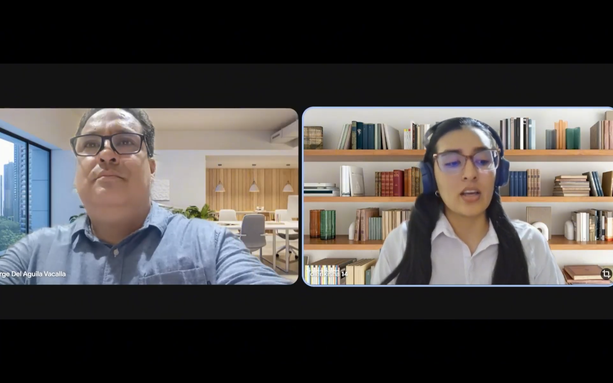
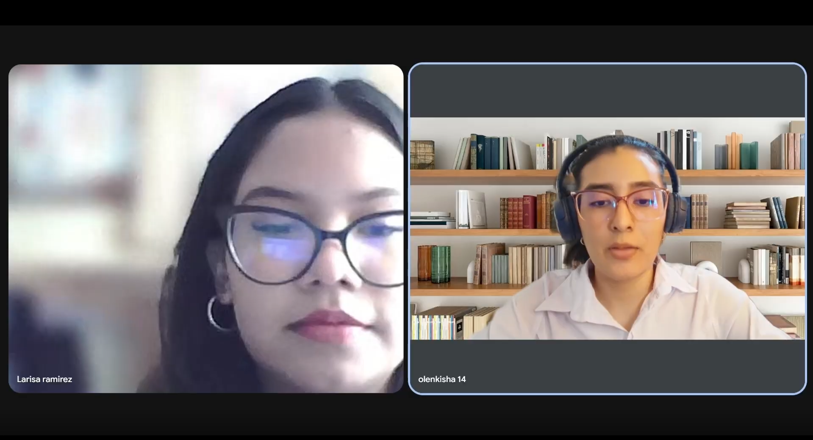
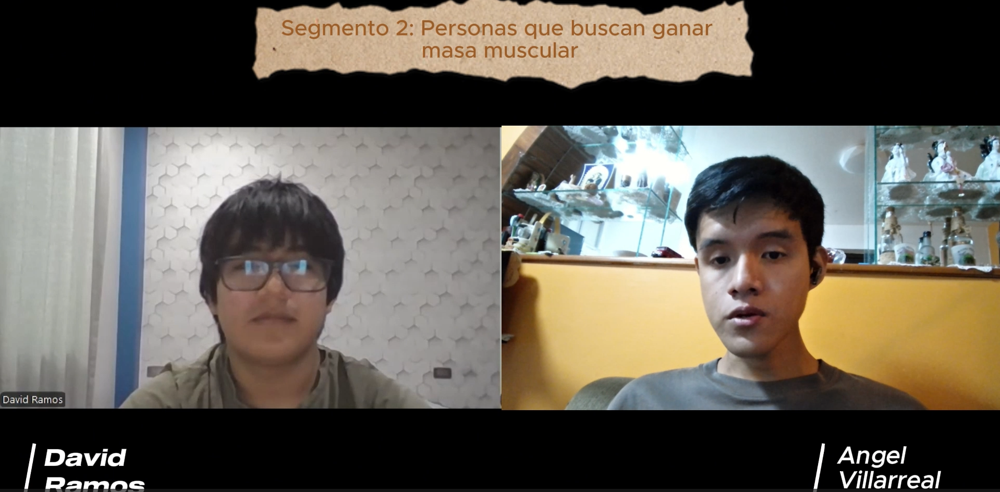

# CAPÍTULO II: REQUIREMENTS ELICITATION & ANALYSIS

## 2.1. Competidores

### 2.1.1. Análisis competitivo

### 2.1.2. Estrategias y tácticas frente a competidores

## 2.2. Entrevistas

### 2.2.1. Diseño de entrevistas

### 2.2.2. Registro de entrevistas

| Segmento: Pérdida de peso | Entrevista #1 |
| --- | --- |
| Nombres y Apellidos |Evelyn Diaz|
| Edad |54|
| Distrito |Loreto - Iquitos|
| Ocupación |Docente universitaria de idiomas|
| Timming inicio |0:06 - 3:46|
| Duración |3:41 minutos|
| URL | |
| Screenshot ||
| Resumen |Evelyn describe su rutina diaria como permanentemente activa debido a su labor docente, la cual le exige estar en constante movimiento entre clases y actividades con sus alumnos. Su motivación para buscar un mejor control alimenticio nace de preocupaciones de salud, específicamente por el aumento de peso relacionado con la edad y niveles elevados de azúcar, por lo cual cuenta actualmente con asesoría de un nutricionista. Al comer fuera de casa, no conoce el valor calórico exacto, pero aplica una estrategia de control basada en evitar la repetición de carbohidratos y equilibrar las proteínas y verduras. Ella califica como una "idea magnífica" la posibilidad de usar una aplicación que analice sus platos mediante fotografías, ya que le permitiría contar con una herramienta de apoyo precisa para el control riguroso de su ingesta diaria. Asimismo, aprueba totalmente la función de sugerencias según el clima como un complemento útil para su alimentación.|

| Segmento: Pérdida de peso | Entrevista #2 |
| --- | --- |
| Nombres y Apellidos |Jorge Del Aguila|
| Edad |49|
| Distrito |Loreto - Iquitos|
| Ocupación |Administrador de empresas y jefe de garantías y taller|
| Timming inicio |3:47 - 8:04|
| Duración |4:18 minutos |
| URL | |
| Screenshot ||
| Resumen |Jorge es un profesional cuya jornada laboral transcurre mayoritariamente en una oficina, permaneciendo sentado aproximadamente el 90% de su tiempo, mientras que el resto lo dedica a la coordinación en taller. A pesar de este sedentarismo laboral, mantiene una rutina de ejercicio nocturno de lunes a viernes con el objetivo de combatir su sobrepeso actual mediante un déficit calórico. En cuanto a su alimentación, suele consumir menús diarios calculando las porciones de manera visual o "al ojo", sin tener certeza sobre el valor calórico real de sus platos. Se muestra muy interesado en utilizar una herramienta tecnológica que analice su metabolismo y las fotos de su comida, asegurando que, de ser efectiva, la recomendaría a su círculo cercano. Respecto a las sugerencias por clima, aunque vive en una zona predominantemente cálida, considera que podrían ser útiles en momentos específicos de lluvia para elegir alimentos como café o sándwiches.|

| Segmento: Pérdida de peso | Entrevista #3 |
| --- | --- |
| Nombres y Apellidos |Larisa Ramírez|
| Edad |19|
| Distrito |San Miguel |
| Ocupación |Estudiante de Administración y Marketing|
| Timming inicio |8:05 - 11:59|
| Duración |3:53 minutos|
| URL | |
| Screenshot ||
| Resumen |Daniela mantiene una rutina mayoritariamente sedentaria debido a sus estudios universitarios, aunque intenta realizar pausas activas y camina diariamente hacia el transporte público. Su principal desafío para perder peso y mejorar su alimentación es un diagnóstico médico de Síndrome de Ovario Poliquístico (SOP), lo cual dificulta la pérdida de peso y le genera constantes antojos de alimentos poco saludables. Al igual que los otros entrevistados, suele medir sus porciones de forma estimada cuando come en restaurantes, pero carece de información calórica real. Ella utilizaría la aplicación propuesta para mantener la disciplina en su alimentación, especialmente cuando sale a comer fuera. Además, destaca que la función de sugerencias por clima sería muy innovadora, mencionando que durante el invierno suele sentir más hambre y deseos de consumir dulces, por lo que una guía adecuada le ayudaría a evitar alimentos que no son saludables.|

| Segmento: Ganancia de Masa Muscular | Entrevista #1 |
| --- | --- |
| Nombres y Apellidos |David Miguel Ramos Parihuamán|
| Edad |19|
| Distrito |Surco|
| Ocupación |Estudiante universitario|
| Timming inicio |12:13 - 16:00|
| Duración |3:47 minutos|
| URL | |
| Screenshot ||
| Resumen |David es un estudiante universitario que entrena en el gimnasio de dos a tres veces por semana con el objetivo de aumentar su masa muscular, proceso que inició hace aproximadamente dos meses. Su mayor dificultad para mantener la constancia radica en los viajes y en las alteraciones de su rutina debidas a responsabilidades académicas y laborales, lo que le complica identificar alimentos locales adecuados y mantener su ritmo de entrenamiento fuera de su entorno habitual. Actualmente monitorea sus pasos con un smartwatch y sigue una dieta basada en las recomendaciones de sus instructores para controlar calorías y proteínas. David ve en la aplicación propuesta una solución para reducir la carga mental durante sus viajes, valorando especialmente las sugerencias de platos típicos adaptados a su dieta y el ajuste automático de porciones según su actividad física, lo cual le permitiría regular su alimentación con precisión incluso cuando sus estudios le impiden asistir al gimnasio.|

| Segmento: Ganancia de Masa Muscular | Entrevista #2 |
| --- | --- |
| Nombres y Apellidos |Rando López|
| Edad |22|
| Distrito |San Borja|
| Ocupación |Estudiante universitario|
| Timming inicio |16:01 - 19:06|
| Duración |3:05 minutos|
| URL | |
| Screenshot ||
| Resumen |Rando es un joven universitario que entrena cuatro veces por semana con el enfoque de ganar masa muscular. Su principal desafío es la gestión del tiempo, ya que sus deberes académicos suelen interferir con su capacidad para asistir al gimnasio y ajustar su ingesta calórica diaria. Aunque ya utiliza tecnología como un smartwatch para medir pasos y pulsaciones, y lleva un control manual de sus proteínas, manifiesta que las aplicaciones de nutrición convencionales le resultan confusas o poco atractivas. Considera que la aplicación propuesta sería de gran valor para mantener su disciplina, destacando la importancia de contar con sugerencias de gastronomía local que encajen con su dieta al viajar. Asimismo, resalta como una herramienta fundamental la automatización en el ajuste de porciones basada en la actividad física registrada por sus dispositivos, lo que facilitaría significativamente el seguimiento de su régimen alimenticio.|

| Segmento: Ganancia de Masa Muscular | Entrevista #3 |
| --- | --- |
| Nombres y Apellidos | Daphne Faustor Vergaray |
| Edad | 25 |
| Distrito | Callao |
| Ocupación | Marketing y publicidad |
| Timming inicio |19:07 - 22:58|
| Duración | 3:52 minutos |
| URL | |
| Screenshot |  |
| Resumen | Daphne Faustor, profesional de 25 años en el área de Marketing y Publicidad, nos comenta que mantiene un estilo de vida activo entrenando fuerza y cardio de 5 a 6 veces por semana para aumentar su masa muscular. Usa su Apple Watch todo el día para monitorear sus pasos y entrenamientos de cardio. Aunque antes seguía dietas estrictas, hoy rechaza el pesaje manual de alimentos porque le resulta estresante y le quita tiempo en su rutina de estudio y trabajo. Prefiere guiarse por referencias visuales, como "puñados". Cuando viaja le encanta probar la comida local, pero siente la frustración de que las opciones baratas suelan ser comida chatarra. Por esta razón, le entusiasma la idea de una plataforma automatizada que use los datos de su smartwatch para sugerirle platos locales que encajen con su dieta, permitiéndole disfrutar de sus viajes y cuidar su nutrición sin complicaciones. |

### 2.2.3. Análisis de entrevistas

#### Segmento 1: Personas que buscan perder peso

Todas las personas entrevistadas en este grupo comparten una misma situación: quieren perder peso o mejorar su salud, pero no saben con exactitud qué están comiendo cuando se alimentan fuera de casa. Desconocen los valores nutricionales reales de los platos que consumen en restaurantes o en el trabajo, lo que les impide llevar un control serio de su alimentación. Las razones que los llevaron a esta situación varían según la edad: los mayores de 40 enfrentan problemas como niveles altos de azúcar o sobrepeso derivado del sedentarismo laboral, mientras que los más jóvenes lidian con condiciones como el síndrome de ovario poliquístico o con la ansiedad que les generan los antojos, lo que complica aún más su relación con la comida.

En cuanto a la tecnología, todos mostraron una muy buena disposición hacia el uso de la cámara del celular para analizar lo que comen. No quieren escribir listas ni buscar alimentos manualmente; prefieren tomar una foto y obtener la información de inmediato. Esto deja claro que la facilidad de uso es uno de los factores más importantes para que una herramienta así sea adoptada en la vida real. Además, la idea de recibir recomendaciones según el clima les resultó muy acertada, ya que reconocen que el frío los impulsa a comer más y de forma más contundente, mientras que el calor los lleva a buscar opciones más ligeras, y consideran valioso que una app tenga eso en cuenta.

En conclusión, este grupo no busca simplemente contar calorías, sino una solución integral que se adapte a sus distintos estilos de vida, ya sea una rutina de oficina, trabajo docente u horarios irregulares. Quieren entender mejor lo que comen, recibir orientación sobre la composición de sus platos y sentir un acompañamiento constante que los motive sin complicarles el día a día. Su disposición a adoptar la herramienta es alta, especialmente cuando perciben que esta fue diseñada pensando en sus condiciones reales y no en un usuario ideal.

#### Segmento 2: Personas que quieren ganar masa muscular

A diferencia del primer grupo, estas personas no buscan adelgazar sino optimizar su alimentación para rendir mejor físicamente y ganar músculo. Todos los entrevistados ya usan dispositivos como relojes inteligentes para registrar su actividad, lo que indica que están familiarizados con la tecnología aplicada a la salud y tienen altas expectativas sobre lo que una app puede hacer por ellos. Su principal obstáculo no es la falta de motivación, sino el tiempo: las responsabilidades académicas y laborales interrumpen constantemente su planificación alimentaria y sus rutinas de entrenamiento, haciendo difícil mantener la consistencia que sus metas exigen.

Respecto a las aplicaciones de nutrición que ya existen en el mercado, las describen como confusas y poco prácticas, porque obligan a registrar todo manualmente y generan más estrés del que resuelven. Lo que realmente valoran es la automatización: quieren que la app detecte cuánto se movieron durante el día y ajuste sola las porciones y los macronutrientes necesarios, sin que ellos tengan que estar pendientes de cada detalle. Buscan una solución que funcione en segundo plano, que se integre con sus dispositivos actuales y que elimine la carga mental de tener que calcular y pesar cada alimento.

Un punto que los tres entrevistados mencionaron de forma espontánea es lo que se podría llamar el "problema del viajero": cuando salen de su ciudad o país, su progreso se ve interrumpido porque no conocen la gastronomía local ni saben si los platos disponibles son compatibles con sus objetivos. Por eso, valoraron mucho la idea de una función que sugiera opciones típicas del lugar donde se encuentran, pero adaptadas a sus metas nutricionales. En pocas palabras, este segmento busca una herramienta que actúe como guía inteligente tanto en su rutina diaria como cuando están fuera de su entorno habitual, sin sacrificar su progreso físico en ningún momento.

## 2.3. Needfinding

### 2.3.1. User Personas

### 2.3.2. User Task Matrix

### 2.3.3. User Journey Mapping

### 2.3.4. Empathy Mapping

## 2.4. Big Picture EventStorming

## 2.5. Ubiquitous Language