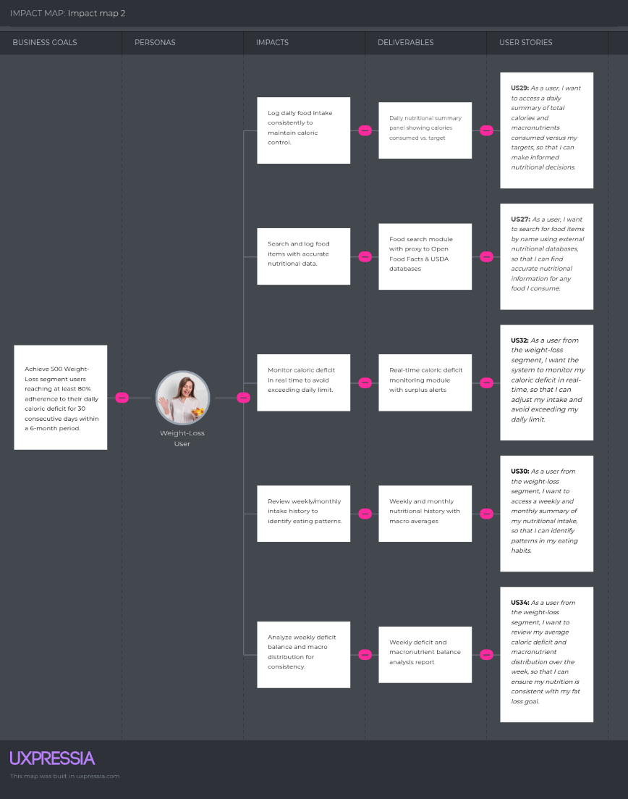
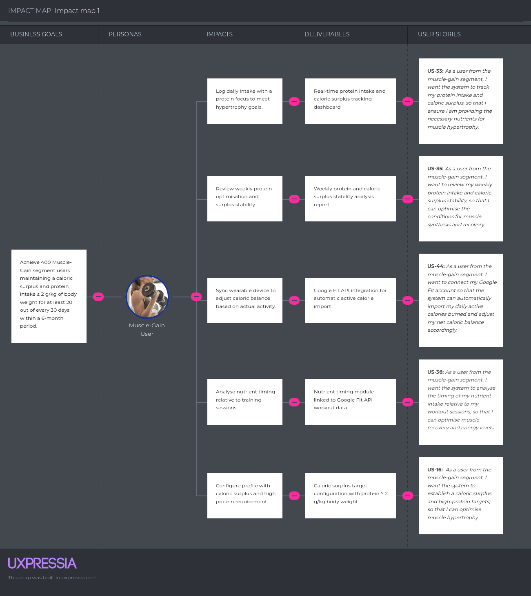

# CAPÍTULO III: REQUIREMENTS SPECIFICATION

## 3.1. User Stories

| **Epic / Story ID** | **Title** | **Description** | **Acceptance Criteria** | **Related with (Epic ID)** |
| :--- | :--- | :--- | :--- | :--- |
| **EP01** | Landing Page | As a visitor, I want to navigate a well-structured landing page so that I understand its value proposition and redirects me to the web application according to my interest. | | |
| US01 | View Hero Section with Carousel | As a visitor, I want to view a hero section with a carousel that contains a call-to-action slide, an About-the-Product video slide, and an About-the-Team video slide, so that I can quickly understand the platform's value, watch the promotional videos, and access the application. | *Scenario 1: First slide displays the main call to action*   Given the visitor accesses the landing page  When the visitor accesses the hero section  Then the system presents the main promotional content with a title, a subtitle, and an option to access the web application   *Scenario 2: Go to App button redirects to the web application*   Given the visitor is on the first slide of the hero section  When the visitor selects the option to access the web application  Then the system redirects the visitor to the web application authentication entry point   *Scenario 3: Second slide displays the About-the-Product video*   Given the visitor navigates to the second slide of the hero section  When the slide is displayed  Then the system makes the About-the-Product video available for playback   *Scenario 4: Third slide displays the About-the-Team video*   Given the visitor navigates to the third slide of the hero section  When the slide is displayed  Then the system makes the About-the-Team video available for playback   *Scenario 5: Carousel navigation is available to the visitor*   Given the visitor views the hero section  When the visitor interacts with the hero section navigation  Then the system transitions between content sections in sequential order | EP01 |
| US02 | View Main Features Section | As a visitor, I want to see the platform's three main features highlighted on the landing page and access a subpage with the complete feature list, so that I can evaluate the platform's capabilities before registering. | *Scenario 1: Three main features are displayed on the landing page*   Given the visitor accesses the landing page  When the visitor views the features section  Then the system displays exactly three featured capabilities, each with a title and a brief description *Scenario 2: Visitor accesses the full features subpage*   Given the visitor views the main features section on the landing page  When the visitor selects the option to view all features  Then the system navigates the visitor to the full features subpage listing all platform capabilities *Scenario 3: Full features subpage displays complete feature catalog*   Given the visitor accesses the full features subpage  When the visitor requests the complete feature list  Then the system displays all platform features organized by category, each with a title and functional description | EP01 |
| US03 | View Subscription Plans Comparison Table | As a visitor, I want to compare the Basic, Pro, and Premium subscription plans and their features, So that I can choose the plan that fits my needs before registering. | *Scenario 1: All three plans are returned with their features*   Given the visitor accesses the landing page  When the visitor requests the subscription plan information  Then the system displays three distinct plans (Basic, Pro, and Premium) with their respective included features   *Scenario 2: Feature availability differentiation*   Given the visitor requests the plans comparison data  When the visitor compares features across different tiers  Then the system distinguishes available features from restricted ones for each plan based on the subscription level   *Scenario 3: Plan selection redirects to the registration process*   Given the visitor selects a specific subscription plan  When the visitor confirms the plan selection  Then the system redirects the visitor to the registration flow corresponding to the chosen plan | EP01 |
| US04 | Switch Interface Language | As a visitor, I want to switch the landing page language between English and Spanish, So that I can browse the platform's features in my preferred language. | *Scenario 1: Visitor switches to English*   Given the visitor is on the landing page in the default Spanish version  When the visitor selects the English language option  Then the system displays the entire page content in English    *Scenario 2: Visitor switches back to Spanish*  Given the visitor has previously switched the interface to English  When the visitor selects the Spanish language option  Then the system reverts all displayed content to the original Spanish version    *Scenario 3: Language preference persistence*  Given the visitor selects a preferred language  When the visitor explores different sections of the landing page  Then the system maintains the selected language throughout the entire browsing session | EP01 |
| US05 | View Terms of Service | As a visitor, I want to access the platform's terms of service from the footer, so that I can review the complete legal and privacy framework before registering. | *Scenario 1: Terms of Service link is accessible from the footer*   Given the visitor navigates the landing page  When the visitor requests the legal information from the footer  Then the system displays a link to the Terms of Service page    *Scenario 2: Terms of Service page displays full legal content*   Given the visitor selects the Terms of Service link  When the request is processed by the platform  Then the system displays the full and readable legal content including privacy policy information in the active language | EP01 |
| US06 | View About Us Section | As a visitor, I want to read about the startup behind NutriSense, including its mission and vision, so that I can understand the team's purpose and values before deciding to register. | *Scenario 1: About Us section is displayed with mission and vision*   Given the visitor accesses the landing page  When the visitor navigates to the About Us section  Then the system displays the startup description, mission statement, and vision statement    *Scenario 2: About Us content is available in the active language*   Given the visitor has a preferred language selected  When the visitor views the About Us section  Then the system displays all content in the currently active language | EP01 |
| US07 | View Frequently Asked Questions Section | As a visitor, I want to read answers to common questions about the platform, so that I can resolve doubts about features, pricing, and usage before registering. | *Scenario 1: FAQ section returns a set of question-and-answer pairs*   Given the visitor accesses the FAQ section of the landing page  When the visitor requests the FAQ content  Then the system displays at least five question-and-answer pairs covering platform features, pricing, and data privacy   *Scenario 2: Requesting a specific question returns only its corresponding answer*   Given the visitor views the FAQ section  When the visitor selects a specific question  Then the system returns the corresponding answer for that question, and the answers of all other questions remain unavailable for reading   *Scenario 3: FAQ content is returned in the active interface language*   Given the visitor has selected a preferred language  When the visitor requests the FAQ content  Then the system returns all questions and answers exclusively in the currently active language | EP01 |
| US08 | Access Login from Landing Page | As a visitor, I want to access the authentication entry point directly from the landing page, so that I can sign in to my existing account without having to navigate to the web application manually. | *Scenario 1: Authentication access point is reachable from any section of the landing page*   Given the visitor is on any section of the landing page  When the visitor requests access to the authentication entry point  Then the system confirms that the authentication access point is reachable from the current section without requiring the visitor to navigate to a prior section   *Scenario 2: Login access option redirects to the web application login page*   Given the visitor selects the login access option on the landing page  When the request is processed  Then the system redirects the visitor to the login page of the web application | EP01 |
| US09 | Submit Contact Form | As a visitor, I want to send a message through a contact form on the landing page, so that I can reach the NutriSense team with questions, feedback, or partnership inquiries. | *Scenario 1: Contact form is submitted successfully*   Given the visitor provides a valid name, a valid email address, and a non-empty message  When the visitor submits the contact form  Then the system processes the submission and returns a reception confirmation to the visitor   *Scenario 2: Contact form submission is rejected when required fields are empty*   Given the visitor submits the contact form with at least one required field left empty  When the system validates the form  Then the system rejects the submission and identifies the required field that is incomplete   *Scenario 3: Contact form submission is rejected when the email is invalid*   Given the visitor provides an email address that does not conform to the standard email format  When the system validates the email field  Then the system rejects the submission and identifies the email address field as invalid | EP01 |
| US10 | View Social Media Links | As a visitor, I want to see the platform's social media links from the landing page, so that I can follow NutriSense on its official channels and stay informed about updates. | *Scenario 1: Distinct social media references are available*   Given the visitor is exploring the landing page for contact information  When the visitor views the social media section  Then the system provides access to at least three social media profiles, each corresponding to a distinct platform   *Scenario 2: Redirection to official external profiles*   Given the visitor selects a specific social media reference  When the system processes the activation of the external connection  Then the system redirects the visitor to the official profile on that social network without interrupting the current browsing session | EP01 |
| **EP02** | Identity & Access Management | As a user, I want to securely create and manage my account, profile, and authentication, So that I can access NutriSense's personalized features across sessions. | | |
| US11 | Register a New Account | As a visitor, I want to register a new account, So that I can access the personalized nutritional features. | *Scenario 1: Successful registration*   Given the new user provides a valid name, a unique email, and a password of at least 8 characters  And the user accepts the terms and conditions  When the user submits the registration request  Then the system creates the account and initiates the profile onboarding flow   *Scenario 2: Already registered email*   Given the user provides an email address that already exists in the system  When the user submits the registration request  Then the system prevents the account creation and displays a message indicating that the email is already registered   *Scenario 3: Weak password is rejected*   Given the user provides a password of fewer than 8 characters  When the user attempts to register  Then the system prevents the account creation and displays the password length requirements    *Scenario 4: Terms not accepted*   Given the user provides all required information but does not accept the Terms and Conditions  When the user attempts to submit the registration request  Then the system prevents the account creation and identifies the terms acceptance as a mandatory requirement | EP02 |
| US12 | Log In to Existing Account | As a user, I want to log in with my credentials, so that I can access my personalized dashboard, view my history, and use advanced tools like Smart Scan. | *Scenario 1: Successful login*   Given the user provides the correct email and password  When the user submits the credentials  Then the system creates a valid session and presents the user's dashboard    *Scenario 2: Incorrect credentials*   Given the user provides an incorrect password or an unregistered email  When the user submits the credentials  Then the system displays a generic invalid credentials message    *Scenario 3: Account protection after repeated failures*   Given the user has failed to log in 5 consecutive times  When the user attempts a new login  Then the system temporarily restricts access to the account and informs the user of the lock duration | EP02 |
| US13 | Recover Account Password | As a user, I want to request a password reset via email, so that I can regain access to my account if I forget my credentials. | *Scenario 1: Password reset link sent*   Given the user provides a registered email for password recovery  When the user submits the request  Then the system sends a temporary verification link to that email address   *Scenario 2: Unregistered email privacy*   Given the user provides an unregistered email address for recovery  When the user submits the request  Then the system displays a neutral confirmation message without disclosing the account's existence   *Scenario 3: Reset link expiration*   Given the user receives a password reset link but does not use it within the defined security timeframe  When the user attempts to access the link  Then the system informs the user that the link has expired and offers to send a new one | EP02 |
| US14 | Complete Nutritional Profile Onboarding | As a new user, I want to configure my nutritional profile by providing my physical data and goals, so that the system can calculate my personalized caloric and macronutrient targets from the start. | *Scenario 1: Health metrics calculation*   Given the new user provides age, sex, weight, height, and activity level  When the profile is saved  Then the system calculates the Body Mass Index (BMI) and Total Daily Energy Expenditure (TDEE)   *Scenario 2: Incomplete profile prevention*   Given the user provides only partial physical data  When the user attempts to complete the onboarding  Then the system prevents the process and identifies the missing required data   *Scenario 3: Target setting for Weight-loss segment*   Given the user selects Lose weight as the primary physical goal  When the profile configuration is completed  Then the system sets a daily caloric target below the calculated TDEE   *Scenario 4: Target setting for Muscle-gain segment*   Given the user selects Gain muscle as the primary physical goal  When the profile configuration is completed  Then the system sets a daily caloric target above the TDEE and increases the protein requirement | EP02 |
| US15 | Nutritional Target Configuration (Weight-Loss Segment) | As a user from the weight-loss segment, I want the system to establish a caloric deficit based on my profile, so that I can lose weight sustainably. | *Scenario 1: Automatic deficit setting*   Given the user from the weight-loss segment selects "Lose weight" as the primary goal  When the user from the weight-loss segment completes the profile configuration  Then the system sets a daily caloric target below the TDEE and suggests a balanced macronutrient distribution focused on satiety   *Scenario 2: Satiety-focused macronutrient distribution*   Given the user from the weight-loss segment has their caloric deficit established  When the user from the weight-loss segment saves their configuration preferences  Then the system prioritizes a higher fiber and moderate protein percentage to help manage hunger during the weight-loss process    *Scenario 3: Dynamic deficit adjustment based on progress*   Given the user from the weight-loss segment has reached a weight plateau for more than 14 days  When the user from the weight-loss segment requests a target review  Then the system recalculates the TDEE and suggests a slight adjustment in the caloric deficit to restart the weight-loss progression | EP02 |
| US16 | Nutritional Target Configuration (Muscle-Gain Segment) | As a user from the muscle-gain segment, I want the system to establish a caloric surplus and high-protein targets, so that I can optimize muscle hypertrophy. | *Scenario 1: Hypertrophy macro setting*   Given the user from the muscle-gain segment selects "Gain muscle" as the primary goal  When the user from the muscle-gain segment completes the profile configuration  Then the system sets a daily caloric target above the TDEE and prioritizes a protein requirement of at least 2.0g per kilogram of body weight   *Scenario 2: Surplus intensity control*   Given the user from the muscle-gain segment wants to avoid excessive fat gain  When the user from the muscle-gain segment selects a "lean bulk" intensity  Then the system limits the caloric surplus to a maximum of 10% over the TDEE while maintaining the high protein ratio   *Scenario 3: Training day vs. Rest day calorie cycling*   Given the user from the muscle-gain segment has a high-intensity training schedule  When the user from the muscle-gain segment distinguishes between training and rest days  Then the system identifies the need for a higher carbohydrate intake on training days while maintaining the baseline protein target | EP02 |
| US17 | Configure Dietary Restrictions and Medical Conditions | As a user, I want to register my allergies, food intolerances, and medical conditions in my profile, so that all recommendations and food searches respect my health constraints at all times. | *Scenario 1: Dietary restrictions application*   Given the user provides restrictions, such as lactose intolerance and allergies  When the health profile is updated  Then the system excludes all items containing that allergen from food recommendations and search results   *Scenario 2: Unrestricted dietary status*   Given the user declares no dietary restrictions or allergies  When the health profile is updated  Then the system applies no filtering logic to food searches or recommendations   *Scenario 3: Medical condition prioritization*   Given the user provides a medical condition such as Type 2 Diabetes  When the system generates food recommendations  Then the system prioritizes low glycemic index (GI) alternatives and flags high-GI options | EP02 |
| US18 | Edit Profile Information | As a user, I want to edit my physical data and activity level at any time, so that my nutritional targets remain accurate as my circumstances change. | *Scenario 1: Dynamic recalculation of physical metrics*   Given the user provides updated physical information, such as current weight  When the changes are saved in the user profile  Then the system recalculates BMI, BMR, and TDEE immediately   *Scenario 2: Activity level multiplier adjustment*   Given the user changes the activity level intensity  When the profile update is processed  Then the system updates the daily caloric target to reflect the new activity multiplier   *Scenario 3: Mid-cycle goal adjustment*   Given the user changes the primary goal, such as switching from weight loss to maintenance  When the profile is saved  Then the system adjusts the future caloric target to match the TDEE while preserving previous log entries | EP02 |
| US19 | Log Out of Account | As a user, I want to log out of my account, so that my session is closed and my personal data remains secure on shared devices. | *Scenario 1: Successful logout*   Given the user is logged in  When the user selects the logout option  Then the session is terminated, all locally stored tokens are cleared, and the user is redirected to the login page   *Scenario 2: Protected route access restriction*   Given the user has successfully logged out  When the user attempts to access any personalized dashboard or profile feature  Then the system denies access and redirects the user to the login page | EP02 |
| US20 | Manage Active Subscription Plan | As a user, I want to view my current subscription plan and its renewal date from my profile settings, so that I can stay informed about my active tier and access the subscription management area when needed. | *Scenario 1: Current plan details are returned*   Given the user accesses the subscription management area  When the user requests the plan information  Then the system returns the current plan name, renewal date, billing amount, and the complete list of features included in the active plan   *Scenario 2: Available upgrade and downgrade options are returned*   Given the user holds an active subscription plan  When the user requests the available subscription management options  Then the system returns the list of plans available for upgrade or downgrade relative to the current tier, each identified with its feature differences and price | EP02 |
| **EP03** | Body Tracking | As a user, I want to periodically log and review my body metrics so that I can monitor my physical progress toward my health goal with accurate, dynamically updated targets | | |
| US21 | Log Current Weight | As a user, I want to log my current weight at any time, so that the system can update my metrics and track my evolution over time. | *Scenario 1: Weight logged successfully*   Given the user provides a valid weight value in kilograms  When the user submits the weight update  Then the system stores the entry with the current timestamp and updates the historical evolution record   *Scenario 2: Invalid weight value*   Given the user provides a weight of 0 or a negative value  When the user attempts to submit the update  Then the system rejects the input and identifies the valid weight range requirements   *Scenario 3: Multiple entries on the same day*   Given the user has already registered a weight entry for the current day  When the user provides a new weight value  Then the system stores the new entry as a separate record  And uses the latest provided value as the primary input for current nutritional calculations | EP03 |
| US22 | View BMI, BMR, and TDEE Calculations | As a user, I want to access my automatically calculated health metrics (BMI, BMR, and TDEE), so that I understand my body's caloric needs and health baseline. | *Scenario 1: Comprehensive health metrics display*   Given the user has a profile with current weight and height data  When the user requests the health summary  Then the system presents the Body Mass Index (BMI) with its corresponding health category, the Basal Metabolic Rate (BMR), and the Total Daily Energy Expenditure (TDEE)   *Scenario 2: Real-time metrics recalculation*   Given the user registers a new weight value  When the user saves the new record  Then the system automatically updates the BMI, BMR, and TDEE results based on the most recent parameters   *Scenario 3: Data accuracy verification*   Given the user's last weight entry is older than 14 days  When the user requests the health metrics  Then the system identifies the information as potentially outdated and prompts for a new weight update | EP03 |
| US23 | View Weight Evolution and Goal Progress | As a user from the weight-loss segment, want to view my weight history over time with selectable date ranges, so that I can assess whether I am progressing toward my health goal. | *Scenario 1: Chronological weight data is available*   Given the user from the weight-loss segment has registered two or more weight entries  When the user from the weight-loss segment requests the evolution data  Then the system returns the registered weight values ordered chronologically   *Scenario 2: Temporal data filtering*   Given the user from the weight-loss segment defines a specific time range (e.g., the last 30 days)  When the user from the weight-loss segment applies the time filter  Then the system includes only the weight records within the specified period in the results | EP03 |
| US24 | Set Target Weight | As a user from the weight-loss segment, I want to set a target weight in my profile, so that the system can display my goal on the evolution chart and calculate the projected time to reach it. | *Scenario 1: Target weight saved*   Given the user from the weight-loss segment provides a valid target weight  When the user from the weight-loss saves the goal configuration  Then the system stores the target value and calculates a projected achievement date based on the user's current caloric target   *Scenario 2: Inconsistent target weight validation*   Given the user from the weight-loss segment provides a target weight equal to or higher than the current weight  When the user from the weight-loss segment attempts to save the target value  Then the system rejects the entry and identifies the inconsistency with the primary goal   *Scenario 3: Target weight reference comparison*   Given the user from the weight-loss segment has established a target weight goal  When the user from the weight-loss segment requests the evolution history  Then the system provides a comparison between the current weight records and the defined goal value | EP03 |
| US25 | Body Fat and Lean Mass Monitoring | As a user from the muscle-gain segment, I want the system to calculate my estimated body fat percentage and lean body mass, so that I can ensure my weight gain consists primarily of muscle tissue. | *Scenario 1: Body fat estimation and storage*   Given the user from the muscle-gain segment provides their current weight and specific body circumferences (waist, neck, and height)  When the user from the muscle-gain segment saves the body composition update  Then the system calculates the estimated body fat percentage and stores it as part of the physical record   *Scenario 2: Lean mass vs. Fat mass calculation*   Given the system has the user's total weight and body fat percentage  When the user from the muscle-gain segment requests a body composition summary  Then the system identifies the total kilograms of lean mass versus fat mass to verify the quality of the weight gain   *Scenario 3: Alert for excessive fat gain*   Given the user from the muscle-gain segment registers a body fat increase that exceeds the recommended ratio for a lean bulk  When the user from the muscle-gain segment reviews their progress  Then the system identifies the deviation from the muscle-building goal and suggests a slight reduction in the caloric surplus | EP03 |
| US26 | Log Height Update | As a user, I want to update my height in the system, so that my Body Mass Index (BMI) and other body-composition metrics remain accurate. | *Scenario 1: Height updated successfully*   Given the user provides a new height value in centimeters  When the user saves the physical profile update  Then the system stores the new height and automatically recalculates the BMI using the updated parameters  *Scenario 2: Invalid height value is rejected*   Given the user provides a height value of zero or a negative number  When the user attempts to save the physical profile update  Then the system rejects the input and identifies the valid height range requirements | EP03 |
| **EP04** | Nutrition Log | As a user, I want to log all my daily food intake and view detailed nutritional information so that I can track my caloric and macro balance with precision | | |
| US27 | Search Food Items by Name | As a user, I want to search for food items by name using external nutritional databases, , so that I can find accurate nutritional information for any food I consume. | *Scenario 1: Search returns matching results*   Given the user provides a food name as search criteria  When the user initiates the query to the external food database  Then the system retrieves a list of matching items including food name, serving size, calories, and primary macronutrients   *Scenario 2: Search returns no results*   Given a user submits a food name that does not match any item in the database  When the user receives an empty result set from the query  Then the system returns an empty result set and offers the option to add the food manually   *Scenario 3: Results filtered by active dietary restrictions*   Given the user has a specific dietary restriction (e.g., lactose intolerance) configured in the profile  When the user receives the search results  Then the system flags or excludes items containing the restricted ingredients based on the user's health profile   *Scenario 4: Selecting an item returns full nutritional detail*   Given the user selects a specific food item from the results  When the user requests the complete information of the item  Then the system provides the full nutritional breakdown including calories, protein, carbohydrates, fat, fiber, and sugar | EP04 |
| US28 | Log a Meal Entry by Meal Type | As a user, I want to add food items to my daily nutrition log categorized by meal type with a custom serving size, so that I maintain an accurate record of my food intake. | *Scenario 1: Food item is logged with a valid quantity*   Given the user has selected a food item and a meal category (e.g., Lunch)  When the user provides a custom quantity and confirms the entry  Then the system stores the item in the daily log with all macronutrients scaled proportionally to the entered quantity   *Scenario 2: Editing a quantity recalculates macros immediately*   Given the user has registered a food item with an incorrect quantity  When the user updates the quantity in the daily log  Then the system recalculates the macros for that entry without affecting any other entries   *Scenario 3: Removal of a log entry*   Given the user has registered a food item by mistake  When the user deletes the record from the daily log  Then the system removes the entry and updates the total daily nutritional calculations   *Scenario 4: Independent log entries for identical food items*   Given the user registers the same food item in two different meal categories (e.g., Breakfast and Snack)  When the user saves both records  Then the system treats each record independently, and both contribute to the overall daily totals | EP04 |
| US29 | View Daily Nutritional Summary | As a user, I want to access a daily summary of total calories and macronutrients consumed versus my targets, so that I can make informed nutritional decisions. | *Scenario 1: Daily consumption calculation*   Given the user has registered at least one food entry for the current day  When the user requests the daily nutritional status  Then the system provides total calories consumed, the remaining balance against the target, and individual totals for protein, carbohydrates, and fat   *Scenario 2: Identification of exceeded caloric targets*   Given the user registers a food item that causes the daily totals to exceed the calculated target  When the user requests the daily summary  Then the system returns the exceeded amount and marks the caloric balance as over target   *Scenario 3: Initial daily state with no entries*   Given the user has not registered any food intake for the current day  When the user requests the daily summary  Then the system returns zero for all consumed values and the full daily targets as remaining | EP04 |
| US30 | View Weekly and Monthly Nutritional History | As a user from the weight-loss segment, I want to access a weekly and monthly summary of my nutritional intake, so that I can identify patterns in my eating habits and assess my consistency over time. | *Scenario 1: Weekly history data retrieval*   Given the user from the weight-loss segment requests the nutritional history for the past 7 days  When the user from the weight-loss segment initiates the historical data request  Then the system returns daily calorie totals for each of the past 7 days and weekly averages for each macro   *Scenario 2: Monthly history aggregate calculation*   Given the user from the weight-loss segment requests the nutritional history for the current month  When the user from the weight-loss initiates the monthly data request  Then the system returns the monthly average for calories and each macro along with the number of days with logged entries   *Scenario 3: Historical data navigation for prior periods*   Given the user from the weight-loss defines a specific prior period (e.g., previous week or month)  When the user requests the corresponding report  Then the system retrieves and presents the accurate nutritional data for that specific timeframe | EP04 |
| US31 | View Nutritional Detail of a Logged Meal | As a user, I want to review the full nutritional breakdown of each logged meal by item, so that I can identify which specific foods contribute most to my macronutrient targets. | *Scenario 1: Meal detail is returned per item*   Given the user selects a specific meal category (e.g., Breakfast, Lunch)  When the user requests the nutritional details of that category  Then the system identifies and returns each registered food item with its name, quantity, calories, and individual macronutrient values   *Scenario 2: Grouped meal summary calculation*   Given the user focuses on the overall daily log  When the user requests a consolidated view of a meal category  Then the system presents the total sum of calories and macronutrients for that specific meal time without listing individual items | EP04 |
| US32 | Caloric Deficit Monitoring | As a user from the weight-loss segment, I want the system to monitor my caloric deficit in real-time, so that I can adjust my intake and avoid exceeding my daily limit. | *Scenario 1: Deficit status identification*   Given the user from the weight-loss segment has a defined caloric target for fat loss  When the user from the weight-loss segment requests the daily nutritional status  Then the system calculates and identifies the remaining calories available before reaching the daily deficit limit   *Scenario 2: Caloric surplus detection*   Given the user from the weight-loss segment registers a meal that exceeds their TDEE-based limit  When the user from the weight-loss segment saves the entry  Then the system identifies the surplus and provides a notification regarding the deviation from the weight-loss target | EP04 |
| US33 | Protein and Macro Target Tracking | As a user from the muscle-gain segment, I want the system to track my protein intake and caloric surplus, so that I ensure I am providing the necessary nutrients for muscle hypertrophy. | *Scenario 1: Protein target verification*   Given the user from the muscle-gain segment has a specific protein target based on their physical profile  When the user from the muscle-gain segment requests the daily summary  Then the system identifies the percentage of the protein goal achieved and the amount remaining to meet the daily requirement   *Scenario 2: Insufficient caloric intake notification*   Given the user from the muscle-gain segment has a goal of maintaining a caloric surplus  When the user from the muscle-gain segment reviews their daily nutritional progress  Then the system identifies the caloric gap and suggests the intake needed to fulfill the muscle-building objective | EP04 |
| US34 | Weekly Deficit and Macro Balance Analysis | As a user from the weight-loss segment, I want to review my average caloric deficit and macronutrient distribution over the week, so that I can ensure my nutrition is consistent with my fat loss goal. | *Scenario 1: Weekly caloric deficit consistency check*   Given the user from the weight-loss segment has completed the daily log for seven consecutive days  When the user from the weight-loss segment requests the weekly macro analysis  Then the system calculates the average fat and carbohydrate distribution to verify adherence to a balanced deficit   *Scenario 2: Macronutrient distribution for satiety*   Given the user from the weight-loss segment has completed the weekly log  When the user from the weight-loss segment reviews their nutritional distribution  Then the system calculates the percentage of fats and carbohydrates consumed to identify patterns that may affect energy levels and satiety | EP04 |
| US35 | Weekly Protein and Surplus Optimization | As a user from the muscle-gain segment, I want to review my weekly protein intake and caloric surplus stability, so that I can optimize the conditions for muscle synthesis and recovery. | *Scenario 1: Protein synthesis optimization for the muscle-gain segment*   Given the user from the muscle-gain segment needs to maintain high protein levels throughout the week  When the user from the muscle-gain segment requests the weekly macro analysis  Then the system identifies days where protein intake fell below the target and calculates the overall weekly compliance   *Scenario 2: Protein source diversity tracking*   Given the user from the muscle-gain segment has logged multiple meals during the week  When the user from the muscle-gain segment requests the weekly nutritional detail  Then the system identifies the variety of protein sources (e.g., animal vs. plant-based) to ensure a complete amino acid profile according to the user's hypertrophy requirements | EP04 |
| US36 | Nutrient Timing for Training Optimization | As a user from the muscle-gain segment, I want the system to analyze the timing of my nutrient intake relative to my workout sessions, so that I can optimize muscle recovery and energy levels. | *Scenario 1: Automated post-workout recovery window*   Given the system identifies a completed training session via the Google Fit API  When the user from the muscle-gain segment logs a food entry within the subsequent two hours  Then the system identifies if the protein and carbohydrate intake meets the specific threshold required for muscle protein synthesis and glycogen recovery   *Scenario 2: Activity-based caloric balance adjustment*   Given the user from the muscle-gain segment has a baseline caloric surplus target  When the Google Fit API reports a higher-than-average active calorie expenditure  Then the system identifies the need for a caloric adjustment and recalculates the daily target to maintain the required surplus for hypertrophy   *Scenario 3: Rest day macro distribution*   Given the system identifies a non-training day (absence of activity data from the wearable)  When the user from the muscle-gain segment requests their daily nutritional status  Then the system identifies the shift in requirements and suggests a distribution focused on baseline protein maintenance with a moderate reduction in carbohydrates | EP04 |
| **EP05** | Smart Scan | As a user, I want to use image analysis to identify foods and restaurant menu items through photos so that I can log my nutritional intake quickly and receive contextual meal recommendations | | |
| US37 | Scan a Food Plate Photo | As a user, I want to take or upload a photo of my food plate to receive estimated calories and macronutrients, so that I can log my meal quickly without manually searching for each item. | *Scenario 1: Plate analysis and nutritional estimation*   Given the user on a Pro or Premium plan provides a clear food plate image  When the user initiates the vision analysis  Then the system identifies the food items and returns estimated quantities, calories, and macronutrient values   *Scenario 2: Data confirmation and logging*   Given the system has provided a scan result for a meal  When the user confirms the identified data and assigns a meal category  Then the system stores the entries and their estimated values in the daily log   *Scenario 3: Handling unprocessable images*   Given the user provides a non-food or low-quality image  When the user initiates the analysis  Then the system identifies that no valid food items can be detected   *Scenario 4: Subscription level restriction*   Given the user is on a Basic plan  When the user requests the Smart Scan feature  Then the system identifies the plan limitation and denies access to the analysis service | EP05 |
| US38 | Menu Recommendations for Weight-Loss Segment | As a user from the weight-loss segment, I want to analyze a restaurant menu photo to receive recommendations that fit my caloric deficit, so that I can eat out without compromising my weight goal. | *Scenario 1: Caloric-deficit menu matching*   Given the user from the weight-loss segment is on a Premium plan and provides a menu image  When the user from the weight-loss segment initiates the menu analysis  Then the system identifies meal options that do not exceed the user's remaining daily calories   *Scenario 2: Low-calorie alternative highlighting*   Given the menu analysis identifies multiple items  When the system generates the recommendations  Then the system prioritizes the three items with the lowest caloric density relative to the user's profile | EP05 |
| US39 | Menu Recommendations for Muscle-Gain Segment | As a user from the muscle-gain segment, I want to analyze a restaurant menu photo to identify high-protein options, so that I can meet my macronutrient targets for muscle hypertrophy. | *Scenario 1: Highest-protein items per serving are identified*   Given the user from the muscle-gain segment is on a Premium plan and provides a restaurant menu image  When the user from the muscle-gain segment initiates the menu analysis  Then the system identifies and returns the items with the highest protein content per serving, each with protein value greater than 20g | EP05 |
| US40 | Enforcement of Dietary Restrictions in Smart Scan | As a user with health-related dietary restrictions, I want the Smart Scan to filter out dangerous ingredients, so that I can ensure my meal safety. | *Scenario 1: Allergen detection in menu scan*   Given the user has a specific health restriction (e.g., lactose or gluten intolerance) configured  When the user initiates a menu or plate scan  Then the system flags or excludes any identified items that contain the restricted ingredients   *Scenario 2: Scan completes successfully when no restrictions are triggered*   Given the user has dietary restrictions configured and provides a food image  When the system identifies the food items in the scan  Then the system confirms that none of the identified items contain restricted ingredients and returns the full nutritional breakdown for logging | EP05 |
| **EP06** | Smart Recommendations Engine | As a user, I want to receive personalized food recommendations that adapt to my current climate, geographic location, pantry contents, and nutritional status, so that my eating choices are always optimized for my context and goals. | | |
| US41 | Receive Climate-Based Food Recommendations | As a user, I want to receive food suggestions adapted to the current weather at my location, so that my meals are appropriate for the environmental conditions I am experiencing. | *Scenario 1: Hot weather produces light food recommendations*   Given a user on the Pro or Premium plan has location access enabled and the current temperature exceeds 28°C  When the user requests a meal recommendation  Then the system returns light, hydrating food suggestions filtered by the user's dietary restrictions   *Scenario 2: Cold weather produces warm food recommendations*   Given the current temperature at the user's location is below 12°C  When the user requests a meal recommendation  Then the system returns warm, calorie-dense food suggestions filtered by the user's dietary restrictions   *Scenario 3: General recommendations when location is denied*   Given the user has denied location access  When the user requests a recommendation  Then the system returns general profile-based recommendations not dependent on weather data and prompts the user to enable location or enter a city manually | EP06 |
| US42 | Activate Travel Mode for Local Food Recommendations | As a user, I want to enable Travel Mode by entering or auto-detecting a city or country different from my home location, so that I receive suggestions of healthy local dishes compatible with my nutritional profile. | *Scenario 1: Travel Mode auto-activated on new city detection*   Given the Geolocation API detects that the user's current location differs from their registered home city  When the user requests recommendations  Then the system activates Travel Mode, identifies the detected city, and returns healthy local dish suggestions filtered by the user's dietary restrictions *Scenario 2: Manual city entry activates Travel Mode*   Given the user provides a city name to activate Travel Mode manually  When the user confirms the city selection  Then the system returns local food recommendations for the provided city filtered by the user's dietary restrictions   *Scenario 3: Travel Mode deactivation restores home-location recommendations*   Given the user has Travel Mode active  When the user requests deactivation of Travel Mode  Then the system disables Travel Mode and resumes standard recommendations based on the home location   *Scenario 4: Unrecognised city returns informative response*   Given the user provides a city name not found in the system's location database  When the user submits the city  Then the system returns a not-found response and identifies the option to try a nearby major city | EP06 |
| US43 | Pantry-Based Recipe Suggestions | As a user, I want to register the ingredients available in my pantry so that the Smart Recommendations engine can suggest meals I can prepare at home using what I already have, filtered by my nutritional profile and dietary restrictions. | *Scenario 1: Recipe matching for the weight-loss segment*   Given the user from the weight-loss segment has registered specific ingredients in their pantry  When the user from the weight-loss segment requests a meal suggestion  Then the system identifies recipes using those ingredients that do not exceed the user's remaining caloric deficit   *Scenario 2: Protein-rich suggestions for the muscle-gain segment*   Given the user from the muscle-gain segment has a high protein requirement remaining for the day  When the user from the muscle-gain segment requests a meal suggestion based on their pantry  Then the system prioritizes recipes that maximize protein intake using the available ingredients   *Scenario 3: Dietary restrictions are applied to pantry suggestions*   Given the user has active dietary restrictions configured in their profile  When the system generates recipe suggestions from the pantry ingredients  Then the system excludes any recipe that contains a restricted ingredient regardless of pantry availability   *Scenario 4: Empty pantry returns informative response*   Given the user has no ingredients registered in their pantry  When the user requests pantry-based meal suggestions  Then the system returns an empty result and prompts the user to add ingredients to their pantry | EP06 |
| **EP07** | Wearable Sync & Activity Tracking | As a user, I want to connect my wearable device and sync activity data via the Google Fit API, so that my active calorie burn is automatically accounted for in my daily caloric balance | | |
| US44 | Connect Google Fit Account | As a user from the muscle-gain segment, I want to connect my Google Fit account so that the system can automatically import my daily steps and active calories burned and adjust my net caloric balance accordingly. | *Scenario 1: Google Fit OAuth authorisation succeeds and data is imported*   Given the user from the muscle-gain segment on the Premium plan initiates the Google Fit connection and completes the OAuth authorisation  When the Google Fit API returns the authorisation confirmation  Then the system establishes the connection, imports today's step count and active calories via the Google Fit API, and recalculates the daily caloric balance   *Scenario 2: Active calories are deducted from the net caloric balance*   Given the user from the muscle-gain segment has Google Fit connected and the API reports 350 active calories burned  When the user requests the daily nutritional summary  Then the system returns a net caloric balance equal to calories consumed minus 350 active calories imported from Google Fit   *Scenario 3: Sync failure retains last known data*   Given the user's Google Fit connection is interrupted  When a sync attempt fails  Then the system retains the most recently synced data and identifies a sync failure in the response | EP07 |
| US45 | Log Physical Activity Manually | As a user, I want to manually log a physical activity by specifying its type and duration, so that the system estimates and accounts for the calories burned without requiring a wearable device. | *Scenario 1: Estimated calorie burn is calculated and deducted from balance*   Given the user provides an activity type and a duration in minutes  When the user saves the activity entry  Then the system estimates the calories burned based on the user's weight and the MET value of the activity type and deducts that amount from the day's net caloric balance   *Scenario 2: Entry without duration is rejected*   Given the user provides an activity type but omits the duration  When the user submits the entry  Then the system rejects the entry and identifies duration as a required field | EP07 |
| **EP08** | Dashboard & Analytics | As a user, I want a central summary of my daily nutritional status, progress metrics, and streak, so that I stay informed and motivated toward my health goals | | |
| US46 | View Daily Nutritional Overview in Dashboard |As a user, I want to access a real-time summary of my day's calorie and macro intake versus my targets, so that I always know my current nutritional status. | *Scenario 1: Consumed, remaining, and macro values are returned*   Given the user has logged at least one food item for the current day  When the user requests the dashboard data  Then the system returns total calories consumed, remaining calories against the daily target, and macro totals versus targets for protein, carbohydrates, and fat   *Scenario 2: Active calories from Google Fit are reflected in the net balance*   Given the user has Google Fit connected and the API has reported active calories  When the user requests the dashboard data  Then the system returns a net caloric balance that subtracts active calories imported from Google Fit from calories consumed   *Scenario 3: Consecutive log streak count is returned*   Given the user has completed their nutrition log for at least two consecutive days  When the user requests the dashboard data  Then the system returns the current count of consecutive days with a completed log | EP08 |
| US47 | View Consecutive Log Streak | As a user, I want to see my current streak of consecutive days in which I completed my nutrition log, so that I feel motivated to maintain consistent tracking habits. | *Scenario 1: Active streak count is returned*   Given the user has completed their nutrition log for at least two consecutive days  When the user requests the streak data  Then the system returns the current count of consecutive days with a completed log   *Scenario 2: Streak resets to zero after a missed day*   Given the user did not complete their log the previous day  When the user requests the streak data  Then the system returns a streak count of zero   *Scenario 3: Milestone is triggered at 7 consecutive days*   Given the user completes their log for the 7th consecutive day  When the user requests the streak data  Then the system generates a milestone notification for the 7-day streak achievement | EP08 |
| US48 | Export Progress Report as PDF | As a user, I want to export a PDF report of my nutritional and body progress for a selected date range, so that I can share my data with a nutritionist or personal trainer. | *Scenario 1: PDF report is generated for a Premium user*   Given a user on the Premium plan submits a valid date range for the report  When the user requests the report  Then the system produces a PDF document containing daily calorie summaries, macro averages, weight evolution data, and activity data for the selected period   *Scenario 2: Empty date range returns an informative response*   Given a user selects a date range for which no log data exists  When the user requests the report  Then the system informs the user that no data is available for the selected period and does not generate a file | EP08 |
| **EP09** | Subscriptions & Billing | As a user, I want to browse, subscribe to, and manage my NutriSense subscription plan so that I can access the features corresponding to my chosen tier and manage my billing information securely | | |
| US49 | Subscribe to a Plan | As a user, I want to complete the subscription process for a chosen plan, so that I can immediately access the features included in that plan. | *Scenario 1: Subscription is activated after successful payment*   Given a user completes the payment flow for a selected plan  When the payment is confirmed by the payment processor  Then the system activates the plan immediately and unlocks all features corresponding to that plan   Scenario 2: Subscription is not activated when payment is declined   Given a user submits invalid payment details  When the payment is processed  Then the system does not activate the subscription and informs the user that the payment was not accepted   Scenario 3: A trial period is activated for first-time Pro subscribers   Given a new user selects the Pro plan for the first time and provides a valid payment method  When the subscription process is completed  Then the system activates a trial period with full Pro feature access and does not charge until the trial ends | EP09 |
| US50 | Upgrade Subscription Plan | As a user, I want to upgrade my subscription to a higher plan at any time, so that I can immediately access the additional features included in the upgraded plan. | *Scenario 1: Upgrade from Basic to Pro*   Given a user on the Basic plan requests an upgrade to Pro  When the user receives the upgrade confirmation  Then the system activates the Pro plan immediately, unlocks all Pro-exclusive features, and charges the prorated difference for the remaining billing cycle   *Scenario 2: Upgrade from Pro to Premium*   Given a user on the Pro plan requests an upgrade to Premium  When the user receives the upgrade confirmation  Then the system activates the Premium plan immediately and unlocks all Premium-exclusive features including wearable sync, menu scan, unlimited history, and PDF export | EP09 |
| US51 | Downgrade Subscription Plan | As a user, I want to downgrade my subscription plan, so that I can reduce my monthly expense while continuing to use the features available in the lower plan. | *Scenario 1: Downgrade is scheduled for the end of the billing cycle*   Given the  user requests a downgrade to a lower plan  When the user receives the  downgrade confirmation  Then the system schedules the downgrade for the last day of the current billing cycle and maintains the current plan's features until that date   *Scenario 2: Premium-exclusive features become unavailable after downgrade takes effect*   Given the user has requested a downgrade and the current billing cycle has ended  When the user attempts to access a feature exclusive to the previous plan  Then the system denies access to that feature and identifies the current active plan as the applicable tier | EP09 |
| US52 | View Billing History and Download Receipts | As a user, I want to view my billing history with all past payments and their amounts, so that I can track my expenditure and download receipts if needed. | *Scenario 1: Billing history is returned*   Given the user has an active or past paid subscription  When the user requests the historical record of their payments  Then the system identifies and returns all past transactions including date, plan name, amount charged, and payment status *Scenario 2: Receipt is generated for a selected payment*   Given the user identifies a specific transaction within their billing history  When the user requests the official receipt for that selected payment  Then the system generates a PDF document containing the transaction details and provides a secure link for its retrieval | EP09 |
| **EP_TS** | RESTful API — Technical Stories | As a Developer, I want a documented ASP.NET Core RESTful API that covers all platform features, so that frontend applications can consume NutriSense services reliably. | | |
| TS01 | API: User Registration and Authentication Endpoints | As a Developer, I want to implement POST /api/v1/auth/register and POST /api/v1/auth/login so that account creation and session management are available via the API. | *Scenario 1: Registration returns 201 with JWT on valid data*   Given the Developer sends POST /api/v1/auth/register with a valid name, unique email, and password of at least 8 characters  When the server processes the request  Then the server responds 201 Created with a JSON body containing userId and a JWT access token   *Scenario 2: Duplicate email returns 409*   Given the Developer sends POST /api/v1/auth/register with an already-registered email  When the server validates the input  Then the server responds 409 Conflict with error code EMAIL_ALREADY_REGISTERED   *Scenario 3: Login with valid credentials returns 200 with tokens*   Given the Developer sends POST /api/v1/auth/login with correct email and password  When the server validates the credentials  Then the server responds 200 OK with a JWT access token and a refresh token   *Scenario 4: Invalid credentials return 401*   Given the Developer sends POST /api/v1/auth/login with an incorrect password or unregistered email  When the server validates the credentials  Then the server responds 401 Unauthorized with error code INVALID_CREDENTIALS   *Scenario 5: Password reset request returns 200 for registered email*   Given the Developer sends POST /api/v1/auth/forgot-password with a registered email address  When the server processes the request  Then the server responds 200 OK and dispatches a password reset link to the provided email address   *Scenario 6: Password reset is completed successfully with a valid token*   Given the Developer sends POST /api/v1/auth/reset-password with a valid reset token and a new password of at least 8 characters  When the server validates the token and processes the request  Then the server responds 200 OK and invalidates the used token so it cannot be reused | EP_TS |
| TS02 | API: User Profile CRUD and Body Metrics Endpoints | As a Developer, I want to implement GET and PUT /api/v1/users/me/profile and POST /api/v1/body-metrics so that profile management and body metric logging are available via the API. | *Scenario 1: GET profile returns full user data with calculated metrics*   Given the Developer sends GET /api/v1/users/me/profile with a valid JWT  When the server authenticates the token  Then the server responds 200 OK with the user's complete profile including goal, dietary restrictions, BMI, BMR, and TDEE *Scenario 2: PUT profile recalculates BMI, BMR, and TDEE*   Given the Developer sends PUT /api/v1/users/me/profile with an updated weight and activity level When the server processes the request  Then the server responds 200 OK with the updated profile and recalculated BMI, BMR, and TDEE   *Scenario 3: POST body metrics stores entry and returns calculations*   Given the Developer sends POST /api/v1/body-metrics with a valid weight value in kg and a date  When the server processes the request  Then the server responds 201 Created with the stored entry and recalculated BMI, BMR, and TDEE   *Scenario 4: Invalid weight value returns 400*   Given the Developer sends POST /api/v1/body-metrics with a weight value of zero or negative  When the server validates the request  Then the server responds 400 Bad Request with error code INVALID_WEIGHT_VALUE | EP_TS |
| TS03 | API: Nutrition Log CRUD and Food Search Proxy Endpoints | As a Developer, I want to implement POST, GET, PUT, DELETE /api/v1/nutrition-log/entries and GET /api/v1/foods/search so that meal logging and food search via Open Food Facts and USDA are available through the API. | *Scenario 1: POST entry returns 201 with scaled macros*   Given the Developer sends POST /api/v1/nutrition-log/entries with a valid foodId, quantity in grams, mealType, and date  When the server processes the request  Then the server responds 201 Created with the stored entry including macronutrients scaled to the submitted quantity   *Scenario 2: GET daily log returns entries grouped by meal type*   Given the Developer sends GET /api/v1/nutrition-log/daily?date=YYYY-MM-DD with a valid JWT  When the server processes the request  Then the server responds 200 OK with all entries for the given date grouped by meal type and total daily macro values   *Scenario 3: Food search proxy returns normalised results from Open Food Facts and USDA*   Given the Developer sends GET /api/v1/foods/search?q=chicken with a valid JWT  When the server queries the Open Food Facts and USDA FoodData Central APIs  Then the server responds 200 OK with a normalised array of food items each containing name, serving size, calories, protein, carbohydrates, and fat   *Scenario 4: Non-existent foodId returns 404*   Given the Developer sends POST /api/v1/nutrition-log/entries with a foodId that does not exist in the database  When the server validates the request  Then the server responds 404 Not Found with error code FOOD_NOT_FOUND | EP_TS |
| TS04 | API: Smart Scan Analysis and Contextual Recommendations Endpoints | As a Developer, I want to implement POST /api/v1/smart-scan/analyze and GET /api/v1/recommendations so that image analysis via Google Cloud Vision and contextual recommendations via OpenWeatherMap and Geolocation are available through the API. | *Scenario 1: Smart Scan returns food identifications for Pro or Premium users*   Given the Developer sends POST /api/v1/smart-scan/analyze with a base64-encoded food image and a valid Pro or Premium JWT  When the server forwards the image to Google Cloud Vision API  Then the server responds 200 OK with an array of identified food items each containing estimated quantity and nutritional values   *Scenario 2: Smart Scan access denied for Basic plan returns 403*   Given the Developer sends POST /api/v1/smart-scan/analyze with a Basic plan JWT  When the server checks plan entitlement  Then the server responds 403 Forbidden with error code FEATURE_REQUIRES_PRO_OR_PREMIUM   *Scenario 3: Recommendations endpoint returns weather-adapted results*   Given the Developer sends GET /api/v1/recommendations with valid latitude and longitude for a Pro or Premium user  When the server queries the OpenWeatherMap API and the user's profile  Then the server responds 200 OK with food recommendations adapted to the current temperature and filtered by the user's dietary restrictions   *Scenario 4: Travel Mode returns local recommendations*   Given the Developer sends GET /api/v1/recommendations?mode=travel&city=Cusco with a valid Pro or Premium JWT  When the server processes the request using the Geolocation context  Then the server responds 200 OK with healthy local dish recommendations for Cusco filtered by the user's dietary restrictions | EP_TS |
| TS05 | API: Google Fit Wearable Sync and Subscription Management Endpoints | As a Developer, I want to implement GET /api/v1/wearable/connect and GET /api/v1/wearable/sync and GET and PUT /api/v1/subscriptions so that wearable integration via Google Fit API and subscription state management are available through the API. | *Scenario 1: Wearable connect returns OAuth URL for Premium users*   Given the Developer sends GET /api/v1/wearable/connect with a valid Premium JWT  When the server processes the request  Then the server responds 200 OK with a Google Fit API OAuth authorisation URL   *Scenario 2: Wearable sync imports steps and active calories*   Given the Developer sends GET /api/v1/wearable/sync for a user with an active Google Fit connection  When the server queries the Google Fit API  Then the server responds 200 OK with the imported step count and active calories for the current day and returns the updated net caloric balance   *Scenario 3: Wearable sync denied for non-Premium plan returns 403*   Given the Developer sends GET /api/v1/wearable/sync with a Pro or Basic plan JWT  When the server checks plan entitlemen  Then the server responds 403 Forbidden with error code FEATURE_REQUIRES_PREMIUM   *Scenario 4: Subscription plan change is applied*   Given the Developer sends PUT /api/v1/subscriptions/change with a valid targetPlan value in the set basic, pro, premium  When the server processes the request  Then the server responds 200 OK with the updated subscription object reflecting the new plan and the effective date | EP_TS |

## 3.2. Impact Mapping

***Imapct Map - Segmento 1: Pérdida de peso***

***Imapct Map - Segmento 2: Ganancia de masa muscular***

## 3.3. Product Backlog

| **#Order** | **Uer Story ID** | **Title** | **Description** | **Story Points**  **(1/2/3/5/8)** |
| :--- | :--- | :--- | :--- | :--- |
| 1 | **US01** | View Hero Section with Carousel | As a visitor, I want to view a hero section with a carousel containing a call-to-action slide, an About-the-Product video slide, and an About-the-Team video slide, so that I can quickly understand the platform's value and access the application. | **3** |
| 2 | **US02** | View Main Features Section | As a visitor, I want to see the platform's three main features highlighted on the landing page and access a subpage with the complete feature list, so that I can evaluate the platform's capabilities before registering. | **2** |
| 3 | **US03** | View Subscription Plans Comparison Table | As a visitor, I want to compare the Basic, Pro, and Premium subscription plans and their features, so that I can choose the plan that fits my needs before registering. | **3** |
| 4 | **US06** | View About Us Section | As a visitor, I want to read about the startup behind NutriSense, including its mission and vision, so that I can understand the team's purpose and values before deciding to register. | **1** |
| 5 | **US07** | View Frequently Asked Questions Section | As a visitor, I want to read answers to common questions about the platform, so that I can resolve doubts about features, pricing, and usage before registering. | **2** |
| 6 | **US09** | Submit Contact Form | As a visitor, I want to send a message through a contact form on the landing page, so that I can reach the NutriSense team with questions, feedback, or partnership inquiries. | **2** |
| 7 | **US10** | View Social Media Links | As a visitor, I want to see the platform's social media links from the landing page, so that I can follow NutriSense on its official channels and stay informed about updates. | **1** |
| 8 | **US04** | Switch Interface Language | As a visitor, I want to switch the landing page language between English and Spanish, so that I can browse the platform's features in my preferred language. | **2** |
| 9 | **US05** | View Terms of Service | As a visitor, I want to access the platform's terms of service from the footer, so that I can review the complete legal and privacy framework before registering. | **1** |
| 10 | **US08** | Access Login from Landing Page | As a visitor, I want to access the authentication entry point directly from the landing page, so that I can sign in to my existing account without navigating manually. | **1** |
| 11 | **US49** | Subscribe to a Plan | As a user, I want to complete the subscription process for a chosen plan, so that I can immediately access the features included in that plan. | **5** |
| 12 | **US50** | Upgrade Subscription Plan | As a user, I want to upgrade my subscription to a higher plan at any time, so that I can immediately access the additional features included in the upgraded plan. | **3** |
| 13 | **US51** | Downgrade Subscription Plan | As a user, I want to downgrade my subscription plan, so that I can reduce my monthly expense while continuing to use the features available in the lower plan. | **3** |
| 14 | **US52** | View Billing History and Download Receipts | As a user, I want to view my billing history with all past payments and their amounts, so that I can track my expenditure and download receipts if needed. | **2** |
| 15 | **US11** | Register a New Account | As a visitor, I want to register a new account, so that I can access the personalised nutritional features. | **3** |
| 16 | **US14** | Complete Nutritional Profile Onboarding | As a new user, I want to configure my nutritional profile by providing my physical data and goals, so that the system can calculate my personalised caloric and macronutrient targets from the start. | **5** |
| 17 | **US15** | Nutritional Target Configuration – Weight-Loss | As a user from the weight-loss segment, I want the system to establish a caloric deficit based on my profile, so that I can lose weight sustainably. | **3** |
| 18 | **US16** | Nutritional Target Configuration – Muscle-Gain | As a user from the muscle-gain segment, I want the system to establish a caloric surplus and high-protein targets, so that I can optimise muscle hypertrophy. | **3** |
| 19 | **US17** | Configure Dietary Restrictions and Medical Conditions | As a user, I want to register my allergies, food intolerances, and medical conditions in my profile, so that all recommendations and food searches respect my health constraints at all times. | **3** |
| 20 | **US18** | Edit Profile Information | As a user, I want to edit my physical data and activity level at any time, so that my nutritional targets remain accurate as my circumstances change. | **2** |
| 21 | **US20** | Manage Active Subscription Plan | As a user, I want to view my current subscription plan and its renewal date from my profile settings, so that I can stay informed about my active tier and access the subscription management area when needed. | **2** |
| 22 | **US12** | Log In to Existing Account | As a user, I want to log in with my credentials, so that I can access my personalised dashboard, view my history, and use advanced tools like Smart Scan. | **3** |
| 23 | **US13** | Recover Account Password | As a user, I want to request a password reset via email, so that I can regain access to my account if I forget my credentials. | **2** |
| 24 | **US19** | Log Out of Account | As a user, I want to log out of my account, so that my session is closed and my personal data remains secure on shared devices. | **1** |
| 25 | **US27** | Search Food Items by Name | As a user, I want to search for food items by name using external nutritional databases, so that I can find accurate nutritional information for any food I consume. | **5** |
| 26 | **US28** | Log a Meal Entry by Meal Type | As a user, I want to add food items to my daily nutrition log categorised by meal type with a custom serving size, so that I maintain an accurate record of my food intake. | **5** |
| 27 | **US29** | View Daily Nutritional Summary | As a user, I want to access a daily summary of total calories and macronutrients consumed versus my targets, so that I can make informed nutritional decisions. | **3** |
| 28 | **US32** | Caloric Deficit Monitoring | As a user from the weight-loss segment, I want the system to monitor my caloric deficit in real-time, so that I can adjust my intake and avoid exceeding my daily limit. | **3** |
| 29 | **US33** | Protein and Macro Target Tracking | As a user from the muscle-gain segment, I want the system to track my protein intake and caloric surplus, so that I ensure I am providing the necessary nutrients for muscle hypertrophy. | **3** |
| 30 | **US31** | View Nutritional Detail of a Logged Meal | As a user, I want to review the full nutritional breakdown of each logged meal by item, so that I can identify which specific foods contribute most to my macronutrient targets. | **2** |
| 31 | **US30** | View Weekly and Monthly Nutritional History | As a user from the weight-loss segment, I want to access a weekly and monthly summary of my nutritional intake, so that I can identify patterns in my eating habits and assess my consistency over time. | **3** |
| 32 | **US34** | Weekly Deficit and Macro Balance Analysis | As a user from the weight-loss segment, I want to review my average caloric deficit and macronutrient distribution over the week, so that I can ensure my nutrition is consistent with my fat loss goal. | **3** |
| 33 | **US35** | Weekly Protein and Surplus Optimisation | As a user from the muscle-gain segment, I want to review my weekly protein intake and caloric surplus stability, so that I can optimise the conditions for muscle synthesis and recovery. | **3** |
| 34 | **US36** | Nutrient Timing for Training Optimisation | As a user from the muscle-gain segment, I want the system to analyse the timing of my nutrient intake relative to my workout sessions, so that I can optimise muscle recovery and energy levels. | **5** |
| 35 | **US21** | Log Current Weight | As a user, I want to log my current weight at any time, so that the system can update my metrics and track my evolution over time. | **2** |
| 36 | **US22** | View BMI, BMR, and TDEE Calculations | As a user, I want to access my automatically calculated health metrics (BMI, BMR, and TDEE), so that I understand my body's caloric needs and health baseline. | **3** |
| 37 | **US23** | View Weight Evolution and Goal Progress | As a user from the weight-loss segment, I want to view my weight history over time with selectable date ranges, so that I can assess whether I am progressing toward my health goal. | **3** |
| 38 | **US24** | Set Target Weight | As a user from the weight-loss segment, I want to set a target weight in my profile, so that the system can display my goal on the evolution chart and calculate the projected time to reach it. | **2** |
| 39 | **US25** | Body Fat and Lean Mass Monitoring | As a user from the muscle-gain segment, I want the system to calculate my estimated body fat percentage and lean body mass, so that I can ensure my weight gain consists primarily of muscle tissue. | **5** |
| 40 | **US26** | Log Height Update | As a user, I want to update my height in the system, so that my Body Mass Index (BMI) and other body-composition metrics remain accurate. | **1** |
| 41 | **US46** | View Daily Nutritional Overview in Dashboard | As a user, I want to access a real-time summary of my day's calorie and macro intake versus my targets, so that I always know my current nutritional status. | **5** |
| 42 | **US47** | View Consecutive Log Streak | As a user, I want to see my current streak of consecutive days in which I completed my nutrition log, so that I feel motivated to maintain consistent tracking habits. | **2** |
| 43 | **US48** | Export Progress Report as PDF | As a user, I want to export a PDF report of my nutritional and body progress for a selected date range, so that I can share my data with a nutritionist or personal trainer. | **5** |
| | | **EP05 — Smart Scan** | | |
| 44 | **US37** | Scan a Food Plate Photo | As a user, I want to take or upload a photo of my food plate to receive estimated calories and macronutrients, so that I can log my meal quickly without manually searching for each item. | **8** |
| 45 | **US40** | Enforcement of Dietary Restrictions in Smart Scan | As a user with health-related dietary restrictions, I want the Smart Scan to filter out dangerous ingredients, so that I can ensure my meal safety. | **5** |
| 46 | **US38** | Menu Recommendations for Weight-Loss Segment | As a user from the weight-loss segment, I want to analyse a restaurant menu photo to receive recommendations that fit my caloric deficit, so that I can eat out without compromising my weight goal. | **8** |
| 47 | **US39** | Menu Recommendations for Muscle-Gain Segment | As a user from the muscle-gain segment, I want to analyse a restaurant menu photo to identify high-protein options, so that I can meet my macronutrient targets for muscle hypertrophy. | **8** |
| 48 | **US41** | Receive Climate-Based Food Recommendations | As a user, I want to receive food suggestions adapted to the current weather at my location, so that my meals are appropriate for the environmental conditions I am experiencing. | **5** |
| 49 | **US42** | Activate Travel Mode for Local Food Recommendations | As a user, I want to enable Travel Mode by entering or auto-detecting a city or country different from my home location, so that I receive suggestions of healthy local dishes compatible with my nutritional profile. | **5** |
| 50 | **US43** | Pantry-Based Recipe Suggestions | As a user, I want to register the ingredients available in my pantry so that the Smart Recommendations engine can suggest meals I can prepare at home, filtered by my nutritional profile and dietary restrictions. | **8** |
| 51 | **US44** | Connect Google Fit Account | As a user from the muscle-gain segment, I want to connect my Google Fit account so that the system can automatically import my daily steps and active calories burned and adjust my net caloric balance accordingly. | **8** |
| 52 | **US45** | Log Physical Activity Manually | As a user, I want to manually log a physical activity by specifying its type and duration, so that the system estimates and accounts for the calories burned without requiring a wearable device. | **3** |
| 53 | **TS01** | API: User Registration and Authentication Endpoints | As a Developer, I want to implement POST /api/v1/auth/register and POST /api/v1/auth/login so that account creation and session management are available via the API. | **5** |
| 54 | **TS02** | API: User Profile CRUD and Body Metrics Endpoints | As a Developer, I want to implement GET and PUT /api/v1/users/me/profile and POST /api/v1/body-metrics so that profile management and body metric logging are available via the API. | **5** |
| 55 | **TS03** | API: Nutrition Log CRUD and Food Search Proxy Endpoints | As a Developer, I want to implement POST, GET, PUT, DELETE /api/v1/nutrition-log/entries and GET /api/v1/foods/search so that meal logging and food search via Open Food Facts and USDA are available through the API. | **8** |
| 56 | **TS06** | API: Token Refresh, Logout and Password Reset Endpoints | As a Developer, I want to implement POST /api/v1/auth/refresh, POST /api/v1/auth/logout, and POST /api/v1/auth/password-reset/request so that token lifecycle management and account recovery are available via the API. | **3** |
| 57 | **TS07** | API: Body Metrics History and Progress Trend Endpoints | As a Developer, I want to implement GET /api/v1/body-metrics/history and GET /api/v1/body-metrics/trend so that the historical series of body measurements and the calculated weight progress trend are available via the API. | **5** |
| 58 | **TS04** | API: Smart Scan Analysis and Contextual Recommendations Endpoints | As a Developer, I want to implement POST /api/v1/smart-scan/analyze and GET /api/v1/recommendations so that image analysis via Google Cloud Vision and contextual recommendations via OpenWeatherMap and Geolocation are available through the API. | **8** |
| 59 | **TS05** | API: Google Fit Wearable Sync and Subscription Management Endpoints | As a Developer, I want to implement GET /api/v1/wearable/connect, GET /api/v1/wearable/sync, and GET and PUT /api/v1/subscriptions so that wearable integration and subscription state management are available through the API. | **8** |
| 60 | **TS08** | API: Analytics Dashboard and Progress Report Export Endpoints | As a Developer, I want to implement GET /api/v1/analytics/dashboard and GET /api/v1/analytics/reports/export so that the aggregated progress dashboard and the downloadable progress report are available via the API. | **5** |
| 61 | **TS09** | API: Pantry Management and Recipe Suggestion Endpoints | As a Developer, I want to implement POST, GET, and DELETE /api/v1/pantry/items and GET /api/v1/pantry/recipe-suggestions so that pantry ingredient management and recipe suggestion generation are available via the API. | **5** |
| 62 | **TS10** | API: OpenAPI Documentation and System Health Check Endpoints | As a Developer, I want the API to expose GET /swagger/index.html and GET /api/v1/health so that the full OpenAPI specification is accessible for frontend integration and the operational status of the system can be verified at any time. | **3** |
