# CAPÍTULO IV: PRODUCT DESIGN

## 4.1. Style Guidelines

### 4.1.1. General Style Guidelines

### 4.1.2. Web Style Guidelines

## 4.2. Information Architecture

### 4.2.1. Organization Systems

La organización del contenido en NutriSense responde a dos contextos distintos: el Landing Page, dirigido a visitantes que aún evalúan la plataforma, y la Web Application, usada por usuarios registrados con metas nutricionales activas.

**Landing Page**

Se aplica una organización jerárquica (visual hierarchy) como criterio principal. La página ordena sus secciones de mayor a menor relevancia decisional:

1. Héroe con propuesta de valor
2. Funcionalidades destacadas
3. Segmentos de usuario (Perder peso / Ganar músculo)
4. Planes de suscripción
5. FAQ
6. Contacto

Esta disposición expone primero la información que impulsa la conversión y delega los detalles al desplazamiento progresivo. La categorización del contenido sigue un esquema por tópicos, agrupando bloques temáticamente independientes (features, pricings) a los que el usuario puede llegar desde el menú de navegación directamente.

**Web Application**

Dentro de la aplicación se combinan tres esquemas según la naturaleza de cada módulo. Se aplica organización secuencial (step-by-step) en los flujos de onboarding:

1. Configuración de meta
2. Datos físicos
3. Restricciones alimentarias
4. Confirmación

Y en el registro de comidas:

1. Selección de momento del día
2. Búsqueda del alimento
3. Confirmación de porción
4. Guardado en el log

Ambos flujos guían al usuario paso a paso para evitar errores y reducir la carga cognitiva. Se aplica organización jerárquica en el Dashboard principal, donde los indicadores más críticos (calorías consumidas vs. meta, macros del día) se presentan de forma prominente y los módulos secundarios (historial, recomendaciones, sincronización wearable) se acceden desde secciones subsiguientes. Se aplica organización matricial en la pantalla de comparación de planes de suscripción (Basic / Pro / Premium), donde las características se disponen en filas y los planes en columnas, y en el módulo de Analytics, donde múltiples métricas se presentan en paralelo. La categorización del contenido de la aplicación sigue además un esquema según audiencia: usuarios del segmento Perder peso ven recomendaciones orientadas a déficit calórico, mientras que los del segmento Ganar músculo visualizan objetivos de superávit y mayor peso en proteína.

### 4.2.2. Labeling Systems

Las etiquetas empleadas en NutriSense priorizan la brevedad y la claridad, evitando tecnicismos que puedan confundir a usuarios no especializados.

**Landing Page**

| Etiqueta | Contenido que representa |
|---|---|
| About Us | Misión, visión y equipo de NutriSense |
| Features | Catálogo completo de funcionalidades |
| Contact | Formulario y canales de contacto |
| Log In | Acceso a la Web Application |

**Web Application**

| Etiqueta | Contenido que representa |
|---|---|
| Dashboard | Resumen diario de calorías y macros |
| Nutrition Log | Registro de comidas por momento del día |
| Smart Scan | Análisis visual de platos y menús |
| Recommendations | Sugerencias contextuales (clima, viaje) |
| Pantry | Ingredientes disponibles y recetas |
| Body Tracking | Registro de peso, talla, BMI y TDEE |
| Wearable| Conexión con Google Fit |
| Analytics | Historial y reportes de progreso |
| Profile| Datos personales, restricciones, suscripción |
| Subscriptions | Planes y facturación |

Las etiquetas de encabezado dentro de cada módulo siguen la misma lógica de concisión: "Today's Summary", "Log a Meal", "Scan a Dish", "My Pantry", "Weekly Report". En todas las vistas se usan atributos `alt` descriptivos en imágenes e íconos para garantizar accesibilidad con lectores de pantalla.

### 4.2.3. SEO Tags and Meta Tags

A continuación se detallan los valores asignados a las principales páginas de la experiencia.

**Landing Page**

| Tag | Valor |
|---|---|
| Title | NutriSense: Smart Nutrition, Your Way |
| Description | NutriSense is the smart nutrition platform that adapts meal recommendations to your location, weather, and health profile. Lose weight or gain muscle, on your terms. |
| Keywords | nutrition app, calorie tracker, smart nutrition, weight loss, muscle gain, meal planner, food tracker, NutriSense, diet app, healthy eating |
| Author | NutriSense Team |

**Features Page**

| Tag | Valor |
|---|---|
| Title | Features: NutriSense |
| Description | Explore all NutriSense features: Smart Scan food analysis, weather-based recommendations, travel mode, pantry recipes, wearable sync, and more. |
| Keywords | NutriSense features, smart scan, calorie tracker, travel mode, weather nutrition, meal logging, wearable sync, recipe ideas, menu analysis |
| Author | NutriSense Team |

**About Us Page**

| Tag | Valor |
|---|---|
| Title | About Us: NutriSense |
| Description | Learn about the NutriSense team and our mission to empower people to eat better through visual food analysis and context-aware smart recommendations. |
| Keywords | NutriSense team, about NutriSense, nutrition mission, healthy eating platform, Latin America nutrition app |
| Author | NutriSense Team |

**Contact Page**

| Tag | Valor |
|---|---|
| Title | Contact: NutriSense |
| Description | Get in touch with the NutriSense team. Send us a message for questions, feedback, or partnership inquiries. |
| Keywords | NutriSense contact, nutrition app support, feedback, partnership, customer service |
| Author | NutriSense Team |

**Web Application**

| Tag | Valor |
|---|---|
| Title | NutriSense App – Your Smart Nutrition Assistant |
| Description | Log your meals, analyze dishes with your camera, and receive personalized recommendations based on your weather and location. Reach your goal with NutriSense. |
| Keywords | nutrition log, calorie tracking, smart scan, weather recommendations, travel mode, wearable sync, NutriSense app, meal tracker, healthy eating assistant |
| Author | NutriSense Team |

Todas las páginas incluyen `charset="UTF-8"`, `robots: index, follow`, etiqueta canónica (`rel="canonical"`) y Open Graph tags para compartir en redes sociales.

### 4.2.4. Searching Systems

El sistema de búsqueda de NutriSense está presente principalmente dentro de la Web Application, en los módulos donde el volumen de datos podría abrumar al usuario si no se ofrecen medios de filtrado eficientes.

**Nutrition Log**

Al registrar una comida, el usuario accede a una barra de búsqueda con las siguientes capacidades:

- *Búsqueda por nombre*: el usuario escribe el nombre del alimento y el sistema muestra resultados en tiempo real desde la base de datos nutricional.
- *Historial de recientes*: los últimos alimentos registrados se muestran debajo del campo de búsqueda para agilizar el reingreso de comidas habituales.

Tras la búsqueda, cada resultado muestra: nombre del alimento, calorías por porción estándar, macros principales (P / C / G) y una opción para ajustar la cantidad antes de guardar.

**Pantry**

El usuario puede buscar ingredientes disponibles en su despensa. El sistema cruza los ingredientes registrados con la base de recetas y filtra las sugerencias por: restricciones alimentarias del perfil (aplicadas automáticamente) y objetivo nutricional (alto en proteína, bajo en carbohidratos, equilibrado).

Los resultados se presentan como tarjetas con: nombre de la receta, imagen referencial, tiempo estimado de preparación, calorías por porción y compatibilidad con el perfil del usuario.

**Analytics**

En la pantalla de análisis, el usuario puede filtrar su historial por: rango de fechas (última semana, último mes, rango personalizado), métrica a visualizar (calorías, proteínas, carbohidratos, grasas, peso corporal) y tipo de vista (gráfico de líneas, gráfico de barras, tabla de datos). Los filtros aplicados se muestran como chips activos sobre el gráfico, con opción de eliminarlos individualmente.

### 4.2.5. Navigation Systems

La navegación del Landing Page se articula mediante una barra fija en la parte superior (sticky navbar) que permanece visible durante el scroll, con las secciones principales (About Us, Features, Contact) y el acceso directo a Log In.

  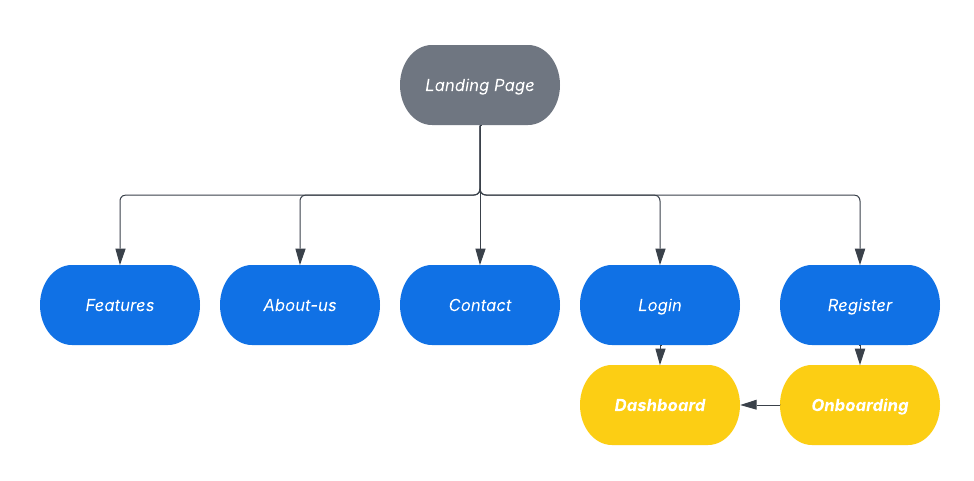

La Web Application utiliza una barra lateral de navegación persistente (sidebar) que organiza los módulos en dos bloques: acciones principales en la parte superior (Dashboard, Nutrition Log, Smart Scan, Recommendations, Pantry, Body Tracking) y configuración en la parte inferior (Analytics, Wearable, Profile, Subscriptions), permitiendo al usuario acceder a cualquier módulo en un solo clic desde cualquier pantalla. 

  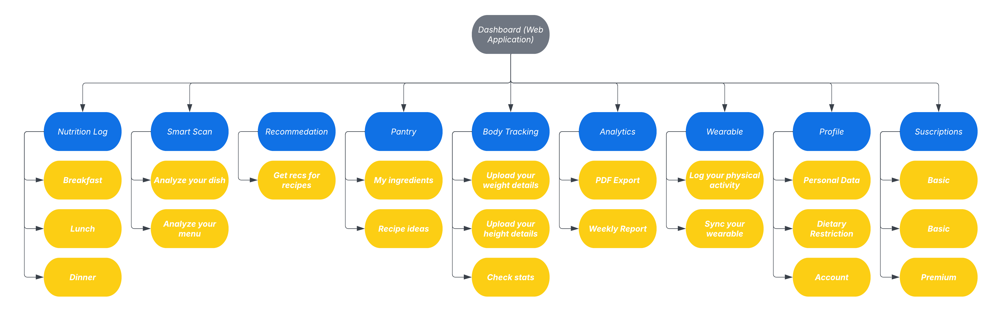

## 4.3. Landing Page UI Design

### 4.3.1. Landing Page Wireframe

### 4.3.2. Landing Page Mock-up

## 4.4. Web Applications UX/UI Design

### 4.4.1. Web Applications Wireframes

### 4.4.2. Web Applications Wireflow Diagrams

### 4.4.2. Web Applications Mock-ups

### 4.4.3. Web Applications User Flow Diagrams

## 4.5. Web Applications Prototyping

## 4.6. Domain-Driven Software Architecture

La arquitectura de NutriSense se basa en Domain-Driven Design (DDD), centrando el diseño en los procesos críticos de salud y nutrición. El sistema se organiza en 7 Bounded Contexts independientes, lo que garantiza una separación clara de responsabilidades y un lenguaje común entre el equipo técnico y el negocio. Este enfoque modular permite que funcionalidades clave, como el análisis de imágenes y el motor de recomendaciones, sean altamente escalables, facilitando un mantenimiento eficiente y una evolución alineada con los requerimientos del dominio.

A continuación, se identifican y describen los contextos delimitados que componen la solución:
| Bounded Context | Descripción | Módulos incluidos |
| :--- | :--- | :--- |
| **Identity & Access** | Gestión de autenticación, autorización y perfiles de usuario. | User & Auth |
| **Nutrition Tracking** | Registro y análisis de alimentos mediante logs y Smart Scan. | Nutrition Log, Smart Scan |
| **Body & Health Metrics** | Seguimiento de indicadores corporales (IMC, TDEE) y metas. | Body Tracking |
| **Smart Recommendations** | Motor de sugerencias personalizadas según contexto y clima. | Recommendations Engine |
| **Activity & Wearable Sync** | Integración y sincronización con dispositivos físicos (Google Fit). | Wearable Sync |
| **Analytics & Reporting** | Generación de dashboards, progreso visual y reportes. | Dashboard & Analytics |
| **Subscriptions & Billing** | Gestión de planes, facturación y control de features Premium. | Subscriptions |

### 4.6.1. Design-Level EventStorming

En esta sección se presenta el modelado del comportamiento del sistema mediante la técnica de EventStorming a nivel de diseño. Este proceso permitió identificar los eventos de dominio y los comandos que disparan la lógica de negocio en cada Bounded Context, estableciendo las reglas de reacción del sistema ante acciones del usuario o políticas automaticas.

A continuación, se detalla la matriz de interdependencias que asegura la reactividad y sincronización de datos entre los distintos módulos:
| Origen (Evento) | Destino (Comando) | Descripción |
| :--- | :--- | :--- |
| **Identity:** User Registered | **Body Metrics:** Register Body Metrics | Inicializa el perfil de salud y metas al crear la cuenta. |
| **Nutrition:** Consumption Updated (Created/Updated/Deleted) | **Analytics:** Generate Progress Insights | Sincroniza indicadores y gráficas de consumo diario ante cualquier cambio en el log. |
| **Nutrition:** Consumption Updated (Created/Updated/Deleted) | **Smart Recs:** Generate Recommendation | Ajusta las sugerencias alimenticias en tiempo real según los macros consumidos y el déficit calórico del día. |
| **Activity:** Caloric Balance Adjusted | **Analytics:** Generate Progress Insights | Refleja el gasto energético por actividad física o sincronización con wearable en los reportes de progreso. |
| **Body Metrics:** TDEE Calculated | **Analytics:** Generate Progress Insights | Compara objetivos metabólicos teóricos frente al progreso real registrado. |
| **Body Metrics:** TDEE Calculated | **Smart Recs:** Generate Recommendation | Personaliza las porciones y sugerencias de comida según el perfil físico y la meta calórica actualizada del usuario. |
| **Subscriptions:** Benefits Enabled | **Smart Recs:** Unlock Premium Features | Habilita el acceso a algoritmos de recomendación avanzada y análisis detallado por IA. |
| **Subscriptions:** Benefits Disabled | **Smart Recs:** Lock Premium Features | Restringe el acceso a funcionalidades avanzadas tras la expiración o cancelación del plan. |

**EventStorming**

Para poder apreciar mejor el EventStorming le recomendamos ingresar al siguiente link:
 [Visualizar EventStorming en Miro](https://miro.com/welcomeonboard/bE1hNUhFbkNRbmJkUjBBSzhIckJGUERwMmE4RnA2bitINitpRVRTKzBVN0loby9TL3dCMmwxK05NVUpMRWhmcll4OWd4Y21weVNaQjlhVElBNk9FQ2pqSXhvNThQV28wWnlBTXZDMFE5SXJZaSs5Y1g0UkQxWFVnL0szbFJqbzJ0R2lncW1vRmFBVnlLcVJzTmdFdlNRPT0hdjE=?share_link_id=245829839866)

### 4.6.2. Software Architecture Context Diagram

El Diagrama de Contexto (Nivel 1 del modelo C4) representa a NutriSense como un sistema centralizado y detalla su interacción con los actores principales y sistemas externos. Este diagrama permite visualizar el alcance global de la solución y los límites del sistema con servicios de terceros que alimentan la lógica de nutrición y salud.

**Elementos:**

 - **NutriSense:** Sistema central que provee las funcionalidades de seguimiento nutricional, escaneo de comidas y recomendaciones inteligentes.
 - **User:** Persona que utiliza la plataforma para gestionar sus objetivos de salud, registrar sus comidas y monitorear su actividad física.
 - **External Systems:**
	- `Google Cloud Vision API:` Procesa las imágenes para el análisis de alimentos.
	- `Nutrition Data Providers:` Fuentes de consulta para información calórica y macronutrientes.
	- `Google Fit API:` Sincroniza datos de actividad física y gasto energético.
	- `OpenWeatherMap:` Provee datos climáticos para ajustar las sugerencias de comidas.
	- `Stripe:` Gestiona de forma segura los pagos y el estado de las suscripciones.
	- `Geolocation API:` Provee la ubicación actual del usuario para el Modo Viaje y las recomendaciones contextuales.

### 4.6.3. Software Architecture Container Diagrams

El Diagrama de Contenedores (Nivel 2 del modelo C4) desglosa el sistema NutriSense en sus principales unidades lógicas de ejecución. En este nivel, se especifican las responsabilidades de cada contenedor, las tecnologías elegidas para su implementación y los protocolos de comunicación que permiten la interacción entre ellos y con los sistemas externos.

**Elementos:**

 - **Web Application:** Servidor web que entrega los archivos estáticos al navegador del usuario para inicializar la aplicación.
    - **Tecnología:** `Nginx`.
 - **Landing Page:** Sitio web estático que presenta la propuesta de valor de NutriSense y redirige a los usuarios hacia la aplicación web.
    - **Tecnología:** `HTML5 + CSS3 + JavaScript`.
 - **Single Page Application:** Frontend donde los usuarios interactúan con la plataforma, gestionan sus metas y visualizan sus progresos. Se ejecuta completamente en el navegador del usuario.
    - **Tecnología:** `Vue.js (con PrimeVue para UI y Pinia para el estado)`.
 - **API Application:** Backend que maneja la lógica de negocio, el motor de recomendaciones, el procesamiento de imágenes y la integración con servicios externos.
    - **Tecnología:** `ASP.NET Core (C#)`.
 - **Database:** Almacena la información de usuarios, registros nutricionales, historial de métricas y datos de facturación.
    - **Tecnología:** `PostgreSQL`.
 - **External Systems:** APIs de terceros que se integran con el backend para extender las capacidades del sistema.
    - **Tecnología:** `JSON/HTTPS (REST)`.

### 4.6.4. Software Architecture Components Diagrams

El Diagrama de Componentes (Nivel 3 del modelo C4) describe la estructura interna de los contenedores principales de NutriSense. En esta sección se detallan los módulos lógicos, sus responsabilidades específicas y las tecnologías utilizadas para la implementación de cada componente.

**A. Single Page Application Components (Frontend)**

El Single Page Application se organiza en 7 Bounded Contexts, cada uno con 4 capas siguiendo el patrón de arquitectura del Domain-Driven Design. 

El diagrama a continuación muestra todos los componentes de la arquitectura en un único bloque, dado que Structurizr no soporta la agrupación visual por Bounded Context en las vistas de componentes.

Cada Bounded Context contiene una capa de Presentation con las vistas Vue, una capa de Application con los servicios JavaScript que orquestan la lógica del cliente, una capa de Domain con los modelos e interfaces, y una capa de Infrastructure con el cliente HTTP Axios que se comunica con el API Application.

Para apreciar la separación por capas Domain-Driven Design de cada Bounded Context, se presenta a continuación un diagrama de detalle individual por cada uno.

**Bounded Contexts:**

 - **Identity & Access:** Gestiona las vistas de login, registro y perfil del usuario.

    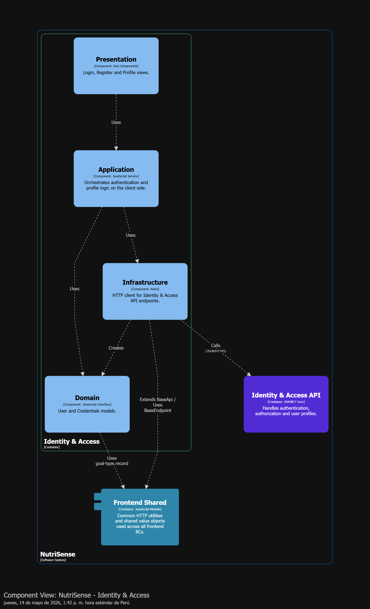

 - **Nutrition Tracking:** Gestiona las vistas de registro de comidas, Smart Scan y escaneo de menús.
    
    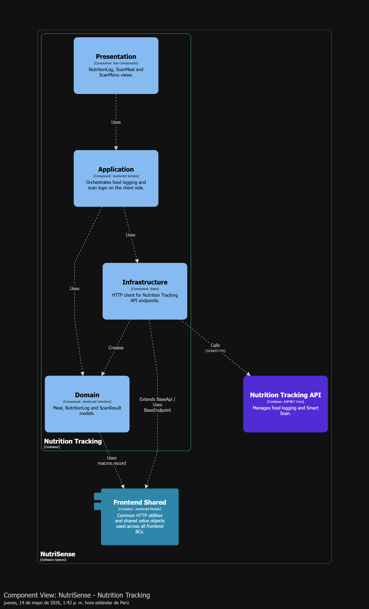

 - **Body & Health Metrics:** Gestiona las vistas de métricas corporales, historial de peso y objetivos de salud.
    
    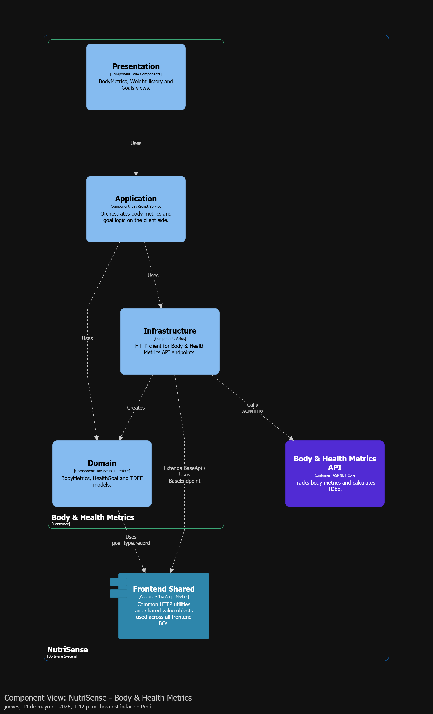

 - **Smart Recommendations:** Gestiona las vistas de recomendaciones personalizadas, Modo Viaje y Despensa.
    
    

 - **Activity & Wearable Sync:** Gestiona las vistas de registro de actividad física y sincronización con wearables.
    
    

 - **Analytics & Reporting:** Gestiona las vistas del dashboard, gráficas de progreso y rachas.
    
    

 - **Subscriptions & Billing:** Gestiona las vistas de planes de suscripción y pagos.
    
    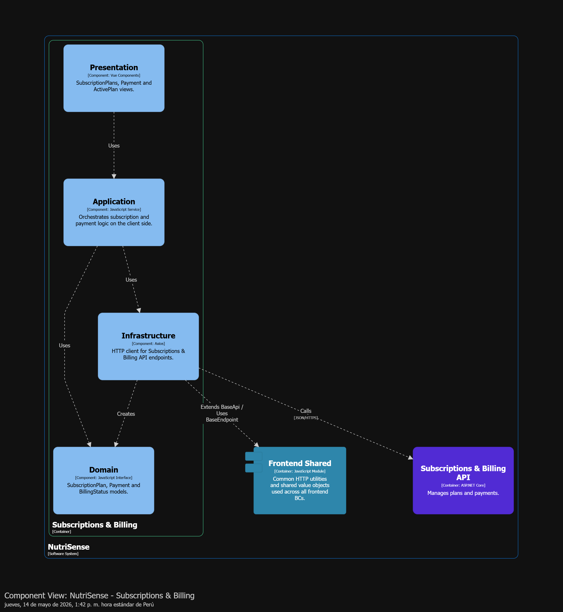

**B. API Application Components (Backend)**

El API Application se organiza en 7 Bounded Contexts y un Shared Kernel, cada uno siguiendo el patrón de arquitectura del Domain-Driven Design.

El diagrama a continuación muestra todos los componentes de la arquitectura en un único bloque, dado que Structurizr no soporta la agrupación visual por Bounded Context en las vistas de componentes.

Cada Bounded Context contiene una capa de Interfaces con los Controllers de ASP.NET Core que reciben las peticiones HTTP, una capa de Application con los servicios y comandos que orquestan los casos de uso, una capa de Domain con los agregados y entidades del dominio, y una capa de Infrastructure con los repositorios de Entity Framework Core y los clientes de APIs externas cuando corresponda. 

Para apreciar la separación por capas Domain-Driven Design de cada Bounded Context, se presenta a continuación un diagrama de detalle individual por cada uno.

**Bounded Contexts:**

 - **Identity & Access:** Maneja la autenticación, autorización y perfiles de usuario.

    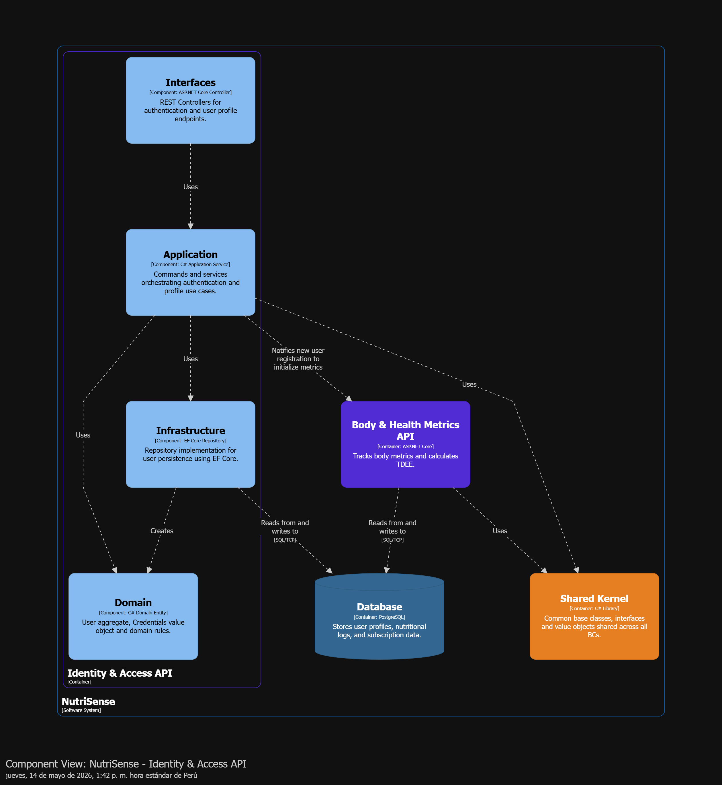

 - **Nutrition Tracking:** Gestiona el registro de comidas y el procesamiento de Smart Scan. Se integra con Google Cloud Vision y Nutrition Data Providers.

    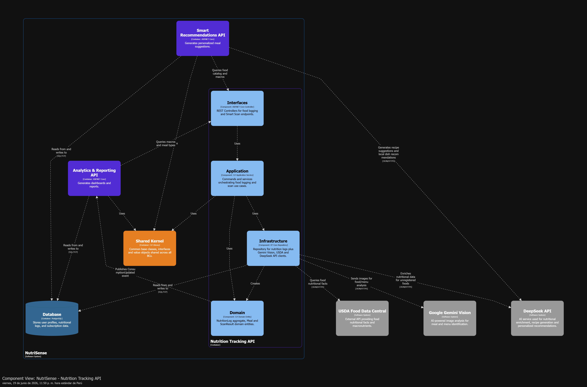

 - **Body & Health Metrics:** Calcula índices de salud como BMI y TDEE y registra el historial de peso.

    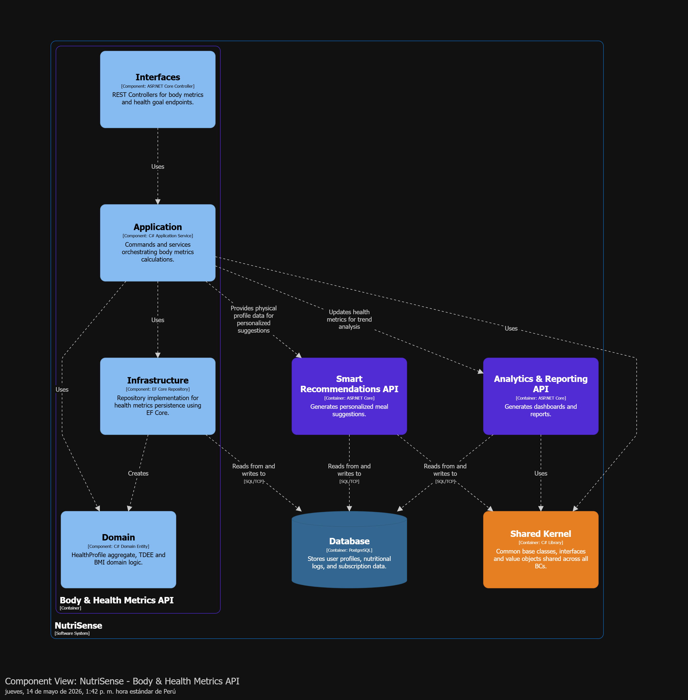

 - **Smart Recommendations:** Procesa datos contextuales para generar sugerencias personalizadas. Se integra con OpenWeatherMap y Geolocation API.

    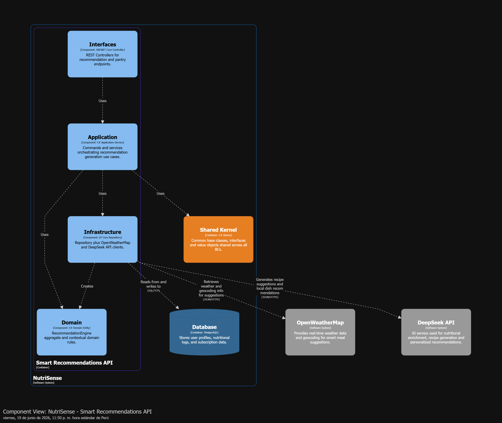

 - **Activity & Wearable Sync:** Sincroniza pasos y datos de actividad desde Google Fit.

    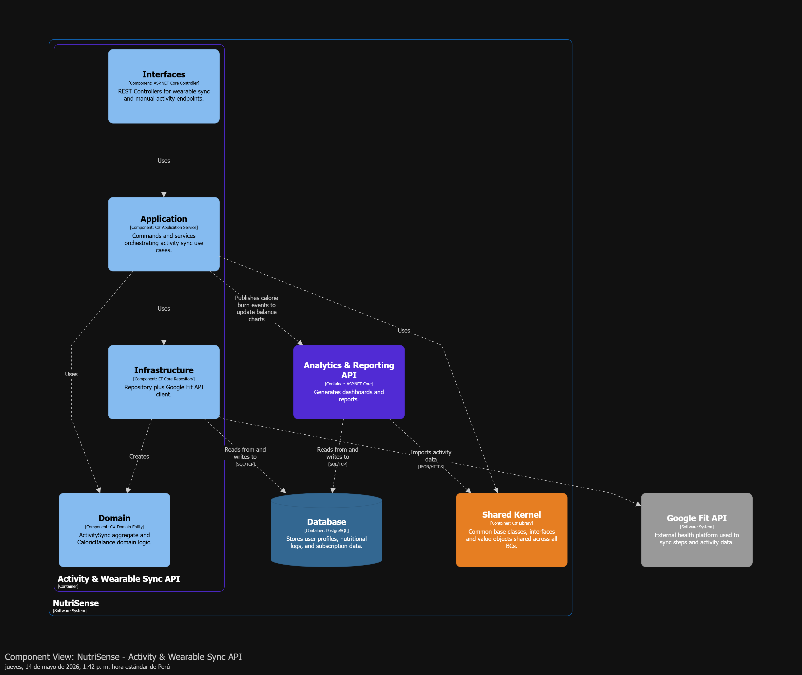

 - **Analytics & Reporting:** Genera gráficas de progreso, rachas y reportes del usuario.

    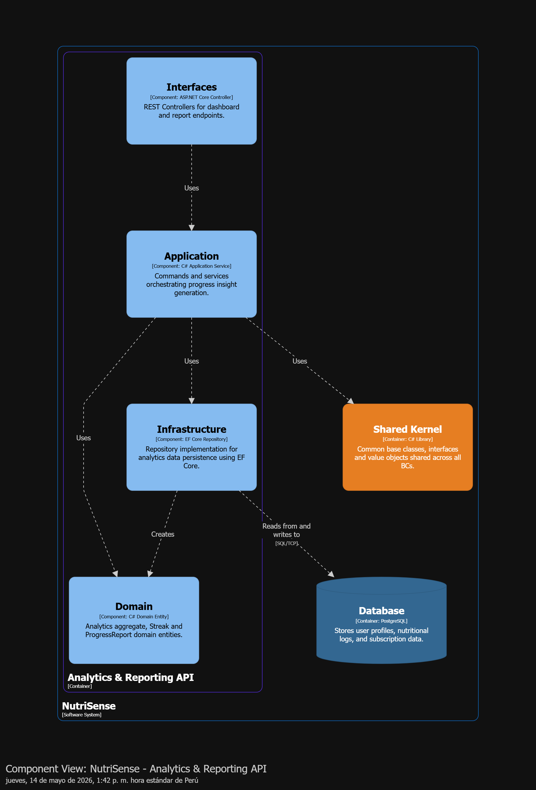

 - **Subscriptions & Billing:** Gestiona los niveles de suscripción e integra con Stripe para el procesamiento de pagos.

    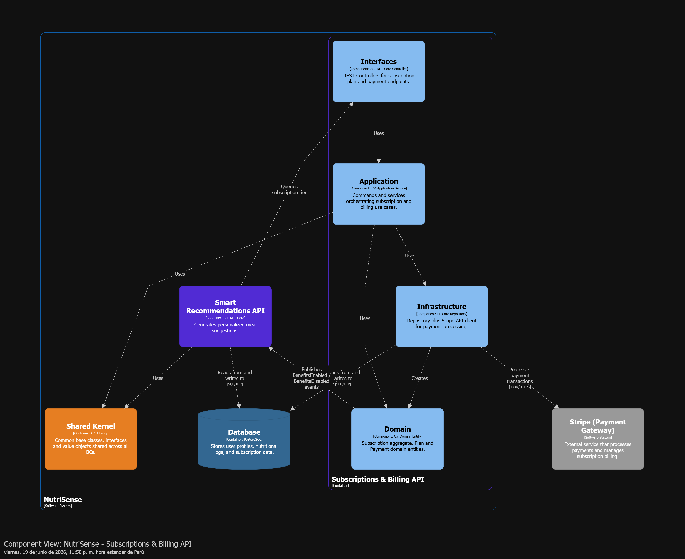

**Shared Kernel:**

Componente transversal utilizado por todos los Bounded Contexts que agrupa clases base, interfaces compartidas y objetos de valor reutilizables. No contiene lógica de negocio propia ni acceso a base de datos.

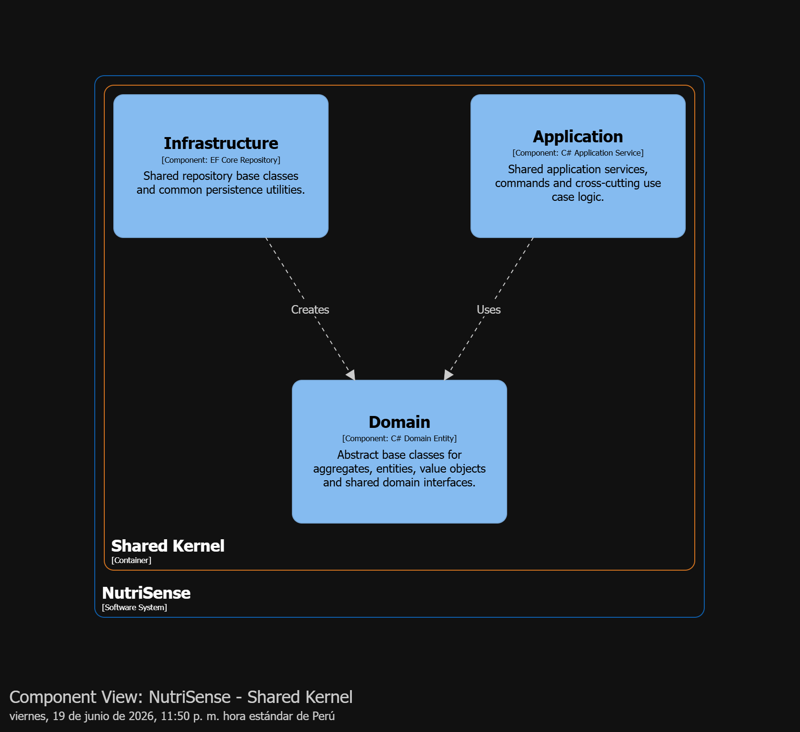

## 4.7. Software Object-Oriented Design

### 4.7.1. Class Diagrams

## 4.8. Database Design

### 4.8.1. Database Diagrams
