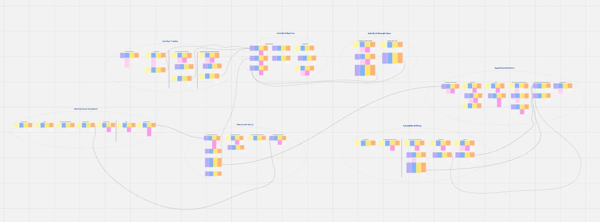
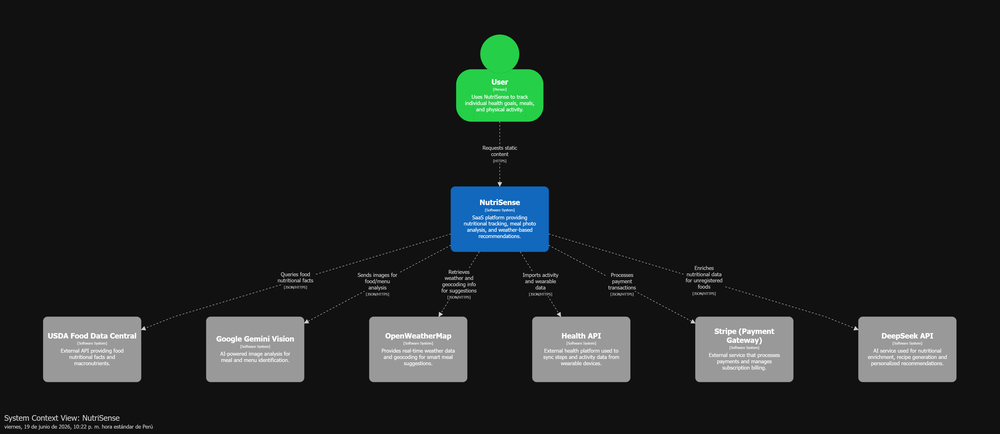

# CAPÍTULO IV: PRODUCT DESIGN

## 4.1. Style Guidelines

### 4.1.1. General Style Guidelines

### 4.1.2. Web Style Guidelines

## 4.2. Information Architecture

### 4.2.1. Organization Systems

### 4.2.2. Labeling Systems

### 4.2.3. SEO Tags and Meta Tags

### 4.2.4. Searching Systems

### 4.2.5. Navigation Systems

## 4.3. Landing Page UI Design

### 4.3.1. Landing Page Wireframe

### 4.3.2. Landing Page Mock-up

## 4.4. Web Applications UX/UI Design

### 4.4.1. Web Applications Wireframes

### 4.4.2. Web Applications Wireflow Diagrams

### 4.4.2. Web Applications Mock-ups

### 4.4.3. Web Applications User Flow Diagrams

## 4.5. Web Applications Prototyping

## 4.6. Domain-Driven Software Architecture

La arquitectura de NutriSense se basa en Domain-Driven Design (DDD), centrando el diseño en los procesos críticos de salud y nutrición. El sistema se organiza en 7 Bounded Contexts independientes, lo que garantiza una separación clara de responsabilidades y un lenguaje común entre el equipo técnico y el negocio. Este enfoque modular permite que funcionalidades clave, como el análisis de imágenes y el motor de recomendaciones, sean altamente escalables, facilitando un mantenimiento eficiente y una evolución alineada con los requerimientos del dominio.
 A continuación, se identifican y describen los contextos delimitados que componen la solución:
| Bounded Context | Descripción | Módulos incluidos |
| :--- | :--- | :--- |
| **Identity & Access** | Gestión de autenticación, autorización y perfiles de usuario. | User & Auth |
| **Nutrition Tracking** | Registro y análisis de alimentos mediante logs y Smart Scan. | Nutrition Log, Smart Scan |
| **Body & Health Metrics** | Seguimiento de indicadores corporales (IMC, TDEE) y metas. | Body Tracking |
| **Smart Recommendations** | Motor de sugerencias personalizadas según contexto y clima. | Recommendations Engine |
| **Activity & Wearable Sync** | Integración y sincronización con dispositivos físicos (Google Fit). | Wearable Sync |
| **Analytics & Reporting** | Generación de dashboards, progreso visual y reportes. | Dashboard & Analytics |
| **Subscriptions & Billing** | Gestión de planes, facturación y control de features Premium. | Subscriptions |

### 4.6.1. Design-Level EventStorming

En esta sección se presenta el modelado del comportamiento del sistema mediante la técnica de EventStorming a nivel de diseño. Este proceso permitió identificar los eventos de dominio y los comandos que disparan la lógica de negocio en cada Bounded Context, estableciendo las reglas de reacción del sistema ante acciones del usuario o políticas automaticas.
 A continuación, se detalla la matriz de interdependencias que asegura la reactividad y sincronización de datos entre los distintos módulos:
| Origen (Evento) | Destino (Comando) | Descripción |
| :--- | :--- | :--- |
| **Identity:** User Registered | **Body Metrics:** Register Body Metrics | Inicializa el perfil de salud y metas al crear la cuenta. |
| **Nutrition:** Consumption Updated (Created/Updated/Deleted) | **Analytics:** Generate Progress Insights | Sincroniza indicadores y gráficas de consumo diario ante cualquier cambio en el log. |
| **Nutrition:** Consumption Updated (Created/Updated/Deleted) | **Smart Recs:** Generate Recommendation | Ajusta las sugerencias alimenticias en tiempo real según los macros consumidos y el déficit calórico del día. |
| **Activity:** Caloric Balance Adjusted | **Analytics:** Generate Progress Insights | Refleja el gasto energético por actividad física o sincronización con wearable en los reportes de progreso. |
| **Body Metrics:** TDEE Calculated | **Analytics:** Generate Progress Insights | Compara objetivos metabólicos teóricos frente al progreso real registrado. |
| **Body Metrics:** TDEE Calculated | **Smart Recs:** Generate Recommendation | Personaliza las porciones y sugerencias de comida según el perfil físico y la meta calórica actualizada del usuario. |
| **Subscriptions:** Benefits Enabled | **Smart Recs:** Unlock Premium Features | Habilita el acceso a algoritmos de recomendación avanzada y análisis detallado por IA. |
| **Subscriptions:** Benefits Disabled | **Smart Recs:** Lock Premium Features | Restringe el acceso a funcionalidades avanzadas tras la expiración o cancelación del plan. |

**EventStorming**

Para poder apreciar mejor el EventStorming le recomendamos ingresar al siguiente link:
[Visualizar EventStorming en Miro](https://miro.com/welcomeonboard/NUZxcUQ2Qk5GeExXSmt6NWVib0EyQ2I1NWRoVWNiVWY1Y2xHOUVwWHcxQzhnY3RmTWZpRTJQWU9MTTBSVnZ1WjdvY3ZNaisrTmpVbGZNaUJvcVpPd2pqSXhvNThQV28wWnlBTXZDMFE5SXJkUjM0K21IRkpUQ3ZHMkJOZ2RwcExhWWluRVAxeXRuUUgwWDl3Mk1qRGVRPT0hdjE=?share_link_id=134220967869)

### 4.6.2. Software Architecture Context Diagram

El Diagrama de Contexto (Nivel 1 del modelo C4) representa a NutriSense como un sistema centralizado y detalla su interacción con los actores principales y sistemas externos. Este diagrama permite visualizar el alcance global de la solución y los límites del sistema con servicios de terceros que alimentan la lógica de nutrición y salud.

**Elementos:**

 - **NutriSense:** Sistema central que provee las funcionalidades de seguimiento nutricional, escaneo de comidas y recomendaciones inteligentes.
 - **User:** Persona que utiliza la plataforma para gestionar sus objetivos de salud, registrar sus comidas y monitorear su actividad física.
 - **External Systems:**
	- **Google Cloud Vision API:** Procesa las imágenes para el análisis de alimentos.
	- **Nutrition Data Providers:** Fuentes de consulta para información calórica y macronutrientes.
	- **Google Fit API:** Sincroniza datos de actividad física y gasto energético.
	- **OpenWeatherMap:** Provee datos climáticos para ajustar las sugerencias de comidas.
	- **Stripe:** Gestiona de forma segura los pagos y el estado de las suscripciones.

### 4.6.3. Software Architecture Container Diagrams

### 4.6.4. Software Architecture Components Diagrams

## 4.7. Software Object-Oriented Design

### 4.7.1. Class Diagrams

## 4.8. Database Design

### 4.8.1. Database Diagrams
