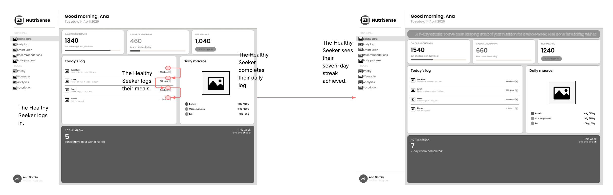
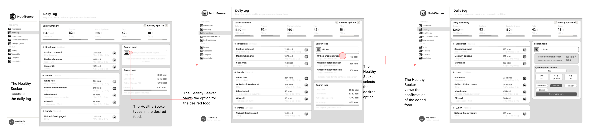
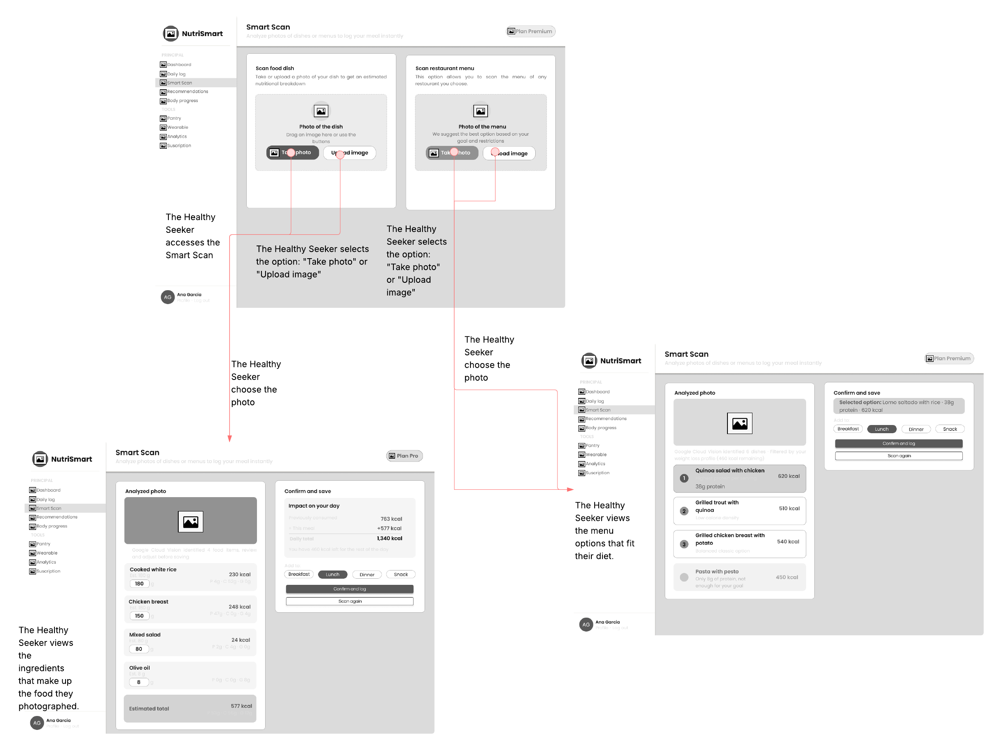
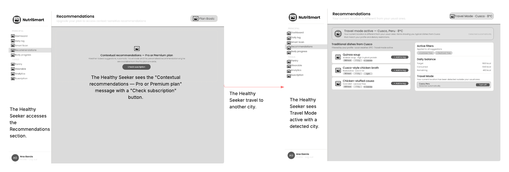
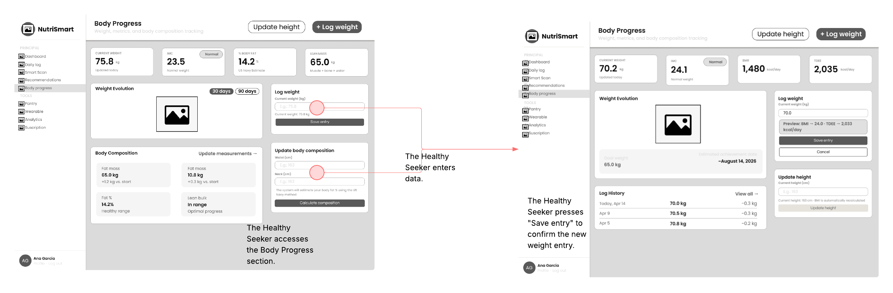
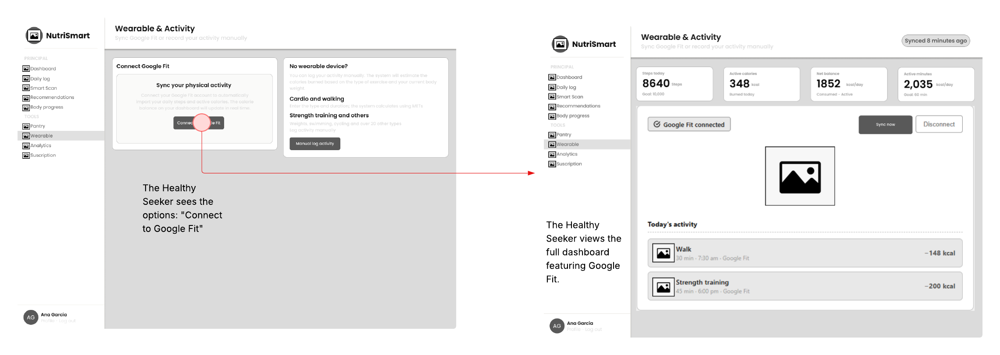
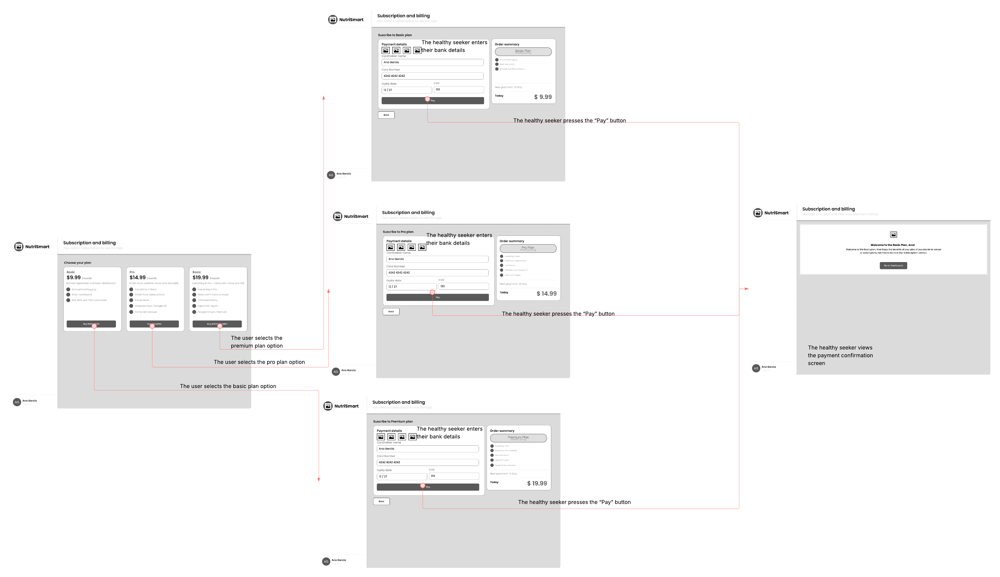

# CAPÍTULO IV: PRODUCT DESIGN

## 4.1. Style Guidelines

### 4.1.1. General Style Guidelines

### 4.1.2. Web Style Guidelines

## 4.2. Information Architecture

### 4.2.1. Organization Systems

### 4.2.2. Labeling Systems

### 4.2.3. SEO Tags and Meta Tags

### 4.2.4. Searching Systems

### 4.2.5. Navigation Systems

## 4.3. Landing Page UI Design

### 4.3.1. Landing Page Wireframe

### 4.3.2. Landing Page Mock-up

## 4.4. Web Applications UX/UI Design

### 4.4.1. Web Applications Wireframes

### 4.4.2. Web Applications Wireflow Diagrams

### WireFlow 1 — Dashboard

| **User Goal N°1** | As a health seeker, I want to view a summary of my daily nutritional progress and receive alerts when I exceed my caloric limits, in order to stay in control of my diet. |
|---|---|

| **Task Flow** |
|---|
| 1. The health seeker accesses the Dashboard. |
| 2. The health seeker views their calories consumed, burned, and the net balance for the day. |
| 3. The health seeker logs their meals throughout the day. |
| 4. The health seeker completes their daily log. |
| 5. The health seeker views their active streak of 7 consecutive completed days. |

| 
**Wireflow** |
|---|
||

### WireFlow 2 — Daily Log

| **User Goal N°2** | As a health seeker, I want to search for and log the foods I consume in my daily record, in order to keep precise track of my macronutrients and calories. |
|---|---|

| **Task Flow** |
|---|
| 1. The health seeker accesses the Daily Log section. |
| 2. The health seeker types the name of the food in the search bar. |
| 3. The health seeker selects the desired food from the results. |
| 4. The health seeker selects the portion size and meal (Breakfast / Lunch / Dinner). |
| 5. The health seeker views the confirmation that the food has been added to the log. |

| 
**Wireflow** |
|---|
||

### WireFlow 3 — Smart Scan

| **User Goal N°3** | As a health seeker, I want to scan or photograph a dish or menu to automatically identify its ingredients and log its nutritional information, saving time on manual entry. |
|---|---|

| **Task Flow** |
|---|
| 1. The health seeker accesses the Smart Scan section. |
| 2. The health seeker selects the *"Take photo"* or *"Upload image"* option. |
| 3. The health seeker captures or uploads a photo of a dish. |
| 4. The health seeker views the identified ingredients that make up the dish. |
| 5. The health seeker confirms and saves the nutritional log. |

| 
**Wireflow** |
|---|
||

### WireFlow 4 — Recommendations

| **User Goal N°4** | As a health seeker, I want to receive personalized dish recommendations based on my current location and weather, in order to choose options that fit my context and nutritional profile. |
|---|---|

| **Task Flow** |
|---|
| 1. The health seeker accesses the Recommendations section. |
| 2. The system automatically detects the user's location and temperature. |
| 3. The health seeker views personalized dish recommendations based on their current location and weather. |
| 4. The health seeker selects a recommended dish. |

| 
**Wireflow** |
|---|
||

### WireFlow 5 — Body Progress

| **User Goal N°5** | As a health seeker, I want to log and update my body weight to monitor my physical progress and keep accurate data about my evolution. |
|---|---|

| **Task Flow** |
|---|
| 1. The health seeker accesses the Body Progress section. |
| 2. The health seeker enters a new weight value. |
| 3. The health seeker views a preview of the updated BMI and TDEE. |
| 4. The health seeker presses *"Save entry"* to confirm the new weight record. |

| 
**Wireflow** |
|---|
||

### WireFlow 6 — Wearable

| **User Goal N°6** | As a health seeker, I want to connect my wearable device or manually log my physical activity, so that my burned calories are accurately reflected in my daily nutritional balance. |
|---|---|

| **Task Flow** |
|---|
| 1. The health seeker accesses the Wearable section. |
| 2. The health seeker selects the *"Connect to Google Fit"* option. |
| 3. The connection with Google Fit is completed successfully. |
| 4. The health seeker views the complete dashboard with data synced from Google Fit. |

| 
**Wireflow** |
|---|
||

### WireFlow 7 — Subscription

| **User Goal N°7** | As a health seeker, I want to subscribe to a paid plan to access NutriSmart's advanced features. |
|---|---|

| **Task Flow** |
|---|
| 1. The health seeker accesses the Subscription and Billing section. |
| 2. The health seeker views the three available plans: Basic ($9.99), Pro ($14.99), and Premium ($19.99). |
| 3. The health seeker selects the desired plan. |
| 4. The health seeker enters their banking details in the payment form. |
| 5. The health seeker presses the *"Pay"* button. |
| 6. The health seeker views the payment confirmation and the welcome message for the selected plan. |

| 
**Wireflow** |
|---|
||

### 4.4.2. Web Applications Mock-ups

### 4.4.3. Web Applications User Flow Diagrams

## 4.5. Web Applications Prototyping

## 4.6. Domain-Driven Software Architecture

### 4.6.1. Design-Level EventStorming

### 4.6.2. Software Architecture Context Diagram

### 4.6.3. Software Architecture Container Diagrams

### 4.6.4. Software Architecture Components Diagrams

## 4.7. Software Object-Oriented Design

### 4.7.1. Class Diagrams

## 4.8. Database Design

### 4.8.1. Database Diagrams
