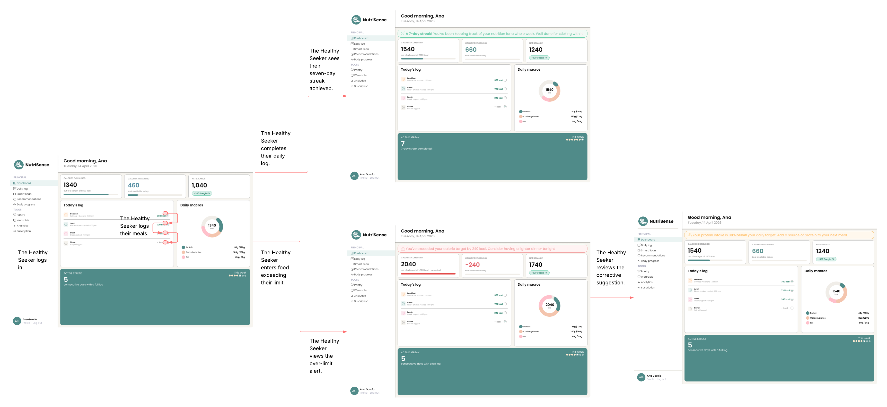
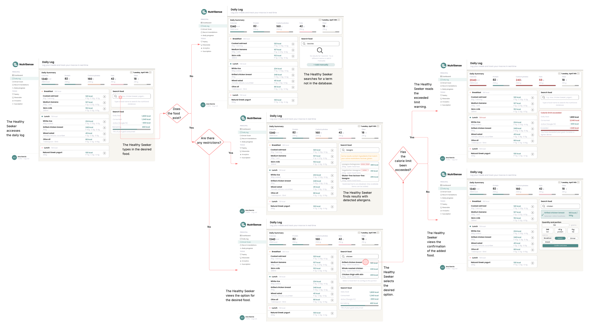
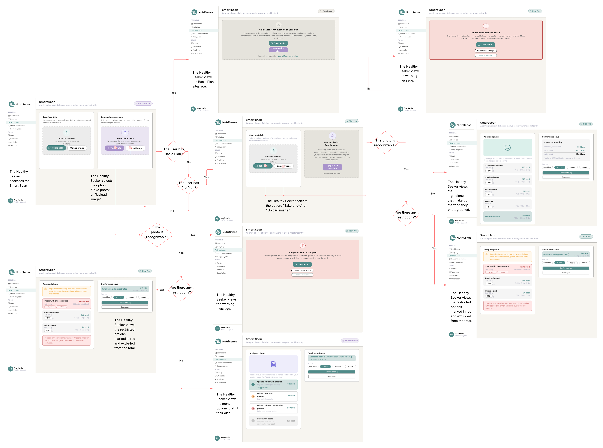
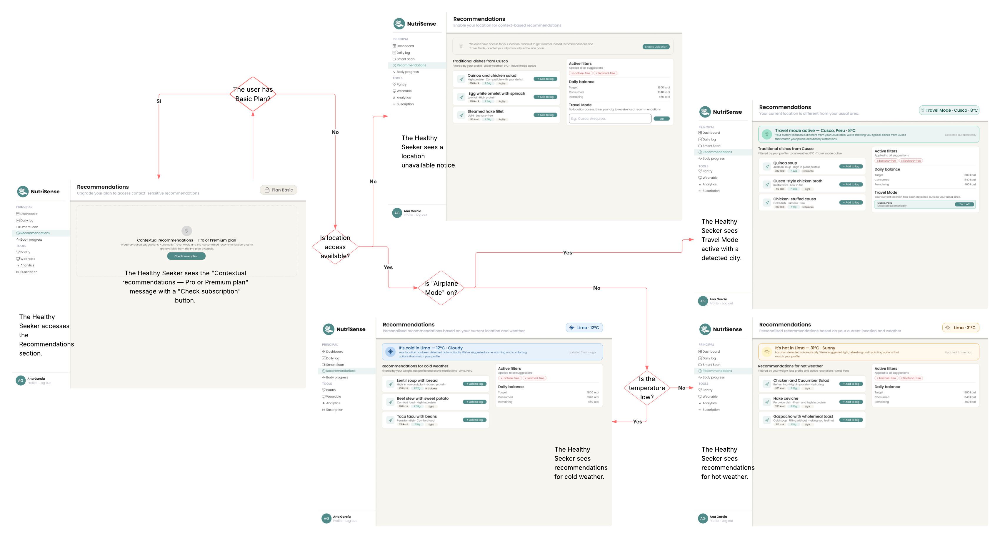
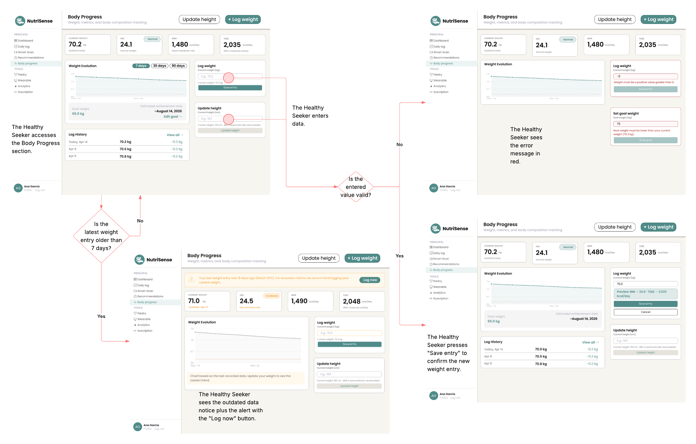
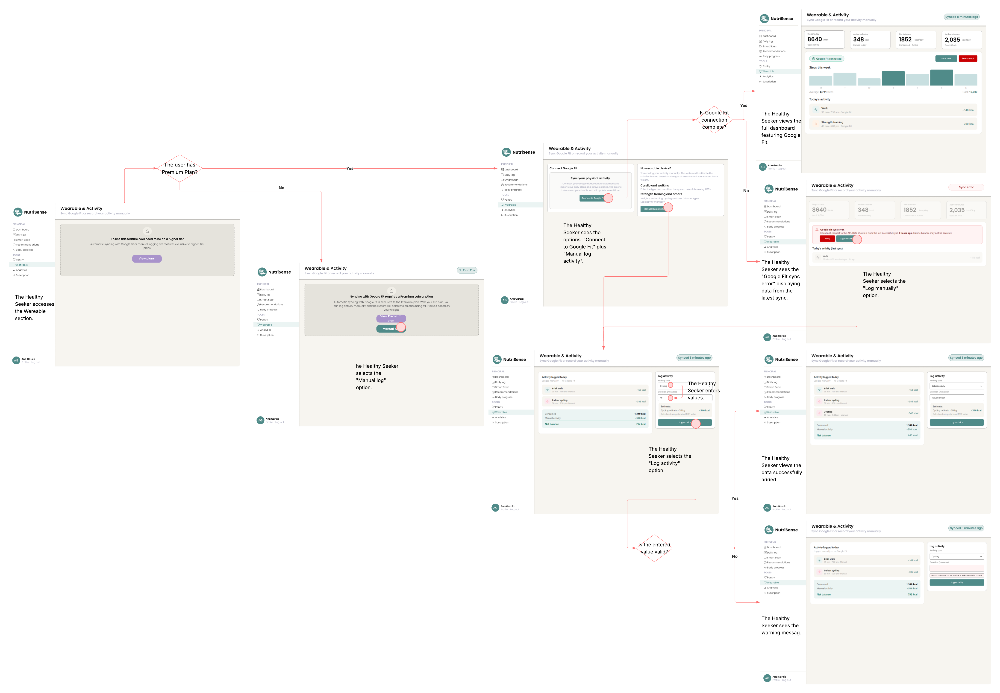
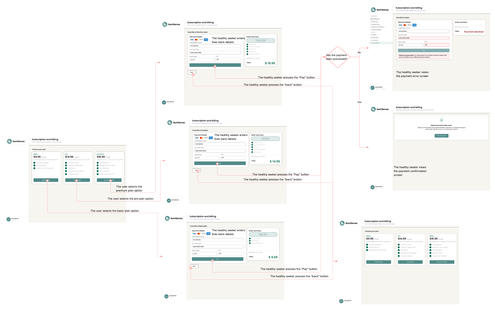

# CAPÍTULO IV: PRODUCT DESIGN

## 4.1. Style Guidelines

### 4.1.1. General Style Guidelines

### 4.1.2. Web Style Guidelines

## 4.2. Information Architecture

### 4.2.1. Organization Systems

### 4.2.2. Labeling Systems

### 4.2.3. SEO Tags and Meta Tags

### 4.2.4. Searching Systems

### 4.2.5. Navigation Systems

## 4.3. Landing Page UI Design

### 4.3.1. Landing Page Wireframe

### 4.3.2. Landing Page Mock-up

## 4.4. Web Applications UX/UI Design

### 4.4.1. Web Applications Wireframes

### 4.4.2. Web Applications Wireflow Diagrams

### 4.4.2. Web Applications Mock-ups

### 4.4.3. Web Applications User Flow Diagrams

### User Flow 1 — Dashboard

| | |
|---|---|
| **User Goal N°1** | As a health seeker, I want to view a summary of my daily nutritional progress and receive alerts when I exceed my caloric limits, in order to stay in control of my diet. |

| | |
|---|---|
| **Happy Path** | 1. The health seeker accesses the Dashboard. |
| | 2. The health seeker views their calories consumed, burned, and the net balance for the day. |
| | 3. The health seeker logs their meals throughout the day. |
| | 4. The health seeker completes their daily log. |
| | 5. The health seeker views their active streak of 7 consecutive completed days. |

| | |
|---|---|
| **Unhappy Path 1** | 1. The health seeker accesses the Dashboard. |
| | 2. The health seeker logs foods exceeding their caloric limit. |
| | 3. The health seeker views the caloric excess alert with the message: *"You've exceeded your calorie target by 240 kcal. Consider having a lighter dinner tonight."* |
| | 4. The health seeker reviews the corrective suggestion displayed on the Dashboard. |

| 
**User Flow** |
|---|
||

---

### User Flow 2 — Daily Log

| | |
|---|---|
| **User Goal N°2** | As a health seeker, I want to search for and log the foods I consume in my daily record, in order to keep precise track of my macronutrients and calories. |

| | |
|---|---|
| **Happy Path** | 1. The health seeker accesses the Daily Log section. |
| | 2. The health seeker types the name of the food in the search bar. |
| | 3. The food exists in the database and has no restrictions. |
| | 4. The health seeker views the desired food option in the results. |
| | 5. The health seeker selects the desired food. |
| | 6. The health seeker selects the portion size and meal (Breakfast / Lunch / Dinner). |
| | 7. The health seeker views the confirmation that the food has been added to the log. |

| | |
|---|---|
| **Unhappy Path 1** | 1. The health seeker accesses the Daily Log section. |
| | 2. The health seeker types the name of the food in the search bar. |
| | 3. The food does not exist in the database. |
| | 4. The health seeker views the no results message and the *"+ Add manually"* option. |

| | |
|---|---|
| **Unhappy Path 2** | 1. The health seeker accesses the Daily Log section. |
| | 2. The health seeker types the name of the food in the search bar. |
| | 3. The food exists but contains restrictions (detected allergens). |
| | 4. The health seeker views the results with the detected allergens highlighted in yellow. |

| | |
|---|---|
| **Unhappy Path 3** | 1. The health seeker accesses the Daily Log section. |
| | 2. The health seeker adds a food that exceeds the daily caloric limit. |
| | 3. The caloric limit has been exceeded. |
| | 4. The health seeker views the exceeded caloric limit warning highlighted in red within the Daily Log. |

| 
**User Flow** |
|---|
||

---

### User Flow 3 — Smart Scan

| | |
|---|---|
| **User Goal N°3** | As a health seeker, I want to scan or photograph a dish or menu to automatically identify its ingredients and log its nutritional information, saving time on manual entry. |

| | |
|---|---|
| **Happy Path** | 1. The health seeker accesses the Smart Scan section. |
| | 2. The health seeker has a Pro or Premium Plan. |
| | 3. The health seeker selects the *"Take photo"* or *"Upload image"* option. |
| | 4. The photo is recognizable and has no restrictions. |
| | 5. The health seeker views the identified ingredients that make up the photographed dish. |
| | 6. The health seeker confirms and saves the nutritional log. |

| | |
|---|---|
| **Unhappy Path 1** | 1. The health seeker accesses the Smart Scan section. |
| | 2. The health seeker has a Basic Plan. |
| | 3. The health seeker views the Basic Plan interface with a message indicating that Smart Scan is not available on their current plan. |

| | |
|---|---|
| **Unhappy Path 2** | 1. The health seeker accesses the Smart Scan section. |
| | 2. The health seeker has a Pro Plan. |
| | 3. The health seeker selects the *"Take photo"* or *"Upload image"* option. |
| | 4. The photo is not recognizable. |
| | 5. The health seeker views the warning message: *"The image does not contain recognizable food"*, with the options to take another photo or upload an image. |

| | |
|---|---|
| **Unhappy Path 3** | 1. The health seeker accesses the Smart Scan section. |
| | 2. The health seeker has a Pro Plan. |
| | 3. The health seeker selects the *"Take photo"* or *"Upload image"* option. |
| | 4. The photo is recognizable but contains dietary restrictions. |
| | 5. The health seeker views the restricted ingredients marked in red and excluded from the nutritional total. |

| 
**User Flow** |
|---|
||

---

### User Flow 4 — Recommendations

| | |
|---|---|
| **User Goal N°4** | As a health seeker, I want to receive personalized dish recommendations based on my current location and weather, in order to choose options that fit my context and nutritional profile. |

| | |
|---|---|
| **Happy Path** | 1. The health seeker accesses the Recommendations section. |
| | 2. The health seeker has a Pro or Premium Plan. |
| | 3. Location access is available and airplane mode is off. |
| | 4. The detected temperature is low. |
| | 5. The health seeker views dish recommendations for cold weather, filtered by their profile and location (Lima). |

| | |
|---|---|
| **Unhappy Path 1** | 1. The health seeker accesses the Recommendations section. |
| | 2. The health seeker has a Basic Plan. |
| | 3. The health seeker views the message *"Contextual recommendations — Pro or Premium plan"* with the *"Check subscription"* button. |

| | |
|---|---|
| **Unhappy Path 2** | 1. The health seeker accesses the Recommendations section. |
| | 2. The health seeker has a Pro or Premium Plan. |
| | 3. Location access is not available. |
| | 4. The health seeker views the location unavailable notice. |

| | |
|---|---|
| **Unhappy Path 3** | 1. The health seeker accesses the Recommendations section. |
| | 2. The health seeker has a Pro or Premium Plan. |
| | 3. Location access is available but airplane mode is on, detecting a different city (Cusco). |
| | 4. The health seeker views the active Travel Mode with the detected city and recommendations for traditional dishes from Cusco. |

| 
**User Flow** |
|---|
||

---

### User Flow 5 — Body Progress

| | |
|---|---|
| **User Goal N°5** | As a health seeker, I want to log and update my body weight to monitor my physical progress and keep accurate data about my evolution. |

| | |
|---|---|
| **Happy Path** | 1. The health seeker accesses the Body Progress section. |
| | 2. The last weight entry is less than 7 days old. |
| | 3. The health seeker enters a valid weight value (positive). |
| | 4. The health seeker views a preview of the updated BMI and TDEE. |
| | 5. The health seeker presses *"Save entry"* to confirm the new weight record. |

| | |
|---|---|
| **Unhappy Path 1** | 1. The health seeker accesses the Body Progress section. |
| | 2. The last weight entry is more than 7 days old. |
| | 3. The health seeker views the outdated data notice with the *"Log now"* button to record their current weight. |

| | |
|---|---|
| **Unhappy Path 2** | 1. The health seeker accesses the Body Progress section. |
| | 2. The health seeker enters an invalid value (negative or non-numeric). |
| | 3. The health seeker views the error message in red: *"Weight must be a positive value greater than 0"* or *"Goal weight must be lower than your current weight"*. |

| 
**User Flow** |
|---|
||

---

### User Flow 6 — Wearable

| | |
|---|---|
| **User Goal N°6** | As a health seeker, I want to connect my wearable device or manually log my physical activity, so that my burned calories are accurately reflected in my daily nutritional balance. |

| | |
|---|---|
| **Happy Path** | 1. The health seeker accesses the Wearable section. |
| | 2. The health seeker has a Premium Plan. |
| | 3. The health seeker views the options: *"Connect to Google Fit"* and *"Manual log activity"*. |
| | 4. The connection with Google Fit is successful. |
| | 5. The health seeker views the complete dashboard with data synced from Google Fit. |

| | |
|---|---|
| **Unhappy Path 1** | 1. The health seeker accesses the Wearable section. |
| | 2. The health seeker does not have a Premium Plan. |
| | 3. The health seeker views the message indicating that the feature requires a higher plan, with the *"View plans"* button. |

| | |
|---|---|
| **Unhappy Path 2** | 1. The health seeker accesses the Wearable section. |
| | 2. The health seeker has a Premium Plan. |
| | 3. The connection with Google Fit does not complete successfully. |
| | 4. The health seeker views the sync error *"Google Fit sync error"* with the last available sync data. |
| | 5. The health seeker selects the *"Manual log activity"* option. |
| | 6. The health seeker enters an invalid value when logging the activity. |
| | 7. The health seeker views the incorrect value warning message. |

| 
**User Flow** |
|---|
||

---

### User Flow 7 — Subscription

| | |
|---|---|
| **User Goal N°7** | As a health seeker, I want to subscribe to a paid plan to access NutriSense's advanced features. |

| | |
|---|---|
| **Happy Path** | 1. The health seeker accesses the Subscription and Billing section. |
| | 2. The health seeker views the three available plans: Basic ($9.99), Pro ($14.99), and Premium ($19.99). |
| | 3. The health seeker selects the desired plan (Basic, Pro, or Premium). |
| | 4. The health seeker enters their banking details in the payment form. |
| | 5. The health seeker presses the *"Pay"* button. |
| | 6. The payment is processed successfully. |
| | 7. The health seeker views the payment confirmation screen with the welcome message for the selected plan. |

| | |
|---|---|
| **Unhappy Path 1** | 1. The health seeker accesses the Subscription and Billing section. |
| | 2. The health seeker selects a plan and completes the payment form. |
| | 3. The health seeker presses the *"Pay"* button. |
| | 4. The payment is not processed. |
| | 5. The health seeker views the payment error screen with the message *"Payment not processed. Your subscription has not been activated. Please check your details or try a different payment method."* |

| | |
|---|---|
| **Unhappy Path 2** | 1. The health seeker accesses the Subscription and Billing section. |
| | 2. The health seeker selects a plan and reviews the order summary. |
| | 3. The health seeker presses the *"Back"* button to return to the plan selection screen. |
| | 4. The health seeker views the plan selection screen again. |

| 
**User Flow** |
|---|
||

## 4.5. Web Applications Prototyping

## 4.6. Domain-Driven Software Architecture

### 4.6.1. Design-Level EventStorming

### 4.6.2. Software Architecture Context Diagram

### 4.6.3. Software Architecture Container Diagrams

### 4.6.4. Software Architecture Components Diagrams

## 4.7. Software Object-Oriented Design

### 4.7.1. Class Diagrams

## 4.8. Database Design

### 4.8.1. Database Diagrams
