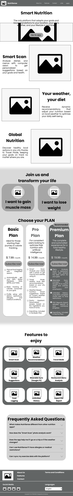
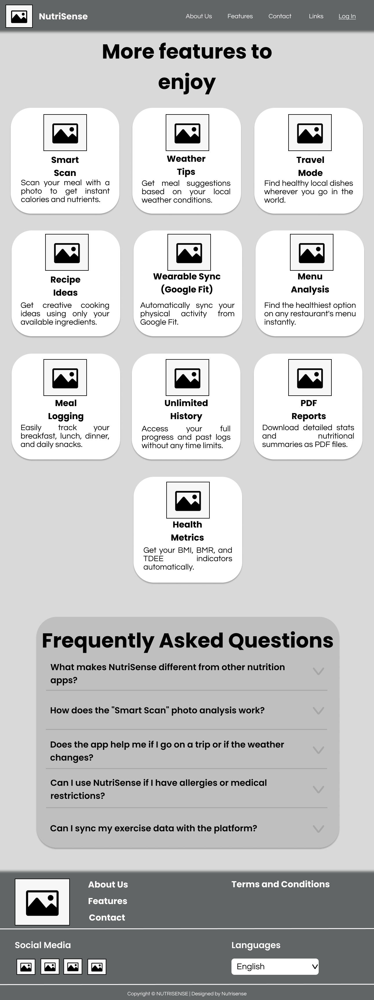
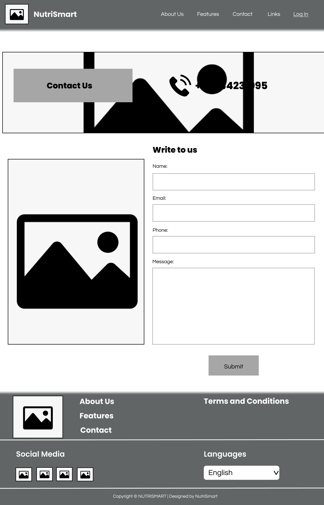
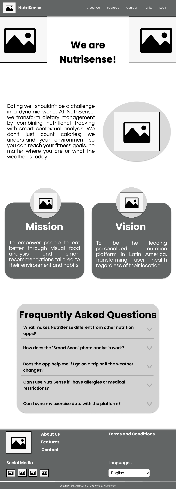
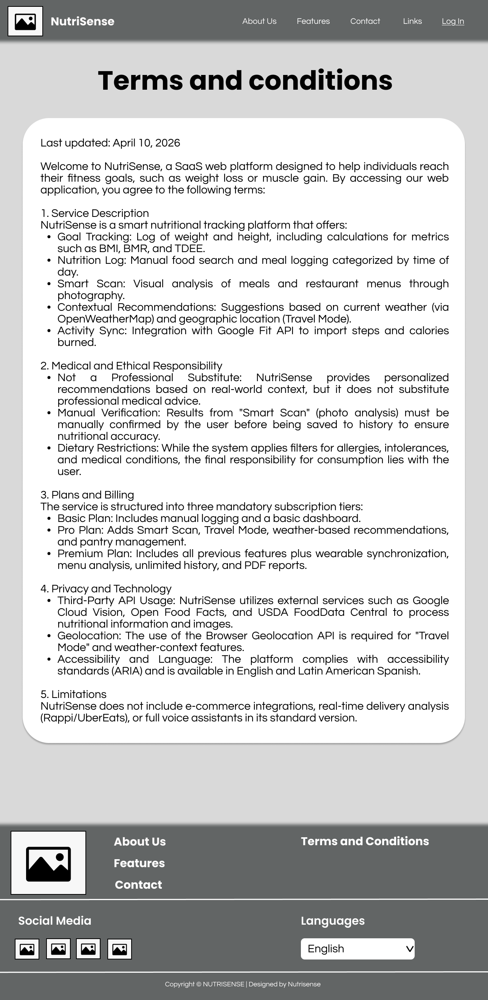
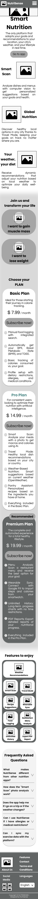
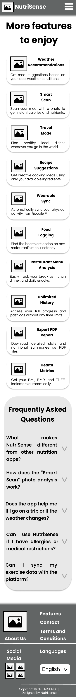

# CAPÍTULO IV: PRODUCT DESIGN

## 4.1. Style Guidelines

### 4.1.1. General Style Guidelines

### 4.1.2. Web Style Guidelines

## 4.2. Information Architecture

### 4.2.1. Organization Systems

### 4.2.2. Labeling Systems

### 4.2.3. SEO Tags and Meta Tags

### 4.2.4. Searching Systems

### 4.2.5. Navigation Systems

## 4.3. Landing Page UI Design

### 4.3.1. Landing Page Wireframe

**Desktop Landing Page**

**Main and Features**

  <table>
    <tr>
      <td></td>
      <td></td>
    </tr>
  </table>

Elementos de Diseño

| Elemento | Justificación |
|---|---|
| **Shape** | Las tarjetas de funcionalidades usan esquinas redondeadas de manera consistente, generando una forma orgánica y amigable que contrasta con el fondo rectangular del canvas. Esto comunica suavidad y accesibilidad visual en ambas páginas. |
| **Space** | En la página de funcionalidades se utiliza un grid de 3 columnas con espaciado uniforme entre tarjetas, mientras que en la landing las secciones alternan entre layouts de 1 y 2 columnas. El espacio negativo entre secciones permite respiración visual y delimita jerárquicamente cada bloque de contenido. |
| **Direction** | En la landing, la alternancia de bloques texto-imagen (izquierda-derecha) genera un ritmo diagonal que guía al usuario hacia abajo. En la página de funcionalidades, la dirección es vertical y descendente: de tarjetas a FAQ a Footer, orientando la lectura de forma clara. |
| **Size** | Los títulos de sección son notablemente más grandes que el texto de las tarjetas, estableciendo jerarquía tipográfica que permite al usuario escanear el contenido rápidamente sin necesidad de leer cada bloque completo. |

Heurísticas de Nielsen

| Heurística | Justificación |
|---|---|
| **Consistencia y estándares (H4)** | El navbar con logo a la izquierda y links a la derecha se repite en ambas páginas, siguiendo la convención web estándar. El footer mantiene la misma estructura (columnas con links, redes sociales y selector de idioma) en ambas vistas, reduciendo la carga cognitiva del usuario. |
| **Diseño estético y minimalista (H8)** | Cada tarjeta de funcionalidad contiene únicamente un ícono, un título en negrita y una descripción breve. No hay elementos decorativos adicionales que compitan con la información relevante, manteniendo el foco en la función descrita. |
| **Reconocer antes que recordar (H6)** | La sección FAQ repite las mismas preguntas en ambas páginas, permitiendo que el usuario las reconozca sin necesidad de navegar hacia atrás. Las etiquetas de los planes (Basic, Pro, Premium) son visualmente diferenciadas, especialmente el plan recomendado, facilitando la comparación inmediata. |
| **Libertad y control del usuario (H3)** | El navbar persistente en la parte superior de ambas vistas actúa como salida constante, permitiendo al usuario redirigirse a cualquier sección en cualquier momento sin quedar atrapado en un flujo no deseado. |

Arquitectura de la Información (AI)

| Principio AI | Justificación |
|---|---|
| **Disclosure** | Cada tarjeta de funcionalidad muestra solo el nombre y una descripción corta, sin desplegar detalles técnicos. Esto aplica el principio de mostrar suficiente información para que el usuario entienda qué encontrará si profundiza, sin saturarlo desde el primer vistazo. |
| **Choices** | La sección "Join us and transform your life" en la landing ofrece dos caminos significativos: "I want to gain muscle mass" e "I want to lose weight". Esto crea bifurcaciones con intención, orientando al usuario según su objetivo real. |
| **Front Doors** | El botón "Go to app" en el hero, el botón "Log In" en el navbar y los botones "Subscribe now!" en los planes son múltiples puertas de entrada a la conversión, asegurando que usuarios que lleguen desde distintas rutas encuentren siempre un punto de acción claro. |
| **Growth** | El grid de 3 columnas con una tarjeta solitaria en la última fila evidencia que el diseño está pensado para escalar: agregar nuevas funcionalidades no rompe la estructura, simplemente se incorporan al grid existente sin rediseñar la página. |

Diseño Inclusivo

| Principio | Justificación |
|---|---|
| **Priorizar el contenido (P6)** | El nombre de cada funcionalidad aparece en negrita antes que la descripción, permitiendo que el usuario escanee rápidamente los títulos para decidir cuáles le interesan sin leer el texto completo. El contenido clave siempre encabeza la tarjeta. |
| **Ofrecer opciones (P5)** | El footer incluye un selector de idioma, permitiendo al usuario adaptar el idioma de la interfaz. Esto amplía el acceso a personas de distintas lenguas maternas, ofreciendo una vía alternativa de interacción. |
| **Ser consistente (P3)** | Los componentes de tarjeta siguen el mismo patrón ícono → título → descripción en todas las funcionalidades de ambas páginas. Esta consistencia estructural hace predecible la lectura y reduce la fricción para usuarios con distintos niveles de familiaridad digital. |
| **Considera la situación del usuario (P2)** | La sección FAQ al final de ambas páginas responde dudas contextuales frecuentes como alergias, viajes y sincronización de ejercicio, anticipando distintos contextos de uso y demostrando consideración por usuarios con necesidades y situaciones de vida diversas. |

**Contact, About-us & Terms**

  <table>
    <tr>
      <td></td>
      <td></td>
      <td></td>
    </tr>
  </table>

Elementos de Diseño

| Elemento | Justificación |
|---|---|
| **Shape** | Las tarjetas de Misión y Visión en la página About Us utilizan esquinas redondeadas combinadas con íconos circulares superpuestos en la parte superior, creando una forma orgánica que transmite cercanía. En la página de Contacto, el formulario y el hero mantienen bordes rectos, generando una sensación más formal y estructurada acorde al contexto. |
| **Space** | La página de Términos y Condiciones concentra todo el contenido dentro de una sola tarjeta blanca con márgenes amplios respecto al fondo gris, usando el espacio para aislar el bloque legal y facilitar su lectura. En About Us, el espacio entre el hero, el bloque de texto y las tarjetas de Misión/Visión separa visualmente cada sección de contenido. |
| **Direction** | En About Us, la alternancia texto-imagen (izquierda-derecha) genera un flujo diagonal descendente que guía al usuario de forma natural. En la página de Contacto, el layout de dos columnas (imagen izquierda, formulario derecha) dirige la mirada horizontalmente hacia el área de acción. |
| **Size** | El título "We are NutriSmart!" en About Us ocupa un tamaño notablemente mayor al resto del texto, estableciendo jerarquía inmediata. En Términos y Condiciones, los títulos de sección numerados son más grandes que el cuerpo del texto, permitiendo escanear las secciones legales sin leer el documento completo. |

Heurísticas de Nielsen

| Heurística | Justificación |
|---|---|
| **Consistencia y estándares (H4)** | El navbar y el footer mantienen la misma estructura en las tres páginas (Contacto, About Us, Términos), siguiendo el patrón establecido en la landing. El selector de idioma y los íconos de redes sociales aparecen siempre en las mismas posiciones del footer. |
| **Prevención de errores (H5)** | El formulario de contacto separa los campos con etiquetas explícitas (Name, Email, Phone, Message) y campos de texto individuales, reduciendo la posibilidad de que el usuario ingrese información incorrecta o en el campo equivocado. |
| **Diseño estético y minimalista (H8)** | La página de Términos y Condiciones concentra todo el contenido legal en un único bloque blanco sin elementos decorativos adicionales. Esto evita distracciones en una página cuyo único objetivo es la lectura comprensiva de información legal. |
| **Visibilidad del estado del sistema (H1)** | El botón "Submit" en el formulario de contacto es el único elemento de acción de la página, comunicando claramente al usuario cuándo ha completado el flujo. El hero de Contacto muestra el número de teléfono de forma prominente como canal alternativo e inmediato. |

Arquitectura de la Información (AI)

| Principio AI | Justificación |
|---|---|
| **Disclosure** | La página About Us muestra primero el propósito general de NutriSmart en un párrafo introductorio, y solo después profundiza en Misión y Visión como tarjetas separadas. Esto aplica el principio de revelar información progresivamente sin abrumar al usuario desde el inicio. |
| **Objects** | Las tarjetas de Misión y Visión tratan cada concepto como un objeto independiente con su propio ícono, título y descripción. Esto les otorga identidad visual propia, haciendo que cada bloque de contenido funcione como una entidad con atributos diferenciados. |
| **Focused Navigation** | El navbar define sus ítems por contenido (About Us, Features, Contact, Links) y no por su posición. Cada etiqueta comunica claramente el tipo de información que el usuario encontrará, sin depender del contexto visual para su interpretación. |
| **Front Doors** | La página de Contacto ofrece dos vías de entrada al mismo objetivo: el formulario escrito y el número de teléfono visible en el hero. Esto asume que distintos usuarios preferirán distintos canales para comunicarse con NutriSmart. |

Diseño Inclusivo

| Principio | Justificación |
|---|---|
| **Proporciona experiencias comparables (P1)** | El formulario de contacto está estructurado con campos individuales y etiquetas explícitas, lo que permite que usuarios que navegan con teclado o lectores de pantalla puedan completar la tarea de contacto de manera equivalente a usuarios que usan mouse. |
| **Priorizar el contenido (P6)** | En Términos y Condiciones, los títulos de sección numerados (Service Description, Medical and Ethical Responsibility, etc.) destacan visualmente sobre el cuerpo del texto, ayudando al usuario a ubicarse dentro del documento y acceder directamente a la sección de su interés. |
| **Ofrecer opciones (P5)** | La página de Contacto ofrece múltiples canales de comunicación: formulario escrito y número telefónico. Esto contempla distintos perfiles de usuario, desde quienes prefieren comunicación asíncrona hasta quienes necesitan respuesta inmediata. |
| **Ser consistente (P3)** | La estructura de las tarjetas de Misión y Visión replica el mismo patrón visual: ícono circular en la parte superior, título en negrita y descripción en cuerpo de texto. Esta consistencia hace que el usuario entienda el patrón de lectura sin necesidad de aprenderlo nuevamente. |

**Mobile Web Browser**

**Main & Features**

  <table>
    <tr>
      <td></td>
      <td></td>
    </tr>
  </table>

Elementos de Diseño

| Elemento | Justificación |
|---|---|
| **Shape** | El navbar móvil abandona el menú horizontal y adopta un ícono de hamburguesa (≡) que despliega un panel lateral con esquinas rectas y fondo oscuro. Las tarjetas de funcionalidades mantienen esquinas redondeadas consistentes con la versión desktop, preservando la identidad visual entre plataformas. |
| **Space** | Al pasar a mobile, el layout de 3 columnas del desktop se convierte en una sola columna vertical con tarjetas apiladas. Esto maximiza el uso del ancho reducido de pantalla y evita que el contenido se comprima o resulte ilegible. |
| **Direction** | En la landing mobile, los bloques de contenido siguen una dirección estrictamente vertical y descendente, alternando imagen y texto en filas independientes. Esto se adapta al patrón de scroll natural del usuario móvil, que consume contenido de arriba hacia abajo. |
| **Size** | El título "Smart Nutrition" ocupa casi el ancho completo de la pantalla en dos líneas, estableciendo una jerarquía visual inmediata y dominante. Los botones de acción como "Go to app" tienen un tamaño generoso para facilitar el toque con el dedo, siguiendo las recomendaciones de área mínima táctil. |

Heurísticas de Nielsen

| Heurística | Justificación |
|---|---|
| **Consistencia y estándares (H4)** | El menú hamburguesa con panel deslizante es el patrón estándar de navegación móvil. Su uso sigue la convención esperada por el usuario, reduciendo la curva de aprendizaje. Los ítems del menú (About Us, Features, Contact, Links, Log in) son los mismos que en desktop. |
| **Libertad y control del usuario (H3)** | El panel de navegación desplegable incluye un botón "✕" en la esquina superior derecha para cerrarlo, ofreciendo al usuario una salida clara sin necesidad de navegar a otra página o usar el botón físico del dispositivo. |
| **Reconocer antes que recordar (H6)** | Cada tarjeta de funcionalidad en mobile combina ícono placeholder y título en negrita en la misma fila, permitiendo que el usuario identifique visualmente la función sin necesidad de leer la descripción completa. El patrón ícono-título se repite de forma predecible en todas las tarjetas. |
| **Diseño estético y minimalista (H8)** | La versión mobile elimina elementos secundarios presentes en desktop, como subtítulos adicionales y columnas paralelas, conservando únicamente el contenido esencial: ícono, título y descripción breve. Esto respeta las limitaciones de espacio sin sacrificar la comprensión del contenido. |

Arquitectura de la Información (AI)

| Principio AI | Justificación |
|---|---|
| **Focused Navigation** | El menú hamburguesa agrupa todos los ítems de navegación en un panel dedicado, definido por su contenido y no por su posición visual. El usuario accede a la navegación como una acción explícita, manteniendo el foco en el contenido de la página mientras no la necesita. |
| **Disclosure** | En la landing mobile, cada sección principal (Smart Scan, Global Nutrition, Your weather your diet) muestra solo el título y una descripción corta antes de la sección de conversión. No se despliegan detalles técnicos hasta que el usuario decide explorar más. |
| **Choices** | La sección "Join us and transform your life" presenta dos opciones de objetivo ("I want to gain muscle mass" e "I want to lose weight") como botones apilados verticalmente, adaptando la bifurcación de decisión al formato de una sola columna sin perder su función de segmentación. |
| **Growth** | El layout de tarjetas apiladas en la página de funcionalidades permite agregar nuevas funcionalidades simplemente añadiendo tarjetas al final de la lista, sin necesidad de rediseñar la estructura. La columna única escala de forma natural con contenido adicional. |

Diseño Inclusivo

| Principio | Justificación |
|---|---|
| **Considera la situación del usuario (P2)** | El diseño mobile asume que el usuario puede estar en movimiento, con una sola mano disponible. El botón "Go to app" y los botones de objetivo ("I want to gain muscle mass") están dimensionados para ser accionables con el pulgar sin requerir precisión. |
| **Proporciona experiencias comparables (P1)** | El contenido disponible en desktop (funcionalidades, planes, FAQ, footer con idiomas) está completamente presente en la versión mobile, reorganizado en una sola columna. El usuario móvil accede a la misma información sin versiones reducidas o simplificadas. |
| **Priorizar el contenido (P6)** | En mobile, el hero coloca el título "Smart Nutrition" y el botón "Go to app" en la parte superior visible sin necesidad de scroll, priorizando el mensaje principal y la acción de conversión antes que cualquier otro contenido. |
| **Ser consistente (P3)** | El patrón de tarjeta en la página de funcionalidades mobile (ícono a la izquierda, título a la derecha, descripción abajo) se repite de forma idéntica en todas las entradas, estableciendo un modelo de lectura predecible que el usuario solo necesita aprender una vez. |

### 4.3.2. Landing Page Mock-up

## 4.4. Web Applications UX/UI Design

### 4.4.1. Web Applications Wireframes

### 4.4.2. Web Applications Wireflow Diagrams

### 4.4.2. Web Applications Mock-ups

### 4.4.3. Web Applications User Flow Diagrams

## 4.5. Web Applications Prototyping

## 4.6. Domain-Driven Software Architecture

### 4.6.1. Design-Level EventStorming

### 4.6.2. Software Architecture Context Diagram

### 4.6.3. Software Architecture Container Diagrams

### 4.6.4. Software Architecture Components Diagrams

## 4.7. Software Object-Oriented Design

### 4.7.1. Class Diagrams

## 4.8. Database Design

### 4.8.1. Database Diagrams
