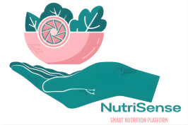
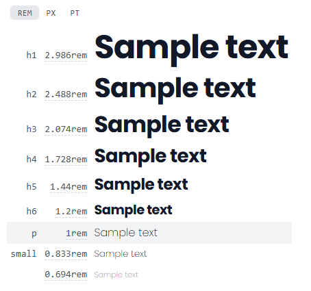
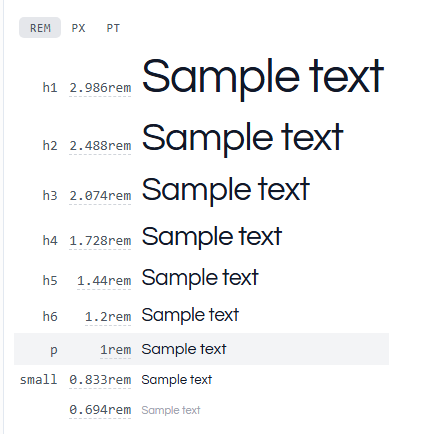
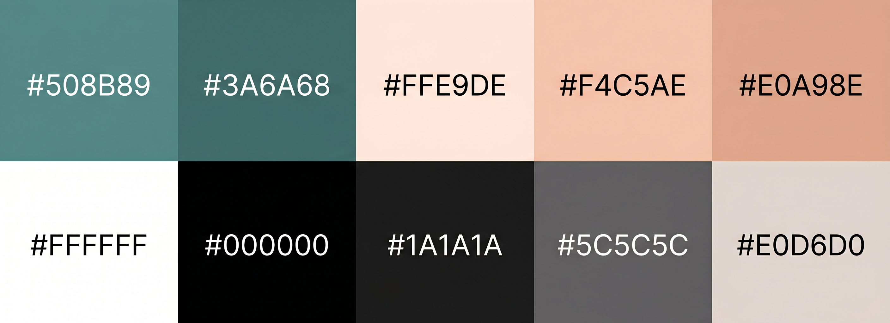

# CAPÍTULO IV: PRODUCT DESIGN

## 4.1. Style Guidelines

### 4.1.1. General Style Guidelines

NutriSense busca un tono equilibrado entre lo motivador y lo accesible, con un lenguaje claro, empático y alentador, orientado a personas que desean mejorar sus hábitos alimenticios sin sentirse abrumadas. La comunicación es entusiasta pero serena, formal en la información nutricional y casual en los mensajes de acompañamiento al usuario. Se evita el tono intimidante o clínico, priorizando cercanía y confianza.

**Branding**

La identidad visual de NutriSense busca transmitir bienestar, modernidad y confianza. El nombre combina "Nutrición" y "Sense" (sentido / sensorial), reflejando la propuesta de una plataforma inteligente que adapta las recomendaciones al contexto del usuario. El logo, acompañado del nombre en tipografía Poppins, transmite una imagen limpia y contemporánea, apta tanto para interfaces digitales como para materiales de comunicación.

  

**Typography**

Para mantener la legibilidad y la personalidad visual de NutriSense se establecen dos tipografías complementarias: Poppins como fuente primaria y Questrial como fuente secundaria, ambas provenientes de Google Fonts y con alta compatibilidad en entornos digitales.

Poppins es una sans-serif geométrica de corte moderno, utilizada en títulos y encabezados. Sus variantes de peso (400, 500, 600, 700 y 800) permiten establecer jerarquías visuales claras. Su geometría transmite energía, precisión y modernidad, valores centrales de la marca.

Questrial es una sans-serif de trazo amigable y legible, utilizada para cuerpos de texto, párrafos y elementos secundarios. Su diseño redondeado complementa a Poppins aportando calidez y accesibilidad en la lectura extendida.

Los tamaños base definidos son: H1 en 48px, H2 en 36px, H3 en 28px, H4 en 24px, cuerpo de texto en 16px y caption en 13px. 

   

**Colors**

La paleta de NutriSense fue diseñada para evocar salud, naturaleza y bienestar digital, con tonos cálidos y orgánicos que contrastan con un color principal de acento tecnológico.

El color principal es el verde azulado (`#508B89`), que transmite calma, salud y equilibrio. Se emplea en el header, botones primarios, íconos activos y elementos de navegación. Su variante oscura (`#3A6A68`) se utiliza en estados hover y énfasis de interacción.

Como color de fondo predominante se usa el melocotón muy claro (`#FFE9DE`), que aporta calidez y diferencia a NutriSense de plataformas de salud de estética clínica. El color de llamada a la acción es un melocotón medio (`#F4C5AE`), complementado por su variante activa (`#E0A98E`), que se aplica en botones secundarios y elementos interactivos.

Los colores neutros incluyen blanco (`#FFFFFF`) para fondos limpios, negro (`#000000`) para textos de alto contraste y dos tonos de texto: gris oscuro (`#1A1A1A`) para texto principal y gris medio (`#5C5C5C`) para texto secundario. El color de bordes y separadores es un gris cálido (`#E0D6D0`) que armoniza con el fondo melocotón.

  

**Spacing**

Se establece una unidad base de 8px para el espaciado interno de componentes. Los márgenes mínimos entre secciones son de 16px en mobile y 24px en desktop. Para los contenedores principales se define un ancho máximo de 1200px con padding lateral de 24px. Los radios de borde siguen tres niveles: 8px para elementos pequeños (botones, inputs), 16px para tarjetas y módulos, y 24px para modales y secciones destacadas.

### 4.1.2. Web Style Guidelines

La interfaz web de NutriSense adopta un enfoque mobile-first, utilizando un sistema de grid de 12 columnas en escritorio y 4 columnas en móvil. Se garantiza que todos los componentes escalen adecuadamente entre breakpoints, priorizando la legibilidad y la usabilidad táctil en pantallas pequeñas antes de enriquecer la experiencia en pantallas más grandes.

**Tipografía**

Se utiliza Poppins para títulos y encabezados de sección, con tamaños responsivos que emplean `clamp()` para escalar fluidamente. Questrial se aplica en párrafos, etiquetas, descripciones de funcionalidades y textos de apoyo. El interlineado base es de 1.6 para asegurar comodidad de lectura en bloques de texto extendido. La jerarquía tipográfica establece que H1 y H2 se reservan para héroes y títulos de sección respectivamente, mientras que H3 y H4 organizan subsecciones y tarjetas de contenido.

**Colores**

La selección de colores para la interfaz web refleja el sistema definido en la guía general. El verde azulado (`#508B89`) actúa como color de marca en la barra de navegación, botones primarios y elementos de énfasis. El fondo principal de las páginas utiliza blanco puro (`#FFFFFF`), mientras que secciones alternadas emplean el melocotón claro (`#FFE9DE`) para generar ritmo visual sin recurrir a sombras agresivas. Los botones de llamada a la acción combinan el melocotón medio (`#F4C5AE`) con texto en negro, garantizando contraste accesible. Los estados de error o alerta se reservan para colores rojizos que no forman parte de la paleta principal, evitando confusión con los tonos cálidos de la marca.

**Interacción y responsividad**

Los botones cuentan con transiciones de 0.3 segundos en hover y focus, proporcionando retroalimentación visual clara al usuario. La barra de navegación es fija con una altura de 68px, colapsando en un menú hamburguesa para viewports móviles. EL formulario de contacto utiliza inputs con radio de borde de 8px y etiquetas flotantes para maximizar el espacio disponible. El scroll entre secciones en la página principal utiliza `scroll-snap` para una experiencia fluida y estructurada. Todos los elementos interactivos cuentan con atributos ARIA y contraste suficiente para cumplir con criterios básicos de accesibilidad web.

## 4.2. Information Architecture

### 4.2.1. Organization Systems

### 4.2.2. Labeling Systems

### 4.2.3. SEO Tags and Meta Tags

### 4.2.4. Searching Systems

### 4.2.5. Navigation Systems

## 4.3. Landing Page UI Design

### 4.3.1. Landing Page Wireframe

### 4.3.2. Landing Page Mock-up

## 4.4. Web Applications UX/UI Design

### 4.4.1. Web Applications Wireframes

### 4.4.2. Web Applications Wireflow Diagrams

### 4.4.2. Web Applications Mock-ups

### 4.4.3. Web Applications User Flow Diagrams

## 4.5. Web Applications Prototyping

## 4.6. Domain-Driven Software Architecture

### 4.6.1. Design-Level EventStorming

### 4.6.2. Software Architecture Context Diagram

### 4.6.3. Software Architecture Container Diagrams

### 4.6.4. Software Architecture Components Diagrams

## 4.7. Software Object-Oriented Design

### 4.7.1. Class Diagrams

## 4.8. Database Design

### 4.8.1. Database Diagrams
