# CAPÍTULO IV: PRODUCT DESIGN

## 4.1. Style Guidelines

### 4.1.1. General Style Guidelines

### 4.1.2. Web Style Guidelines

## 4.2. Information Architecture

### 4.2.1. Organization Systems

### 4.2.2. Labeling Systems

### 4.2.3. SEO Tags and Meta Tags

### 4.2.4. Searching Systems

### 4.2.5. Navigation Systems

## 4.3. Landing Page UI Design

### 4.3.1. Landing Page Wireframe

**Desktop Landing Page**

**Main and Features**

  <table>
    <tr>
      <td></td>
      <td></td>
    </tr>
  </table>

Elementos de Diseño

| Elemento | Justificación |
|---|---|
| **Shape** | Las tarjetas de funcionalidades usan esquinas redondeadas de manera consistente, generando una forma orgánica y amigable que contrasta con el fondo rectangular del canvas. Esto comunica suavidad y accesibilidad visual en ambas páginas. |
| **Space** | En la página de funcionalidades se utiliza un grid de 3 columnas con espaciado uniforme entre tarjetas, mientras que en la landing las secciones alternan entre layouts de 1 y 2 columnas. El espacio negativo entre secciones permite respiración visual y delimita jerárquicamente cada bloque de contenido. |
| **Direction** | En la landing, la alternancia de bloques texto-imagen (izquierda-derecha) genera un ritmo diagonal que guía al usuario hacia abajo. En la página de funcionalidades, la dirección es vertical y descendente: de tarjetas a FAQ a Footer, orientando la lectura de forma clara. |
| **Size** | Los títulos de sección son notablemente más grandes que el texto de las tarjetas, estableciendo jerarquía tipográfica que permite al usuario escanear el contenido rápidamente sin necesidad de leer cada bloque completo. |

Heurísticas de Nielsen

| Heurística | Justificación |
|---|---|
| **Consistencia y estándares (H4)** | El navbar con logo a la izquierda y links a la derecha se repite en ambas páginas, siguiendo la convención web estándar. El footer mantiene la misma estructura (columnas con links, redes sociales y selector de idioma) en ambas vistas, reduciendo la carga cognitiva del usuario. |
| **Diseño estético y minimalista (H8)** | Cada tarjeta de funcionalidad contiene únicamente un ícono, un título en negrita y una descripción breve. No hay elementos decorativos adicionales que compitan con la información relevante, manteniendo el foco en la función descrita. |
| **Reconocer antes que recordar (H6)** | La sección FAQ repite las mismas preguntas en ambas páginas, permitiendo que el usuario las reconozca sin necesidad de navegar hacia atrás. Las etiquetas de los planes (Basic, Pro, Premium) son visualmente diferenciadas, especialmente el plan recomendado, facilitando la comparación inmediata. |
| **Libertad y control del usuario (H3)** | El navbar persistente en la parte superior de ambas vistas actúa como salida constante, permitiendo al usuario redirigirse a cualquier sección en cualquier momento sin quedar atrapado en un flujo no deseado. |

Arquitectura de la Información (AI)

| Principio AI | Justificación |
|---|---|
| **Disclosure** | Cada tarjeta de funcionalidad muestra solo el nombre y una descripción corta, sin desplegar detalles técnicos. Esto aplica el principio de mostrar suficiente información para que el usuario entienda qué encontrará si profundiza, sin saturarlo desde el primer vistazo. |
| **Choices** | La sección "Join us and transform your life" en la landing ofrece dos caminos significativos: "I want to gain muscle mass" e "I want to lose weight". Esto crea bifurcaciones con intención, orientando al usuario según su objetivo real. |
| **Front Doors** | El botón "Go to app" en el hero, el botón "Log In" en el navbar y los botones "Subscribe now!" en los planes son múltiples puertas de entrada a la conversión, asegurando que usuarios que lleguen desde distintas rutas encuentren siempre un punto de acción claro. |
| **Growth** | El grid de 3 columnas con una tarjeta solitaria en la última fila evidencia que el diseño está pensado para escalar: agregar nuevas funcionalidades no rompe la estructura, simplemente se incorporan al grid existente sin rediseñar la página. |

Diseño Inclusivo

| Principio | Justificación |
|---|---|
| **Priorizar el contenido (P6)** | El nombre de cada funcionalidad aparece en negrita antes que la descripción, permitiendo que el usuario escanee rápidamente los títulos para decidir cuáles le interesan sin leer el texto completo. El contenido clave siempre encabeza la tarjeta. |
| **Ofrecer opciones (P5)** | El footer incluye un selector de idioma, permitiendo al usuario adaptar el idioma de la interfaz. Esto amplía el acceso a personas de distintas lenguas maternas, ofreciendo una vía alternativa de interacción. |
| **Ser consistente (P3)** | Los componentes de tarjeta siguen el mismo patrón ícono → título → descripción en todas las funcionalidades de ambas páginas. Esta consistencia estructural hace predecible la lectura y reduce la fricción para usuarios con distintos niveles de familiaridad digital. |
| **Considera la situación del usuario (P2)** | La sección FAQ al final de ambas páginas responde dudas contextuales frecuentes como alergias, viajes y sincronización de ejercicio, anticipando distintos contextos de uso y demostrando consideración por usuarios con necesidades y situaciones de vida diversas. |

**Contact, About-us & Terms**

  <table>
    <tr>
      <td></td>
      <td></td>
      <td></td>
    </tr>
  </table>

Elementos de Diseño

| Elemento | Justificación |
|---|---|
| **Shape** | Las tarjetas de Misión y Visión en la página About Us utilizan esquinas redondeadas combinadas con íconos circulares superpuestos en la parte superior, creando una forma orgánica que transmite cercanía. En la página de Contacto, el formulario y el hero mantienen bordes rectos, generando una sensación más formal y estructurada acorde al contexto. |
| **Space** | La página de Términos y Condiciones concentra todo el contenido dentro de una sola tarjeta blanca con márgenes amplios respecto al fondo gris, usando el espacio para aislar el bloque legal y facilitar su lectura. En About Us, el espacio entre el hero, el bloque de texto y las tarjetas de Misión/Visión separa visualmente cada sección de contenido. |
| **Direction** | En About Us, la alternancia texto-imagen (izquierda-derecha) genera un flujo diagonal descendente que guía al usuario de forma natural. En la página de Contacto, el layout de dos columnas (imagen izquierda, formulario derecha) dirige la mirada horizontalmente hacia el área de acción. |
| **Size** | El título "We are NutriSmart!" en About Us ocupa un tamaño notablemente mayor al resto del texto, estableciendo jerarquía inmediata. En Términos y Condiciones, los títulos de sección numerados son más grandes que el cuerpo del texto, permitiendo escanear las secciones legales sin leer el documento completo. |

Heurísticas de Nielsen

| Heurística | Justificación |
|---|---|
| **Consistencia y estándares (H4)** | El navbar y el footer mantienen la misma estructura en las tres páginas (Contacto, About Us, Términos), siguiendo el patrón establecido en la landing. El selector de idioma y los íconos de redes sociales aparecen siempre en las mismas posiciones del footer. |
| **Prevención de errores (H5)** | El formulario de contacto separa los campos con etiquetas explícitas (Name, Email, Phone, Message) y campos de texto individuales, reduciendo la posibilidad de que el usuario ingrese información incorrecta o en el campo equivocado. |
| **Diseño estético y minimalista (H8)** | La página de Términos y Condiciones concentra todo el contenido legal en un único bloque blanco sin elementos decorativos adicionales. Esto evita distracciones en una página cuyo único objetivo es la lectura comprensiva de información legal. |
| **Visibilidad del estado del sistema (H1)** | El botón "Submit" en el formulario de contacto es el único elemento de acción de la página, comunicando claramente al usuario cuándo ha completado el flujo. El hero de Contacto muestra el número de teléfono de forma prominente como canal alternativo e inmediato. |

Arquitectura de la Información (AI)

| Principio AI | Justificación |
|---|---|
| **Disclosure** | La página About Us muestra primero el propósito general de NutriSmart en un párrafo introductorio, y solo después profundiza en Misión y Visión como tarjetas separadas. Esto aplica el principio de revelar información progresivamente sin abrumar al usuario desde el inicio. |
| **Objects** | Las tarjetas de Misión y Visión tratan cada concepto como un objeto independiente con su propio ícono, título y descripción. Esto les otorga identidad visual propia, haciendo que cada bloque de contenido funcione como una entidad con atributos diferenciados. |
| **Focused Navigation** | El navbar define sus ítems por contenido (About Us, Features, Contact, Links) y no por su posición. Cada etiqueta comunica claramente el tipo de información que el usuario encontrará, sin depender del contexto visual para su interpretación. |
| **Front Doors** | La página de Contacto ofrece dos vías de entrada al mismo objetivo: el formulario escrito y el número de teléfono visible en el hero. Esto asume que distintos usuarios preferirán distintos canales para comunicarse con NutriSmart. |

Diseño Inclusivo

| Principio | Justificación |
|---|---|
| **Proporciona experiencias comparables (P1)** | El formulario de contacto está estructurado con campos individuales y etiquetas explícitas, lo que permite que usuarios que navegan con teclado o lectores de pantalla puedan completar la tarea de contacto de manera equivalente a usuarios que usan mouse. |
| **Priorizar el contenido (P6)** | En Términos y Condiciones, los títulos de sección numerados (Service Description, Medical and Ethical Responsibility, etc.) destacan visualmente sobre el cuerpo del texto, ayudando al usuario a ubicarse dentro del documento y acceder directamente a la sección de su interés. |
| **Ofrecer opciones (P5)** | La página de Contacto ofrece múltiples canales de comunicación: formulario escrito y número telefónico. Esto contempla distintos perfiles de usuario, desde quienes prefieren comunicación asíncrona hasta quienes necesitan respuesta inmediata. |
| **Ser consistente (P3)** | La estructura de las tarjetas de Misión y Visión replica el mismo patrón visual: ícono circular en la parte superior, título en negrita y descripción en cuerpo de texto. Esta consistencia hace que el usuario entienda el patrón de lectura sin necesidad de aprenderlo nuevamente. |

**Mobile Web Browser**

**Main & Features**

  <table>
    <tr>
      <td></td>
      <td></td>
      <td>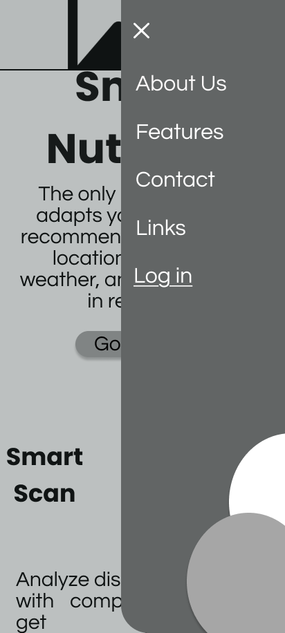</td>
    </tr>
  </table>

Elementos de Diseño

| Elemento | Justificación |
|---|---|
| **Shape** | El navbar móvil abandona el menú horizontal y adopta un ícono de hamburguesa (≡) que despliega un panel lateral con esquinas rectas y fondo oscuro. Las tarjetas de funcionalidades mantienen esquinas redondeadas consistentes con la versión desktop, preservando la identidad visual entre plataformas. |
| **Space** | Al pasar a mobile, el layout de 3 columnas del desktop se convierte en una sola columna vertical con tarjetas apiladas. Esto maximiza el uso del ancho reducido de pantalla y evita que el contenido se comprima o resulte ilegible. |
| **Direction** | En la landing mobile, los bloques de contenido siguen una dirección estrictamente vertical y descendente, alternando imagen y texto en filas independientes. Esto se adapta al patrón de scroll natural del usuario móvil, que consume contenido de arriba hacia abajo. |
| **Size** | El título "Smart Nutrition" ocupa casi el ancho completo de la pantalla en dos líneas, estableciendo una jerarquía visual inmediata y dominante. Los botones de acción como "Go to app" tienen un tamaño generoso para facilitar el toque con el dedo, siguiendo las recomendaciones de área mínima táctil. |

Heurísticas de Nielsen

| Heurística | Justificación |
|---|---|
| **Consistencia y estándares (H4)** | El menú hamburguesa con panel deslizante es el patrón estándar de navegación móvil. Su uso sigue la convención esperada por el usuario, reduciendo la curva de aprendizaje. Los ítems del menú (About Us, Features, Contact, Links, Log in) son los mismos que en desktop. |
| **Libertad y control del usuario (H3)** | El panel de navegación desplegable incluye un botón "✕" en la esquina superior derecha para cerrarlo, ofreciendo al usuario una salida clara sin necesidad de navegar a otra página o usar el botón físico del dispositivo. |
| **Reconocer antes que recordar (H6)** | Cada tarjeta de funcionalidad en mobile combina ícono placeholder y título en negrita en la misma fila, permitiendo que el usuario identifique visualmente la función sin necesidad de leer la descripción completa. El patrón ícono-título se repite de forma predecible en todas las tarjetas. |
| **Diseño estético y minimalista (H8)** | La versión mobile elimina elementos secundarios presentes en desktop, como subtítulos adicionales y columnas paralelas, conservando únicamente el contenido esencial: ícono, título y descripción breve. Esto respeta las limitaciones de espacio sin sacrificar la comprensión del contenido. |

Arquitectura de la Información (AI)

| Principio AI | Justificación |
|---|---|
| **Focused Navigation** | El menú hamburguesa agrupa todos los ítems de navegación en un panel dedicado, definido por su contenido y no por su posición visual. El usuario accede a la navegación como una acción explícita, manteniendo el foco en el contenido de la página mientras no la necesita. |
| **Disclosure** | En la landing mobile, cada sección principal (Smart Scan, Global Nutrition, Your weather your diet) muestra solo el título y una descripción corta antes de la sección de conversión. No se despliegan detalles técnicos hasta que el usuario decide explorar más. |
| **Choices** | La sección "Join us and transform your life" presenta dos opciones de objetivo ("I want to gain muscle mass" e "I want to lose weight") como botones apilados verticalmente, adaptando la bifurcación de decisión al formato de una sola columna sin perder su función de segmentación. |
| **Growth** | El layout de tarjetas apiladas en la página de funcionalidades permite agregar nuevas funcionalidades simplemente añadiendo tarjetas al final de la lista, sin necesidad de rediseñar la estructura. La columna única escala de forma natural con contenido adicional. |

Diseño Inclusivo

| Principio | Justificación |
|---|---|
| **Considera la situación del usuario (P2)** | El diseño mobile asume que el usuario puede estar en movimiento, con una sola mano disponible. El botón "Go to app" y los botones de objetivo ("I want to gain muscle mass") están dimensionados para ser accionables con el pulgar sin requerir precisión. |
| **Proporciona experiencias comparables (P1)** | El contenido disponible en desktop (funcionalidades, planes, FAQ, footer con idiomas) está completamente presente en la versión mobile, reorganizado en una sola columna. El usuario móvil accede a la misma información sin versiones reducidas o simplificadas. |
| **Priorizar el contenido (P6)** | En mobile, el hero coloca el título "Smart Nutrition" y el botón "Go to app" en la parte superior visible sin necesidad de scroll, priorizando el mensaje principal y la acción de conversión antes que cualquier otro contenido. |
| **Ser consistente (P3)** | El patrón de tarjeta en la página de funcionalidades mobile (ícono a la izquierda, título a la derecha, descripción abajo) se repite de forma idéntica en todas las entradas, estableciendo un modelo de lectura predecible que el usuario solo necesita aprender una vez. |

**Contact, About-us & Terms**

  <table>
    <tr>
      <td>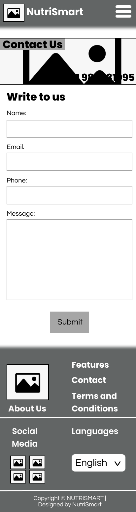</td>
      <td>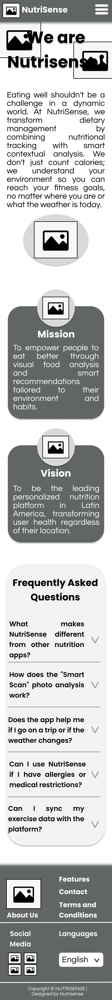</td>
      <td>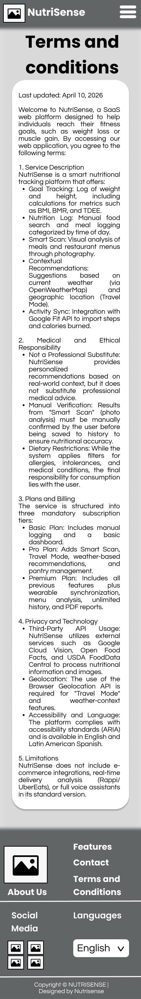</td>
    </tr>
  </table>

Elementos de Diseño

| Elemento | Justificación |
|---|---|
| **Shape** | Las tarjetas de Misión y Visión en About Us mantienen las esquinas redondeadas y el ícono circular superpuesto en la parte superior, adaptando fielmente la forma orgánica de la versión desktop al formato de una sola columna. El formulario de contacto conserva bordes rectos en los campos de texto, transmitiendo formalidad y estructura. |
| **Space** | En Términos y Condiciones, el contenido legal ocupa casi todo el ancho de la pantalla con márgenes mínimos, priorizando la legibilidad del texto extenso en pantalla pequeña. En About Us, se preserva espacio vertical generoso entre el bloque introductorio y las tarjetas de Misión/Visión para separar visualmente las secciones. |
| **Direction** | En About Us, las tarjetas de Misión y Visión se apilan verticalmente una debajo de la otra, adaptando el layout de dos columnas del desktop a una dirección de lectura descendente natural para el usuario móvil. En Contacto, el formulario ocupa toda la columna sin elementos paralelos, dirigiendo la atención exclusivamente al llenado de campos. |
| **Size** | En Términos y Condiciones, los títulos de sección numerados son visualmente más grandes que el cuerpo del texto, permitiendo que el usuario escanee rápidamente las secciones legales sin necesidad de leer el documento completo en una pantalla reducida. |

Heurísticas de Nielsen

| Heurística | Justificación |
|---|---|
| **Consistencia y estándares (H4)** | El navbar hamburguesa y el footer de dos columnas se repiten de forma idéntica en las tres páginas móviles (Contacto, About Us, Términos), manteniendo la coherencia estructural establecida en la landing mobile y reduciendo la desorientación del usuario al navegar entre vistas. |
| **Prevención de errores (H5)** | El formulario de contacto en mobile presenta los campos apilados verticalmente con etiquetas explícitas encima de cada input, eliminando ambigüedad sobre qué información ingresar en cada campo. El campo de mensaje tiene una altura generosa que reduce el riesgo de enviar mensajes incompletos. |
| **Diseño estético y minimalista (H8)** | La página de Términos y Condiciones en mobile elimina cualquier elemento decorativo adicional, presentando únicamente el bloque de texto legal sobre fondo blanco. Esto respeta el principio de no añadir información que compita con el contenido relevante en una pantalla de espacio reducido. |
| **Visibilidad del estado del sistema (H1)** | El hero de la página de Contacto muestra el número de teléfono de forma visible e inmediata sobre la imagen de fondo, comunicando al usuario desde el primer momento que existe un canal de contacto directo antes de que llegue al formulario. |

Arquitectura de la Información (AI)

| Principio AI | Justificación |
|---|---|
| **Disclosure** | En About Us mobile, el párrafo introductorio aparece primero como contexto general, y solo después se revelan las tarjetas de Misión y Visión como profundización. Esto aplica el principio de mostrar información suficiente para orientar al usuario antes de presentar el detalle. |
| **Objects** | Las tarjetas de Misión y Visión en mobile tratan cada concepto como un objeto independiente con ícono, título y descripción propios, preservando su identidad visual incluso al reorganizarse en columna única. Cada tarjeta funciona como una entidad autónoma con atributos diferenciados. |
| **Front Doors** | La página de Contacto ofrece dos puntos de entrada al mismo objetivo: el número telefónico visible en el hero y el formulario escrito debajo. Esto garantiza que usuarios que lleguen directamente a esta página desde cualquier canal encuentren siempre una vía de acción inmediata. |
| **Focused Navigation** | El panel hamburguesa agrupa los ítems de navegación (Features, Contact, Terms and Conditions, About Us) definidos por su contenido y no por su posición en pantalla. El usuario accede a la navegación como una acción deliberada, manteniendo el foco en el contenido mientras no la necesita. |

Diseño Inclusivo

| Principio | Justificación |
|---|---|
| **Proporciona experiencias comparables (P1)** | Los campos del formulario de contacto en mobile están dimensionados con altura suficiente para ser accionables con el dedo, ofreciendo una experiencia de llenado equivalente a la versión desktop sin requerir precisión de cursor. |
| **Priorizar el contenido (P6)** | En About Us mobile, el título "We are NutriSmart!" ocupa la parte superior visible de la pantalla sin necesidad de scroll, priorizando el mensaje de identidad de marca antes que cualquier otro contenido. Las tarjetas de Misión y Visión destacan sus títulos en negrita sobre fondo oscuro para facilitar el escaneo. |
| **Ser consistente (P3)** | El footer mantiene la misma estructura de dos columnas en las tres páginas móviles, con los mismos enlaces (Features, Contact, Terms and Conditions, About Us) y el selector de idioma en la misma posición. Esta consistencia permite al usuario ubicar recursos secundarios sin esfuerzo cognitivo adicional. |
| **Considera la situación del usuario (P2)** | La página de Términos y Condiciones en mobile adapta el texto legal a columna única con interlineado generoso, reconociendo que el usuario puede estar leyendo en condiciones de movilidad o con pantalla de tamaño reducido, donde la densidad de texto dificulta la lectura. |

### 4.3.2. Landing Page Mock-up

**Desktop Web Browser**

**Main & Features**

  <table>
    <tr>
      <td>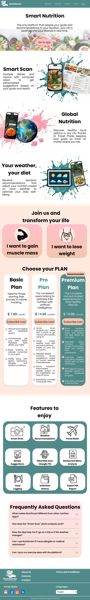</td>
      <td>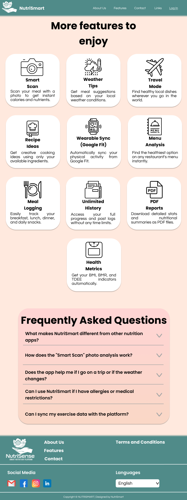</td>
    </tr>
  </table>

Elementos de Diseño

| Elemento | Justificación |
|---|---|
| **Colour** | Se aplica una paleta de tonos cálidos con fondo salmón/rosado como color dominante en ambas páginas, complementado con un verde oscuro en el navbar y footer. Esta combinación transmite salud, calidez y naturalidad, alineada con el propósito nutricional de la plataforma. Las tarjetas de funcionalidades usan fondo blanco para generar contraste sobre el fondo salmón y destacar el contenido. |
| **Texture** | En la landing, las secciones de Smart Scan, Global Nutrition y Your Weather usan imágenes fotográficas reales de alimentos y dispositivos móviles como fondo, introduciendo textura orgánica que contrasta con las secciones de fondo plano. Esto genera profundidad visual y contextualiza cada funcionalidad con evidencia visual real. |
| **Shape** | Los íconos de cada funcionalidad son ilustraciones de línea fina con estilo outline consistente, reemplazando los placeholders del wireframe. Las tarjetas mantienen esquinas redondeadas. Los botones de objetivo ("I want to gain muscle mass") adoptan formas redondeadas con fondo gris oscuro que los distingue como elementos interactivos. |
| **Colour (contraste)** | El plan Premium incluye un fondo verde oscuro que lo diferencia visualmente de los planes Basic y Pro en fondo blanco, reforzando su etiqueta "Recommended" y dirigiendo la atención del usuario hacia la opción de mayor valor sin necesidad de texto adicional. |

Heurísticas de Nielsen

| Heurística | Justificación |
|---|---|
| **Consistencia y estándares (H4)** | El navbar verde oscuro con logo a la izquierda y links a la derecha se mantiene idéntico en ambas páginas. El footer replica la misma estructura de columnas con enlaces, redes sociales reales (Gmail, Facebook, Instagram, LinkedIn) y selector de idioma, estableciendo un patrón reconocible en toda la plataforma. |
| **Reconocer antes que recordar (H6)** | Los íconos outline de cada funcionalidad son metáforas visuales directas de su función: una cámara para Smart Scan, un avión para Travel Mode, un tenedor y plato para Meal Logging. El usuario reconoce la funcionalidad por el ícono antes de leer el título, reduciendo la carga cognitiva. |
| **Relación entre el sistema y el mundo real (H2)** | Las imágenes fotográficas reales de alimentos frescos, dispositivos móviles con la app activa y fondos con salpicaduras de color conectan el sistema con el mundo real del usuario. Esto hace que la plataforma se perciba como una herramienta tangible y no como un producto abstracto. |
| **Diseño estético y minimalista (H8)** | La sección de funcionalidades en la landing muestra solo 6 tarjetas con ícono, nombre y descripción breve, redirigiendo al usuario a la página de funcionalidades para ver el listado completo. Esto evita saturar la landing con información que compite con el llamado a la acción principal. |

Arquitectura de la Información (AI)

| Principio AI | Justificación |
|---|---|
| **Exemplars** | Las secciones de Smart Scan, Global Nutrition y Your Weather usan imágenes reales de la app en uso sobre dispositivos móviles como ejemplos concretos de cada funcionalidad. Esto aplica el principio de mostrar ejemplares que ilustren el contenido de cada categoría antes de que el usuario profundice. |
| **Choices** | La sección "Join us and transform your life" presenta dos opciones de objetivo con íconos ilustrativos (figura muscular vs. figura delgada), haciendo que la elección sea visualmente significativa y no solo textual, facilitando la toma de decisión del usuario. |
| **Disclosure** | La landing muestra una vista previa de 6 funcionalidades en la sección "Features to enjoy" sin detallar todas las capacidades de cada una. El usuario que quiera profundizar puede navegar a la página de funcionalidades, donde encuentra las 10 tarjetas completas con descripciones detalladas. |
| **Objects** | El logo de NutriSmart en navbar y footer incorpora un ícono de hoja y el tagline "Smart Nutrition Platform", tratando la marca como un objeto vivo con identidad visual propia. Esto refuerza la coherencia entre todas las páginas y hace que la marca sea reconocible como entidad independiente. |

Diseño Inclusivo

| Principio | Justificación |
|---|---|
| **Agrega valor (P7)** | Los íconos outline temáticos reemplazan los placeholders genéricos del wireframe, agregando valor semántico real a cada tarjeta. Un ícono de cámara para Smart Scan o un avión para Travel Mode comunica la función de forma inmediata, mejorando la experiencia de usuarios con distintos niveles de alfabetización digital. |
| **Priorizar el contenido (P6)** | El plan Premium se distingue visualmente con fondo verde oscuro y la etiqueta "Recommended" destacada, priorizando la opción más completa sin ocultar las alternativas. El usuario puede comparar los tres planes de forma simultánea sin necesidad de navegar entre páginas. |
| **Ofrecer opciones (P5)** | El footer incluye íconos de redes sociales reales (Gmail, Facebook, Instagram, LinkedIn) como canales alternativos de contacto e información. El selector de idioma permite cambiar el idioma de la interfaz, ampliando el acceso a usuarios hispanohablantes y angloparlantes. |
| **Proporciona experiencias comparables (P1)** | Los íconos outline de línea fina tienen un estilo visual consistente y reconocible que funciona correctamente en distintas resoluciones de pantalla. Esto garantiza que la experiencia de reconocimiento visual de funcionalidades sea equivalente para usuarios en monitores de alta y baja densidad de píxeles. |

**Contact, About-us & Terms**

  <table>
    <tr>
      <td>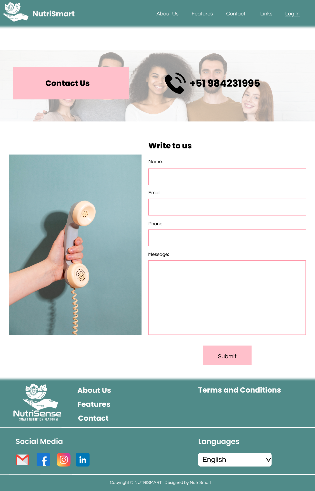</td>
      <td>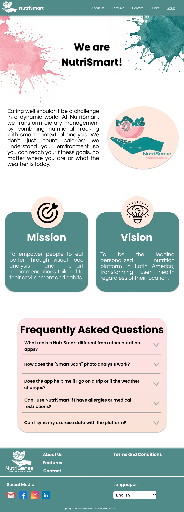</td>
      <td>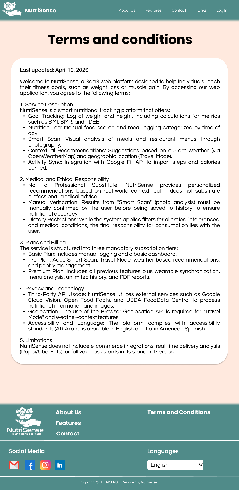</td>
    </tr>
  </table>

Elementos de Diseño

| Elemento | Justificación |
|---|---|
| **Colour** | La paleta salmón/rosado como fondo dominante se extiende consistentemente en las tres páginas, unificando la identidad visual de toda la plataforma. En Contacto, los bordes de los campos del formulario usan un tono rosado que los diferencia sutilmente del fondo blanco. El botón "Submit" adopta el mismo tono salmón, integrándolo como elemento de acción dentro de la paleta general. |
| **Texture** | En About Us, el hero incorpora manchas de acuarela en tonos rosado y verde azulado como elementos decorativos de fondo, introduciendo una textura orgánica y artesanal que humaniza la marca. En Contacto, la fotografía de una mano sosteniendo un teléfono retro sobre fondo azul verdoso aporta textura fotográfica real que contrasta con el fondo blanco del formulario. |
| **Shape** | Las tarjetas de Misión y Visión en About Us usan esquinas redondeadas con fondo verde oscuro y un ícono circular superpuesto en la parte superior, con ilustraciones outline temáticas: una diana para Misión y un foco para Visión. Esto reemplaza los placeholders del wireframe con formas con significado semántico directo. En Contacto, el bloque "Contact Us" en el hero adopta forma rectangular con fondo rosado pastel, destacándolo sobre la fotografía de personas. |
| **Colour (contraste tipográfico)** | En Términos y Condiciones, el título de la página y los títulos de sección numerados son negros sobre fondo salmón y blanco respectivamente, generando contraste suficiente para la lectura de texto legal extenso. El texto dentro de la tarjeta blanca usa negro sobre blanco, la combinación de mayor legibilidad disponible. |

Heurísticas de Nielsen

| Heurística | Justificación |
|---|---|
| **Consistencia y estándares (H4)** | El navbar verde oscuro con logo NutriSense a la izquierda y links a la derecha se replica de forma idéntica en las tres páginas. El footer mantiene la misma estructura de cuatro columnas con logo, enlaces, redes sociales con íconos de color real y selector de idioma, estableciendo un patrón reconocible en toda la plataforma. |
| **Relación entre el sistema y el mundo real (H2)** | La fotografía del hero en Contacto muestra un grupo de personas diversas sonrientes, comunicando cercanía y accesibilidad humana antes de llegar al formulario. La imagen de la mano con teléfono retro refuerza la metáfora de comunicación de forma visual e inmediata, sin necesidad de texto explicativo. |
| **Prevención de errores (H5)** | Los campos del formulario de contacto tienen bordes rosados visibles que los delimitan claramente, reduciendo el riesgo de que el usuario interactúe con el área incorrecta. Las etiquetas (Name, Email, Phone, Message) están posicionadas fuera de los campos, evitando que desaparezcan al comenzar a escribir. |
| **Diseño estético y minimalista (H8)** | La página de Términos y Condiciones concentra todo el contenido legal en una sola tarjeta blanca sobre fondo salmón, sin imágenes decorativas ni elementos visuales adicionales. La decisión de eliminar todo ornamento en esta página respeta el principio de no añadir elementos que compitan con la lectura comprensiva de información legal. |

Arquitectura de la Información (AI)

| Principio AI | Justificación |
|---|---|
| **Objects** | El logo de NutriSense en navbar y footer es ahora un objeto visual completo: ilustración de manos sosteniendo una hoja, nombre de marca y tagline "Smart Nutrition Platform". Este objeto se comporta de forma consistente en todas las páginas como elemento de identidad vivo, no como un simple placeholder. |
| **Exemplars** | En About Us, el ícono circular que acompaña el bloque introductorio muestra la ilustración del logo de NutriSense a color, funcionando como un ejemplar visual de la identidad de marca antes de que el usuario llegue a las tarjetas de Misión y Visión. |
| **Disclosure** | La página de Términos y Condiciones organiza el contenido en cinco secciones numeradas y claramente tituladas (Service Description, Medical and Ethical Responsibility, Plans and Billing, Privacy and Technology, Limitations), permitiendo al usuario identificar rápidamente la sección de su interés sin leer el documento completo. |
| **Front Doors** | En Contacto, el número de teléfono real (+51 984231995) aparece en el hero de forma prominente junto al ícono de llamada, actuando como puerta de entrada directa para usuarios que prefieren contacto inmediato sobre el formulario escrito. |

Diseño Inclusivo

| Principio | Justificación |
|---|---|
| **Agrega valor (P7)** | Las manchas de acuarela en el hero de About Us agregan valor estético que humaniza la página institucional, diferenciándola de un bloque de texto corporativo genérico. Los íconos temáticos de diana (Misión) y foco (Visión) agregan valor semántico que refuerza el significado de cada concepto más allá del título. |
| **Proporciona experiencias comparables (P1)** | Los íconos de redes sociales en el footer usan sus colores de marca oficiales (rojo para Gmail, azul para Facebook, gradiente para Instagram, azul para LinkedIn), permitiendo que usuarios con distintos niveles de familiaridad digital identifiquen los canales por color y forma sin depender únicamente del texto. |
| **Priorizar el contenido (P6)** | En About Us, las tarjetas de Misión y Visión usan fondo verde oscuro con texto blanco, destacándolas visualmente sobre el fondo blanco de la página. Esto prioriza el contenido institucional más relevante de la página mediante contraste cromático deliberado. |
| **Considera la situación del usuario (P2)** | La fotografía del hero en Contacto muestra personas de distintas etnias y géneros, reconociendo que NutriSmart es una plataforma dirigida a una audiencia diversa. Esta decisión visual comunica inclusión desde el primer elemento visible de la página de contacto. |

**Mobile Web Browser**

**Main & Features**

  <table>
    <tr>
      <td>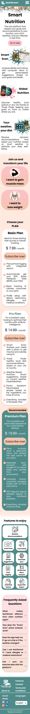</td>
      <td>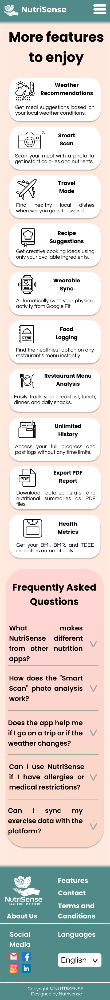</td>
      <td>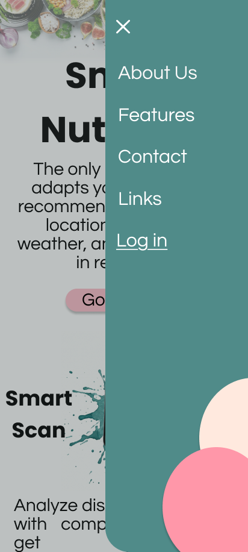</td>
    </tr>
  </table>

Elementos de Diseño

| Elemento | Justificación |
|---|---|
| **Colour** | La paleta salmón/rosado como fondo dominante y el verde oscuro del navbar se mantienen consistentes con la versión desktop, garantizando coherencia de identidad visual entre plataformas. El panel de navegación hamburguesa adopta el mismo verde oscuro del navbar, y los círculos decorativos del fondo del panel combinan el rosado y el blanco de la paleta general. |
| **Texture** | El hero de la landing mobile incorpora una fotografía de alimentos frescos como banda superior y manchas de acuarela en verde azulado como elementos decorativos alrededor de las imágenes de producto. Esta textura orgánica se adapta al ancho reducido de pantalla sin perder la riqueza visual presente en la versión desktop. |
| **Shape** | Las tarjetas de funcionalidades en la página de features adoptan el mismo patrón ícono-título-descripción con esquinas redondeadas, pero en layout de columna única que ocupa el ancho completo de la pantalla. El botón "Go to app" usa forma de píldora con fondo rosado pastel, diferenciándolo del texto circundante como elemento de acción primaria. |
| **Size** | El título "Smart Nutrition" ocupa casi el ancho completo de la pantalla en dos líneas con una jerarquía tipográfica dominante. Los íconos outline en las tarjetas de funcionalidades tienen un tamaño generoso respecto al ancho de la tarjeta, haciéndolos reconocibles en pantallas de densidad variable sin necesidad de ampliar. |

Heurísticas de Nielsen

| Heurística | Justificación |
|---|---|
| **Consistencia y estándares (H4)** | El menú hamburguesa despliega un panel con el mismo conjunto de ítems de navegación (About Us, Features, Contact, Links, Log in) que la versión desktop, manteniendo consistencia en el contenido accesible independientemente del dispositivo. El botón "✕" para cerrar el panel sigue la convención estándar de cierre en interfaces móviles. |
| **Relación entre el sistema y el mundo real (H2)** | Las imágenes de la app activa sobre dispositivos móviles reales en las secciones Smart Scan y Global Nutrition muestran el producto en su contexto de uso natural. Las manchas de acuarela y fotografías de alimentos conectan la plataforma con el mundo real de la nutrición cotidiana del usuario. |
| **Reconocer antes que recordar (H6)** | Los íconos outline temáticos en las tarjetas de funcionalidades mobile (cámara para Smart Scan, avión para Travel Mode, gorro de chef para Recipe Suggestions) permiten al usuario identificar la función visualmente antes de leer el título, reduciendo la carga de memoria en una interfaz de consumo vertical y rápido. |
| **Diseño estético y minimalista (H8)** | La versión mobile de la página de funcionalidades presenta las tarjetas en columna única con solo ícono, título en negrita y una línea de descripción, eliminando cualquier elemento visual que no aporte información funcional directa. El fondo salmón liso entre tarjetas actúa como separador neutro sin añadir ruido visual. |

Arquitectura de la Información (AI)

| Principio AI | Justificación |
|---|---|
| **Disclosure** | En la landing mobile, cada sección de funcionalidad principal (Smart Scan, Global Nutrition) muestra la imagen del producto en contexto y una descripción breve antes de invitar al usuario a profundizar. La información se revela progresivamente a medida que el usuario hace scroll, sin sobrecargar la pantalla inicial. |
| **Objects** | Las imágenes de la app activa sobre smartphones tratan el producto como un objeto vivo con comportamientos propios: el teléfono muestra la interfaz de Smart Scan en uso real, comunicando que la app es un objeto funcional y no una representación abstracta. |
| **Focused Navigation** | El panel hamburguesa agrupa la navegación como una acción deliberada del usuario, manteniendo los ítems definidos por su contenido. Los indicadores de carrusel (puntos) debajo de la banda de imagen del hero comunican que existe contenido navegable horizontalmente, orientando al usuario sobre las posibilidades de exploración disponibles. |
| **Growth** | El layout de tarjetas apiladas en la página de funcionalidades mobile permite incorporar nuevas funcionalidades simplemente añadiendo tarjetas al final de la lista sin rediseñar la estructura, escalando de forma natural con el crecimiento del producto. |

Diseño Inclusivo

| Principio | Justificación |
|---|---|
| **Considera la situación del usuario (P2)** | El botón "Go to app" tiene forma de píldora con área táctil generosa, diseñado para ser accionable con el pulgar en una sola mano. Las tarjetas de funcionalidades tienen altura suficiente para evitar toques accidentales en elementos adyacentes, reconociendo que el usuario móvil interactúa con el dedo en condiciones de movimiento. |
| **Proporciona experiencias comparables (P1)** | La versión mobile presenta el mismo contenido disponible en desktop (funcionalidades, secciones de producto, navegación completa), reorganizado en columna única. El usuario móvil accede a información equivalente sin versiones reducidas, garantizando paridad de experiencia entre dispositivos. |
| **Priorizar el contenido (P6)** | El título "Smart Nutrition" y el botón "Go to app" ocupan la parte superior visible de la pantalla sin necesidad de scroll, priorizando el mensaje principal y la acción de conversión. En la página de funcionalidades, cada tarjeta posiciona el título en negrita antes que la descripción, facilitando el escaneo rápido del contenido. |
| **Ser consistente (P3)** | El patrón de tarjeta en la página de funcionalidades mobile replica exactamente la misma estructura que la versión desktop (ícono a la izquierda, título a la derecha, descripción abajo), estableciendo un modelo de lectura familiar para usuarios que hayan interactuado previamente con la versión de escritorio. |

**Contact, About-us & Terms**

  <table>
    <tr>
      <td>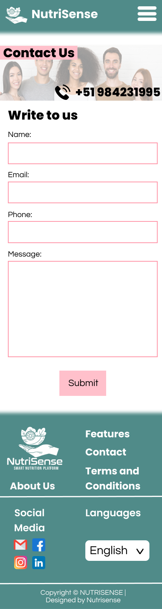</td>
      <td>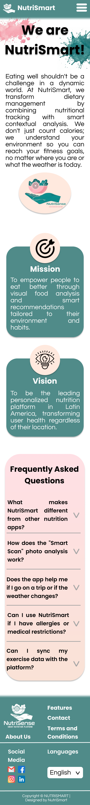</td>
      <td>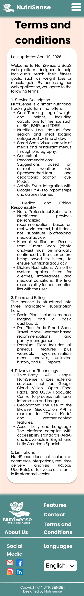</td>
    </tr>
  </table>

Elementos de Diseño

| Elemento | Justificación |
|---|---|
| **Colour** | Los bordes rosados de los campos del formulario en Contacto y el botón "Submit" en el mismo tono salmón mantienen la paleta cromática de la plataforma incluso en los elementos interactivos más funcionales. En About Us, las manchas de acuarela rosada y verde azulado sobre el fondo blanco del hero replican el lenguaje visual decorativo de la versión desktop adaptado al ancho móvil. |
| **Texture** | En Contacto, la fotografía del hero muestra un grupo de personas diversas y sonrientes ocupando el ancho completo de la pantalla, introduciendo textura fotográfica humana que contextualiza la página antes del formulario. En About Us, las manchas de acuarela aportan textura orgánica al encabezado, diferenciando visualmente la página institucional de las demás. |
| **Shape** | Las tarjetas de Misión y Visión en About Us mobile conservan las esquinas redondeadas con fondo verde oscuro y el ícono circular superpuesto en la parte superior, manteniendo la forma orgánica de la versión desktop en columna única. El logo de NutriSense en el footer combina una forma circular ilustrada con texto, funcionando como un objeto visual compacto adaptado al espacio reducido. |
| **Size** | En Términos y Condiciones, el título "Terms and conditions" ocupa las dos primeras líneas visibles con un tamaño notablemente mayor al cuerpo del texto, estableciendo jerarquía inmediata en una página de contenido denso. Los íconos de redes sociales en el footer tienen un tamaño táctil generoso que los hace accionables sin requerir precisión. |

Heurísticas de Nielsen

| Heurística | Justificación |
|---|---|
| **Consistencia y estándares (H4)** | El navbar con logo y hamburguesa, y el footer con estructura de dos columnas, íconos de redes sociales a color y selector de idioma se replican de forma idéntica en las tres páginas móviles, manteniendo el patrón establecido en la landing mobile y generando predictibilidad en la navegación. |
| **Prevención de errores (H5)** | Los campos del formulario de Contacto tienen bordes rosados claramente visibles sobre fondo blanco, delimitando el área de interacción y reduciendo el riesgo de que el usuario toque fuera del campo. El campo de mensaje tiene altura generosa para evitar que el usuario envíe mensajes incompletos por falta de espacio visual. |
| **Visibilidad del estado del sistema (H1)** | El número de teléfono real (+51 984231995) aparece superpuesto sobre la fotografía del hero en Contacto junto al ícono de llamada, comunicando de forma inmediata que existe un canal de contacto directo disponible antes de que el usuario llegue al formulario. |
| **Diseño estético y minimalista (H8)** | La página de Términos y Condiciones en mobile presenta el contenido legal en una sola tarjeta blanca sin imágenes, íconos ni elementos decorativos adicionales. Esta decisión respeta el principio de eliminar todo lo que no contribuya directamente a la comprensión del contenido legal en pantalla reducida. |

Arquitectura de la Información (AI)

| Principio AI | Justificación |
|---|---|
| **Objects** | El logo de NutriSense en navbar y footer de las tres páginas mobile es un objeto visual completo con ilustración, nombre de marca y tagline, comportándose de forma consistente como elemento de identidad en todas las vistas. Las tarjetas de Misión y Visión tratan cada concepto como un objeto independiente con ícono, título y descripción propios. |
| **Disclosure** | En About Us mobile, el párrafo introductorio aparece antes de las tarjetas de Misión y Visión, revelando el propósito general de la empresa antes de profundizar en sus valores institucionales. En Términos y Condiciones, los títulos de sección numerados permiten al usuario anticipar la estructura del documento sin leerlo completo. |
| **Front Doors** | La página de Contacto mobile ofrece dos puertas de entrada al mismo objetivo: el número telefónico visible en el hero y el formulario escrito debajo. Esto garantiza que usuarios que lleguen directamente a esta página desde cualquier canal encuentren siempre una vía de acción inmediata adecuada a su preferencia. |
| **Focused Navigation** | El footer en las tres páginas mobile presenta los mismos enlaces de navegación (Features, Contact, Terms and Conditions, About Us) definidos por su contenido, permitiendo al usuario reorientarse dentro de la plataforma desde cualquier página sin necesidad de volver al inicio. |

Diseño Inclusivo

| Principio | Justificación |
|---|---|
| **Considera la situación del usuario (P2)** | Los campos del formulario de Contacto tienen altura suficiente para ser accionables con el dedo en condiciones de movilidad, y el botón "Submit" está posicionado debajo del último campo con espacio de separación que evita envíos accidentales al terminar de escribir el mensaje. |
| **Proporciona experiencias comparables (P1)** | Los íconos de redes sociales en el footer usan sus colores de marca oficiales (rojo Gmail, azul Facebook, gradiente Instagram, azul LinkedIn), permitiendo que usuarios con distintos niveles de alfabetización digital identifiquen los canales por color y forma sin depender únicamente del texto en pantalla reducida. |
| **Priorizar el contenido (P6)** | En About Us mobile, las tarjetas de Misión y Visión con fondo verde oscuro y texto blanco destacan visualmente sobre el fondo salmón de la página, priorizando el contenido institucional más relevante mediante contraste cromático deliberado incluso en formato de columna única. |
| **Ser consistente (P3)** | La estructura del footer se replica de forma idéntica en las tres páginas mobile con los mismos bloques (logo + enlaces + redes sociales + selector de idioma), estableciendo un patrón reconocible que permite al usuario ubicar recursos secundarios sin esfuerzo cognitivo adicional independientemente de la página en que se encuentre. |

## 4.4. Web Applications UX/UI Design

### 4.4.1. Web Applications Wireframes

**Login, Dashboard, Analytics, Daily log & Balance progress**

  <table>
    <tr>
      <td>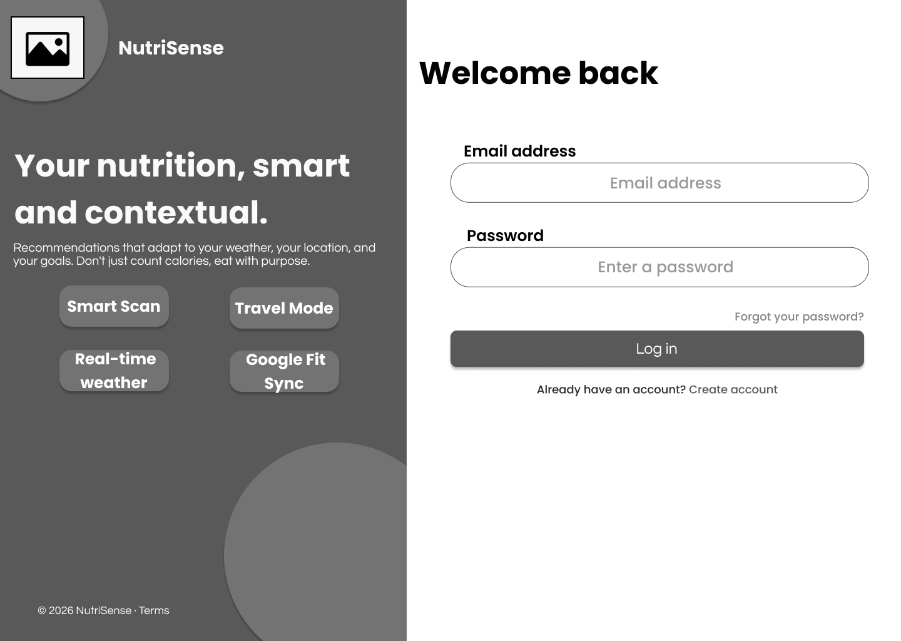</td>
      <td>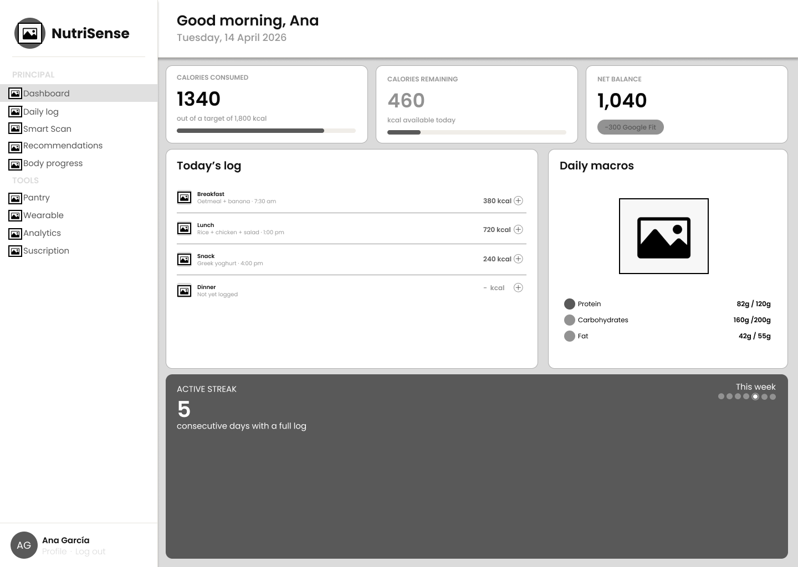</td>
      <td>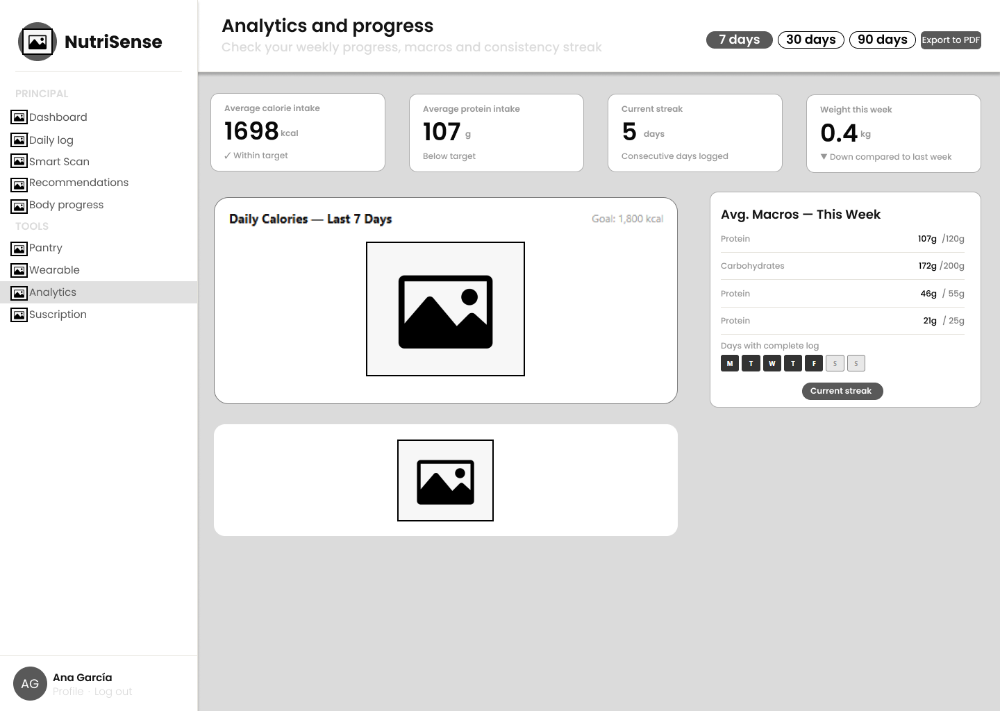</td>
    </tr>
    <tr>
      <td>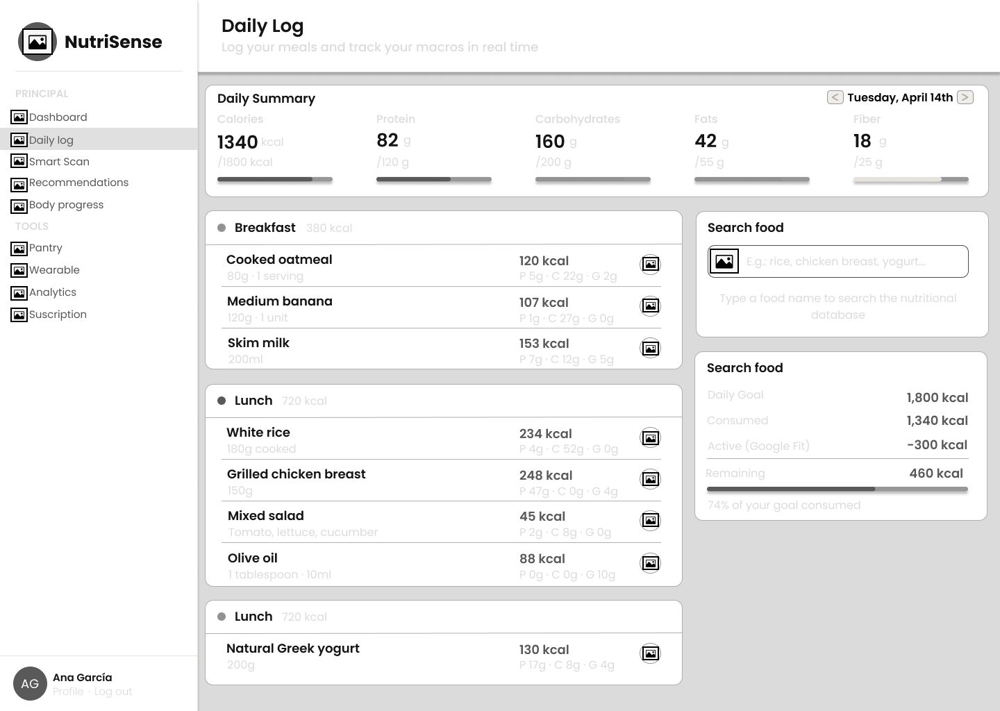</td>
      <td>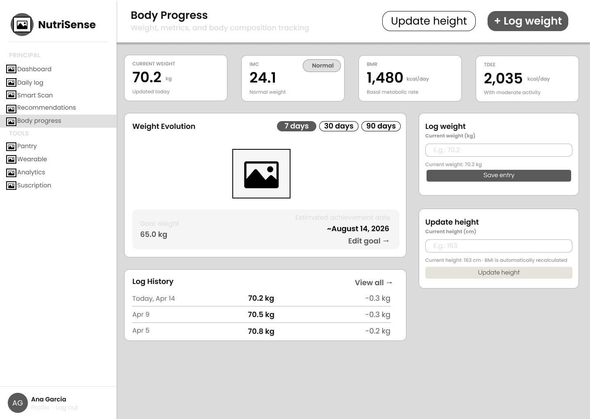</td>
    </tr>
  </table>

## Elementos de Diseño

| Elemento | Justificación |
|---|---|
| **Shape** | La barra lateral de navegación usa un layout rectangular fijo con ítems de texto e ícono alineados verticalmente. Las tarjetas de métricas (calorías, IMC, BMR, TDEE) son rectangulares con esquinas redondeadas y jerarquía numérica prominente. El ítem activo del menú lateral se resalta con un fondo diferenciado que indica la sección actual. En Login, los campos de entrada usan forma de píldora con bordes redondeados, diferenciándolos visualmente de los campos rectangulares del wireframe de la landing. |
| **Space** | El layout de la aplicación divide la pantalla en dos zonas fijas: sidebar izquierdo de navegación y área de contenido principal. Dentro del área de contenido, las tarjetas de métricas se distribuyen en una fila horizontal superior, seguidas de bloques de contenido secundario en grid de dos columnas. Este uso del espacio establece una jerarquía clara entre datos primarios y secundarios. |
| **Direction** | En Dashboard y Analytics, la lectura sigue un patrón en Z: de izquierda a derecha en la fila de métricas superiores, luego diagonal hacia el bloque principal de contenido y finalmente al panel lateral derecho. En Daily Log, la dirección es vertical descendente dentro de cada bloque de comidas, con el panel de búsqueda fijo a la derecha. |
| **Size** | Los valores numéricos clave (1340 kcal, 70.2 kg, 24.1 IMC) se muestran en un tamaño notablemente mayor al de sus etiquetas y unidades de medida, estableciendo una jerarquía tipográfica que permite al usuario escanear los datos más relevantes sin leer el contexto completo. |

Heurísticas de Nielsen

| Heurística | Justificación |
|---|---|
| **Visibilidad del estado del sistema (H1)** | El Dashboard saluda al usuario por nombre ("Good morning, Ana") con fecha actual, comunicando que el sistema está activo y contextualizado en tiempo real. Las barras de progreso en Daily Log muestran el porcentaje de cada macronutriente consumido respecto a la meta diaria. En Body Progress, la fecha de logro estimada ("~August 14, 2026") informa al usuario sobre su proyección actual. |
| **Reconocer antes que recordar (H6)** | El menú lateral muestra todos los ítems de navegación visibles de forma permanente, divididos en secciones PRINCIPAL y TOOLS. El ítem activo está resaltado, eliminando la necesidad de que el usuario recuerde en qué sección se encuentra. En Daily Log, cada comida muestra nombre, cantidad, calorías y macros en la misma fila, evitando que el usuario deba navegar para recordar qué registró. |
| **Flexibilidad y eficiencia en el uso (H7)** | En Body Progress, los filtros de tiempo "7 days", "30 days" y "90 days" permiten al usuario experto cambiar el rango del gráfico con un solo clic sin necesidad de configurar fechas manualmente. En Analytics, el botón "Export to PDF" y los mismos filtros de rango ofrecen atajos directos para usuarios avanzados. |
| **Prevención de errores (H5)** | En Body Progress, el campo "Log weight" muestra el peso actual como placeholder ("E.g.: 70.2") y lo confirma debajo del campo ("Current weight: 70.2 kg"), permitiendo al usuario verificar el valor antes de guardar. El campo "Update height" incluye la nota "BMI is automatically recalculated", informando las consecuencias de la acción antes de ejecutarla. |

Arquitectura de la Información (AI)

| Principio AI | Justificación |
|---|---|
| **Objects** | Cada entrada del Daily Log trata la comida como un objeto con atributos propios: nombre, cantidad, calorías y macros (P, C, G). Cada registro del Log History en Body Progress tiene fecha, peso y variación como atributos independientes. Estos objetos se comportan como entidades vivas que acumulan historial y generan proyecciones. |
| **Multiple Classification** | La navegación lateral organiza el contenido en dos categorías diferenciadas: PRINCIPAL (Dashboard, Daily log, Smart Scan, Recommendations, Body progress) y TOOLS (Pantry, Wearable, Analytics, Subscription). Esta clasificación permite al usuario acceder al contenido tanto por flujo de uso habitual como por tipo de herramienta. |
| **Choices** | En Analytics, los filtros "7 days", "30 days" y "90 days" ofrecen tres perspectivas temporales significativas del progreso del usuario. En Login, el enlace "Forgot your password?" y "Create account" ofrecen rutas alternativas sin obligar al usuario a abandonar el flujo principal. |
| **Growth** | La estructura de Daily Log organiza las comidas por categoría (Breakfast, Lunch, Snack, Dinner) con entradas expandibles dentro de cada bloque. Esto permite que el número de alimentos registrados por comida crezca sin romper la jerarquía visual, añadiendo filas dentro del bloque correspondiente. |

Diseño Inclusivo

| Principio | Justificación |
|---|---|
| **Priorizar el contenido (P6)** | En Dashboard, las tres tarjetas superiores (Calories Consumed, Calories Remaining, Net Balance) presentan los datos más relevantes para el seguimiento diario del usuario en la parte más visible de la pantalla, antes que cualquier otro contenido. Los valores numéricos en tamaño grande priorizan el dato sobre su contexto. |
| **Proporciona experiencias comparables (P1)** | El panel de búsqueda de alimentos en Daily Log incluye un campo de texto con placeholder descriptivo ("E.g.: rice, chicken breast, yogurt...") que orienta al usuario sobre el tipo de entrada esperada, ofreciendo una experiencia de búsqueda accesible tanto para usuarios que conocen los nombres exactos como para quienes buscan por categoría general. |
| **Deja al usuario mandar (P4)** | En Body Progress, el usuario puede editar su meta de peso y actualizar su altura en cualquier momento desde el panel lateral. En Analytics, el botón "Export to PDF" da al usuario control sobre sus propios datos, permitiéndole exportarlos cuando lo considere necesario. |
| **Agrega valor (P7)** | El bloque "Active Streak" en Dashboard muestra el número de días consecutivos con registro completo, agregando valor motivacional más allá del simple registro de datos. La integración con Google Fit que descuenta calorías activas del balance diario ("Active (Google Fit): -300 kcal") agrega valor contextual que una app de nutrición estándar no ofrece. |

### 4.4.2. Web Applications Wireflow Diagrams

### 4.4.2. Web Applications Mock-ups

### 4.4.3. Web Applications User Flow Diagrams

## 4.5. Web Applications Prototyping

## 4.6. Domain-Driven Software Architecture

### 4.6.1. Design-Level EventStorming

### 4.6.2. Software Architecture Context Diagram

### 4.6.3. Software Architecture Container Diagrams

### 4.6.4. Software Architecture Components Diagrams

## 4.7. Software Object-Oriented Design

### 4.7.1. Class Diagrams

## 4.8. Database Design

### 4.8.1. Database Diagrams
