# CAPÍTULO V: Product Implementation, Validation & Deployment

El proceso de construcción, verificación y puesta en marcha de NutriSense representa la fase donde los conceptos arquitectónicos se materializan en una solución funcional. Esta etapa es determinante para transformar los modelos de diseño en una plataforma operativa, permitiendo validar la viabilidad de nuestra propuesta tecnológica y asegurar que el producto final cumpla con los estándares de calidad esperados por los usuarios en el ecosistema de salud digital.

## 5.1. Software Configuration Management

La gestión de configuración de software (SCM) en NutriSense garantiza la integridad y trazabilidad de todos los artefactos del proyecto durante su ciclo de vida. Este apartado detalla los procesos para administrar los cambios en el código fuente y la documentación, asegurando versiones reproducibles y una colaboración estructurada que minimice conflictos y optimice la calidad de las entregas finales.

### 5.1.1. Software Development Environment Configuration

En este apartado, el equipo detalla el ecosistema de herramientas digitales seleccionadas para la construcción de NutriSense. Cada solución ha sido elegida para optimizar una fase específica del ciclo de vida, garantizando la interoperabilidad y el flujo de trabajo constante entre los miembros del proyecto.

**Project Management**

Con el fin de centralizar la administración de tareas y asegurar la sincronía del grupo, se adoptaron plataformas que permiten una planificación ágil y un seguimiento detallado del backlog.

- **Trello:** Herramienta de tipo SaaS. Se utilizó como el tablero Kanban principal para la organización de las User Stories y la asignación de responsabilidades individuales. Su interfaz permitió visualizar el progreso de cada funcionalidad desde su etapa de "To Do" hasta su validación final.

    [Link de registro o inicio de sesion](https://trello.com)

    **Evidencia de uso:**  

   

 - **Microsoft Teams:** Herramienta de tipo SaaS. Se empleó como el centro neurálgico para la comunicación formal y síncrona del equipo. Esta plataforma permitió integrar las sesiones de videoconferencia con el almacenamiento compartido de archivos y el chat grupal, facilitando la toma de decisiones estratégicas y la organización de reuniones de sprint review y daily stand-ups.

    [Link de registro, inicio de sesion y descarga](https://www.microsoft.com/teams)

    **Evidencia de uso:**     

   

**Requirement Management**

Para la fase de análisis y especificación de los requerimientos de NutriSense, se implementaron herramientas de modelado visual que permiten transformar las necesidades del usuario en estructuras técnicas comprensibles para todo el equipo.

- **Miro:** Herramienta de tipo SaaS. Se estableció como el entorno colaborativo principal para la captura de requisitos dinámicos. A través de sesiones de EventStorming, el equipo pudo identificar los eventos de dominio, las reglas de negocio y los flujos de trabajo de los 7 Bounded Contexts. Esta herramienta facilitó la transición de las necesidades del cliente hacia una lógica de sistema reactiva. 

    [Link de registro o inicio de sesion](https://miro.com)

    **Evidencia de uso:**  

   

 - **Structurizr:** Herramienta de tipo SaaS. Se utilizó para la especificación técnica de los requisitos arquitectónicos mediante el modelo C4. Esta suite permitió documentar el contexto del sistema, los contenedores y los componentes de manera jerárquica, asegurando que el diseño de software esté alineado estrictamente con las capacidades funcionales exigidas por la plataforma. 

    [Link de registro o inicio de sesion](https://structurizr.com )

    **Evidencia de uso:**     

   

**Product UX/UI Design**

En el diseño de la interfaz y la experiencia del usuario para la salud digital, se utilizaron soluciones enfocadas en la fidelidad visual y el entendimiento de las necesidades del cliente.

- **Figma:** Herramienta de tipo SaaS. Se utilizó para la arquitectura visual de NutriSense, permitiendo la creación de prototipos interactivos de alta fidelidad. Mediante esta plataforma, se definieron los estilos, la tipografía y los componentes de UI que aseguran una experiencia coherente y atractiva. 

    [Link de registro, inicio de sesion y descarga](https://www.figma.com)

    **Evidencia de uso:**  

   

 - **UXPressia** Herramienta de tipo SaaS. Se aplicó para la construcción de los Customer Journey Maps y el análisis de los perfiles de usuario (User Personas). Permitió identificar los puntos de dolor de los usuarios al gestionar su nutrición, orientando el diseño hacia soluciones personalizadas. 

    [Link de registro o inicio de sesion](https://uxpressia.com)

    **Evidencia de uso:**   

   

**Software Development**

Para la fase de construcción de la plataforma, se seleccionaron entornos de desarrollo integrados (IDE) que maximizan la productividad del equipo y aseguran la calidad del código fuente mediante herramientas avanzadas de depuración y autocompletado.

- **Visual Studio Code:** Herramienta de tipo Desktop (IDE). Se utilizó como el entorno de trabajo versátil para la edición de scripts, archivos de configuración y la integración de herramientas de control de versiones. Gracias a su ecosistema de extensiones, permitió una edición ágil y personalizada de los diferentes módulos del proyecto, facilitando una codificación ligera y eficiente.

    [Link de descarga](https://code.visualstudio.com/)

    **Evidencia de uso:**  

   

- **Rider:** Herramienta de tipo Desktop (IDE). Se empleó como el entorno de desarrollo integrado especializado para la arquitectura del backend en ASP.NET Core con C#. Su potente motor de análisis de código permitió gestionar de forma robusta los componentes del dominio y asegurar que la lógica del servidor cumpliera con los estándares de rendimiento exigidos por la plataforma.

    [Link de descarga](https://www.jetbrains.com/rider/)

 - **WebStorm** Herramienta de tipo Desktop (IDE). Se empleó como el entorno de desarrollo integrado especializado para la arquitectura del frontend en Vue.js. Su potente motor de análisis de código permitió gestionar de forma robusta los componentes reactivos de la interfaz y asegurar que la lógica de cliente cumpliera con los estándares de rendimiento exigidos por la plataforma.	

    [Link de descarga](https://www.jetbrains.com/webstorm/)

**Software Testing**

Con el objetivo de garantizar la calidad y el cumplimiento de los criterios de aceptación, se utilizó un estándar de especificación basado en el comportamiento.

- **Gherkin:** Lenguaje de especificación técnica. Se implementó para definir los escenarios de prueba bajo el formato "Dado que, Cuando, Entonces". Su uso permitió que las validaciones del sistema fueran legibles tanto para el equipo de desarrollo como para el área de negocio, asegurando que cada funcionalidad opere según lo previsto.

    [Link de la documentacion y uso](https://cucumber.io/docs/gherkin/)

    **Evidencia de uso:**  

   

**Software Documentation**

La gestión de los activos digitales y la preservación del historial de cambios se realizó mediante una plataforma líder en el control de versiones.

- **GitHub:** Herramienta de tipo SaaS. Se utilizó como el repositorio maestro de NutriSense, donde se resguardó el código fuente, la documentación técnica y las definiciones de pruebas. Su infraestructura permitió la colaboración asíncrona entre desarrolladores y garantizó la trazabilidad total del proyecto.

    [Link de registro o inicio de sesion](https://github.com)

    **Evidencia de uso:**

   

**Software Deployment**

Con el propósito de garantizar la accesibilidad de la propuesta de valor inicial y automatizar su publicación, se utilizó un servicio de alojamiento en la nube que permite el despliegue efectivo del sitio de presentación (Landing Page). Este enfoque asegura que los interesados puedan visualizar la solución preliminar de forma rápida y confiable.

- **GitHub Pages:** Herramienta de tipo SaaS. Actúa como la plataforma de publicación estática para la difusión inicial del proyecto. Su implementación permitió automatizar el ciclo de actualización a partir del código fuente resguardado en la rama principal, facilitando una sincronización inmediata entre los ajustes realizados por el equipo y la versión web disponible para los usuarios.

    [Link de la documentacion y uso](https://pages.github.com/)

### 5.1.2. Source Code Management

Para garantizar la integridad y el control total sobre las modificaciones del software, el equipo ha seleccionado GitHub como plataforma centralizada de gestión de versiones. Este sistema permite una colaboración distribuida y asíncrona, facilitando la auditoría de cambios y la integración de las diferentes capas de la aplicación NutriSense.

**Repositorios del Proyecto**

La solución se ha segmentado en repositorios independientes para mantener una arquitectura limpia y una separación de responsabilidades clara:

 - **nutrisense-website:** Repositorio dedicado al sitio de presentación estática (Landing Page).

    [Link del repositorio nutrisense-website](https://github.com/upc-pre-202610-1asi0730-12053-nutrisens/nutrisense-website)

 - **nutrisense-platform:** Contiene el núcleo de la solución (Backend), desarrollado como una API RESTful en C#. Este repositorio aloja la lógica de negocio, los servicios de dominio y las suites de pruebas automatizadas.

    [Link del repositorio nutrisense-platform](https://github.com/upc-pre-202610-1asi0730-12053-nutrisens/nutrisense-platform)

 - **nutrisense-webapp** Espacio reservado para el código del cliente web (Frontend) construido en Vue.js.

    [Link del repositorio nutrisense-webapp](https://github.com/upc-pre-202610-1asi0730-12053-nutrisens/nutrisense-webapp)

 - **nutrisense-report:** Repositorio de soporte utilizado para la gestión de la documentación técnica y los informes del proyecto.
  
    [Link del repositorio nutrisense-report](https://github.com/upc-pre-202610-1asi0730-12053-nutrisens/nutrisense-report)

**Implementación de GitFlow**

Para la organización y administración de la base de código, el equipo ha adoptado el esquema de ramificación GitFlow. Este flujo de trabajo se fundamenta en el modelo estratégico propuesto por Vincent Driessen en su publicación "A successful Git branching model", el cual proporciona una estructura robusta para gestionar el ciclo de vida del software mediante roles específicos para cada rama:

 - **Main Branch:** Resguarda el código fuente definitivo que se encuentra en el entorno de producción. Es la versión oficial y estable de NutriSense; cualquier cambio aquí representa una versión liberada al usuario.
    - **Notación:** `main o master`.
 - **Develop Branch:** Actúa como la rama matriz para la integración de todas las capacidades técnicas en desarrollo. Es el espacio donde se consolidan las funcionalidades antes de ser enviadas a la fase de publicación.
    - **Notación:** `develop`.
 - **Feature Branches:** Segmentos temporales creados para trabajar en requerimientos específicos o historias de usuario del backlog. Se originan a partir de develop y deben reintegrarse a esta misma rama una vez finalizada y validada la tarea.
    - **Notación:** `feature/US-nombre`.
 - **Release Branches:** Utilizadas para preparar un lanzamiento oficial de la plataforma. Permiten realizar auditorías finales, ajustes de configuración y correcciones menores sin interrumpir el desarrollo de nuevas funciones en la rama matriz.
    - **Notación:** `release/vX.Y.Z`.
  - **Hotfix Branches:** Ramas de corrección urgente creadas directamente desde main para resolver errores críticos detectados en producción. Una vez corregido el problema, se fusionan tanto en main como en develop para mantener la consistencia del código en todas las ramas activas.
    - **Notación:** `hotfix/nombre-del-error`.

**Conventional Commits**

Se adopta esta convención para estandarizar el historial de cambios y facilitar la generación automática de bitácoras (changelogs). Este estándar permite identificar rápidamente la intención de cada modificación mediante una estructura semántica clara.

El formato mandatorio es: `<tipo>[alcance]: <descripción>`, el cual incluye un encabezado obligatorio y, de ser necesario, un cuerpo técnico y pie de página para referencias.

Los tipos de confirmación permitidos para este proyecto son:

- **feat:** Incorporación de una nueva funcionalidad o capacidad al sistema.
- **fix:** Resolución de un error técnico, bug o comportamiento no deseado.
- **docs:** Modificaciones exclusivas en la documentación, manuales o archivos README.
- **style:** Ajustes relacionados con el formato, indentación o estética del código sin alterar su lógica funcional.
- **chore:** Labores de mantenimiento, actualizaciones de dependencias o ajustes en la configuración del entorno de compilación.
- **refactor:** Cambios en la estructura del código destinados a mejorar su legibilidad o eficiencia interna.
- **test:** Inclusión, corrección o actualización de escenarios de pruebas unitarias o de integración.

**Semantic Versioning**

Se emplea la versión 2.0.0 de Semantic Versioning bajo el esquema vX.Y.Z:

- **X (MAYOR):** Cambios grandes o incompatibles con versiones anteriores.
- **Y (MINOR):** Nuevas funcionalidades compatibles con versiones anteriores.
- **Z (PATCH):** Correcciones menores o parches que no afectan la funcionalidad.

### 5.1.3. Source Code Style Guide & Conventions

Para asegurar que el código de NutriSense sea mantenible, escalable y profesional, el equipo ha adoptado una serie de normas y guías de estilo internacionales. Como política fundamental, toda la nomenclatura técnica (variables, clases, métodos y comentarios) será redactada íntegramente en inglés, garantizando un estándar global en el desarrollo.

**Convenciones aplicadas por lenguaje:**

**HTML**

Siguiendo la "HTML Style Guide and Coding Conventions" de W3Schools y la "Google HTML/CSS Style Guide", se mantiene una arquitectura semántica y accesible. El código se escribe íntegramente en minúsculas, con una indentación de dos espacios y comentarios descriptivos para separar bloques funcionales.

**Estructura y etiquetas principales empleadas:**

- **Base:** `<!DOCTYPE html>`, `<html>`, `<head>`, `<body>` para la jerarquía global.
- **Metadatos:** `<meta>`, `<title>`, `<link>` para la configuración y vinculación de estilos.
- **Semántica:** `<nav>`, `<section>`, `<header>`, `<footer>`, `<main>` para la organización del contenido principal.
- **Contenido:** `<h1>`, `<h2>`, `<p>`, ``, `<a>` para la visualización de métricas y enlaces.
- **Interacción:** `<form>`, `<input>`, `<label>`, `<button>` para el registro de datos en formularios interactivos.

**CSS**

El archivo styles.css se estructuró bajo la "Google HTML/CSS Style Guide", aplicando una organización modular mediante comentarios (ej. /* NAVIGATION */, /* HERO CAROUSEL */). Se emplea kebab-case para clases y una indentación uniforme.

**Propiedades y convenciones aplicadas:**

- **Diseño y Layout:** `display: flex`, `grid-template-columns`, `position`, `z-index` para una interfaz responsiva.
- **Dimensiones:** `width`, `height`, `max-width`, `min-height`.
- **Espaciado:** `padding`, `margin`, `gap`.
- **Tipografía:** `font-family`, `font-size`, `font-weight`, `line-height`, `color`.
- **Decoración:** `background-color`, `border-radius`, `box-shadow`, `border`.
- **Interactividad:** `transition`, `transform`, `:hover` para mejorar la experiencia de usuario.

**JavaScript**

La lógica de cliente se fundamenta en las "MDN JavaScript guidelines" y la "W3C JavaScript Style Guide", priorizando un código modular, seguro y de alto rendimiento. Se emplea tanto en el desarrollo del Landing Page para la interactividad del sitio estático, como en la Web Application como base del framework Vue.js. Se aplica la convención camelCase para la nomenclatura de variables y funciones, y se utilizan comentarios descriptivos en inglés para documentar la finalidad de cada bloque funcional.

**Estructura y elementos técnicos aplicados:**

- **Selección del DOM:** Uso de métodos estandarizados como `document.getElementById()` y `document.querySelector()` para la captura de elementos de la interfaz.
- **Gestión de Eventos:** Implementación de `addEventListener()` para controlar acciones como click (botones de registro), submit (formularios de métricas) y el evento `DOMContentLoaded` para asegurar la carga del script.
- **Validaciones de Datos:** Aplicación de expresiones regulares para verificar la integridad de correos electrónicos, teléfonos y formatos de entrada.
- **Interacción Dinámica:** Manipulación de clases mediante `classList` para menús interactivos, modales de confirmación y feedback visual en formularios.
- **Control Lógico:** Empleo de condicionales `(if/else)`, bucles de iteración `(forEach)` y temporizadores `(setInterval())` para la actualización de datos en tiempo real.

**C#**

El desarrollo del backend se rige estrictamente por las "C# Coding Conventions" de Microsoft y las "Microsoft ASP.NET Core Coding Guidelines". Estas normas aseguran que la lógica de los 7 Bounded Contexts de NutriSense sea robusta, escalable y fácil de auditar por cualquier miembro del equipo técnico.

**Convenciones de tipografía y estructura:**

- **PascalCase:** Para nombres de clases, métodos e interfaces `(ej. public class UserProfile, NutritionService)`.
- **camelCase:** Para parámetros de métodos y variables locales `(ej. int currentCalories, calculateDailyGoal())`.
- **Principios SOLID:** Implementación rigurosa del Principio de Responsabilidad Única (SRP). Cada servicio, controlador o componente de .NET (o simplemente C#) gestiona una operación atómica del dominio, evitando el acoplamiento innecesario y facilitando las pruebas unitarias.
- **Formateo y Claridad:** Se emplea la sintaxis expandida, donde las llaves de apertura se ubican en una línea nueva para mejorar la legibilidad de las estructuras de control. Además, se utilizan comentarios concisos en inglés para documentar la finalidad de métodos complejos.

**Gherkin (.feature)**

Las pruebas de aceptación del sistema fueron redactadas empleando la sintaxis Gherkin, siguiendo las "Gherkin Conventions for Readable Specifications". Estos archivos se encuentran organizados por historias de usuario dentro del repositorio de GitHub, asegurando una trazabilidad total entre el requerimiento funcional y su validación técnica.

**Convenciones aplicadas:**

- **Estructura canónica Given – When – Then:** Se emplea este formato de forma estricta para mapear la secuencia lógica y las precondiciones, acciones y resultados esperados de cada caso de prueba.
- **Uso de Scenario Outline y Examples:** Se implementan plantillas de escenarios junto con tablas de datos para validar de manera eficiente diversos flujos de entrada y salida.
- **Equilibrio de lenguaje:** Se utiliza un léxico que balancea la terminología técnica con el lenguaje de negocio, facilitando que tanto analistas como desarrolladores mantengan una visión compartida del sistema.

### 5.1.4. Software Deployment Configuration

## 5.2. Landing Page, Services & Applications Implementation

La implementación del Landing Page, los servicios web y las aplicaciones representa la etapa crítica donde el equipo consolida el desarrollo de NutriSense. Este proceso permite materializar el diseño y las funcionalidades planificadas, transformando los requisitos en un producto tangible y operativo. En esta fase se traduce cada especificación técnica en código fuente, construyendo la infraestructura necesaria para satisfacer las necesidades identificadas de los segmentos objetivo.

### 5.2.1. Sprint 1

#### 5.2.1.1. Sprint Planning 1

<table>
  <tr>
    <th colspan="2">Sprint #</th>
    <th colspan="2">Sprint 1</th>
  </tr>
  <tr>
    <th colspan="4">Sprint Planning Background</th>
  </tr>
  <tr>
    <td colspan="2">Date</td>
    <td colspan="2">2026-04-03</td>
  </tr>
  <tr>
    <td colspan="2">Time</td>
    <td colspan="2">06:00 PM (GMT-5)</td>
  </tr>
  <tr>
    <td colspan="2">Location</td>
    <td colspan="2">Reunión presencial</td>
  </tr>
  <tr>
    <td colspan="2">Prepared By</td>
    <td colspan="2">Villarreal Bazan, Angel Martin</td>
  </tr>
  <tr>
    <td colspan="2">Attendees (to planning meeting)</td>
    <td colspan="2">Del Aguila Del Aguila, Olenka Priscilla / Espinoza Cruz, Angela Milagros / Mora Rivera, Joel Fernando / Vergraray Calderon, Rose Almendra / Villarreal Bazan, Angel Martin</td>
  </tr>
  <tr>
  <tr>
    <th colspan="4">Sprint Goal &amp; User Stories</th>
  </tr>
  <tr>
    <td colspan="2">Sprint 1 Goal</td>
    <td colspan="2">Nuestro enfoque está en entregar una Landing Page de NutriSense completamente funcional y de acceso público, tanto en inglés como en español. Creemos que transmite con claridad la propuesta de valor de la plataforma, los planes de suscripción y la identidad del equipo a los usuarios potenciales de ambos segmentos objetivo: adultos que buscan perder peso y jóvenes adultos que buscan ganar masa muscular. Esto se confirmará cuando cualquier visitante pueda navegar por todas las secciones de la landing page (Hero, Características, Planes, Sobre Nosotros, Preguntas Frecuentes, Contacto), cambiar el idioma de la interfaz entre inglés (en_US) y español (es_419), y acceder al punto de entrada de la aplicación web desde la landing page sin enlaces rotos ni infracciones de accesibilidad.</td>
  </tr>
  <tr>
    <td colspan="2">Sprint 1 Velocity</td>
    <td colspan="2">15 Story Points</td>
  </tr>
  <tr>
    <td colspan="2">Sum of Story Points</td>
    <td colspan="2">15 Story Points</td>
  </tr>
</table>

#### 5.2.1.2. Aspect Leaders and Collaborators

El Sprint 1 abarca exclusivamente la construcción del sitio web estático (Landing Page) de NutriSense. Los aspectos identificados para organizar el liderazgo y la colaboración en este sprint son los siguientes:

**Hero & Navigation:** Comprende el carrusel de la sección hero con sus tres diapositivas (call-to-action, video del producto, video del equipo), la barra de navegación y el enrutamiento entre páginas del sitio estático.

**Features, Plans & FAQ:** Comprende la sección de tres funciones principales destacadas, la subpágina de lista completa de funciones, la tabla comparativa de planes Basic / Pro / Premium y la sección de preguntas frecuentes con acordeón interactivo.

**About Us & Contact:** Comprende la subpágina About Us con la descripción de la startup, misión y visión, el formulario de contacto con validación del lado cliente y el despliegue de los enlaces a redes sociales.

**i18n & a11y:** Comprende la implementación del módulo de internacionalización (en_US / es_419) con persistencia de preferencia de idioma durante la sesión, y el cumplimiento de accesibilidad con atributos ARIA en todos los componentes interactivos (carrusel, acordeón FAQ, formulario, navegación).

**Terms of Service & Footer:** Comprende la subpágina de Términos y Condiciones, el footer global con enlaces legales, redes sociales, selector de idioma y copyright, y el vínculo del botón de login con el punto de entrada de la aplicación web.

| Team Member (Last Name, First Name) | GitHub Username | Hero & Navigation | Features, Plans & FAQ | About Us & Contact | i18n & a11y | Terms of Service & Footer |
|-------------------------------------|-----------------|:-----------------:|:---------------------:|:------------------:|:-----------:|:-------------------------:|
| Del Aguila Del Aguila, Olenka Priscilla | olenkisha_14 | C | L | C | C | C |
| Espinoza Cruz, Angela Milagros | Emy127 | C | C | L | C | C |
| Mora Rivera, Joel Fernando | xJoelFMRx | L | C | C | C | C |
| Vergraray Calderon, Rose Almendra | roseal28 | C | C | C | C | L |
| Villarreal Bazan, Angel Martin | nevatrix | C | C | C | L | C |

#### 5.2.1.3. Sprint Backlog 1

El Sprint 1 tiene como objetivo principal entregar el sitio web estático (Landing Page) de NutriSense completamente funcional, accesible y desplegado públicamente. Todos los User Stories de este sprint pertenecen al Epic EP01 Landing Page y cubren las secciones del sitio: Hero con carrusel, Funciones principales, Comparativa de planes, Cambio de idioma, Términos y condiciones, About Us, FAQ, formulario de contacto y enlaces a redes sociales. El entregable del sprint es la Landing Page publicada en GitHub Pages y accesible desde cualquier navegador de escritorio o móviL.
A continuación se presenta el board del sprint en Trello y la tabla de work-items correspondiente.


URL del Board (Trello): https://trello.com/invite/b/69e7e914df07d176838add9d/ATTIdd4dfe357744be4dc97cce9e1ff43aeeC1917E49/sprint-1

| US ID | US Title | Task ID | Task Title | Description | Est. (h) | Assigned To | Status |
|-------|----------|---------|------------|-------------|----------|-------------|--------|
| US01 | View Hero Section with Carousel | T01 | Set up repository and project structure | Create the GitHub repository, configure GitFlow with `main` / `develop` / `feature/*` branches, add `.gitignore`, `README.md`, and establish the base folder structure (`/assets`, `/css`, `/js`, `/pages`). | 2 | Villarreal Bazan, Angel Martin | Done |
| US01 | View Hero Section with Carousel | T02 | Implement global CSS design tokens and base styles | Define CSS custom properties (color palette, typography scale, spacing, border-radius, transition) aligned with Material Design guidelines and the NutriSense style guide. | 3 | Villarreal Bazan, Angel Martin | Done |
| US01 | View Hero Section with Carousel | T03 | Build navbar component with responsive hamburger menu | Implement the fixed top navigation bar including logo, navigation links, language selector, login button, and hamburger menu for mobile breakpoints with ARIA `role="navigation"` and `aria-label`. | 3 | Villarreal Bazan, Angel Martin | Done |
| US01 | View Hero Section with Carousel | T04 | Build hero carousel CTA slide | Implement the first carousel slide with headline, subtitle, and CTA button that redirects to the web application authentication entry point. Apply `aria-live="polite"` and `role="region"` to the carousel container. | 3 | Villarreal Bazan, Angel Martin | Done |
| US01 | View Hero Section with Carousel | T05 | Build hero carousel abt-product video slide | Implement the second carousel slide embedding the About-the-Product video, ensuring the video is playable and the slide is reachable via carousel navigation controls. | 2 | Villarreal Bazan, Angel Martin | Done |
| US01 | View Hero Section with Carousel | T06 | Build hero carousel abt-team video slide | Implement the third carousel slide embedding the About-the-Team video. Add previous/next navigation buttons with `aria-label="Previous slide"` and `aria-label="Next slide"`. | 2 | Villarreal Bazan, Angel Martin | Done |
| US02 | View Main Features Section | T07 | Build feature highlights section (3 featured capabilities) | Implement the features section on `index.html` displaying exactly three capability cards, each with an icon, title, and brief description. Add a "See all features" link pointing to `features.html`. | 3 | Del Aguila Del Aguila, Olenka Priscilla | Done |
| US02 | View Main Features Section | T08 | Build `features.html` full features subpage | Create the complete features subpage listing all platform capabilities organised by category, each with title and functional description. Apply page hero, teal grid layout and consistent footer. | 3 | Del Aguila Del Aguila, Olenka Priscilla | Done |
| US03 | View Subscription Plans Comparison Table | T09 | Build subscription plans comparison section | Implement the three-column plans comparison table (Basic, Pro, Premium) with feature availability indicators and a CTA button per plan that redirects to the registration flow. | 3 | Del Aguila Del Aguila, Olenka Priscilla | Done |
| US04 | Switch Interface Language (Landing) | T10 | Implement i18n module with `en_US` and `es_419` string dictionaries | Create `i18n.js` with `en` and `es` translation maps covering all text content across all pages. Implement the `applyTranslation(lang)` function that updates all elements with `data-i18n` attributes. | 4 | Mora Rivera, Joel Fernando | Done |
| US04 | Switch Interface Language (Landing) | T11 | Implement language toggle and session persistence | Wire the language selector in the navbar and footer to `applyTranslation()`. Persist the selected language in `sessionStorage` so the choice is maintained as the visitor navigates between pages. | 2 | Mora Rivera, Joel Fernando | Done |
| US04 | Switch Interface Language (Landing) | T12 | Add `data-i18n` attributes to all HTML elements across all pages | Audit all pages (`index.html`, `features.html`, `about-us.html`, `contact.html`, `terms.html`) and add `data-i18n` attributes to every text node that must be translated. | 3 | Mora Rivera, Joel Fernando | Done |
| US05 | View Terms of Service | T13 | Build `terms.html` Terms and Conditions subpage | Create the Terms of Service page with full legal content (privacy policy, data use, subscription terms). Ensure the page is linked from the footer on all pages and content renders in the active language. | 2 | Vergaray Calderon, Rose Almendra | Done |
| US05 | View Terms of Service | T14 | Build global footer component | Implement the site-wide footer with the NutriSense tagline, navigation links, social media links, language selector, Terms and Conditions link, and copyright notice. Apply consistent styles across all pages. | 3 | Vergaray Calderon, Rose Almendra | Done |
| US06 | View About Us Section | T15 | Build `about-us.html` — startup description, mission and vision | Implement the About Us page hero section and the startup description block with mission and vision cards. Content must be i18n-ready with `data-i18n` attributes. | 3 | Espinoza Cruz, Angela Milagros | Done |
| US06 | View About Us Section | T16 | Add team member cards section to `about-us.html` | Implement the team member cards section displaying each member's name, role, and avatar image. | 2 | Espinoza Cruz, Angela Milagros | Done |
| US07 | View Frequently Asked Questions Section | T17 | Build FAQ accordion component on `about-us.html` and `features.html` | Implement the FAQ section with at least five question-and-answer pairs using a keyboard-accessible accordion pattern with `aria-expanded`, `aria-controls`, and `role="region"` on each answer panel. | 3 | Espinoza Cruz, Angela Milagros | Done |
| US08 | Access Login from Landing Page | T18 | Add persistent login access option to all page headers | Ensure the login button is present in the navbar on every page and correctly redirects to the web application authentication entry point URL. | 1 | Mora Rivera, Joel Fernando | Done |
| US09 | Submit Contact Form | T19 | Build `contact.html` contact form with client-side validation | Create the contact page with name, email, phone, and message fields. Implement client-side validation: required fields, email format, phone format, minimum message length. Display inline error messages with `role="alert"` for each invalid field. | 4 | Espinoza Cruz, Angela Milagros | Done |
| US09 | Submit Contact Form | T20 | Implement contact form submission confirmation feedback | On valid submission, display a success confirmation message and reset the form. Ensure the confirmation is announced by screen readers using `aria-live="assertive"`. | 2 | Espinoza Cruz, Angela Milagros | Done |
| US10 | View Social Media Links | T21 | Implement social media links section in footer | Add at least three social media profile links to the footer. Each link must open in a new tab with `target="_blank" rel="noopener noreferrer"` and include an `aria-label` describing the destination. | 1 | Vergaray Calderon, Rose Almendra | Done |

#### 5.2.1.4. Development Evidence for Sprint Review

Durante este sprint, el equipo completó la implementación completa de la landing page de NutriSense. El desarrollo abarcó la creación de todas las secciones de la página principal (hero carousel, navegación, highlights, plans, features grid, FAQ, footer), las subpáginas (features, about us, contact, terms), la hoja de estilos global con design tokens, las interacciones en JavaScript, la internacionalización (i18n) y los assets estáticos del proyecto.

| Repository | Branch | Commit Id | Commit Message | Commit Message Body | Committed on |
|---|---|---|---|---|---|
| upc-pre-202610-1asi0730-12053-nutrisens/nutrisense-website | feature/hero-carousel | 73d0f16 | Initial commit | — | 04/04/2026 |
| upc-pre-202610-1asi0730-12053-nutrisens/nutrisense-website | feature/hero-carousel | efa2ae4 | chore: set up project structure and base HTML files | — | 20/04/2026 |
| upc-pre-202610-1asi0730-12053-nutrisens/nutrisense-website | feature/hero-carousel | 4b2924c | style: add global CSS design tokens and base styles | — | 22/04/2026 |
| upc-pre-202610-1asi0730-12053-nutrisens/nutrisense-website | feature/hero-carousel | 374fabb | feat: build responsive navbar with hamburger menu | — | 22/04/2026 |
| upc-pre-202610-1asi0730-12053-nutrisens/nutrisense-website | feature/hero-carousel | 9256286 | feat: build hero carousel with CTA slides | — | 22/04/2026 |
| upc-pre-202610-1asi0730-12053-nutrisens/nutrisense-website | feature/hero-carousel | 1a0585e | style: add style of product video slide to hero carousel | — | 22/04/2026 |
| upc-pre-202610-1asi0730-12053-nutrisens/nutrisense-website | feature/home-sections | b2867b9 | feat: build feature highlights and segments sections | — | 22/04/2026 |
| upc-pre-202610-1asi0730-12053-nutrisens/nutrisense-website | feature/home-sections | 6850adc | feat: build subscription plans comparison section | — | 22/04/2026 |
| upc-pre-202610-1asi0730-12053-nutrisens/nutrisense-website | feature/features-subpage | 1a2a62c | feat: build features subpage with grid and CTA | — | 23/04/2026 |
| upc-pre-202610-1asi0730-12053-nutrisens/nutrisense-website | feature/i18n | 21a2784 | feat: add i18n dictionaries for en language | — | 24/04/2026 |
| upc-pre-202610-1asi0730-12053-nutrisens/nutrisense-website | feature/i18n | 205893d | feat: add i18n dictionaries for es language | — | 24/04/2026 |
| upc-pre-202610-1asi0730-12053-nutrisens/nutrisense-website | feature/i18n | c0c640f | feat: implement language toggle with session persistence | — | 24/04/2026 |
| upc-pre-202610-1asi0730-12053-nutrisens/nutrisense-website | develop | 71b1947 | feat: add content in terms page | — | 24/04/2026 |
| upc-pre-202610-1asi0730-12053-nutrisens/nutrisense-website | develop | 43d818a | style: add terms styles | — | 24/04/2026 |
| upc-pre-202610-1asi0730-12053-nutrisens/nutrisense-website | develop | 5194348 | feat: add terms script | — | 24/04/2026 |
| upc-pre-202610-1asi0730-12053-nutrisens/nutrisense-website | develop | 9e01661 | feat: add content in about us page | — | 25/04/2026 |
| upc-pre-202610-1asi0730-12053-nutrisens/nutrisense-website | develop | 4a8fc11 | style: add about us styles | — | 25/04/2026 |
| upc-pre-202610-1asi0730-12053-nutrisens/nutrisense-website | develop | 505b75c | style: add grid about responsive | — | 25/04/2026 |
| upc-pre-202610-1asi0730-12053-nutrisens/nutrisense-website | feature/contact-page | 1517d4b | feat: add content in contact page | — | 25/04/2026 |
| upc-pre-202610-1asi0730-12053-nutrisens/nutrisense-website | develop | 59b46f6 | feat: add content in about us page | — | 25/04/2026 |
| upc-pre-202610-1asi0730-12053-nutrisens/nutrisense-website | develop | 49d7985 | style: add about us styles | — | 25/04/2026 |
| upc-pre-202610-1asi0730-12053-nutrisens/nutrisense-website | develop | 31d528c | style: add grid about responsive | — | 25/04/2026 |
| upc-pre-202610-1asi0730-12053-nutrisens/nutrisense-website | feature/contact-page | a49718d | style: add contact styles | — | 25/04/2026 |
| upc-pre-202610-1asi0730-12053-nutrisens/nutrisense-website | feature/contact-page | e471015 | feat: add contact form page with validations | — | 25/04/2026 |
| upc-pre-202610-1asi0730-12053-nutrisens/nutrisense-website | feature/footer | 41e10d4 | feat: add footer on index | — | 25/04/2026 |
| upc-pre-202610-1asi0730-12053-nutrisens/nutrisense-website | feature/css-footer-accessibility | 4206759 | style: add footer, page-hero, page-features, responsive and accessibility CSS | — | 25/04/2026 |
| upc-pre-202610-1asi0730-12053-nutrisens/nutrisense-website | feature/footer-subpages | 17634d8 | feat: add footer and i18n.js script to about-us, contact and terms pages | — | 25/04/2026 |
| upc-pre-202610-1asi0730-12053-nutrisens/nutrisense-website | develop | 95e4dd4 | feat: add features grid and FAQ sections to home page | — | 25/04/2026 |
| upc-pre-202610-1asi0730-12053-nutrisens/nutrisense-website | feature/skip-links | 07d9ea7 | feat: add skip-to-content accessibility link to all pages | — | 25/04/2026 |
| upc-pre-202610-1asi0730-12053-nutrisens/nutrisense-website | feature/faq-accordion | 3cfd16d | feat: add FAQ accordion interactive behaviour to main.js | — | 25/04/2026 |
| upc-pre-202610-1asi0730-12053-nutrisens/nutrisense-website | develop | 6b3f3cf | style: reorder CSS file | — | 25/04/2026 |
| upc-pre-202610-1asi0730-12053-nutrisens/nutrisense-website | develop | b15c0d9 | refactor: change structure of html files | — | 25/04/2026 |
| upc-pre-202610-1asi0730-12053-nutrisens/nutrisense-website | develop | cab2938 | chore: add images to all page | — | 25/04/2026 |
| upc-pre-202610-1asi0730-12053-nutrisens/nutrisense-website | feature/update-readme | db86c1d | docs: update README | — | 25/04/2026 |

#### 5.2.1.5. Execution Evidence for Sprint Review

Durante el Sprint 1, el equipo completó la implementación y despliegue público del sitio web estático (Landing Page) de NutriSense. Se entregaron las diez User Stories comprometidas (US01–US10), cubriendo la totalidad de las secciones del sitio: Hero con carrusel de tres diapositivas, sección de funciones principales con subpágina completa, tabla comparativa de planes de suscripción, módulo de internacionalización en_US / es_419 con persistencia de sesión, subpágina About Us con misión, visión y tarjetas del equipo, acordeón de preguntas frecuentes, formulario de contacto con validación del lado cliente, acceso persistente al login desde todas las páginas, sección de redes sociales y subpágina de Términos y Condiciones. El sitio fue desplegado en GitHub Pages.

A continuación se presentan screenshots de las principales vistas implementadas durante el sprint.

**Hero Section (Call to Action)**


**Main Features Section y enlace a subpágina completa**


**Subscription Plans Comparison Table**


**About Us (misión, visión y equipo)**


**FAQ accordion**


**Contact page con formulario y validación**


**Terms and Conditions subpage**


**Footer con redes sociales, selector de idioma y enlace legal**


**Cambio de idioma activo**


El video de demostración del Sprint 1 ilustra la navegación completa por todas las secciones de la Landing Page, el cambio de idioma entre inglés y español, la validación del formulario de contacto y el acceso al punto de entrada de la aplicación web desde la página de inicio.

**URL del video de demostración del Sprint 1:** [URL del Sprint1](https://upcedupe-my.sharepoint.com/:v:/g/personal/u202411669_upc_edu_pe/IQBsc9_NPkKFS7eT1V0JMJ6hAakJKdyqhph88Pi2lJ2uUo4?e=EWfAjD&nav=eyJyZWZlcnJhbEluZm8iOnsicmVmZXJyYWxBcHAiOiJTdHJlYW1XZWJBcHAiLCJyZWZlcnJhbFZpZXciOiJTaGFyZURpYWxvZy1MaW5rIiwicmVmZXJyYWxBcHBQbGF0Zm9ybSI6IldlYiIsInJlZmVycmFsTW9kZSI6InZpZXcifX0%3D)


#### 5.2.1.6. Services Documentation Evidence for Sprint Review

El Sprint 1 tuvo como único alcance la implementación del sitio web estático (Landing Page) de NutriSense. En esta iteración no se desarrollaron ni desplegaron Web Services, endpoints RESTful ni ningún componente de backend. Por ello, no existe documentación de servicios con OpenAPI que reportar en este sprint.

#### 5.2.1.7. Software Deployment Evidence for Sprint Review


Durante este sprint se realizó el despliegue de la landing page de NutriSense en GitHub Pages. El proceso abarcó la configuración del repositorio remoto, la integración del flujo Gitflow con la rama `main` como fuente de despliegue, y la habilitación del servicio de hosting estático de GitHub. A continuación se describen los pasos realizados.

##### Creación del repositorio en GitHub

Se creó el repositorio público `nutrisense-website` bajo la organización `upc-pre-202610-1asi0730-12053-nutrisens` en GitHub. Este repositorio centraliza todo el código fuente de la landing page y sirve como base para el despliegue continuo.


##### Configuración de ramas bajo Gitflow

Se estableció la estructura de ramas siguiendo Gitflow:

- `main` > rama de producción (fuente de despliegue)
- `develop` > rama de integración
- `feature/*` > ramas de desarrollo por funcionalidad

Todo el trabajo fue integrado mediante Pull Requests desde las ramas `feature/*` hacia `develop`, y finalmente desde `develop` hacia `main` como parte del release `v1.0.0`.

##### Merge a main y creación del tag de release

Una vez completadas todas las features del sprint, se realizó el merge de `develop` a `main` mediante un Pull Request en GitHub, etiquetando el commit resultante como `v1.0.0`.

##### Configuración de GitHub Pages

Para habilitar el despliegue se siguieron los pasos:

1. Ingresar al repositorio en GitHub
2. Ir a **Settings** > **Pages**
3. En la sección **Build and deployment**, seleccionar:
   - **Source:** Deploy from a branch
   - **Branch:** `main`
   - **Folder:** `/ (root)`
4. Hacer click en **Save**

GitHub Pages procesó el contenido de la rama `main` y generó automáticamente la URL de despliegue.


##### URL de despliegue

La landing page quedó disponible públicamente en: [Landing Page](https://upc-pre-202610-1asi0730-12053-nutrisens.github.io/nutrisense-website/index.html)

#### 5.2.1.8. Team Collaboration Insights during Sprint

Durante el Sprint, todos los miembros del equipo participaron activamente en las actividades de implementación, tal como se refleja en los analíticos de colaboración de GitHub. Como se puede observar en la gráfica de contribuciones, los integrantes Nevatrix, xJoelFMRx, olenkisha14, Emy127 y Roseal28 realizaron commits de manera constante. Cada miembro aportó al desarrollo del Sprint.


### 5.2.2. Sprint 2

#### 5.2.2.1. Sprint Planning 2

<table>
  <tr>
    <th colspan="2">Sprint #</th>
    <th colspan="2">Sprint 2</th>
  </tr>
  <tr>
    <th colspan="4">Sprint Planning Background</th>
  </tr>
  <tr>
    <td colspan="2">Date</td>
    <td colspan="2">2026-05-05</td>
  </tr>
  <tr>
    <td colspan="2">Time</td>
    <td colspan="2">06:00 PM (GMT-5)</td>
  </tr>
  <tr>
    <td colspan="2">Location</td>
    <td colspan="2">Reunión presencial</td>
  </tr>
  <tr>
    <td colspan="2">Prepared By</td>
    <td colspan="2">Villarreal Bazan, Angel Martin</td>
  </tr>
  <tr>
    <td colspan="2">Attendees (to planning meeting)</td>
    <td colspan="2">Del Aguila Del Aguila, Olenka Priscilla / Espinoza Cruz, Angela Milagros / Mora Rivera, Joel Fernando / Vergraray Calderon, Rose Almendra / Villarreal Bazan, Angel Martin</td>
  </tr>
  <tr>
    <th colspan="4">Sprint 1 Review Summary</th>
  </tr>
  <tr>
    <td colspan="4">Durante el Sprint 1 se entregó la Landing Page pública de NutriSense en su totalidad (US01–US10): carrusel hero con tres diapositivas, sección de funciones principales, tabla comparativa de planes, módulo de internacionalización en_US/es_419, subpágina About Us, acordeón FAQ, formulario de contacto con validación, enlace al login desde todas las páginas, sección de redes sociales y página de Términos y Condiciones. El sitio fue desplegado en GitHub Pages y quedó accesible públicamente. La Landing Page cumplió el Sprint Goal al 100 %.</td>
  </tr>
  <tr>
    <th colspan="4">Sprint 1 Retrospective Summary</th>
  </tr>
  <tr>
    <td colspan="4">El equipo valoró positivamente el uso de GitFlow y Conventional Commits, que facilitaron la integración sin conflictos. Como oportunidad de mejora se identificó la necesidad de definir interfaces y contratos de componentes con mayor anticipación para evitar retrabajos. Para el Sprint 2 se acordó crear tickets de diseño antes de iniciar la implementación de cada bounded context y realizar revisiones de Pull Request en menos de 24 horas.</td>
  </tr>
  <tr>
    <th colspan="4">Sprint Goal &amp; User Stories</th>
  </tr>
  <tr>
    <td colspan="2">Sprint 2 Goal</td>
    <td colspan="2">Nuestro enfoque está en entregar una aplicación web de NutriSense (Vue) completamente funcional que cubra autenticación, incorporación del perfil nutricional, seguimiento nutricional, métricas de salud corporal, panel principal, escaneo inteligente y recomendaciones, registro de actividad física y gestión de suscripciones. Creemos que entrega valor integral a ambos segmentos objetivo (adultos que buscan perder peso y jóvenes adultos que buscan ganar masa muscular) al permitirles registrarse, configurar su perfil, registrar comidas y actividad física, monitorear sus macros y progreso corporal, y gestionar su plan de suscripción. Esto se confirmará cuando los usuarios puedan completar el flujo completo desde el registro hasta el panel principal sin errores, registrar al menos una entrada de comida con su desglose nutricional, visualizar sus analíticas diarias y semanales, y suscribirse a un plan o gestionar uno existente desde dentro de la aplicación.</td>
  </tr>
  <tr>
    <td colspan="2">Sprint 2 Velocity</td>
    <td colspan="2">90 Story Points</td>
  </tr>
  <tr>
    <td colspan="2">Sum of Story Points</td>
    <td colspan="2">89 Story Points</td>
  </tr>
</table>

#### 5.2.2.2. Aspect Leaders and Collaborators

El Sprint 2 abarca el desarrollo de la aplicación web (Vue) de NutriSense. Los aspectos funcionales identificados para organizar el liderazgo y la colaboración son los siguientes:

**Authentication & Onboarding:** Comprende el registro de cuenta, inicio de sesión, recuperación y restablecimiento de contraseña, y el flujo de onboarding nutricional de 4 pasos.

**Nutrition Tracking:** Comprende la búsqueda de alimentos, el registro de comidas por tipo, el resumen diario, el detalle de cada entrada registrada y la vista de historial semanal/mensual.

**Body Health Metrics:** Comprende el registro de peso y talla, el cálculo de BMI/BMR/TDEE, la evolución del peso con gráfico, el monitoreo de grasa corporal y masa magra, y el objetivo de peso.

**Dashboard & Analytics:** Comprende la vista de resumen diario (KPI cards, macro donut chart, streak banner), las vistas de análisis semanal y mensual de déficit calórico y balance de macros.

**Smart Scan & Recommendations:** Comprende el escaneo de foto de plato, las recomendaciones de menú para ambos segmentos, la aplicación de restricciones dietéticas, las recomendaciones basadas en clima y modo viaje, y las sugerencias de recetas de despensa.

**Activity & Wearable:** Comprende el registro manual de actividad física.

**Subscriptions & Billing:** Comprende la suscripción a un plan, la mejora y degradación del plan activo, el historial de pagos y la descarga de recibos.

**Profile Management:** Comprende la edición de información personal, la configuración de restricciones dietéticas y condiciones médicas, la gestión de plan activo, y el cierre de sesión.

| Team Member (Last Name, First Name) | GitHub Username | Auth & Onboarding | Nutrition Tracking (Manual & Smart Scan) | Body Health Metrics | Analytics | Smart Recommendations | Activity & Wearable | Subscriptions & Billing | Profile Management |
|-------------------------------------|-----------------|:-----------------:|:----------------------------------------:|:-------------------:|:---------:|:---------------------:|:-------------------:|:-----------------------:|:-----------------:|
| Del Aguila Del Aguila, Olenka Priscilla | olenkisha_14 | C | C | C | L | C | C | C | C |
| Espinoza Cruz, Angela Milagros | Emy127 | C | C | L | C | C | C | C | C |
| Mora Rivera, Joel Fernando | xJoelFMRx | C | L | C | C | C | L | C | C |
| Vergraray Calderon, Rose Almendra | roseal28 | C | C | C | C | L | C | C | C |
| Villarreal Bazan, Angel Martin | nevatrix | L | C | C | C | C | C | L | L |

#### 5.2.2.3. Sprint Backlog 2

El Sprint 2 tiene como objetivo principal entregar la aplicación web Vue de NutriSense con cobertura funcional completa para los flujos de autenticación, onboarding, seguimiento nutricional, métricas corporales, dashboard, smart scan, recomendaciones, actividad física y gestión de suscripciones. El backlog contempla 41 User Stories distribuidas en 8 bounded contexts, con un total de 89 Story Points. A continuación se presenta el board del sprint en Trello y la tabla de work-items correspondiente.

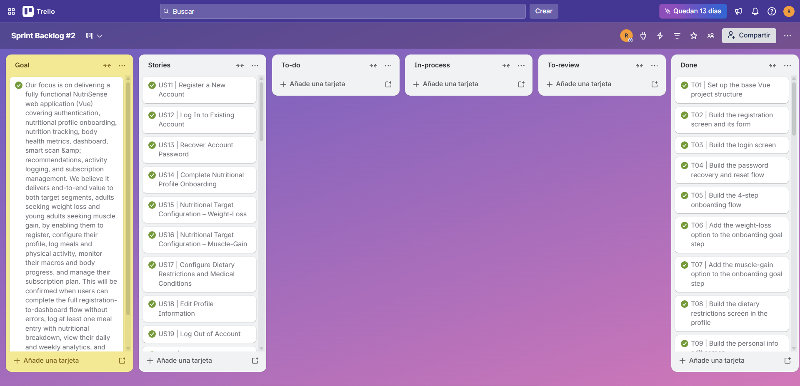
URL del Board (Trello): [Enlace Trello](https://trello.com/invite/b/6a04a5ef98fca4467d3647e3/ATTI236cd0cdc520db02f073921a3684a7ee7C775E8F/sprint-backlog-2)
 
| US ID | US Title | Task ID | Task Title | Description | Est. (h) | Assigned To | Status |
|-------|----------|---------|------------|-------------|----------|-------------|--------|
| US11 | Register a New Account | T01 | Define IAM domain entities | Define the User aggregate root, Email and Password value objects, and DietaryRestriction enumeration in the IAM bounded context. | 2 | Villarreal Bazan, Angel Martin | Done |
| US11 | Register a New Account | T02 | Set up the base Vue project structure | Bootstrap the project with Vite, set up Vue Router to separate public routes from protected ones, create the two main layouts (one for the app shell and one for auth screens), and plug in Pinia so the user's state is available across the whole app. | 4 | Villarreal Bazan, Angel Martin | Done |
| US11 | Register a New Account | T03 | Build the registration screen and its form | Create `register.view.vue` with name, email, password, and confirm-password fields. Fields should validate in real time as the user types, and on submit the form should hit the account-creation endpoint. | 3 | Villarreal Bazan, Angel Martin | Done |
| US11 | Register a New Account | T04 | Implement real-time form validations | Validate email format, minimum password length (8 chars), password-match check, and required-name rule. Show inline error messages as the user types. | 2 | Villarreal Bazan, Angel Martin | Done |
| US11 | Register a New Account | T05 | Integrate registration with IAM Pinia store | Wire the registration form submission to the IAM store's `register` action, store the returned JWT, and handle duplicate-email error responses. | 2 | Villarreal Bazan, Angel Martin | Done |
| US11 | Register a New Account | T06 | Functional verification of registration flow | Test the happy path (valid data → account created → redirect to onboarding) and the error paths (duplicate email, weak password, empty fields). | 1 | Villarreal Bazan, Angel Martin | Done |
| US12 | Log In to Existing Account | T07 | Define UserSession entity and auth token value object | Define the UserSession entity (userId, token, expiresAt) and an AuthToken value object that encapsulates the JWT string validation rule in the IAM domain. | 2 | Villarreal Bazan, Angel Martin | Done |
| US12 | Log In to Existing Account | T08 | Build the login screen | Create `login.view.vue` with email and password fields. Show a clear error message if the credentials are wrong. On success, redirect to the dashboard if the user already completed onboarding, or to the onboarding flow if it's their first time. | 3 | Villarreal Bazan, Angel Martin | Done |
| US12 | Log In to Existing Account | T09 | Implement login form validations | Validate that both email and password fields are filled and that the email matches a valid format before the form can be submitted. | 2 | Villarreal Bazan, Angel Martin | Done |
| US12 | Log In to Existing Account | T10 | Integrate login with IAM Pinia store | Wire the login form to the IAM store's `login` action, persist the auth token to local storage, and populate the current user state. | 2 | Villarreal Bazan, Angel Martin | Done |
| US12 | Log In to Existing Account | T11 | Implement Vue Router auth guard | Add a navigation guard that redirects unauthenticated users to login and routes authenticated first-time users to onboarding instead of the dashboard. | 2 | Villarreal Bazan, Angel Martin | Done |
| US12 | Log In to Existing Account | T12 | Functional verification of login flow | Test the happy path (valid credentials → dashboard), first-time user redirect (→ onboarding), and error path (wrong credentials → inline error). | 1 | Villarreal Bazan, Angel Martin | Done |
| US13 | Recover Account Password | T13 | Define password-reset domain entities | Define a PasswordResetToken value object (token string, expiry timestamp) and a RecoveryRequest entity in the IAM domain to model the reset flow. | 2 | Villarreal Bazan, Angel Martin | Done |
| US13 | Recover Account Password | T14 | Build the password recovery and reset flow | Create two screens: `recover-password.view.vue` where the user enters their email to receive a reset link, and `reset-password.view.vue` where they can type and confirm their new password. | 3 | Villarreal Bazan, Angel Martin | Done |
| US13 | Recover Account Password | T15 | Implement recovery form validations | Validate email format in the recovery screen and enforce minimum password length plus password-match rule in the reset screen. | 2 | Villarreal Bazan, Angel Martin | Done |
| US13 | Recover Account Password | T16 | Integrate recovery flow with IAM Pinia store | Wire both screens to IAM store actions: `requestPasswordReset` (sends email) and `confirmPasswordReset` (submits new password with token). | 2 | Villarreal Bazan, Angel Martin | Done |
| US13 | Recover Account Password | T17 | Connect to password-reset API mock | Configure the API mock to handle POST /auth/recover and POST /auth/reset-password, returning appropriate success and error responses. | 1 | Villarreal Bazan, Angel Martin | Done |
| US13 | Recover Account Password | T18 | Functional verification of the reset flow | Test the happy path (email sent → link clicked → new password set → login) and error paths (expired token, password mismatch). | 1 | Villarreal Bazan, Angel Martin | Done |
| US14 | Complete Nutritional Profile Onboarding | T19 | Define onboarding domain value objects | Define ActivityLevel, NutritionalGoalType, and DietaryPreference value objects in the IAM domain to model the data collected during onboarding. | 2 | Villarreal Bazan, Angel Martin | Done |
| US14 | Complete Nutritional Profile Onboarding | T20 | Build the 4-step onboarding flow | Create `onboarding.view.vue` as a chain of four screens: personal data, nutritional goal, dietary restrictions, and profile summary. Include a progress bar at the top and back/next buttons to move between steps. | 5 | Villarreal Bazan, Angel Martin | Done |
| US14 | Complete Nutritional Profile Onboarding | T21 | Implement per-step validations | Validate required fields in each step (name and DOB in step 1, goal selection in step 2, at least one option in step 3) before allowing the user to advance. | 2 | Villarreal Bazan, Angel Martin | Done |
| US14 | Complete Nutritional Profile Onboarding | T22 | Integrate onboarding with IAM Pinia store | Wire each step to the IAM store's `saveOnboardingProfile` action so partial progress is preserved if the user navigates back. | 2 | Villarreal Bazan, Angel Martin | Done |
| US14 | Complete Nutritional Profile Onboarding | T23 | Connect to profile creation API mock | Configure the API mock to accept POST /profile/onboarding and return the calculated macro targets and redirect hint. | 1 | Villarreal Bazan, Angel Martin | Done |
| US14 | Complete Nutritional Profile Onboarding | T24 | Functional verification of onboarding flow | Test all four steps end-to-end, back-navigation state persistence, and the completed-profile redirect to the dashboard. | 1 | Villarreal Bazan, Angel Martin | Done |
| US15 | Nutritional Target Configuration – Weight-Loss | T25 | Define WeightLossGoal value object and calorie-deficit service | Define a WeightLossGoal value object (target weight, weekly rate) and a CalorieDeficitCalculator domain service that computes the daily calorie budget. | 2 | Villarreal Bazan, Angel Martin | Done |
| US15 | Nutritional Target Configuration – Weight-Loss | T26 | Add the weight-loss option to the onboarding goal step | In the goal step of the onboarding, let the user pick "lose weight". Once selected, show how many calories they should eat per day and how much they could lose per week based on their profile. | 3 | Villarreal Bazan, Angel Martin | Done |
| US15 | Nutritional Target Configuration – Weight-Loss | T27 | Display calculated daily calorie target and weekly projection | Render the computed daily calorie budget and the projected weekly weight-loss value in the goal step summary panel. | 2 | Villarreal Bazan, Angel Martin | Done |
| US15 | Nutritional Target Configuration – Weight-Loss | T28 | Validate weight-loss goal inputs | Enforce that the target weight is below the current weight and that the selected weekly rate does not exceed a safe deficit (max 1 kg/week). | 2 | Villarreal Bazan, Angel Martin | Done |
| US15 | Nutritional Target Configuration – Weight-Loss | T29 | Integrate weight-loss config with Pinia store | Persist the selected goal type, daily calorie target, and macro split to the IAM store so they are available globally across the app. | 1 | Villarreal Bazan, Angel Martin | Done |
| US15 | Nutritional Target Configuration – Weight-Loss | T30 | Functional verification of weight-loss calorie calculations | Test calorie-budget calculation against known input sets (height, weight, activity level) and verify the projection is capped at the maximum safe rate. | 1 | Villarreal Bazan, Angel Martin | Done |
| US16 | Nutritional Target Configuration – Muscle-Gain | T31 | Define MuscleGainGoal value object and caloric-surplus service | Define a MuscleGainGoal value object (lean-mass target, surplus percentage) and a CaloricSurplusCalculator domain service that computes the daily calorie budget and macro split. | 2 | Villarreal Bazan, Angel Martin | Done |
| US16 | Nutritional Target Configuration – Muscle-Gain | T32 | Add the muscle-gain option to the onboarding goal step | In the goal step of the onboarding, let the user pick "gain muscle". Once selected, show the recommended caloric surplus and how their macros (protein, carbs, fats) should be split. | 3 | Villarreal Bazan, Angel Martin | Done |
| US16 | Nutritional Target Configuration – Muscle-Gain | T33 | Display recommended caloric surplus and macro split | Render the computed caloric surplus (e.g., +300 kcal/day) and the protein/carbs/fat gram targets in the goal step summary panel. | 2 | Villarreal Bazan, Angel Martin | Done |
| US16 | Nutritional Target Configuration – Muscle-Gain | T34 | Validate muscle-gain goal inputs | Enforce that the protein ratio does not fall below 1.6 g/kg and that the selected surplus is within a physiologically reasonable range (150–500 kcal/day). | 2 | Villarreal Bazan, Angel Martin | Done |
| US16 | Nutritional Target Configuration – Muscle-Gain | T35 | Integrate muscle-gain config with Pinia store | Persist the goal type, daily calorie surplus, and macro gram targets to the IAM store. | 1 | Villarreal Bazan, Angel Martin | Done |
| US16 | Nutritional Target Configuration – Muscle-Gain | T36 | Functional verification of muscle-gain macro calculations | Test macro-split calculations against known inputs and verify the surplus is clamped within the allowed range. | 1 | Villarreal Bazan, Angel Martin | Done |
| US17 | Configure Dietary Restrictions and Medical Conditions | T37 | Define DietaryRestriction and UserCondition value objects | Define a DietaryRestriction enum (vegan, gluten-free, lactose-free, nut-free) and a UserCondition enum (diabetic, hypertensive, celiac) in the IAM domain. | 2 | Villarreal Bazan, Angel Martin | Done |
| US17 | Configure Dietary Restrictions and Medical Conditions | T38 | Build the dietary restrictions screen in the profile | Create `profile-dietary.view.vue` with a checklist of diet options and conditions the user can mark (vegan, gluten-free, lactose-free, diabetic, etc.). Saving these preferences ties them to the account and influences future recommendations. | 3 | Villarreal Bazan, Angel Martin | Done |
| US17 | Configure Dietary Restrictions and Medical Conditions | T39 | Validate restriction selection | Ensure the user makes an explicit choice (either one or more restrictions, or "none of the above") before saving, to avoid silent empty-array submissions. | 2 | Villarreal Bazan, Angel Martin | Done |
| US17 | Configure Dietary Restrictions and Medical Conditions | T40 | Integrate dietary preferences with IAM Pinia store | Wire the checklist save button to the IAM store's `updateDietaryProfile` action and optimistically update the UI on success. | 2 | Villarreal Bazan, Angel Martin | Done |
| US17 | Configure Dietary Restrictions and Medical Conditions | T41 | Connect to dietary profile API mock | Configure the API mock to handle PATCH /profile/dietary, returning the updated restriction list. | 1 | Villarreal Bazan, Angel Martin | Done |
| US17 | Configure Dietary Restrictions and Medical Conditions | T42 | Functional verification of dietary preferences | Verify that saved restrictions load correctly on re-entry and that the values are reflected in the Smart Scan and Recommendations bounded contexts. | 1 | Villarreal Bazan, Angel Martin | Done |
| US18 | Edit Profile Information | T43 | Define editable profile value objects | Define Name, Email, DateOfBirth, BiologicalSex, and Height value objects with their respective validation rules in the IAM domain. | 2 | Villarreal Bazan, Angel Martin | Done |
| US18 | Edit Profile Information | T44 | Build the personal info edit screen | Create `profile-personal-info.view.vue` where the user can update their name, email, date of birth, sex, and height. Fields should validate and show a confirmation message after saving. | 3 | Villarreal Bazan, Angel Martin | Done |
| US18 | Edit Profile Information | T45 | Implement field-level validations | Validate name (non-empty), email format, DOB (valid date in the past, age ≥ 13), and height range (50–250 cm). | 2 | Villarreal Bazan, Angel Martin | Done |
| US18 | Edit Profile Information | T46 | Integrate profile edit with IAM Pinia store | Wire the save button to the IAM store's `updatePersonalInfo` action and show a success toast on completion. | 2 | Villarreal Bazan, Angel Martin | Done |
| US18 | Edit Profile Information | T47 | Connect to profile edit API mock and trigger recalculations | Configure the API mock for PATCH /profile/personal. Ensure that saving a new height triggers BMI and TDEE recalculation in the Body Health Metrics store. | 1 | Villarreal Bazan, Angel Martin | Done |
| US18 | Edit Profile Information | T48 | Functional verification of profile edit flow | Test save, inline error display, success confirmation, and downstream recalculation of BMI when height changes. | 1 | Villarreal Bazan, Angel Martin | Done |
| US19 | Log Out of Account | T49 | Define session-clearing requirements in IAM domain | Identify all state that must be cleared on logout: JWT token in local storage, Pinia user state, and any cached API responses. Document the `clearSession` contract. | 1 | Villarreal Bazan, Angel Martin | Done |
| US19 | Log Out of Account | T50 | Add the sign-out button to the main app layout | Place a "Sign out" button inside `app-layout.component.vue`. Clicking it should clear the stored token and Pinia state, then send the user back to the login screen. | 1 | Villarreal Bazan, Angel Martin | Done |
| US19 | Log Out of Account | T51 | Implement clearSession action in IAM Pinia store | Add a `clearSession` action that removes the JWT from local storage, resets the user state to null, and clears any cross-store cached data. | 2 | Villarreal Bazan, Angel Martin | Done |
| US19 | Log Out of Account | T52 | Protect routes from post-logout back-navigation | Update the Vue Router auth guard so that after logout, pressing the browser back button does not allow the user to return to authenticated screens. | 2 | Villarreal Bazan, Angel Martin | Done |
| US19 | Log Out of Account | T53 | Connect logout to API mock (token revocation) | Configure the API mock to handle POST /auth/logout and confirm token revocation. | 1 | Villarreal Bazan, Angel Martin | Done |
| US19 | Log Out of Account | T54 | Functional verification of logout and session cleanup | Verify that after logout all protected routes redirect to login, local storage is cleared, and back-navigation is blocked. | 1 | Villarreal Bazan, Angel Martin | Done |
| US20 | Manage Active Subscription Plan | T55 | Define PlanTier and BillingCycle value objects | Define PlanTier (Basic, Pro, Premium) and BillingCycle (monthly, annual) value objects in the IAM domain, including feature-set mapping per tier. | 2 | Villarreal Bazan, Angel Martin | Done |
| US20 | Manage Active Subscription Plan | T56 | Build the active plan section in the profile | Create `profile-billing.view.vue` showing the user's current plan, the next renewal date, and a button that takes them to `subscription.view.vue` to make changes. | 2 | Villarreal Bazan, Angel Martin | Done |
| US20 | Manage Active Subscription Plan | T57 | Display renewal warning and plan feature list | Show a yellow warning banner when the renewal date is within 7 days, and list the features included in the active plan. | 2 | Villarreal Bazan, Angel Martin | Done |
| US20 | Manage Active Subscription Plan | T58 | Integrate billing info with IAM Pinia store | Wire `profile-billing.view.vue` to the IAM store's `fetchActivePlan` action on mount. | 2 | Villarreal Bazan, Angel Martin | Done |
| US20 | Manage Active Subscription Plan | T59 | Connect to billing API mock | Configure the API mock to return active plan data from GET /billing/active-plan. | 1 | Villarreal Bazan, Angel Martin | Done |
| US20 | Manage Active Subscription Plan | T60 | Functional verification of active plan display | Verify that plan name, renewal date, and renewal warning display correctly and that navigation to the subscription screen works. | 1 | Villarreal Bazan, Angel Martin | Done |
| US27 | Search Food Items by Name | T61 | Define Food entity and FoodSource value object | Define the Food aggregate (id, name, macros per serving, source) and a FoodSource value object (database, user-defined, scanned) in the Nutrition Tracking domain. | 2 | Mora Rivera, Joel Fernando | Done |
| US27 | Search Food Items by Name | T62 | Build the food search component with autocomplete | Create `nutrition-log-form.component.vue` with a search field that suggests matching foods as the user types, pulling from the food API. When the user picks one, display its nutritional info per serving (calories, protein, carbs, fat). | 4 | Mora Rivera, Joel Fernando | Done |
| US27 | Search Food Items by Name | T63 | Implement debounced search and serving info display | Debounce the search input (300 ms), show a loading spinner while fetching, and render the selected food's macros per serving below the search field. | 2 | Mora Rivera, Joel Fernando | Done |
| US27 | Search Food Items by Name | T64 | Validate food selection before form submit | Prevent form submission if no food has been selected from the autocomplete results and show an inline error message. | 2 | Mora Rivera, Joel Fernando | Done |
| US27 | Search Food Items by Name | T65 | Integrate food search with Nutrition Tracking Pinia store | Wire the autocomplete to the store's `searchFoods` action and cache the last 20 results to avoid redundant API calls. | 1 | Mora Rivera, Joel Fernando | Done |
| US27 | Search Food Items by Name | T66 | Functional verification of food search accuracy | Test that search returns relevant results for common food names, that macro info is correct, and that selecting an item populates the form fields. | 1 | Mora Rivera, Joel Fernando | Done |
| US28 | Log a Meal Entry by Meal Type | T67 | Define NutritionLog entity and MealType value object | Define the NutritionLog aggregate (id, userId, foodId, mealType, servings, date) and MealType value object (breakfast, lunch, dinner, snack) in the Nutrition Tracking domain. | 2 | Mora Rivera, Joel Fernando | Done |
| US28 | Log a Meal Entry by Meal Type | T68 | Build the meal logging screen | Create `nutrition-log.view.vue` with a selector to choose the meal type (breakfast, lunch, dinner, or snack), plug in the food search component, and let the user confirm and save the entry. | 4 | Mora Rivera, Joel Fernando | Done |
| US28 | Log a Meal Entry by Meal Type | T69 | Implement meal entry validations | Require a meal type selection and validate that serving quantity is a positive number before allowing submission. | 2 | Mora Rivera, Joel Fernando | Done |
| US28 | Log a Meal Entry by Meal Type | T70 | Integrate meal logging with Nutrition Tracking Pinia store | Wire the save button to the store's `addNutritionLog` action and refresh the daily log list on success. | 2 | Mora Rivera, Joel Fernando | Done |
| US28 | Log a Meal Entry by Meal Type | T71 | Connect to nutrition API mock | Configure the API mock to handle POST /nutrition-logs and return the created entry with its computed macro totals. | 1 | Mora Rivera, Joel Fernando | Done |
| US28 | Log a Meal Entry by Meal Type | T72 | Functional verification of meal entry creation | Test the happy path (meal type + food selected → entry saved → list refreshed) and validation errors (no food selected, zero servings). | 1 | Mora Rivera, Joel Fernando | Done |
| US31 | View Nutritional Detail of a Logged Meal | T73 | Define NutritionLogDetail view model | Define a NutritionLogDetail view model that extends NutritionLog with pre-computed per-macro grams and percentage-of-daily-target fields. | 2 | Mora Rivera, Joel Fernando | Done |
| US31 | View Nutritional Detail of a Logged Meal | T74 | Build the daily meal list with expandable detail | Create `nutrition-log-list.component.vue` that lists all entries logged for the day. Tapping an entry should expand it to reveal the full nutrient breakdown for that meal. | 3 | Mora Rivera, Joel Fernando | Done |
| US31 | View Nutritional Detail of a Logged Meal | T75 | Implement expand/collapse animation and detail layout | Add a smooth expand/collapse transition and render the calorie, protein, carbs, and fat breakdown for each expanded entry. | 2 | Mora Rivera, Joel Fernando | Done |
| US31 | View Nutritional Detail of a Logged Meal | T76 | Validate empty and error states | Show an informative empty-state message when no meals have been logged for the day and handle fetch errors gracefully. | 2 | Mora Rivera, Joel Fernando | Done |
| US31 | View Nutritional Detail of a Logged Meal | T77 | Integrate list with Nutrition Tracking Pinia store | Wire the component to the store's `fetchDailyLogs` action on mount and update the list reactively when a new entry is added. | 1 | Mora Rivera, Joel Fernando | Done |
| US31 | View Nutritional Detail of a Logged Meal | T78 | Functional verification of meal detail display | Verify that expanding an entry shows accurate macro data, that the empty state appears when no logs exist, and that the list updates after adding a new entry. | 1 | Mora Rivera, Joel Fernando | Done |
| US37 | Scan a Food Plate Photo | T79 | Define SmartScan domain entities | Define a ScanResult entity (detectedFoods list, confidenceScores, scanId) and a ScanSource value object (PHOTO_UPLOAD, CAMERA) in the Nutrition Tracking domain. | 2 | Mora Rivera, Joel Fernando | Done |
| US37 | Scan a Food Plate Photo | T80 | Add the Smart Scan modal for plate scanning | Inside `nutrition-log.view.vue`, integrate a modal where the user can upload or take a photo of their plate. The image is sent to the analysis service and the detected foods are automatically pre-filled into the log form. | 5 | Mora Rivera, Joel Fernando | Done |
| US37 | Scan a Food Plate Photo | T81 | Validate image before upload | Enforce JPEG/PNG format and a 10 MB maximum file size, showing a clear error message if either constraint is violated. | 2 | Mora Rivera, Joel Fernando | Done |
| US37 | Scan a Food Plate Photo | T82 | Integrate scan result with Nutrition Tracking store | Wire the modal to the store's `analyzePlatePhoto` action, map the detected food IDs to full Food entities, and pre-populate the log form fields. | 2 | Mora Rivera, Joel Fernando | Done |
| US37 | Scan a Food Plate Photo | T83 | Connect to Smart Scan API mock | Configure the API mock to handle POST /smart-scan/dish and return a mocked ScanResult with at least three detected food items. | 1 | Mora Rivera, Joel Fernando | Done |
| US37 | Scan a Food Plate Photo | T84 | Functional verification of photo upload and form pre-fill | Verify that uploading a valid image triggers the scan, that detected foods are pre-filled in the log form, and that invalid files show appropriate errors. | 1 | Mora Rivera, Joel Fernando | Done |
| US38 | Menu Recommendations for Weight-Loss Segment | T85 | Define WeightLossMenuSuggestion entity | Define a WeightLossMenuSuggestion entity (suggestedFood, replacedFood, calorieSaving) and a CalorieSwapService that generates low-calorie swap options in the Nutrition Tracking domain. | 2 | Mora Rivera, Joel Fernando | Done |
| US38 | Menu Recommendations for Weight-Loss Segment | T86 | Add weight-loss menu suggestions to the Smart Scan flow | Within the Smart Scan flow, show calorie-reduction menu suggestions for users whose goal is to lose weight. Include lower-calorie swaps for more caloric ingredients. | 3 | Mora Rivera, Joel Fernando | Done |
| US38 | Menu Recommendations for Weight-Loss Segment | T87 | Filter suggestions by user calorie budget | Show only swap suggestions where the alternative food keeps the meal under the user's daily calorie target. | 2 | Mora Rivera, Joel Fernando | Done |
| US38 | Menu Recommendations for Weight-Loss Segment | T88 | Validate that suggestions appear only for weight-loss users | Add a guard in the Smart Scan flow that skips the suggestions section entirely if the user's configured goal is not weight-loss. | 2 | Mora Rivera, Joel Fernando | Done |
| US38 | Menu Recommendations for Weight-Loss Segment | T89 | Integrate suggestions with Nutrition Tracking store | Wire the suggestion cards to the store's `fetchWeightLossSuggestions` action called after scan results are received. | 1 | Mora Rivera, Joel Fernando | Done |
| US38 | Menu Recommendations for Weight-Loss Segment | T90 | Functional verification of weight-loss suggestions | Test that swaps are relevant, calorie savings are accurate, and that the section does not appear for muscle-gain users. | 1 | Mora Rivera, Joel Fernando | Done |
| US39 | Menu Recommendations for Muscle-Gain Segment | T91 | Define MuscleGainMenuSuggestion entity | Define a MuscleGainMenuSuggestion entity (suggestedFood, proteinBoost, calorieIncrease) and a ProteinBoostService in the Nutrition Tracking domain. | 2 | Mora Rivera, Joel Fernando | Done |
| US39 | Menu Recommendations for Muscle-Gain Segment | T92 | Add muscle-gain menu suggestions to the Smart Scan flow | Within the Smart Scan flow, show high-protein, high-calorie menu suggestions for users who want to build muscle. Include nutritional complement options. | 3 | Mora Rivera, Joel Fernando | Done |
| US39 | Menu Recommendations for Muscle-Gain Segment | T93 | Display protein boost and calorie increase per suggestion | For each suggestion card, show the protein gram increase and total calorie uplift compared to the original detected food. | 2 | Mora Rivera, Joel Fernando | Done |
| US39 | Menu Recommendations for Muscle-Gain Segment | T94 | Validate that suggestions appear only for muscle-gain users | Add a guard that skips the muscle-gain suggestions section if the user's configured goal is not muscle-gain. | 2 | Mora Rivera, Joel Fernando | Done |
| US39 | Menu Recommendations for Muscle-Gain Segment | T95 | Integrate suggestions with Nutrition Tracking store | Wire the suggestion cards to the store's `fetchMuscleGainSuggestions` action called after scan results are received. | 1 | Mora Rivera, Joel Fernando | Done |
| US39 | Menu Recommendations for Muscle-Gain Segment | T96 | Functional verification of muscle-gain suggestions | Test that suggestions are high-protein, that protein-boost values are accurate, and that the section does not appear for weight-loss users. | 1 | Mora Rivera, Joel Fernando | Done |
| US40 | Enforcement of Dietary Restrictions in Smart Scan | T97 | Define FoodRestrictionCheck domain service | Define a FoodRestrictionCheck domain service that cross-references a detected food's allergen list against the user's DietaryRestriction profile and returns a list of violations. | 2 | Mora Rivera, Joel Fernando | Done |
| US40 | Enforcement of Dietary Restrictions in Smart Scan | T98 | Filter incompatible foods by dietary restrictions in Smart Scan | Make the Smart Scan analysis aware of the user's dietary profile. If it detects a food the user can't eat (e.g., gluten for someone with celiac disease), flag it clearly as incompatible. | 3 | Mora Rivera, Joel Fernando | Done |
| US40 | Enforcement of Dietary Restrictions in Smart Scan | T99 | Implement incompatibility warning UI | Display a warning icon and tooltip on each detected food card that violates a user restriction, explaining which restriction is violated. | 2 | Mora Rivera, Joel Fernando | Done |
| US40 | Enforcement of Dietary Restrictions in Smart Scan | T100 | Validate restriction check across all supported types | Test the FoodRestrictionCheck service against each supported restriction type (vegan, gluten-free, lactose-free, nut-free) to ensure no type is silently skipped. | 2 | Mora Rivera, Joel Fernando | Done |
| US40 | Enforcement of Dietary Restrictions in Smart Scan | T101 | Integrate restriction check with Nutrition Tracking store | Wire the scan result processing in the store to call the FoodRestrictionCheck service and attach violation flags before rendering the result. | 1 | Mora Rivera, Joel Fernando | Done |
| US40 | Enforcement of Dietary Restrictions in Smart Scan | T102 | Functional verification of restriction flagging | Verify restriction flags appear for the correct foods and that no flags appear when the user has no restrictions configured. | 1 | Mora Rivera, Joel Fernando | Done |
| US45 | Log Physical Activity Manually | T103 | Define ActivityLog entity and domain value objects | Define the ActivityLog aggregate (id, userId, activityType, durationMinutes, intensityLevel, caloriesBurned, date) and ActivityType and IntensityLevel value objects in the Activity & Wearable domain. | 2 | Mora Rivera, Joel Fernando | Done |
| US45 | Log Physical Activity Manually | T104 | Build the manual activity logging screen | Create `activity.view.vue` with a history of logged activities and `activity-log-form.component.vue` with a form to enter the activity type, duration, intensity, and estimated calories burned. | 4 | Mora Rivera, Joel Fernando | Done |
| US45 | Log Physical Activity Manually | T105 | Implement activity form validations | Require activity type and intensity selections and validate that duration is a positive integer before allowing submission. | 2 | Mora Rivera, Joel Fernando | Done |
| US45 | Log Physical Activity Manually | T106 | Calculate estimated calories burned | Implement calorie estimation using MET values: caloriesBurned = MET × weight(kg) × durationHours. Update the estimate reactively as duration or intensity changes. | 2 | Mora Rivera, Joel Fernando | Done |
| US45 | Log Physical Activity Manually | T107 | Integrate activity logging with Activity Pinia store | Wire the form submission to the store's `addActivityLog` action and refresh the activity history list on success. | 1 | Mora Rivera, Joel Fernando | Done |
| US45 | Log Physical Activity Manually | T108 | Functional verification of manual activity logging | Test the happy path, calorie calculation accuracy, and validation errors (missing activity type, zero duration). | 1 | Mora Rivera, Joel Fernando | Done |
| US44 | Connect Google Fit Account | T109 | Define WearableConnection entity and value objects | Define the WearableConnection entity (id, userId, provider, status, connectedAt) and WearableProvider (GOOGLE_FIT) and WearableStatus (CONNECTED, DISCONNECTED, ERROR) value objects. | 2 | Mora Rivera, Joel Fernando | In-Process |
| US44 | Connect Google Fit Account | T110 | Scaffold the Google Fit integration | Define the data models needed and set up the skeleton connection to Google Fit, including the OAuth flow so the user can link their account. The connection screen should be in place even though full sync is still pending. | 3 | Mora Rivera, Joel Fernando | In-Process |
| US44 | Connect Google Fit Account | T111 | Implement OAuth redirect and token exchange | Build the OAuth initiation (redirect to Google consent screen) and callback handler (exchange authorization code for token, store connection state). | 3 | Mora Rivera, Joel Fernando | In-Process |
| US44 | Connect Google Fit Account | T112 | Handle OAuth failure and timeout gracefully | Show a clear error message if the user denies the OAuth consent or if the token exchange times out, and allow them to retry. | 2 | Mora Rivera, Joel Fernando | In-Process |
| US44 | Connect Google Fit Account | T113 | Integrate connection state with Activity Pinia store | Wire the connection screen to the store's `connectWearable` and `fetchWearableStatus` actions and display current connection status reactively. | 1 | Mora Rivera, Joel Fernando | In-Process |
| US44 | Connect Google Fit Account | T114 | Functional verification of OAuth initiation and status update | Verify that clicking "Connect Google Fit" initiates the OAuth flow and that the connection status badge updates to CONNECTED after success. | 1 | Mora Rivera, Joel Fernando | In-Process |
| US21 | Log Current Weight | T115 | Define WeightLog entity and WeightUnit value object | Define the WeightLog entity (id, userId, weightValue, unit, measuredAt) and a WeightUnit value object (KG, LB) with unit-conversion logic in the Body Health Metrics domain. | 2 | Espinoza Cruz, Angela Milagros | Done |
| US21 | Log Current Weight | T116 | Build the weight logging form in body progress | Inside `body-progress.view.vue`, create the form where the user enters their current weight, picks the unit (kg or lb), and selects the date of the measurement. | 3 | Espinoza Cruz, Angela Milagros | Done |
| US21 | Log Current Weight | T117 | Implement weight entry validations | Validate that weight is a positive number within physiological bounds (20–500 kg / 44–1100 lb) and that a unit and date are selected. | 2 | Espinoza Cruz, Angela Milagros | Done |
| US21 | Log Current Weight | T118 | Integrate weight logging with Body Health Metrics Pinia store | Wire the save button to the store's `addWeightLog` action and trigger BMI and TDEE recalculation after a new entry is saved. | 2 | Espinoza Cruz, Angela Milagros | Done |
| US21 | Log Current Weight | T119 | Connect to body metrics API mock | Configure the API mock to handle POST /weight-logs and return the saved entry with its server-assigned timestamp. | 1 | Espinoza Cruz, Angela Milagros | Done |
| US21 | Log Current Weight | T120 | Functional verification of weight entry and unit conversion | Verify that values entered in lb are stored correctly in kg, that BMI updates after saving, and that out-of-range values are rejected. | 1 | Espinoza Cruz, Angela Milagros | Done |
| US22 | View BMI, BMR, and TDEE Calculations | T121 | Define BodyMetrics domain service with calculation formulas | Define a BodyMetricsCalculator domain service that implements BMI (weight/height²), BMR (Mifflin-St Jeor formula), and TDEE (BMR × activity multiplier). | 2 | Espinoza Cruz, Angela Milagros | Done |
| US22 | View BMI, BMR, and TDEE Calculations | T122 | Display automatically calculated BMI, BMR, and TDEE | In `body-progress.view.vue`, add a section showing the user's body mass index, basal metabolic rate, and total daily energy expenditure. These values should update on their own whenever a new weight or height is saved. | 3 | Espinoza Cruz, Angela Milagros | Done |
| US22 | View BMI, BMR, and TDEE Calculations | T123 | Implement reactive auto-recalculation on data change | Use Pinia store watchers to automatically recompute and display BMI, BMR, and TDEE whenever the user's weight, height, or activity level changes. | 2 | Espinoza Cruz, Angela Milagros | Done |
| US22 | View BMI, BMR, and TDEE Calculations | T124 | Validate incomplete data state | Show a placeholder with a prompt to complete their profile when height or weight is missing, instead of displaying NaN or zero. | 2 | Espinoza Cruz, Angela Milagros | Done |
| US22 | View BMI, BMR, and TDEE Calculations | T125 | Integrate metrics display with Body Health Metrics Pinia store | Wire the metrics section to the store's computed properties `bmi`, `bmr`, and `tdee` so they update reactively. | 1 | Espinoza Cruz, Angela Milagros | Done |
| US22 | View BMI, BMR, and TDEE Calculations | T126 | Functional verification of BMI, BMR, and TDEE values | Test calculated values against known reference inputs (e.g., 70 kg, 175 cm, moderately active male) and verify the display updates after adding a new weight entry. | 1 | Espinoza Cruz, Angela Milagros | Done |
| US23 | View Weight Evolution and Goal Progress | T127 | Define weight history data model and goal-progress calculation | Define a WeightHistory view model (sorted list of WeightLog entries) and a GoalProgressCalculator service that returns percentage-to-goal based on start and target weights. | 2 | Espinoza Cruz, Angela Milagros | Done |
| US23 | View Weight Evolution and Goal Progress | T128 | Build the weight evolution chart | Create `weight-chart.component.vue` with a line chart showing how the user's weight has changed over time. Add a reference line indicating how far they are from their target weight. | 3 | Espinoza Cruz, Angela Milagros | Done |
| US23 | View Weight Evolution and Goal Progress | T129 | Implement date range filter on the chart | Add a segmented control (Last 30 days / Last 90 days / All time) that filters the chart data range without fetching new data from the API. | 2 | Espinoza Cruz, Angela Milagros | Done |
| US23 | View Weight Evolution and Goal Progress | T130 | Validate sparse data edge cases | Ensure the chart renders correctly with a single data point (no line drawn, just a dot) and shows an empty-state prompt when no weight logs exist. | 2 | Espinoza Cruz, Angela Milagros | Done |
| US23 | View Weight Evolution and Goal Progress | T131 | Integrate chart data with Body Health Metrics Pinia store | Wire the chart to the store's `fetchWeightHistory` action on mount and redraw whenever a new entry is added. | 1 | Espinoza Cruz, Angela Milagros | Done |
| US23 | View Weight Evolution and Goal Progress | T132 | Functional verification of chart and goal progress indicator | Verify the chart line, goal reference line, and progress percentage for a known set of weight log entries. | 1 | Espinoza Cruz, Angela Milagros | Done |
| US24 | Set Target Weight | T133 | Define UserGoal entity with target-weight validation rules | Define the UserGoal entity in the Body Health Metrics domain, enforcing that target weight yields a BMI within the range 18.5–29.9 relative to the user's height. | 2 | Espinoza Cruz, Angela Milagros | Done |
| US24 | Set Target Weight | T134 | Add the target weight field | In `body-progress.view.vue`, let the user enter their goal weight. Validate that the value falls within a healthy range and show a progress indicator with the percentage of the goal already achieved. | 2 | Espinoza Cruz, Angela Milagros | Done |
| US24 | Set Target Weight | T135 | Implement target weight validations | Reject values outside the healthy BMI range (18.5–29.9) and show a descriptive error explaining the allowed weight range in kg for the user's height. | 2 | Espinoza Cruz, Angela Milagros | Done |
| US24 | Set Target Weight | T136 | Display goal progress indicator | Render a percentage progress bar showing how close the user's current weight is to their target, updating reactively when a new weight log is added. | 2 | Espinoza Cruz, Angela Milagros | Done |
| US24 | Set Target Weight | T137 | Integrate target weight with Body Health Metrics Pinia store | Wire the save button to the store's `setGoalWeight` action and ensure the goal is persisted across sessions. | 1 | Espinoza Cruz, Angela Milagros | Done |
| US24 | Set Target Weight | T138 | Functional verification of target weight save and progress | Test that valid targets are saved, out-of-range values are rejected, and the progress bar reflects the correct percentage. | 1 | Espinoza Cruz, Angela Milagros | Done |
| US25 | Body Fat and Lean Mass Monitoring | T139 | Define BodyMeasurement entity with composition fields | Define the BodyMeasurement entity (id, userId, bodyFatPercentage, leanMassKg, measuredAt) and a LeanMassCalculator domain service (leanMass = weight × (1 − bodyFatPercentage)). | 2 | Espinoza Cruz, Angela Milagros | Done |
| US25 | Body Fat and Lean Mass Monitoring | T140 | Add body fat input and lean mass display | In `body-progress.view.vue`, add a body fat percentage input field and a read-only lean mass display that updates automatically. | 3 | Espinoza Cruz, Angela Milagros | Done |
| US25 | Body Fat and Lean Mass Monitoring | T141 | Implement body fat percentage validations | Validate that body fat percentage is between 3% (essential fat minimum) and 60% (obesity upper bound) and that the field is filled before saving. | 2 | Espinoza Cruz, Angela Milagros | Done |
| US25 | Body Fat and Lean Mass Monitoring | T142 | Integrate body composition data with Body Health Metrics Pinia store | Wire the save button to the store's `addBodyMeasurement` action and refresh the composition history chart on success. | 2 | Espinoza Cruz, Angela Milagros | Done |
| US25 | Body Fat and Lean Mass Monitoring | T143 | Connect to body measurements API mock | Configure the API mock to handle POST /body-measurements and return the saved entry with the computed lean mass value. | 1 | Espinoza Cruz, Angela Milagros | Done |
| US25 | Body Fat and Lean Mass Monitoring | T144 | Functional verification of body fat entry and lean mass calculation | Verify that the lean mass value is correct for known inputs, that out-of-range percentages are rejected, and that the history chart updates. | 1 | Espinoza Cruz, Angela Milagros | Done |
| US26 | Log Height Update | T145 | Define Height value object with unit conversion | Define a Height value object in the IAM domain that stores height in centimeters internally and provides cm ↔ inches conversion methods. | 2 | Espinoza Cruz, Angela Milagros | Done |
| US26 | Log Height Update | T146 | Add the height field in the personal profile | In `profile-personal-info.view.vue`, include a height field so the user can update their measurement. When saved, automatically recalculate their BMI and TDEE with the new value. | 2 | Espinoza Cruz, Angela Milagros | Done |
| US26 | Log Height Update | T147 | Implement height input validations | Validate that height is a positive number within a physiological range (100–250 cm / 39–98 in) and that a unit is selected. | 2 | Espinoza Cruz, Angela Milagros | Done |
| US26 | Log Height Update | T148 | Trigger BMI and TDEE recalculation after height save | After a successful height update, dispatch the Body Health Metrics store's `recalculateMetrics` action to recompute BMI and TDEE with the new height value. | 2 | Espinoza Cruz, Angela Milagros | Done |
| US26 | Log Height Update | T149 | Integrate height update with IAM and Body Health Metrics stores | Wire the height field to the IAM store's `updatePersonalInfo` action and chain a call to the Body Health Metrics store's `recalculateMetrics` action on success. | 1 | Espinoza Cruz, Angela Milagros | Done |
| US26 | Log Height Update | T150 | Functional verification of height save and downstream recalculation | Verify that saving a new height triggers correct BMI and TDEE recalculation and that out-of-range heights are rejected. | 1 | Espinoza Cruz, Angela Milagros | Done |
| US46 | View Daily Nutritional Overview in Dashboard | T151 | Define DailyNutritionSummary view model | Define a DailyNutritionSummary view model that aggregates total calories consumed, per-macro grams, caloric deficit, and current log streak from the Analytics store. | 2 | Villarreal Bazan, Angel Martin | Done |
| US46 | View Daily Nutritional Overview in Dashboard | T152 | Build the main dashboard screen | Create `dashboard.view.vue` as the app's home screen. Show cards for daily calories, macro progress, and caloric deficit, the log streak banner, and quick-access shortcuts to log a meal or an activity. | 5 | Villarreal Bazan, Angel Martin | Done |
| US46 | View Daily Nutritional Overview in Dashboard | T153 | Implement log streak banner and milestone animation | Display the consecutive log streak count and trigger a confetti or badge animation when the user hits a 7-day or 30-day milestone. | 2 | Villarreal Bazan, Angel Martin | Done |
| US46 | View Daily Nutritional Overview in Dashboard | T154 | Validate empty and first-login state | Show zero-state cards with a prompt to log a meal when no data exists for the current day. | 2 | Villarreal Bazan, Angel Martin | Done |
| US46 | View Daily Nutritional Overview in Dashboard | T155 | Integrate dashboard with Analytics Pinia store | Wire all dashboard cards to the Analytics store's `fetchDailySummary` action on mount and refresh them when the store state changes. | 1 | Villarreal Bazan, Angel Martin | Done |
| US46 | View Daily Nutritional Overview in Dashboard | T156 | Functional verification of all dashboard cards | Verify that calorie, macro, deficit, and streak cards all display correct values against a known set of logged meals. | 1 | Villarreal Bazan, Angel Martin | Done |
| US47 | View Consecutive Log Streak | T157 | Define StreakRecord entity and StreakCalculator domain service | Define the StreakRecord entity (currentStreak, longestStreak, lastLogDate) and a StreakCalculator service that increments the streak for consecutive daily logs and resets it on a missed day. | 2 | Villarreal Bazan, Angel Martin | Done |
| US47 | View Consecutive Log Streak | T158 | Implement the consecutive log streak banner | In `dashboard.view.vue`, display how many days in a row the user has logged their meals. Add a small animation or celebration when they hit a milestone (e.g., 7 days, 30 days). | 2 | Villarreal Bazan, Angel Martin | Done |
| US47 | View Consecutive Log Streak | T159 | Add milestone celebration animation | Trigger a confetti or badge reveal animation when the streak reaches 7-day, 30-day, and 100-day milestones using a lightweight CSS animation. | 2 | Villarreal Bazan, Angel Martin | Done |
| US47 | View Consecutive Log Streak | T160 | Validate streak reset logic | Test that the streak resets to 1 on the day after a missed day and that logging two meals in the same day does not double-count the streak. | 2 | Villarreal Bazan, Angel Martin | Done |
| US47 | View Consecutive Log Streak | T161 | Integrate streak display with Analytics Pinia store | Wire the streak banner to the store's `fetchCurrentStreak` action on dashboard mount and update it reactively when a new meal is logged. | 1 | Villarreal Bazan, Angel Martin | Done |
| US47 | View Consecutive Log Streak | T162 | Functional verification of streak increment and milestone trigger | Test streak increment across three consecutive days of logging, the reset scenario, and that the milestone animation fires at exactly 7 days. | 1 | Villarreal Bazan, Angel Martin | Done |
| US48 | Export Progress Report as PDF | T163 | Define ProgressReport view model | Define a ProgressReport view model that composes body metrics snapshots, weekly nutrition averages, and physical activity totals for a user-selected date range. | 2 | Villarreal Bazan, Angel Martin | In-Process |
| US48 | Export Progress Report as PDF | T164 | Register the export route and scaffold PDF generation | Register the export route in the Vue router and wire up the PDF generation logic. The report should summarize the chosen period: body metrics, weekly nutrition, and physical activity. The download button should be visible from the dashboard. | 4 | Villarreal Bazan, Angel Martin | In-Process |
| US48 | Export Progress Report as PDF | T165 | Build the report layout component with period selector | Create a report-preview component with a date range picker and content sections for body metrics, nutrition, and activity. | 3 | Villarreal Bazan, Angel Martin | In-Process |
| US48 | Export Progress Report as PDF | T166 | Validate that PDF is not generated for empty periods | Show an informative message and disable the download button if no data exists for the selected date range. | 2 | Villarreal Bazan, Angel Martin | In-Process |
| US48 | Export Progress Report as PDF | T167 | Integrate report data with Analytics Pinia store | Wire the period selector to the store's `fetchReportData` action and pass the assembled view model to the PDF generation service. | 1 | Villarreal Bazan, Angel Martin | In-Process |
| US48 | Export Progress Report as PDF | T168 | Functional verification of PDF export | Verify that the downloaded PDF contains correct body metrics, nutrition summary, and activity data for the selected period. | 1 | Villarreal Bazan, Angel Martin | In-Process |
| US41 | Receive Climate-Based Food Recommendations | T169 | Define WeatherCondition record and climate recommendation rules | Define a WeatherCondition record (COLD, HOT, RAINY, MILD) and a ClimateRecommendationRule value object that maps each condition to a list of suitable food categories. | 2 | Vergraray Calderon, Rose Almendra | Done |
| US41 | Receive Climate-Based Food Recommendations | T170 | Build the climate-based recommendations section | In `recommendations.view.vue`, create the section that fetches current weather data and suggests foods or meal types suited to the day's temperature and conditions (cold days, hot days, rainy days, etc.). | 4 | Vergraray Calderon, Rose Almendra | Done |
| US41 | Receive Climate-Based Food Recommendations | T171 | Display weather-matched food suggestions | Render recommendation cards with the suggested food name, description, and the weather condition that triggered the suggestion. | 2 | Vergraray Calderon, Rose Almendra | Done |
| US41 | Receive Climate-Based Food Recommendations | T172 | Validate fallback when weather API is unavailable | Show a static set of default recommendations and a subtle notice when the weather service cannot be reached. | 2 | Vergraray Calderon, Rose Almendra | Done |
| US41 | Receive Climate-Based Food Recommendations | T173 | Integrate weather data and suggestions with Smart Recommendations Pinia store | Wire the climate section to the store's `fetchClimateRecommendations` action and pass the current WeatherCondition as a parameter. | 1 | Vergraray Calderon, Rose Almendra | Done |
| US41 | Receive Climate-Based Food Recommendations | T174 | Functional verification of climate-based suggestions | Test suggestions for each WeatherCondition type using mocked weather data and verify the fallback behavior when the API is unavailable. | 1 | Vergraray Calderon, Rose Almendra | Done |
| US42 | Activate Travel Mode for Local Food Recommendations | T175 | Define LocationPreference entity and TravelMode toggle | Define a LocationPreference entity (city, country, coordinates) and a TravelMode value object (enabled/disabled) in the Smart Recommendations domain. | 2 | Vergraray Calderon, Rose Almendra | Done |
| US42 | Activate Travel Mode for Local Food Recommendations | T176 | Add travel mode with a location preferences panel | In `recommendations.view.vue`, add a side panel where the user can turn on travel mode. Optionally detect their location and show suggestions for local foods typical of where they are. | 3 | Vergraray Calderon, Rose Almendra | Done |
| US42 | Activate Travel Mode for Local Food Recommendations | T177 | Implement optional location detection | Use the browser Geolocation API to detect the user's current city/country and pre-fill the location panel; allow manual override. | 2 | Vergraray Calderon, Rose Almendra | Done |
| US42 | Activate Travel Mode for Local Food Recommendations | T178 | Validate that travel mode disables cleanly | Ensure that toggling travel mode off immediately reverts to default recommendations and clears the location preference from the store. | 2 | Vergraray Calderon, Rose Almendra | Done |
| US42 | Activate Travel Mode for Local Food Recommendations | T179 | Integrate travel mode state with Smart Recommendations Pinia store | Wire the travel mode toggle to the store's `setTravelMode` action and reactively refresh recommendations when the mode or location changes. | 1 | Vergraray Calderon, Rose Almendra | Done |
| US42 | Activate Travel Mode for Local Food Recommendations | T180 | Functional verification of travel mode activation | Test that enabling travel mode triggers local food suggestions, that disabling it reverts correctly, and that the Geolocation fallback works when the browser permission is denied. | 1 | Vergraray Calderon, Rose Almendra | Done |
| US43 | Pantry-Based Recipe Suggestions | T181 | Define PantryItem and Recipe entities | Define the PantryItem entity (id, ingredient, quantity, unit) and the Recipe aggregate (id, title, ingredients, instructions, macros) in the Smart Recommendations domain. | 2 | Vergraray Calderon, Rose Almendra | Done |
| US43 | Pantry-Based Recipe Suggestions | T182 | Build the pantry list and recipe suggestion cards | Create `pantry-list.component.vue` so the user can keep track of ingredients they have at home, and `recipe-card.component.vue` to show recipes they can make with what's available in their pantry. | 4 | Vergraray Calderon, Rose Almendra | Done |
| US43 | Pantry-Based Recipe Suggestions | T183 | Implement recipe matching logic | Filter the recipe catalog to show only recipes for which the user has at least 80% of the required ingredients available in their pantry. | 2 | Vergraray Calderon, Rose Almendra | Done |
| US43 | Pantry-Based Recipe Suggestions | T184 | Validate pantry item CRUD operations | Test add, edit, and delete operations for pantry items, including the empty-pantry state (show a prompt to add ingredients). | 2 | Vergraray Calderon, Rose Almendra | Done |
| US43 | Pantry-Based Recipe Suggestions | T185 | Integrate pantry and recipe data with Smart Recommendations Pinia store | Wire pantry CRUD operations to the store's `addPantryItem`, `removePantryItem`, and `fetchRecipeSuggestions` actions. | 1 | Vergraray Calderon, Rose Almendra | Done |
| US43 | Pantry-Based Recipe Suggestions | T186 | Functional verification of recipe suggestions | Test that recipe cards update when a new ingredient is added to the pantry, that the 80% matching threshold is respected, and that the empty-pantry state is shown correctly. | 1 | Vergraray Calderon, Rose Almendra | Done |
| US29 | View Daily Nutritional Summary | T187 | Define DailyMacroSummary view model | Define a DailyMacroSummary view model that aggregates total calories, protein, carbs, and fat consumed so far today and compares them to the user's daily targets. | 2 | Del Aguila Del Aguila, Olenka Priscilla | Done |
| US29 | View Daily Nutritional Summary | T188 | Show the daily calorie and macro summary | In `nutrition-log.view.vue`, add a summary panel that shows how many calories and grams of each macro the user has had so far today, compared against their daily targets. | 3 | Del Aguila Del Aguila, Olenka Priscilla | Done |
| US29 | View Daily Nutritional Summary | T189 | Implement color-coded progress bars | Render a progress bar per macro (calories, protein, carbs, fat) in green when under target, yellow when within 10% over, and red when over target by more than 10%. | 2 | Del Aguila Del Aguila, Olenka Priscilla | Done |
| US29 | View Daily Nutritional Summary | T190 | Validate that summary reflects only today's meals | Ensure the summary only counts meals logged on today's date and does not include entries from previous days. | 2 | Del Aguila Del Aguila, Olenka Priscilla | Done |
| US29 | View Daily Nutritional Summary | T191 | Integrate summary with Nutrition Tracking Pinia store | Wire the summary panel to the store's `fetchDailySummary` action on mount and update it reactively when a new meal is logged. | 1 | Del Aguila Del Aguila, Olenka Priscilla | Done |
| US29 | View Daily Nutritional Summary | T192 | Functional verification of summary accuracy | Test that the summary totals match the sum of individually logged meals and that the color-coded bars transition correctly at the target thresholds. | 1 | Del Aguila Del Aguila, Olenka Priscilla | Done |
| US30 | View Weekly and Monthly Nutritional History | T193 | Define NutritionHistoryPeriod view model | Define a NutritionHistoryPeriod view model that aggregates daily calorie and macro data into weekly and monthly buckets for chart rendering. | 2 | Del Aguila Del Aguila, Olenka Priscilla | Done |
| US30 | View Weekly and Monthly Nutritional History | T194 | Build the analytics view with weekly and monthly charts | Create `analytics.view.vue` with bar and line charts showing the calorie and macro history. The user should be able to switch between weekly and monthly view using a date range selector. | 4 | Del Aguila Del Aguila, Olenka Priscilla | Done |
| US30 | View Weekly and Monthly Nutritional History | T195 | Implement date range selector | Add a segmented toggle (Weekly / Monthly) that switches the chart data source without re-fetching data from the API when toggling between already-loaded ranges. | 2 | Del Aguila Del Aguila, Olenka Priscilla | Done |
| US30 | View Weekly and Monthly Nutritional History | T196 | Validate empty period state | Show an informative empty-state illustration and message when no meals were logged in the selected period. | 2 | Del Aguila Del Aguila, Olenka Priscilla | Done |
| US30 | View Weekly and Monthly Nutritional History | T197 | Integrate analytics data with Analytics Pinia store | Wire the view to the store's `fetchNutritionHistory` action on mount, passing the selected period as a parameter. | 1 | Del Aguila Del Aguila, Olenka Priscilla | Done |
| US30 | View Weekly and Monthly Nutritional History | T198 | Functional verification of weekly and monthly chart accuracy | Test that bar heights and line values correspond correctly to the sum of logged meals for each period. | 1 | Del Aguila Del Aguila, Olenka Priscilla | Done |
| US32 | Caloric Deficit Monitoring | T199 | Define CaloricDeficit calculation rule in Analytics domain | Define a CaloricDeficitCalculator domain service that computes the remaining or excess calories as: deficit = dailyTarget − totalConsumed. | 2 | Del Aguila Del Aguila, Olenka Priscilla | Done |
| US32 | Caloric Deficit Monitoring | T200 | Add the caloric deficit card to the dashboard | In `dashboard.view.vue`, show a card that tells the user how many calories they've consumed, what their target is, and how much is left or over. Use color indicators so they can tell at a glance whether they're on track. | 2 | Del Aguila Del Aguila, Olenka Priscilla | Done |
| US32 | Caloric Deficit Monitoring | T201 | Implement color-coded status indicators | Display the deficit card in green when under target, yellow when within 10% over target, and red when over target by more than 10%. | 2 | Del Aguila Del Aguila, Olenka Priscilla | Done |
| US32 | Caloric Deficit Monitoring | T202 | Validate that the card updates in real-time after logging | Ensure the deficit card recomputes and re-renders immediately after each new meal is saved without requiring a page reload. | 2 | Del Aguila Del Aguila, Olenka Priscilla | Done |
| US32 | Caloric Deficit Monitoring | T203 | Integrate deficit data with Analytics Pinia store | Wire the card to the Analytics store's `dailyDeficit` computed property and subscribe to Nutrition Tracking store mutations to keep it in sync. | 1 | Del Aguila Del Aguila, Olenka Priscilla | Done |
| US32 | Caloric Deficit Monitoring | T204 | Functional verification of deficit calculation | Test the deficit value for several logged-meal combinations and verify the color transitions occur at the correct thresholds. | 1 | Del Aguila Del Aguila, Olenka Priscilla | Done |
| US33 | Protein and Macro Target Tracking | T205 | Define MacroTargets record and daily macro aggregation logic | Define a MacroTargets record (proteinGrams, carbsGrams, fatGrams) and a DailyMacroAggregator domain service that sums macro intake across all logged meals for the day. | 2 | Del Aguila Del Aguila, Olenka Priscilla | Done |
| US33 | Protein and Macro Target Tracking | T206 | Build macro donut chart component | Create `macro-donut-chart.component.vue` with a donut chart that visually shows how much of the user's daily protein, carb, and fat targets they've already hit. | 3 | Del Aguila Del Aguila, Olenka Priscilla | Done |
| US33 | Protein and Macro Target Tracking | T207 | Implement percentage labels and color coding per macro | Display percentage-consumed labels on each donut segment and use consistent colors (protein = blue, carbs = orange, fat = yellow) across the app. | 2 | Del Aguila Del Aguila, Olenka Priscilla | Done |
| US33 | Protein and Macro Target Tracking | T208 | Validate edge cases in donut chart rendering | Ensure the donut renders without visual glitches when a macro is at 0% (show a hollow arc) or over 100% (cap segment at 100% and show an overflow indicator). | 2 | Del Aguila Del Aguila, Olenka Priscilla | Done |
| US33 | Protein and Macro Target Tracking | T209 | Integrate macro tracking with Analytics Pinia store | Wire the donut chart to the store's `fetchMacroTargets` action and update it reactively when new meals are logged. | 1 | Del Aguila Del Aguila, Olenka Priscilla | Done |
| US33 | Protein and Macro Target Tracking | T210 | Functional verification of donut chart rendering | Test the chart with 0%, 50%, 100%, and 120% consumption scenarios and verify correct segment sizes and overflow behavior. | 1 | Del Aguila Del Aguila, Olenka Priscilla | Done |
| US34 | Weekly Deficit and Macro Balance Analysis | T211 | Define WeeklyDeficitSummary entity with trend comparison | Define a WeeklyDeficitSummary entity (weekStart, totalDeficit, avgDailyDeficit) and a WeeklyTrendComparator service that produces IMPROVED / WORSENED / STABLE by comparing the last two weeks. | 2 | Del Aguila Del Aguila, Olenka Priscilla | Done |
| US34 | Weekly Deficit and Macro Balance Analysis | T212 | Add weekly deficit and macro balance section in analytics view | In `analytics.view.vue`, include a section summarizing the week's caloric deficit and macro balance, with trend indicators showing whether things improved or got worse compared to the previous week. | 3 | Del Aguila Del Aguila, Olenka Priscilla | Done |
| US34 | Weekly Deficit and Macro Balance Analysis | T213 | Implement trend indicator icons and labels | Display an up-arrow (green) for IMPROVED, down-arrow (red) for WORSENED, and dash (grey) for STABLE alongside the weekly deficit and macro balance figures. | 2 | Del Aguila Del Aguila, Olenka Priscilla | Done |
| US34 | Weekly Deficit and Macro Balance Analysis | T214 | Validate trend with edge cases | Handle the first-week case (no prior-week data) by showing STABLE with a note that trend data is not yet available, and handle missing mid-week data by averaging only logged days. | 2 | Del Aguila Del Aguila, Olenka Priscilla | Done |
| US34 | Weekly Deficit and Macro Balance Analysis | T215 | Integrate weekly analysis with Analytics Pinia store | Wire the section to the store's `fetchWeeklyDeficit` action and pass the current and prior week date ranges as parameters. | 1 | Del Aguila Del Aguila, Olenka Priscilla | Done |
| US34 | Weekly Deficit and Macro Balance Analysis | T216 | Functional verification of weekly trend indicators | Test IMPROVED, WORSENED, and STABLE scenarios with controlled data sets and verify the first-week fallback message. | 1 | Del Aguila Del Aguila, Olenka Priscilla | Done |
| US35 | Weekly Protein and Surplus Optimisation | T217 | Define WeeklySurplusSummary entity and optimisation tip generator | Define a WeeklySurplusSummary entity (weekStart, totalProteinGrams, totalSurplusKcal) and an OptimisationTipGenerator service that produces actionable tips based on protein shortfall or excess surplus. | 2 | Del Aguila Del Aguila, Olenka Priscilla | Done |
| US35 | Weekly Protein and Surplus Optimisation | T218 | Add weekly protein and surplus optimisation section | In `analytics.view.vue`, include a section that breaks down the week's protein intake and accumulated caloric surplus, with automatic tips on what to adjust the following week. | 3 | Del Aguila Del Aguila, Olenka Priscilla | Done |
| US35 | Weekly Protein and Surplus Optimisation | T219 | Display contextual adjustment tips | Generate and display up to three specific tips (e.g., "Add 20 g protein per day", "Reduce surplus by 100 kcal") based on the week's data. | 2 | Del Aguila Del Aguila, Olenka Priscilla | Done |
| US35 | Weekly Protein and Surplus Optimisation | T220 | Validate tips are goal-specific | Ensure the tip generator produces weight-loss tips (reduce surplus) for weight-loss users and muscle-gain tips (increase protein) for muscle-gain users, never mixing the two. | 2 | Del Aguila Del Aguila, Olenka Priscilla | Done |
| US35 | Weekly Protein and Surplus Optimisation | T221 | Integrate surplus data with Analytics Pinia store | Wire the section to the store's `fetchWeeklySurplus` action and pass the user's goal type so the tip generator receives the correct context. | 1 | Del Aguila Del Aguila, Olenka Priscilla | Done |
| US35 | Weekly Protein and Surplus Optimisation | T222 | Functional verification of tips and surplus display | Test tip generation for both goal types with controlled weekly data and verify that no tips appear when both protein and surplus are within target. | 1 | Del Aguila Del Aguila, Olenka Priscilla | Done |
| US49 | Subscribe to a Plan | T223 | Define SubscriptionPlan entity and PlanTier feature map | Define a SubscriptionPlan entity (planId, tier, price, features) and a PlanFeatureMap value object that lists the capabilities enabled per tier (Basic, Pro, Premium). | 2 | Villarreal Bazan, Angel Martin | Done |
| US49 | Subscribe to a Plan | T224 | Build the subscription screen with plan cards | Create `subscription.view.vue` showing the three available plans (Basic, Pro, Premium) using `plan-card.component.vue`. The user should be able to see what each plan includes, pick the one they want, and confirm the subscription. | 4 | Villarreal Bazan, Angel Martin | Done |
| US49 | Subscribe to a Plan | T225 | Display plan comparison with feature highlights | Render each plan card with a feature list, price, and a visual distinction (e.g., "Most Popular" badge) for the Pro tier. | 2 | Villarreal Bazan, Angel Martin | Done |
| US49 | Subscribe to a Plan | T226 | Validate subscription confirmation step | Require the user to explicitly confirm the plan selection in a modal (showing price and billing cycle) before the subscription is submitted. | 2 | Villarreal Bazan, Angel Martin | Done |
| US49 | Subscribe to a Plan | T227 | Integrate subscription flow with IAM Pinia store | Wire the confirm button to the store's `subscribeToPlan` action (POST /subscriptions) and update the active plan display on success. | 1 | Villarreal Bazan, Angel Martin | Done |
| US49 | Subscribe to a Plan | T228 | Functional verification of plan selection and confirmation | Test that selecting a plan, confirming, and canceling all work correctly and that the active plan card updates after a successful subscription. | 1 | Villarreal Bazan, Angel Martin | Done |
| US50 | Upgrade Subscription Plan | T229 | Define UpgradePlan domain rule with prorated billing | Define an UpgradePlan value object that computes the prorated price difference (days remaining / total days × price delta) for mid-cycle upgrades. | 2 | Villarreal Bazan, Angel Martin | Done |
| US50 | Upgrade Subscription Plan | T230 | Add the plan upgrade flow | In `subscription.view.vue`, when the user wants to switch to a higher plan, show them the price difference and confirm that the change takes effect on their next billing date. | 2 | Villarreal Bazan, Angel Martin | Done |
| US50 | Upgrade Subscription Plan | T231 | Display price difference and effective date | Show the prorated price delta and the date when the new plan takes effect in a confirmation modal. | 2 | Villarreal Bazan, Angel Martin | Done |
| US50 | Upgrade Subscription Plan | T232 | Validate that the downgrade path is blocked from the upgrade flow | Ensure the upgrade UI is not reachable when the user is already on the highest tier and does not offer any lower-tier options. | 2 | Villarreal Bazan, Angel Martin | Done |
| US50 | Upgrade Subscription Plan | T233 | Integrate upgrade with IAM Pinia store and billing API mock | Wire the upgrade confirmation to the store's `upgradePlan` action (PATCH /subscriptions/upgrade) and refresh the active plan display. | 1 | Villarreal Bazan, Angel Martin | Done |
| US50 | Upgrade Subscription Plan | T234 | Functional verification of upgrade confirmation and plan update | Test the prorated price display, the confirmation modal, and that the active plan card reflects the new tier after upgrade. | 1 | Villarreal Bazan, Angel Martin | Done |
| US51 | Downgrade Subscription Plan | T235 | Define DowngradePlan domain rule with feature-loss warning | Define a DowngradePlan value object that computes which features are lost when moving from the current tier to the selected lower tier. | 2 | Villarreal Bazan, Angel Martin | Done |
| US51 | Downgrade Subscription Plan | T236 | Add the plan downgrade flow | In `subscription.view.vue`, when the user wants to drop to a lower plan, warn them about the features they will lose and ask for confirmation before applying the change. | 2 | Villarreal Bazan, Angel Martin | Done |
| US51 | Downgrade Subscription Plan | T237 | Display feature-loss warning list | In the downgrade confirmation modal, list each feature that will be disabled at the end of the current billing cycle. | 2 | Villarreal Bazan, Angel Martin | Done |
| US51 | Downgrade Subscription Plan | T238 | Validate that multiple downgrades per cycle are blocked | Enforce that a downgrade can only be scheduled once per billing cycle and show an informative message if the user tries to downgrade again. | 2 | Villarreal Bazan, Angel Martin | Done |
| US51 | Downgrade Subscription Plan | T239 | Integrate downgrade with IAM Pinia store and billing API mock | Wire the downgrade confirmation to the store's `downgradePlan` action (PATCH /subscriptions/downgrade) and display a "scheduled for end of cycle" badge. | 1 | Villarreal Bazan, Angel Martin | Done |
| US51 | Downgrade Subscription Plan | T240 | Functional verification of downgrade warning and plan update | Test the feature-loss list, the one-downgrade-per-cycle guard, and that the plan card shows the scheduled change correctly. | 1 | Villarreal Bazan, Angel Martin | Done |
| US52 | View Billing History and Download Receipts | T241 | Define PaymentRecord entity in IAM domain | Define the PaymentRecord entity (id, userId, amount, currency, planTier, billingDate, status, receiptUrl) in the IAM domain. | 2 | Villarreal Bazan, Angel Martin | Done |
| US52 | View Billing History and Download Receipts | T242 | Build the payment history screen | Create `payment-history.view.vue` with a table listing all past payments (date, amount, plan, status). Each row should have a button to download the receipt as a PDF. | 3 | Villarreal Bazan, Angel Martin | Done |
| US52 | View Billing History and Download Receipts | T243 | Implement per-row receipt download | Wire each row's download button to trigger a PDF download using the receiptUrl from the PaymentRecord, or generate a receipt client-side if no URL is available. | 2 | Villarreal Bazan, Angel Martin | Done |
| US52 | View Billing History and Download Receipts | T244 | Validate empty billing history state | Show an informative illustration and message when the user has no payment history yet. | 2 | Villarreal Bazan, Angel Martin | Done |
| US52 | View Billing History and Download Receipts | T245 | Integrate billing history with IAM Pinia store | Wire the payment history table to the store's `fetchPaymentHistory` action (GET /payment-history) and support basic pagination (10 entries per page). | 1 | Villarreal Bazan, Angel Martin | Done |
| US52 | View Billing History and Download Receipts | T246 | Functional verification of billing table and receipt download | Test that payments are listed in descending date order, that receipt download works for a sample row, and that the empty state appears when no payments exist. | 1 | Villarreal Bazan, Angel Martin | Done |

#### 5.2.2.4. Development Evidence for Sprint Review

Durante este sprint, el equipo completó la implementación del frontend completo de la aplicación web autenticada de NutriSense. El desarrollo cubrió los bounded contexts de IAM, Nutrition Tracking, Analytics & Reporting, Activity & Wearable, Smart Recommendations y Body Health Metrics, incluyendo entidades de dominio, assemblers, servicios de API, stores de Pinia, componentes de UI y vistas completas. Todo el trabajo fue gestionado mediante GitFlow, con ramas `feature/` individuales por bounded context fusionadas en `develop` y liberadas en `main` como versión `v2.0.0`.

| Repository | Branch | Commit Id | Commit Message | Commit Message Body | Committed on |
|---|---|---|---|---|---|
| upc-pre-202610-1asi0730-12053-nutrisens/nutrisense-webapp | feature/set-up | `a1b2c3d` | chore: create vite vue project with base configuration | — | 2026-05-01 |
| upc-pre-202610-1asi0730-12053-nutrisens/nutrisense-webapp | feature/set-up | `b2c3d4e` | chore: add project dependencies | — | 2026-05-01 |
| upc-pre-202610-1asi0730-12053-nutrisens/nutrisense-webapp | feature/set-up | `c3d4e5f` | chore: clean up vite default boilerplate | — | 2026-05-01 |
| upc-pre-202610-1asi0730-12053-nutrisens/nutrisense-webapp | feature/set-up | `d4e5f6a` | chore: update package.json metadata | — | 2026-05-01 |
| upc-pre-202610-1asi0730-12053-nutrisens/nutrisense-webapp | feature/set-up | `e5f6a7b` | docs: add README with project overview | — | 2026-05-01 |
| upc-pre-202610-1asi0730-12053-nutrisens/nutrisense-webapp | feature/set-up | `f6a7b8c` | chore: add i18n configuration with empty locale files for en and es | — | 2026-05-01 |
| upc-pre-202610-1asi0730-12053-nutrisens/nutrisense-webapp | feature/iam | `g7b8c9d` | feature(iam): add activity-level.js | — | 2026-05-15 |
| upc-pre-202610-1asi0730-12053-nutrisens/nutrisense-webapp | feature/iam | `h8c9d0e` | feature(iam): add biological-sex.js file | — | 2026-05-15 |
| upc-pre-202610-1asi0730-12053-nutrisens/nutrisense-webapp | feature/iam | `i9d0e1f` | feature(iam): add date-of-birth.js file | — | 2026-05-15 |
| upc-pre-202610-1asi0730-12053-nutrisens/nutrisense-webapp | feature/iam | `j0e1f2a` | feature(iam): add dietary-restriction entity file | — | 2026-05-15 |
| upc-pre-202610-1asi0730-12053-nutrisens/nutrisense-webapp | feature/iam | `k1f2a3b` | feature(iam): add email.record javascript file | — | 2026-05-15 |
| upc-pre-202610-1asi0730-12053-nutrisens/nutrisense-webapp | feature/iam | `l2a3b4c` | feature(iam): add height.record javascript file | — | 2026-05-15 |
| upc-pre-202610-1asi0730-12053-nutrisens/nutrisense-webapp | feature/iam | `m3b4c5d` | feature(iam): add plan-tier.record javascript file | — | 2026-05-15 |
| upc-pre-202610-1asi0730-12053-nutrisens/nutrisense-webapp | feature/iam | `n4c5d6e` | feature(iam): add preferred-units.record javascript file | — | 2026-05-15 |
| upc-pre-202610-1asi0730-12053-nutrisens/nutrisense-webapp | feature/iam | `o5d6e7f` | feature(iam): add waist-measurement.record javascript file | — | 2026-05-15 |
| upc-pre-202610-1asi0730-12053-nutrisens/nutrisense-webapp | feature/iam | `p6e7f8a` | feature(iam): add user-session entity javascript file | — | 2026-05-15 |
| upc-pre-202610-1asi0730-12053-nutrisens/nutrisense-webapp | feature/iam | `q7f8a9b` | feature(iam): add user entity javascript file | — | 2026-05-15 |
| upc-pre-202610-1asi0730-12053-nutrisens/nutrisense-webapp | feature/iam | `r8a9b0c` | feature(iam): add dietary-restriction.assembler javascript file | — | 2026-05-15 |
| upc-pre-202610-1asi0730-12053-nutrisens/nutrisense-webapp | feature/iam | `s9b0c1d` | feature(iam): add user-session.assembler javascript file | — | 2026-05-15 |
| upc-pre-202610-1asi0730-12053-nutrisens/nutrisense-webapp | feature/iam | `t0c1d2e` | feature(iam): add user.assembler javascript file | — | 2026-05-15 |
| upc-pre-202610-1asi0730-12053-nutrisens/nutrisense-webapp | feature/iam | `u1d2e3f` | feature(iam): add iam.api javascript file | — | 2026-05-15 |
| upc-pre-202610-1asi0730-12053-nutrisens/nutrisense-webapp | feature/iam | `v2e3f4a` | feature(iam): add iam.store javascript file | — | 2026-05-15 |
| upc-pre-202610-1asi0730-12053-nutrisens/nutrisense-webapp | feature/iam | `w3f4a5b` | feature(iam): add iam.routes javascript file | — | 2026-05-15 |
| upc-pre-202610-1asi0730-12053-nutrisens/nutrisense-webapp | feature/iam | `x4a5b6c` | feature(iam): add login.view vue file | — | 2026-05-15 |
| upc-pre-202610-1asi0730-12053-nutrisens/nutrisense-webapp | feature/iam | `y5b6c7d` | feature(iam): add onboarding.view vue file | — | 2026-05-15 |
| upc-pre-202610-1asi0730-12053-nutrisens/nutrisense-webapp | feature/iam | `z6c7d8e` | feature(iam): add profile-billing.view vue file | — | 2026-05-15 |
| upc-pre-202610-1asi0730-12053-nutrisens/nutrisense-webapp | feature/iam | `a7d8e9f` | feature(iam): add profile-dietary.view vue file | — | 2026-05-15 |
| upc-pre-202610-1asi0730-12053-nutrisens/nutrisense-webapp | feature/iam | `b8e9f0a` | feature(iam): add profile-personal-info.view vue file | — | 2026-05-15 |
| upc-pre-202610-1asi0730-12053-nutrisens/nutrisense-webapp | feature/iam | `c9f0a1b` | feature(iam): add profile-security.view vue file | — | 2026-05-15 |
| upc-pre-202610-1asi0730-12053-nutrisens/nutrisense-webapp | feature/iam | `d0a1b2c` | feature(iam): add profile.view vue file | — | 2026-05-15 |
| upc-pre-202610-1asi0730-12053-nutrisens/nutrisense-webapp | feature/iam | `e1b2c3d` | feature(iam): add recover-password.view vue file | — | 2026-05-15 |
| upc-pre-202610-1asi0730-12053-nutrisens/nutrisense-webapp | feature/iam | `f2c3d4e` | feature(iam): add register.view vue file | — | 2026-05-15 |
| upc-pre-202610-1asi0730-12053-nutrisens/nutrisense-webapp | feature/iam | `g3d4e5f` | feature(iam): add reset-password.view vue file | — | 2026-05-15 |
| upc-pre-202610-1asi0730-12053-nutrisens/nutrisense-webapp | feature/nutrition-tracking | `h4e5f6a` | feat(nutrition-tracking): add food-source record | — | 2026-05-15 |
| upc-pre-202610-1asi0730-12053-nutrisens/nutrisense-webapp | feature/nutrition-tracking | `i5f6a7b` | feat(nutrition-tracking): add food entity | — | 2026-05-15 |
| upc-pre-202610-1asi0730-12053-nutrisens/nutrisense-webapp | feature/nutrition-tracking | `j6a7b8c` | feat(nutrition-tracking): add log-source record | — | 2026-05-15 |
| upc-pre-202610-1asi0730-12053-nutrisens/nutrisense-webapp | feature/nutrition-tracking | `k7b8c9d` | feat(nutrition-tracking): add meal-type record | — | 2026-05-15 |
| upc-pre-202610-1asi0730-12053-nutrisens/nutrisense-webapp | feature/nutrition-tracking | `l8c9d0e` | feat(nutrition-tracking): add nutrition-log entity | — | 2026-05-15 |
| upc-pre-202610-1asi0730-12053-nutrisens/nutrisense-webapp | feature/nutrition-tracking | `m9d0e1f` | feat(nutrition-tracking): add food-restriction service | — | 2026-05-15 |
| upc-pre-202610-1asi0730-12053-nutrisens/nutrisense-webapp | feature/nutrition-tracking | `n0e1f2a` | feat(nutrition-tracking): add streak-criteria service | — | 2026-05-15 |
| upc-pre-202610-1asi0730-12053-nutrisens/nutrisense-webapp | feature/nutrition-tracking | `o1f2a3b` | feat(nutrition-tracking): add food assembler | — | 2026-05-15 |
| upc-pre-202610-1asi0730-12053-nutrisens/nutrisense-webapp | feature/nutrition-tracking | `p2a3b4c` | feat(nutrition-tracking): add nutrition-log assembler | — | 2026-05-15 |
| upc-pre-202610-1asi0730-12053-nutrisens/nutrisense-webapp | feature/nutrition-tracking | `q3b4c5d` | feat(nutrition-tracking): add nutrition-tracking API service | — | 2026-05-15 |
| upc-pre-202610-1asi0730-12053-nutrisens/nutrisense-webapp | feature/nutrition-tracking | `r4c5d6e` | feat(nutrition-tracking): add nutrition-tracking store | — | 2026-05-15 |
| upc-pre-202610-1asi0730-12053-nutrisens/nutrisense-webapp | feature/nutrition-tracking | `s5d6e7f` | feat(nutrition-tracking): add nutrition-log form component | — | 2026-05-15 |
| upc-pre-202610-1asi0730-12053-nutrisens/nutrisense-webapp | feature/nutrition-tracking | `t6e7f8a` | feat(nutrition-tracking): add nutrition-log list component | — | 2026-05-15 |
| upc-pre-202610-1asi0730-12053-nutrisens/nutrisense-webapp | feature/nutrition-tracking | `u7f8a9b` | feat(nutrition-tracking): add nutrition-tracking routes | — | 2026-05-15 |
| upc-pre-202610-1asi0730-12053-nutrisens/nutrisense-webapp | feature/nutrition-tracking | `v8a9b0c` | feat(nutrition-tracking): add nutrition-log view | — | 2026-05-15 |
| upc-pre-202610-1asi0730-12053-nutrisens/nutrisense-webapp | feature/nutrition-tracking | `w9b0c1d` | feat(nutrition-tracking): add scan-dish-result view | — | 2026-05-15 |
| upc-pre-202610-1asi0730-12053-nutrisens/nutrisense-webapp | feature/nutrition-tracking | `x0c1d2e` | feat(nutrition-tracking): add scan-menu-result view | — | 2026-05-15 |
| upc-pre-202610-1asi0730-12053-nutrisens/nutrisense-webapp | feature/analytics-reporting | `y1d2e3f` | feat(analytics-reporting): add streak-record entity | — | 2026-05-15 |
| upc-pre-202610-1asi0730-12053-nutrisens/nutrisense-webapp | feature/analytics-reporting | `z2e3f4a` | feat(analytics-reporting): add adherence-calculator service | — | 2026-05-15 |
| upc-pre-202610-1asi0730-12053-nutrisens/nutrisense-webapp | feature/analytics-reporting | `a3f4a5b` | feat(analytics-reporting): add streak-calculator service | — | 2026-05-15 |
| upc-pre-202610-1asi0730-12053-nutrisens/nutrisense-webapp | feature/analytics-reporting | `b4a5b6c` | feat(analytics-reporting): add streak-record assembler | — | 2026-05-15 |
| upc-pre-202610-1asi0730-12053-nutrisens/nutrisense-webapp | feature/analytics-reporting | `c5b6c7d` | feat(analytics-reporting): add analytics-reporting api | — | 2026-05-15 |
| upc-pre-202610-1asi0730-12053-nutrisens/nutrisense-webapp | feature/analytics-reporting | `d6c7d8e` | feat(analytics-reporting): add analytics-reporting store | — | 2026-05-15 |
| upc-pre-202610-1asi0730-12053-nutrisens/nutrisense-webapp | feature/analytics-reporting | `e7d8e9f` | feat(analytics-reporting): add kpi-card component | — | 2026-05-15 |
| upc-pre-202610-1asi0730-12053-nutrisens/nutrisense-webapp | feature/analytics-reporting | `f8e9f0a` | feat(analytics-reporting): add macro-donut-chart component | — | 2026-05-15 |
| upc-pre-202610-1asi0730-12053-nutrisens/nutrisense-webapp | feature/analytics-reporting | `g9f0a1b` | feat(analytics-reporting): add analytics-reporting routes | — | 2026-05-15 |
| upc-pre-202610-1asi0730-12053-nutrisens/nutrisense-webapp | feature/analytics-reporting | `h0a1b2c` | feat(analytics-reporting): add dashboard view | — | 2026-05-15 |
| upc-pre-202610-1asi0730-12053-nutrisens/nutrisense-webapp | feature/analytics-reporting | `i1b2c3d` | feat(analytics-reporting): add analytics view | — | 2026-05-15 |
| upc-pre-202610-1asi0730-12053-nutrisens/nutrisense-webapp | feature/activity-wearable | `j2c3d4e` | feat(activity-wearable): add activity-log entity | — | 2026-05-15 |
| upc-pre-202610-1asi0730-12053-nutrisens/nutrisense-webapp | feature/activity-wearable | `k3d4e5f` | feat(activity-wearable): add activity-type record | — | 2026-05-15 |
| upc-pre-202610-1asi0730-12053-nutrisens/nutrisense-webapp | feature/activity-wearable | `l4e5f6a` | feat(activity-wearable): add intensity record | — | 2026-05-15 |
| upc-pre-202610-1asi0730-12053-nutrisens/nutrisense-webapp | feature/activity-wearable | `m5f6a7b` | feat(activity-wearable): add wearable-connection entity | — | 2026-05-15 |
| upc-pre-202610-1asi0730-12053-nutrisens/nutrisense-webapp | feature/activity-wearable | `n6a7b8c` | feat(activity-wearable): add wearable-provider record | — | 2026-05-15 |
| upc-pre-202610-1asi0730-12053-nutrisens/nutrisense-webapp | feature/activity-wearable | `o7b8c9d` | feat(activity-wearable): add wearable-status record | — | 2026-05-15 |
| upc-pre-202610-1asi0730-12053-nutrisens/nutrisense-webapp | feature/activity-wearable | `p8c9d0e` | feat(activity-wearable): add activity-log assembler | — | 2026-05-15 |
| upc-pre-202610-1asi0730-12053-nutrisens/nutrisense-webapp | feature/activity-wearable | `q9d0e1f` | feat(activity-wearable): add wearable-connection assembler | — | 2026-05-15 |
| upc-pre-202610-1asi0730-12053-nutrisens/nutrisense-webapp | feature/activity-wearable | `r0e1f2a` | feat(activity-wearable): add activity-wearable API service | — | 2026-05-15 |
| upc-pre-202610-1asi0730-12053-nutrisens/nutrisense-webapp | feature/activity-wearable | `s1f2a3b` | feat(activity-wearable): add activity-wearable store | — | 2026-05-15 |
| upc-pre-202610-1asi0730-12053-nutrisens/nutrisense-webapp | feature/activity-wearable | `t2a3b4c` | feat(activity-wearable): add activity-log form component | — | 2026-05-15 |
| upc-pre-202610-1asi0730-12053-nutrisens/nutrisense-webapp | feature/activity-wearable | `u3b4c5d` | feat(activity-wearable): add activity-log list component | — | 2026-05-15 |
| upc-pre-202610-1asi0730-12053-nutrisens/nutrisense-webapp | feature/activity-wearable | `v4c5d6e` | feat(activity-wearable): add activity-wearable routes | — | 2026-05-15 |
| upc-pre-202610-1asi0730-12053-nutrisens/nutrisense-webapp | feature/activity-wearable | `w5d6e7f` | feat(activity-wearable): add activity-history view | — | 2026-05-15 |
| upc-pre-202610-1asi0730-12053-nutrisens/nutrisense-webapp | feature/activity-wearable | `x6e7f8a` | feat(activity-wearable): add activity view | — | 2026-05-15 |
| upc-pre-202610-1asi0730-12053-nutrisens/nutrisense-webapp | feature/smart-recommendations | `y7f8a9b` | feat(smart-recommendations): add city entity | — | 2026-05-15 |
| upc-pre-202610-1asi0730-12053-nutrisens/nutrisense-webapp | feature/smart-recommendations | `z8a9b0c` | feat(smart-recommendations): add location-preference entity | — | 2026-05-15 |
| upc-pre-202610-1asi0730-12053-nutrisens/nutrisense-webapp | feature/smart-recommendations | `a9b0c1d` | feat(smart-recommendations): add macro-profile entity | — | 2026-05-15 |
| upc-pre-202610-1asi0730-12053-nutrisens/nutrisense-webapp | feature/smart-recommendations | `b0c1d2e` | feat(smart-recommendations): add recommendation-card entity | — | 2026-05-15 |
| upc-pre-202610-1asi0730-12053-nutrisens/nutrisense-webapp | feature/smart-recommendations | `c1d2e3f` | feat(smart-recommendations): add recipe entity | — | 2026-05-15 |
| upc-pre-202610-1asi0730-12053-nutrisens/nutrisense-webapp | feature/smart-recommendations | `d2e3f4a` | feat(smart-recommendations): add pantry-item entity | — | 2026-05-15 |
| upc-pre-202610-1asi0730-12053-nutrisens/nutrisense-webapp | feature/smart-recommendations | `e3f4a5b` | feat(smart-recommendations): add ingredient-catalog-item entity | — | 2026-05-15 |
| upc-pre-202610-1asi0730-12053-nutrisens/nutrisense-webapp | feature/smart-recommendations | `f4a5b6c` | feat(smart-recommendations): add weather-condition record | — | 2026-05-15 |
| upc-pre-202610-1asi0730-12053-nutrisens/nutrisense-webapp | feature/smart-recommendations | `g5b6c7d` | feat(smart-recommendations): add badge record | — | 2026-05-15 |
| upc-pre-202610-1asi0730-12053-nutrisens/nutrisense-webapp | feature/smart-recommendations | `h6c7d8e` | feat(smart-recommendations): add ingredient-category record | — | 2026-05-15 |
| upc-pre-202610-1asi0730-12053-nutrisens/nutrisense-webapp | feature/smart-recommendations | `i7d8e9f` | feat(smart-recommendations): add weather-type record | — | 2026-05-15 |
| upc-pre-202610-1asi0730-12053-nutrisens/nutrisense-webapp | feature/smart-recommendations | `j8e9f0a` | feat(smart-recommendations): add city assembler | — | 2026-05-15 |
| upc-pre-202610-1asi0730-12053-nutrisens/nutrisense-webapp | feature/smart-recommendations | `k9f0a1b` | feat(smart-recommendations): add ingredient-catalog-item assembler | — | 2026-05-15 |
| upc-pre-202610-1asi0730-12053-nutrisens/nutrisense-webapp | feature/smart-recommendations | `l0a1b2c` | feat(smart-recommendations): add recipe assembler | — | 2026-05-15 |
| upc-pre-202610-1asi0730-12053-nutrisens/nutrisense-webapp | feature/smart-recommendations | `m1b2c3d` | feat(smart-recommendations): add pantry-item assembler | — | 2026-05-15 |
| upc-pre-202610-1asi0730-12053-nutrisens/nutrisense-webapp | feature/smart-recommendations | `n2c3d4e` | feat(smart-recommendations): add recommendation-card assembler | — | 2026-05-15 |
| upc-pre-202610-1asi0730-12053-nutrisens/nutrisense-webapp | feature/smart-recommendations | `o3d4e5f` | feat(smart-recommendations): add smart-recommendations api class | — | 2026-05-15 |
| upc-pre-202610-1asi0730-12053-nutrisens/nutrisense-webapp | feature/smart-recommendations | `p4e5f6a` | feat(smart-recommendations): add smart-recommendations store | — | 2026-05-15 |
| upc-pre-202610-1asi0730-12053-nutrisens/nutrisense-webapp | feature/smart-recommendations | `q5f6a7b` | feat(smart-recommendations): add log-dish-dialog component | — | 2026-05-15 |
| upc-pre-202610-1asi0730-12053-nutrisens/nutrisense-webapp | feature/smart-recommendations | `r6a7b8c` | feat(smart-recommendations): add pantry-list component | — | 2026-05-15 |
| upc-pre-202610-1asi0730-12053-nutrisens/nutrisense-webapp | feature/smart-recommendations | `s7b8c9d` | feat(smart-recommendations): add recipe-detail-dialog component | — | 2026-05-15 |
| upc-pre-202610-1asi0730-12053-nutrisens/nutrisense-webapp | feature/smart-recommendations | `t8c9d0e` | feat(smart-recommendations): add recipe-card component | — | 2026-05-15 |
| upc-pre-202610-1asi0730-12053-nutrisens/nutrisense-webapp | feature/smart-recommendations | `u9d0e1f` | feat(smart-recommendations): add recommendation-card component | — | 2026-05-15 |
| upc-pre-202610-1asi0730-12053-nutrisens/nutrisense-webapp | feature/smart-recommendations | `v0e1f2a` | feat(smart-recommendations): add recommendations view | — | 2026-05-15 |
| upc-pre-202610-1asi0730-12053-nutrisens/nutrisense-webapp | feature/smart-recommendations | `w1f2a3b` | feat(smart-recommendations): add smart-recommendations routes | — | 2026-05-15 |
| upc-pre-202610-1asi0730-12053-nutrisens/nutrisense-webapp | feature/body-health-metrics | `x2a3b4c` | feat: add BmiResult record model | — | 2026-05-15 |
| upc-pre-202610-1asi0730-12053-nutrisens/nutrisense-webapp | feature/body-health-metrics | `y3b4c5d` | feat: add BodyMeasurement entity | — | 2026-05-15 |
| upc-pre-202610-1asi0730-12053-nutrisens/nutrisense-webapp | feature/body-health-metrics | `z4c5d6e` | feat: add MacroTargets record model | — | 2026-05-15 |
| upc-pre-202610-1asi0730-12053-nutrisens/nutrisense-webapp | feature/body-health-metrics | `a5d6e7f` | feat: add UserGoal entity | — | 2026-05-15 |
| upc-pre-202610-1asi0730-12053-nutrisens/nutrisense-webapp | feature/body-health-metrics | `b6e7f8a` | feat: add WeeklyRate record model | — | 2026-05-15 |
| upc-pre-202610-1asi0730-12053-nutrisens/nutrisense-webapp | feature/body-health-metrics | `c7f8a9b` | feat: add WeightLog entity | — | 2026-05-15 |
| upc-pre-202610-1asi0730-12053-nutrisens/nutrisense-webapp | feature/body-health-metrics | `d8a9b0c` | feat: add BodyMetrics domain service | — | 2026-05-15 |
| upc-pre-202610-1asi0730-12053-nutrisens/nutrisense-webapp | feature/body-health-metrics | `e9b0c1d` | feat: add BodyMeasurement assembler | — | 2026-05-15 |
| upc-pre-202610-1asi0730-12053-nutrisens/nutrisense-webapp | feature/body-health-metrics | `f0c1d2e` | feat: add UserGoal assembler | — | 2026-05-15 |
| upc-pre-202610-1asi0730-12053-nutrisens/nutrisense-webapp | feature/body-health-metrics | `g1d2e3f` | feat: add WeightLog assembler | — | 2026-05-15 |
| upc-pre-202610-1asi0730-12053-nutrisens/nutrisense-webapp | feature/body-health-metrics | `h2e3f4a` | feat: add body health metrics API service | — | 2026-05-15 |
| upc-pre-202610-1asi0730-12053-nutrisens/nutrisense-webapp | feature/body-health-metrics | `i3f4a5b` | feat: add body health metrics Pinia store | — | 2026-05-15 |
| upc-pre-202610-1asi0730-12053-nutrisens/nutrisense-webapp | feature/body-health-metrics | `j4a5b6c` | feat: add WeightChart component | — | 2026-05-15 |
| upc-pre-202610-1asi0730-12053-nutrisens/nutrisense-webapp | feature/body-health-metrics | `k5b6c7d` | feat: add body health metrics routes | — | 2026-05-15 |
| upc-pre-202610-1asi0730-12053-nutrisens/nutrisense-webapp | feature/body-health-metrics | `l6c7d8e` | feat: add BodyProgress view | — | 2026-05-15 |


#### 5.2.2.5. Execution Evidence for Sprint Review

A continuación se presentan screenshots de las principales vistas implementadas durante el sprint.

**Dashboard**
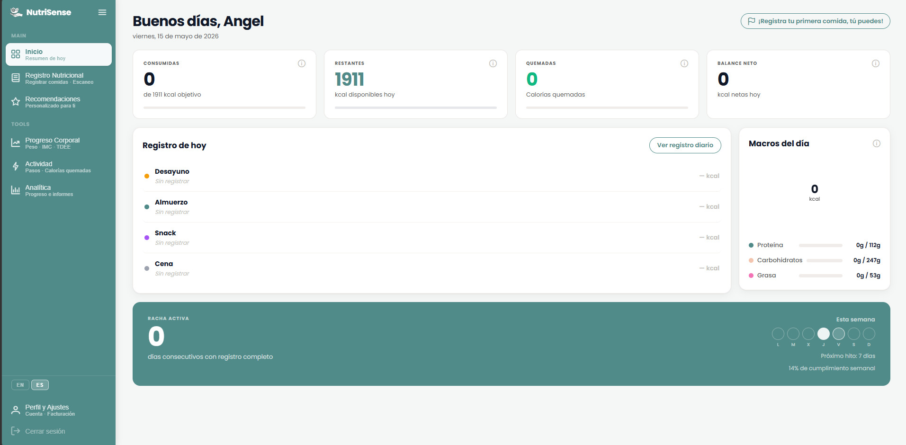

**Nutrition Log**
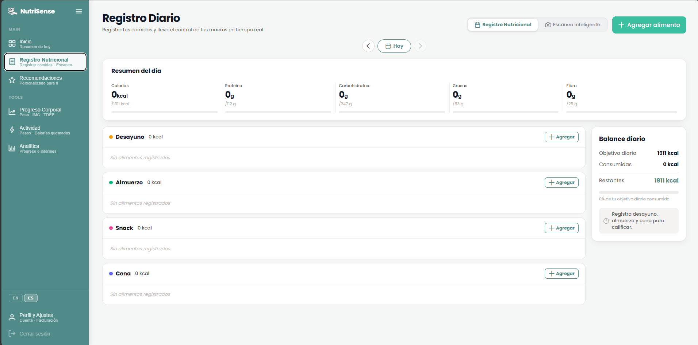

**Smart Scan**
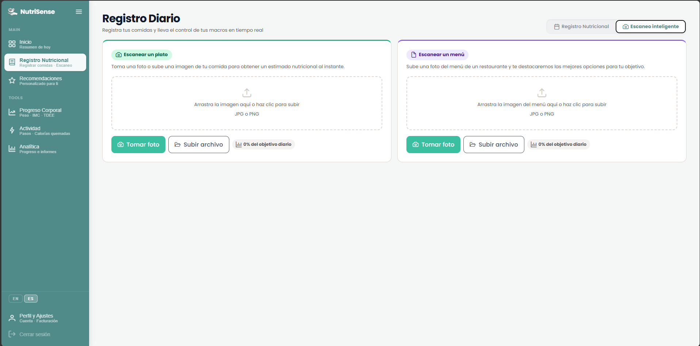

**Scan Dish**
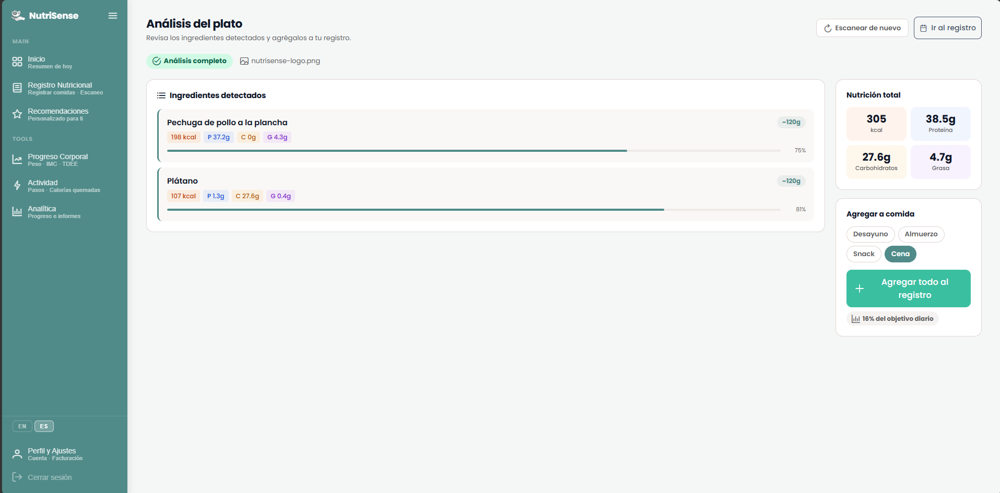

**Scan Menu**
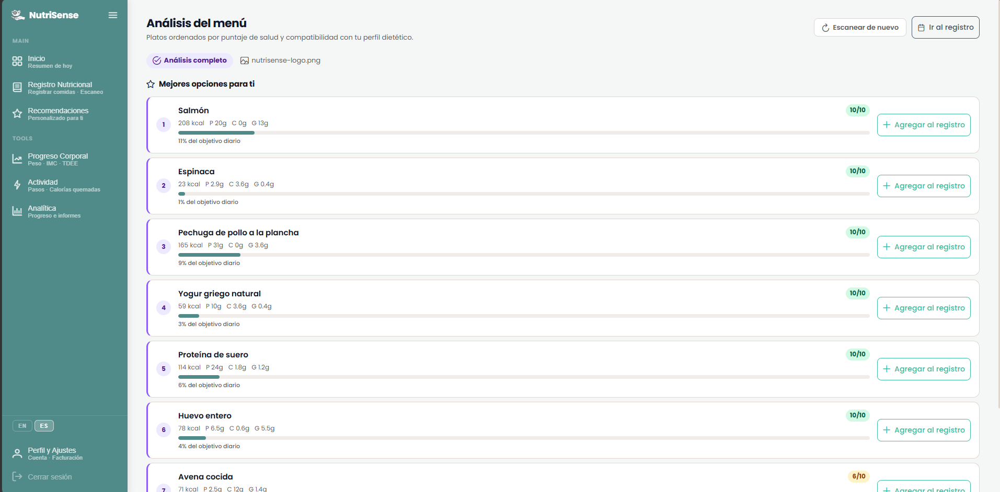

**Recommendations**
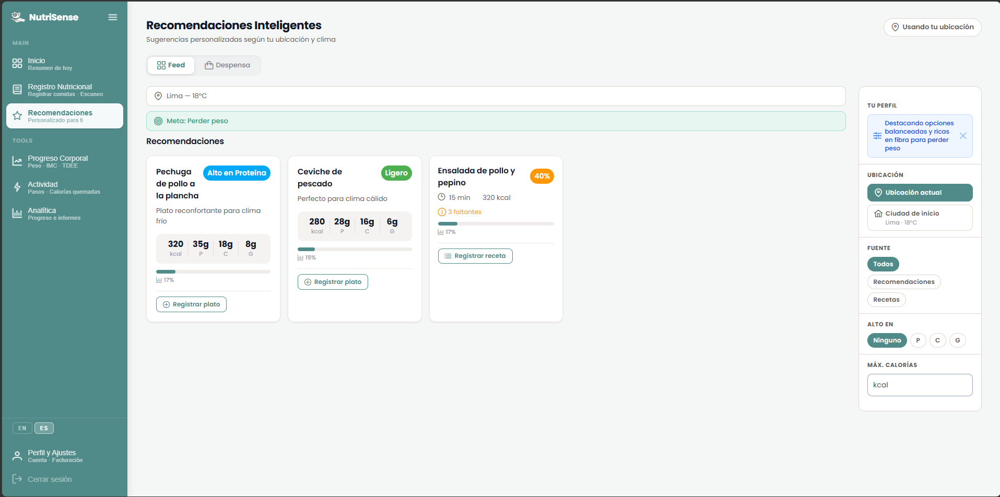

**Pantry**
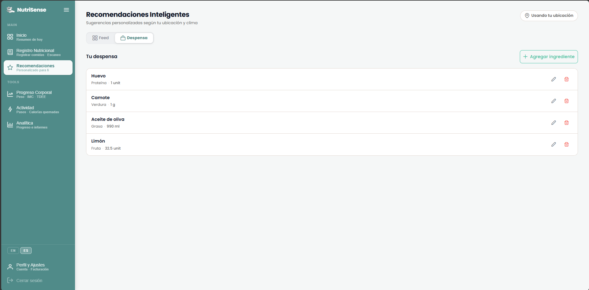

**Body Health**
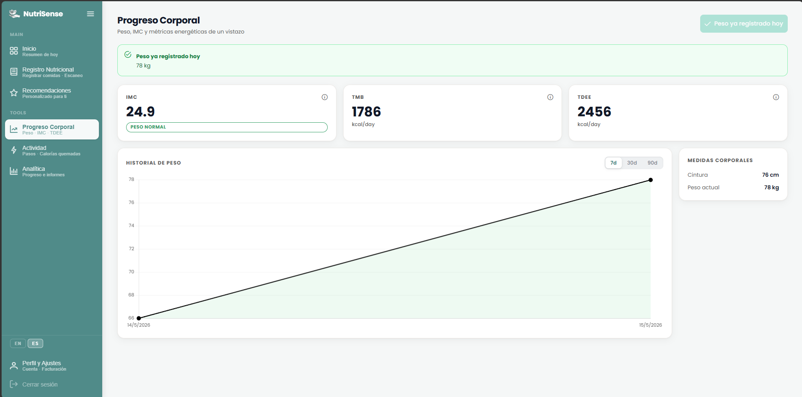

**Activity**
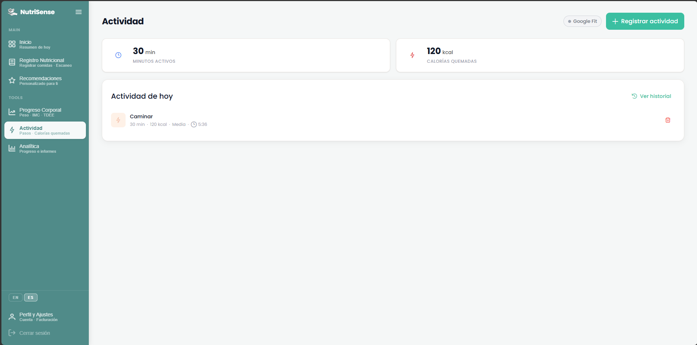

**Analytics**
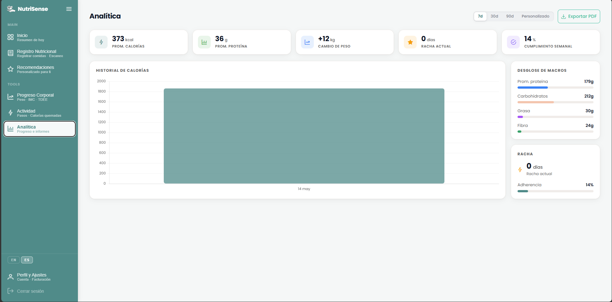

**Settings**
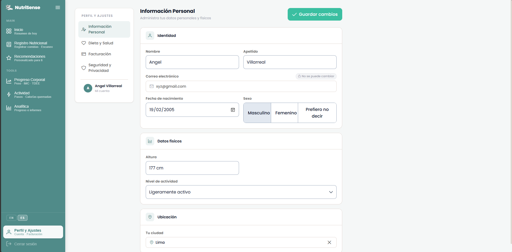

**Billing**
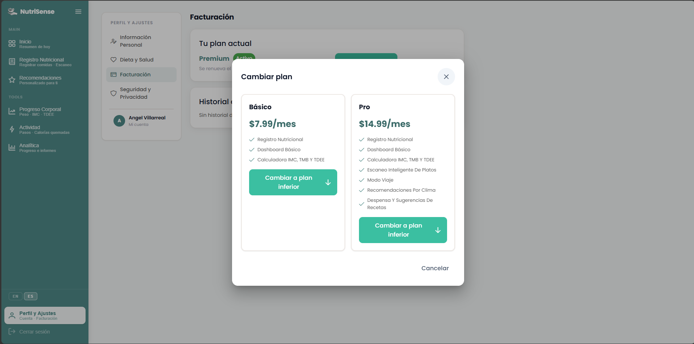

El video de demostración del Sprint 2 ilustra la navegación completa por todos los bounded contexts, la transición entre los cuatro estados de adherencia conductual del dashboard, el flujo de escaneo de plato y menú de restaurante con selección y log del plato compatible, el registro manual de actividad física con deducción en tiempo real en el balance calórico, y la gestión de suscripciones con upgrade de plan.
 
**URL del video de demostración del Sprint 2:** [Video sprint 2](https://upcedupe-my.sharepoint.com/:v:/g/personal/u202417857_upc_edu_pe/IQDBsCHSNqkDQb50xJnv7onlAZ2-CDPLsxKTtYgOhFUMl_A?nav=eyJyZWZlcnJhbEluZm8iOnsicmVmZXJyYWxBcHAiOiJPbmVEcml2ZUZvckJ1c2luZXNzIiwicmVmZXJyYWxBcHBQbGF0Zm9ybSI6IldlYiIsInJlZmVycmFsTW9kZSI6InZpZXciLCJyZWZlcnJhbFZpZXciOiJNeUZpbGVzTGlua0NvcHkifX0&e=WQQQNT)

#### 5.2.2.6. Services Documentation Evidence for Sprint Review

El Sprint 2 tuvo como alcance exclusivo la construcción del frontend de la aplicación web autenticada de NutriSense. Todos los datos son servidos mediante una capa mock con `json-server` a partir del archivo `db.json`, sin conexión a endpoints reales de backend. Por esta razón, no se generó documentación OpenAPI ni se desplegaron Web Services durante esta iteración.
 
La especificación completa de los endpoints RESTful que el frontend consumirá en producción se encuentra documentada en las Technical Stories del Product Backlog del Capítulo III. Su implementación está planificada para el Sprint 3 dentro del repositorio `nutrisense-platform`, cubriendo: IAM y sesiones, Nutrition Tracking con validación de restricciones, Analytics & Reporting, Body Health Metrics, Activity & Wearable, Smart Recommendations con pantry, y Smart Scan.

#### 5.2.2.7. Software Deployment Evidence for Sprint Review

##### Creación del repositorio en GitHub

Se creó el repositorio público `nutrisense-webapp` bajo la organización `upc-pre-202610-1asi0730-12053-nutrisense` en GitHub. Este repositorio centraliza el código fuente del frontend Vue y sirve como base para el despliegue continuo. 

[Link del repositorio nutrisense-webapp](https://github.com/upc-pre-202610-1asi0730-12053-nutrisens/nutrisense-webapp)

##### Configuración de ramas bajo Gitflow

Se estableció la estructura de ramas siguiendo Gitflow:

- `main` → rama de producción (fuente de despliegue)
- `develop` → rama de integración
- `feature/*` → ramas de desarrollo por bounded context

Todo el trabajo fue integrado mediante Pull Requests desde las ramas `feature/*` hacia `develop`, y finalmente desde `develop` hacia `main` como parte del release `v2.0.0`.

##### Merge a main y creación del tag de release

Una vez completadas todas las features del sprint, se realizó el merge de `develop` a `main` mediante un Pull Request en GitHub, etiquetando el commit resultante como `v2.0.0`.

##### Configuración del despliegue en Coolify

Para habilitar el despliegue continuo desde el repositorio se siguieron los pasos:
 
1. Ingresar al panel de administración de Coolify
2. Crear una nueva aplicación seleccionando **GitHub** como fuente
3. Conectar el repositorio `nutrisense-webapp` de la organización `upc-pre-202610-1asi0730-12053-nutrisense`
4. Configurar los parámetros de build:
   - **Build command:** `npm run build`
   - **Output directory:** `dist/nutrisense-webapp`
   - **Branch:** `main`
5. Asignar el dominio personalizado `app-sense.nutriproject.xyz` en la sección **Domains**
6. Guardar la configuración y ejecutar el primer despliegue manual
Coolify procesó el contenido de la rama `main`, ejecutó el build de Vue, y sirvió los artefactos estáticos generados bajo el dominio configurado.

##### URL de despliegue

La aplicación web quedó disponible públicamente en: [NutriSense Web App](https://app-sense.nutriproject.xyz)

#### 5.2.2.8. Team Collaboration Insights during Sprint
Durante el Sprint 2, todos los miembros del equipo participaron activamente en las actividades de implementación, tal como se refleja en los analíticos de colaboración de GitHub. Como se puede observar en la gráfica de contribuciones, los integrantes Nevatrix, xJoelFMRx, olenkisha14, Emy127 y roseal28 realizaron commits de manera constante a lo largo del sprint, cada uno liderando su bounded context asignado y colaborando en los aspectos transversales de i18n y accesibilidad.

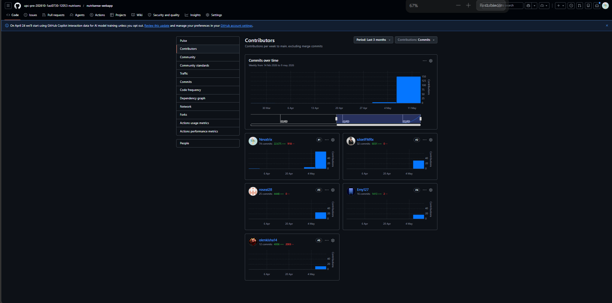

### 5.2.3. Sprint 3

#### 5.2.3.1. Sprint Planning 3

<table>
  <tr>
    <th colspan="2">Sprint #</th>
    <th colspan="2">Sprint 3</th>
  </tr>
  <tr>
    <th colspan="4">Sprint Planning Background</th>
  </tr>
  <tr>
    <td colspan="2">Date</td>
    <td colspan="2">2026-06-02</td>
  </tr>
  <tr>
    <td colspan="2">Time</td>
    <td colspan="2">06:00 PM (GMT-5)</td>
  </tr>
  <tr>
    <td colspan="2">Location</td>
    <td colspan="2">Reunión presencial</td>
  </tr>
  <tr>
    <td colspan="2">Prepared By</td>
    <td colspan="2">Villarreal Bazan, Angel Martin</td>
  </tr>
  <tr>
    <td colspan="2">Attendees (to planning meeting)</td>
    <td colspan="2">Del Aguila Del Aguila, Olenka Priscilla / Espinoza Cruz, Angela Milagros / Mora Rivera, Joel Fernando / Vergraray Calderon, Rose Almendra / Villarreal Bazan, Angel Martin</td>
  </tr>
  <tr>
    <th colspan="4">Sprint 2 Review Summary</th>
  </tr>
  <tr>
    <td colspan="4">Durante el Sprint 2 se entregó la aplicación web Vue de NutriSense con cobertura funcional completa para los flujos de autenticación, onboarding nutricional, seguimiento de comidas, métricas corporales, dashboard, escaneo inteligente con IA, recomendaciones, registro de actividad física y gestión de suscripciones. La aplicación fue desplegada y resultó accesible públicamente. El Sprint Goal se cumplió al 100 %.</td>
  </tr>
  <tr>
    <th colspan="4">Sprint 2 Retrospective Summary</th>
  </tr>
  <tr>
    <td colspan="4">El equipo destacó positivamente la organización por bounded contexts, que permitió el trabajo paralelo sin conflictos de integración. Como oportunidad de mejora se identificó la necesidad de definir con mayor anticipación los contratos de los endpoints (request/response bodies y códigos de estado) para evitar inconsistencias entre el frontend y el backend al integrarse. Para el Sprint 3 se acordó documentar cada endpoint con OpenAPI antes de iniciar su implementación y validar la integración frontend–backend en cada Pull Request.</td>
  </tr>
  <tr>
    <th colspan="4">Sprint Goal &amp; User Stories</th>
  </tr>
  <tr>
    <td colspan="2">Sprint 3 Goal</td>
    <td colspan="2">Nuestro enfoque está en entregar el backend de NutriSense completamente operativo, con los 76 endpoints REST versionados bajo <code>api/v1/</code>, distribuidos en los 7 bounded contexts (IAM, BodyHealthMetrics, NutritionTracking, ActivityWearable, SmartRecommendations, Subscriptions y AnalyticsReporting), documentados con OpenAPI/Swagger e integrados con los servicios externos (Gemini, DeepSeek, USDA, OpenWeatherMap, Stripe, Google Fit). Creemos que entrega la capa de negocio y persistencia que da soporte real a ambos segmentos objetivo, al calcular automáticamente sus metas calóricas y de macros, propagar eventos de dominio entre contextos y desbloquear funciones premium según el plan de suscripción activo. Esto se confirmará cuando el equipo de frontend pueda consumir todos los endpoints sin errores, el flujo completo de onboarding dispare la saga de cálculo IMC → BMR → TDEE → meta diaria, el escaneo de plato con Gemini persista entradas en el log nutricional, y la activación de una suscripción vía Stripe habilite las funciones premium en SmartRecommendations.</td>
  </tr>
  <tr>
    <td colspan="2">Sprint 3 Velocity</td>
    <td colspan="2">109 Story Points</td>
  </tr>
  <tr>
    <td colspan="2">Sum of Story Points</td>
    <td colspan="2">109 Story Points</td>
  </tr>
</table>

---

#### 5.2.3.2. Aspect Leaders and Collaborators

El Sprint 3 abarca la implementación completa del backend (`Nutrisense.Nutrisense.Platform`) en **.NET 10 / C#** bajo una arquitectura DDD + Clean Architecture organizada por bounded context. Cada integrante asumió el liderazgo del o los contextos que desarrolló en su totalidad, incluyendo las cuatro capas (Domain, Application, Infrastructure, Interfaces) y los endpoints REST correspondientes. Los aspectos identificados para organizar el liderazgo y la colaboración en este sprint son los siguientes:

**IAM (Identity & Access Management):** Comprende el registro y autenticación de usuarios (JWT HS256, BCrypt), la gestión del perfil, sesiones, objetivos de salud y restricciones dietéticas. Expone 11 endpoints bajo `api/v1/authentication`, `api/v1/users` y `api/v1/users/{userId}/sessions`, además del ACL `IIamContextFacade` consumido por otros bounded contexts.

**BodyHealthMetrics:** Comprende el registro de biometría inicial y la saga de cálculo encadenada IMC → BMR (Mifflin-St Jeor) → TDEE → meta diaria de calorías y macros, el historial de peso, las medidas corporales y el objetivo de peso. Expone 8 endpoints bajo `api/v1/body-metrics` y publica los eventos de dominio `BmiCalculated`, `BmrCalculated`, `TdeeCalculated` y `DailyCaloricGoalSet`.

**NutritionTracking:** Comprende el catálogo de alimentos (búsqueda, registro e importación USDA), el registro diario de comidas con cálculo proporcional de macros, el historial y el resumen diario, y el escaneo de platos y menús con IA (Gemini para visión + DeepSeek como fallback de estimación de macros). Expone 14 endpoints bajo `api/v1/foods` y `api/v1/nutrition-logs`.

**ActivityWearable:** Comprende el registro manual de actividad física, el recálculo del balance calórico diario, la conexión y sincronización de dispositivos wearable (Google Fit), y la verificación de propiedad antes de eliminar registros. Expone 8 endpoints bajo `api/v1/activity-logs` y `api/v1/wearable-connections`, y publica los eventos `ActivityImported`, `ActiveCaloriesCalculated` y `CaloricBalanceAdjusted`.

**SmartRecommendations:** Comprende la generación de recomendaciones contextuales con DeepSeek (clima vía OpenWeatherMap, objetivo, restricciones dietéticas y doble filtro), la gestión de despensa, el catálogo de ingredientes, las sugerencias de recetas, el modo viaje y la detección de ubicación por coordenadas. Expone 19 endpoints y consume los ACL de IAM, BodyHealthMetrics, NutritionTracking y Subscriptions.

**Subscriptions & Billing:** Comprende el ciclo de vida completo de la suscripción (selección de plan, pago vía Stripe, upgrade/downgrade, cancelación y renovación), los métodos de pago y el historial de pagos. Expone 11 endpoints bajo `api/v1/subscription-plans`, `api/v1/user-subscriptions`, `api/v1/payment-methods` y `api/v1/payments`. Los eventos críticos `BenefitsEnabled` / `BenefitsDisabled` gobiernan el desbloqueo de funciones premium en SmartRecommendations.

**AnalyticsReporting:** Comprende el cálculo de adherencia (ponderación 50 % calorías / 50 % proteína), la gestión de rachas (streaks), los snapshots de progreso (90 días), el dashboard diario y la exportación de reportes PDF (función Premium). Expone 5 endpoints bajo `api/v1/analytics` y opera de forma reactiva escuchando los eventos `ConsumptionUpdated`, `CaloricBalanceAdjusted` y `TdeeCalculated` de otros bounded contexts.

**Shared & Infrastructure Transversal:** Comprende el `AppDbContext` con todas las configuraciones EF Core, el `UnitOfWork`, el `BaseRepository<T>`, el `Result Pattern`, los interceptores de auditoría (`AuditableEntityInterceptor`, `UtcDateTimeInterceptor`), las migraciones Code-First, el `CatalogImportHostedService` y los clientes compartidos `DeepSeekClient` y `GeminiClient`. Es una responsabilidad transversal en la que todos los integrantes colaboran.

| Team Member (Last Name, First Name) | GitHub Username | IAM | BodyHealthMetrics | NutritionTracking | ActivityWearable | SmartRecommendations | Subscriptions & Billing | AnalyticsReporting | Shared & Infra |
|-------------------------------------|-----------------|:---:|:-----------------:|:-----------------:|:----------------:|:--------------------:|:-----------------------:|:------------------:|:--------------:|
| Del Aguila Del Aguila, Olenka Priscilla | olenkisha_14 | C | C | C | C | C | C | L | C |
| Espinoza Cruz, Angela Milagros | Emy127 | C | C | C | L | C | C | C | C |
| Mora Rivera, Joel Fernando | xJoelFMRx | C | C | L | C | C | C | C | C |
| Vergraray Calderon, Rose Almendra | roseal28 | C | L | C | C | C | C | C | C |
| Villarreal Bazan, Angel Martin | nevatrix | L | C | C | C | L | L | C | L |

#### 5.2.3.3. Sprint Backlog 3

El Sprint 3 tiene como objetivo principal entregar la plataforma de NutriSense con cobertura funcional completa para los bounded contexts de IAM, BodyHealthMetrics, NutritionTracking, ActivityWearable, SmartRecommendations, Subscriptions y AnalyticsReporting, incluyendo además las correcciones de seguridad transversal (validación de ownership/IDOR y restricción de rol admin) identificadas durante la documentación de endpoints. El backlog contempla 25 Technical Stories distribuidas en 7 bounded contexts, con un total de 109 Story Points.

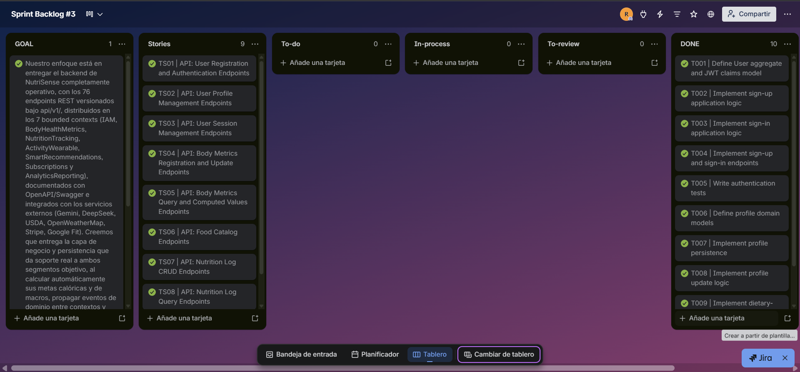
URL del Board (Trello): [Enlace Trello](https://trello.com/b/QxmJTyBW/sprint-backlog-3)

| US ID | US Title | Task ID | Task Title | Description | Est. (h) | Assigned To | Status |
|-------|----------|---------|------------|-------------|----------|-------------|--------|
| TS01 | API: User Registration and Authentication Endpoints | T001 | Define User aggregate and JWT claims model | Define the User aggregate, password hashing strategy and JWT claims (sub, roles) used across the API. | 2 | Villarreal Bazan, Angel Martin | Done |
| TS01 | API: User Registration and Authentication Endpoints | T002 | Implement sign-up application logic | Implement uniqueness validation, password hashing and initial profile bootstrap for POST /sign-up. | 4 | Villarreal Bazan, Angel Martin | Done |
| TS01 | API: User Registration and Authentication Endpoints | T003 | Implement sign-in application logic | Implement credential validation and JWT + sessionId issuance for POST /sign-in. | 3 | Villarreal Bazan, Angel Martin | Done |
| TS01 | API: User Registration and Authentication Endpoints | T004 | Implement sign-up and sign-in endpoints | Wire POST /api/v1/authentication/sign-up and POST /api/v1/authentication/sign-in controllers. | 3 | Villarreal Bazan, Angel Martin | Done |
| TS01 | API: User Registration and Authentication Endpoints | T005 | Write authentication tests | Unit and integration tests for sign-up/sign-in success and failure paths (duplicate email, invalid credentials). | 3 | Villarreal Bazan, Angel Martin | Done |
| TS02 | API: User Profile Management Endpoints | T006 | Define profile domain models | Define UserProfile, HealthGoal and DietaryRestriction domain models and validation rules. | 2 | Villarreal Bazan, Angel Martin | Done |
| TS02 | API: User Profile Management Endpoints | T007 | Implement profile persistence | Implement repository/persistence for profile, health goal and dietary restrictions. | 4 | Villarreal Bazan, Angel Martin | Done |
| TS02 | API: User Profile Management Endpoints | T008 | Implement profile update logic | Implement application logic for profile and health-goal updates. | 4 | Villarreal Bazan, Angel Martin | Done |
| TS02 | API: User Profile Management Endpoints | T009 | Implement dietary-restrictions and deletion logic | Implement full-replacement logic for dietary restrictions and cascading account deletion. | 3 | Villarreal Bazan, Angel Martin | Done |
| TS02 | API: User Profile Management Endpoints | T010 | Implement user profile API endpoints | Implement GET, PUT profile, PUT health-goal, GET/PUT dietary-restrictions and DELETE for api/v1/users. | 4 | Villarreal Bazan, Angel Martin | Done |
| TS02 | API: User Profile Management Endpoints | T011 | Write profile management tests | Unit and integration tests covering profile update, dietary restriction replacement, and account deletion. | 4 | Villarreal Bazan, Angel Martin | Done |
| TS03 | API: User Session Management Endpoints | T012 | Define Session entity | Define the Session entity and token invalidation strategy. | 2 | Villarreal Bazan, Angel Martin | Done |
| TS03 | API: User Session Management Endpoints | T013 | Implement session listing query | Implement repository/query for listing active and inactive sessions per user. | 3 | Villarreal Bazan, Angel Martin | Done |
| TS03 | API: User Session Management Endpoints | T014 | Implement logout application logic | Implement token invalidation and ownership validation for logout. | 3 | Villarreal Bazan, Angel Martin | Done |
| TS03 | API: User Session Management Endpoints | T015 | Implement session API endpoints | Implement GET /sessions and POST /sessions/{sessionId}/logout. | 3 | Villarreal Bazan, Angel Martin | Done |
| TS03 | API: User Session Management Endpoints | T016 | Write session management tests | Tests for session listing and logout including ownership validation. | 3 | Villarreal Bazan, Angel Martin | Done |
| TS04 | API: Body Metrics Registration and Update Endpoints | T017 | Define BodyMetrics aggregate | Define the BodyMetrics aggregate and BMI/TDEE calculation rules. | 3 | Vergraray Calderon, Rose Almendra | Done |
| TS04 | API: Body Metrics Registration and Update Endpoints | T018 | Implement body metrics persistence | Implement repository/persistence for the body metrics profile. | 3 | Vergraray Calderon, Rose Almendra | Done |
| TS04 | API: Body Metrics Registration and Update Endpoints | T019 | Implement weight/measurement update logic | Implement application logic for weight and body-measurement updates with BMI/TDEE recalculation. | 4 | Vergraray Calderon, Rose Almendra | Done |
| TS04 | API: Body Metrics Registration and Update Endpoints | T020 | Implement health-goal adjustment logic | Implement caloric adjustment logic driven by target weight and weekly pace. | 3 | Vergraray Calderon, Rose Almendra | Done |
| TS04 | API: Body Metrics Registration and Update Endpoints | T021 | Implement body metrics write endpoints | Implement POST body-metrics, PUT weight, POST body-measurements, PUT health-goal. | 4 | Vergraray Calderon, Rose Almendra | Done |
| TS04 | API: Body Metrics Registration and Update Endpoints | T022 | Write body metrics write-path tests | Tests covering profile creation conflicts and recalculation accuracy. | 4 | Vergraray Calderon, Rose Almendra | Done |
| TS05 | API: Body Metrics Query and Computed Values Endpoints | T023 | Define body metrics read models | Define read models for BMI, daily caloric goal and weight-history projections. | 2 | Vergraray Calderon, Rose Almendra | Done |
| TS05 | API: Body Metrics Query and Computed Values Endpoints | T024 | Implement body metrics query logic | Implement repository/query logic with date-range filtering and pagination. | 3 | Vergraray Calderon, Rose Almendra | Done |
| TS05 | API: Body Metrics Query and Computed Values Endpoints | T025 | Implement BMI/macro calculation logic | Implement BMI category classification (WHO ranges) and macro-breakdown calculation. | 3 | Vergraray Calderon, Rose Almendra | Done |
| TS05 | API: Body Metrics Query and Computed Values Endpoints | T026 | Implement body metrics query endpoints | Implement GET by-user, GET bmi, GET daily-caloric-goal, GET weight-history. | 3 | Vergraray Calderon, Rose Almendra | Done |
| TS05 | API: Body Metrics Query and Computed Values Endpoints | T027 | Write body metrics query tests | Tests for BMI categorization and weight-history pagination/filtering. | 3 | Vergraray Calderon, Rose Almendra | Done |
| TS06 | API: Food Catalog Endpoints | T028 | Define Food entity and catalog indexing | Define the Food entity and the search-indexing strategy for the catalog. | 3 | Mora Rivera, Joel Fernando | Done |
| TS06 | API: Food Catalog Endpoints | T029 | Implement food catalog persistence | Implement repository/persistence for the food catalog. | 3 | Mora Rivera, Joel Fernando | Done |
| TS06 | API: Food Catalog Endpoints | T030 | Implement USDA import integration | Implement USDA FoodData Central import integration with 502 error handling. | 4 | Mora Rivera, Joel Fernando | Done |
| TS06 | API: Food Catalog Endpoints | T031 | Implement admin-only authorization for catalog writes | Restrict POST and POST /import to the admin role. | 2 | Mora Rivera, Joel Fernando | Done |
| TS06 | API: Food Catalog Endpoints | T032 | Implement food catalog API endpoints | Implement GET search, GET by id, POST and POST import. | 4 | Mora Rivera, Joel Fernando | Done |
| TS06 | API: Food Catalog Endpoints | T033 | Write food catalog tests | Tests covering search, USDA import failure handling and admin-only access. | 4 | Mora Rivera, Joel Fernando | Done |
| TS07 | API: Nutrition Log CRUD Endpoints | T034 | Define NutritionLogEntry entity | Define the NutritionLogEntry entity and date/quantity validation rules. | 2 | Mora Rivera, Joel Fernando | Done |
| TS07 | API: Nutrition Log CRUD Endpoints | T035 | Implement nutrition log persistence | Implement repository/persistence for nutrition log entries. | 3 | Mora Rivera, Joel Fernando | Done |
| TS07 | API: Nutrition Log CRUD Endpoints | T036 | Implement update/delete application logic | Implement ownership-validated update and delete logic. | 3 | Mora Rivera, Joel Fernando | Done |
| TS07 | API: Nutrition Log CRUD Endpoints | T037 | Implement nutrition log CRUD endpoints | Implement POST, PATCH and DELETE for api/v1/nutrition-logs. | 3 | Mora Rivera, Joel Fernando | Done |
| TS07 | API: Nutrition Log CRUD Endpoints | T038 | Write nutrition log CRUD tests | Tests for invalid date format and ownership-based delete restriction. | 3 | Mora Rivera, Joel Fernando | Done |
| TS08 | API: Nutrition Log Query Endpoints | T039 | Define nutrition log read models | Define read models for daily entries, daily summary and history projections. | 2 | Mora Rivera, Joel Fernando | Done |
| TS08 | API: Nutrition Log Query Endpoints | T040 | Implement nutrition log aggregation query | Implement repository/query logic with macro aggregation for the daily summary. | 3 | Mora Rivera, Joel Fernando | Done |
| TS08 | API: Nutrition Log Query Endpoints | T041 | Implement history date-range filtering | Implement date-range filtering logic for the history endpoint. | 3 | Mora Rivera, Joel Fernando | Done |
| TS08 | API: Nutrition Log Query Endpoints | T042 | Implement nutrition log query endpoints | Implement GET by date, GET daily-summary and GET history. | 3 | Mora Rivera, Joel Fernando | Done |
| TS08 | API: Nutrition Log Query Endpoints | T043 | Write nutrition log query tests | Tests for daily-summary macro aggregation and history date filtering. | 3 | Mora Rivera, Joel Fernando | Done |
| TS09 | API: Dish and Menu Scan Endpoints | T044 | Define scan preview/selection models | Define ScanPreview and ScanSelection models for dish and menu analysis. | 3 | Mora Rivera, Joel Fernando | Done |
| TS09 | API: Dish and Menu Scan Endpoints | T045 | Integrate AI vision service | Integrate the Vision/AI service for dish and menu image analysis. | 5 | Mora Rivera, Joel Fernando | Done |
| TS09 | API: Dish and Menu Scan Endpoints | T046 | Implement scan analysis logic (no persistence) | Implement scan-dish and scan-menu application logic returning a preview without persisting. | 4 | Mora Rivera, Joel Fernando | Done |
| TS09 | API: Dish and Menu Scan Endpoints | T047 | Implement scan confirmation logic | Implement scan-dish/confirm and scan-menu/select application logic, persisting on confirmation. | 4 | Mora Rivera, Joel Fernando | Done |
| TS09 | API: Dish and Menu Scan Endpoints | T048 | Implement scan API endpoints | Implement POST endpoints for scan-dish, scan-dish/confirm, scan-menu and scan-menu/select. | 4 | Mora Rivera, Joel Fernando | Done |
| TS09 | API: Dish and Menu Scan Endpoints | T049 | Write smart scan tests | Tests validating preview endpoints do not persist and confirm/select endpoints do. | 4 | Mora Rivera, Joel Fernando | Done |
| TS10 | API: Wearable Connection and Sync Endpoints | T050 | Define WearableConnection entity | Define the WearableConnection entity and OAuth token storage strategy. | 3 | Espinoza Cruz, Angela Milagros | Done |
| TS10 | API: Wearable Connection and Sync Endpoints | T051 | Implement OAuth connection logic | Implement OAuth code exchange and provider connection logic, with conflict handling. | 5 | Espinoza Cruz, Angela Milagros | Done |
| TS10 | API: Wearable Connection and Sync Endpoints | T052 | Implement sync chain orchestration | Implement the full activity-data sync chain (Subflow 5.1) triggered on connection. | 5 | Espinoza Cruz, Angela Milagros | Done |
| TS10 | API: Wearable Connection and Sync Endpoints | T053 | Implement disconnect logic | Implement disconnect logic including OAuth token revocation. | 3 | Espinoza Cruz, Angela Milagros | Done |
| TS10 | API: Wearable Connection and Sync Endpoints | T054 | Implement wearable connection API endpoints | Implement POST, GET by-user, POST {id}/sync and DELETE {id}. | 4 | Espinoza Cruz, Angela Milagros | Done |
| TS10 | API: Wearable Connection and Sync Endpoints | T055 | Write wearable connection tests | Tests for connection conflicts, manual sync triggering and disconnect. | 4 | Espinoza Cruz, Angela Milagros | Done |
| TS11 | API: Activity Log Endpoints | T056 | Define ActivityLog entity | Define the ActivityLog entity and caloric balance recalculation rules. | 3 | Espinoza Cruz, Angela Milagros | Done |
| TS11 | API: Activity Log Endpoints | T057 | Implement activity log persistence | Implement repository/persistence for activity log entries. | 3 | Espinoza Cruz, Angela Milagros | Done |
| TS11 | API: Activity Log Endpoints | T058 | Implement caloric balance recalculation logic | Implement the recalculation chain (Subflow 5.2) triggered on create and delete. | 4 | Espinoza Cruz, Angela Milagros | Done |
| TS11 | API: Activity Log Endpoints | T059 | Implement ownership-validated delete logic | Implement ownership validation for the delete operation (403 on mismatch). | 2 | Espinoza Cruz, Angela Milagros | Done |
| TS11 | API: Activity Log Endpoints | T060 | Implement activity log API endpoints | Implement POST, GET by-user, GET daily-summary and DELETE. | 4 | Espinoza Cruz, Angela Milagros | Done |
| TS11 | API: Activity Log Endpoints | T061 | Write activity log tests | Tests for ownership validation on delete and caloric balance recalculation. | 4 | Espinoza Cruz, Angela Milagros | Done |
| TS12 | API: Recommendation Endpoints | T062 | Define RecommendationCard entity | Define the RecommendationCard entity and trigger rules. | 2 | Villarreal Bazan, Angel Martin | Done |
| TS12 | API: Recommendation Endpoints | T063 | Implement active-card query logic | Implement repository/query for active, non-expired recommendation cards. | 3 | Villarreal Bazan, Angel Martin | Done |
| TS12 | API: Recommendation Endpoints | T064 | Implement trigger-based generation logic | Implement card generation logic based on configured triggers. | 3 | Villarreal Bazan, Angel Martin | Done |
| TS12 | API: Recommendation Endpoints | T065 | Implement recommendation API endpoints | Implement GET by-user and POST generate/{userId}. | 3 | Villarreal Bazan, Angel Martin | Done |
| TS12 | API: Recommendation Endpoints | T066 | Write recommendation tests | Tests for active card filtering and trigger-based generation. | 3 | Villarreal Bazan, Angel Martin | Done |
| TS13 | API: Recipe Endpoints | T067 | Define Recipe and Ingredient models | Define Recipe and Ingredient relationship models. | 3 | Villarreal Bazan, Angel Martin | Done |
| TS13 | API: Recipe Endpoints | T068 | Implement recipe filtering query | Implement repository/query with goal and prep-time filtering. | 3 | Villarreal Bazan, Angel Martin | Done |
| TS13 | API: Recipe Endpoints | T069 | Implement suggestion matching algorithm | Implement pantry-and-goal-based recipe suggestion matching. | 4 | Villarreal Bazan, Angel Martin | Done |
| TS13 | API: Recipe Endpoints | T070 | Implement admin-only authorization for recipe import | Restrict POST /import to the admin role. | 2 | Villarreal Bazan, Angel Martin | Done |
| TS13 | API: Recipe Endpoints | T071 | Implement recipe API endpoints | Implement GET filtered, GET by id, POST suggest and POST import. | 4 | Villarreal Bazan, Angel Martin | Done |
| TS13 | API: Recipe Endpoints | T072 | Write recipe tests | Tests for goal/pantry-based suggestion matching and admin-only import. | 4 | Villarreal Bazan, Angel Martin | Done |
| TS14 | API: Pantry Management Endpoints | T073 | Define PantryItem entity | Define the PantryItem entity and plan-based capacity rules. | 2 | Villarreal Bazan, Angel Martin | Done |
| TS14 | API: Pantry Management Endpoints | T074 | Implement pantry persistence | Implement repository/persistence for pantry items. | 3 | Villarreal Bazan, Angel Martin | Done |
| TS14 | API: Pantry Management Endpoints | T075 | Implement plan-gating logic | Implement plan-gating logic for item additions, returning 402 when exceeded. | 3 | Villarreal Bazan, Angel Martin | Done |
| TS14 | API: Pantry Management Endpoints | T076 | Implement pantry API endpoints | Implement GET, POST items, DELETE item and PATCH item. | 3 | Villarreal Bazan, Angel Martin | Done |
| TS14 | API: Pantry Management Endpoints | T077 | Write pantry tests | Tests for plan-gated item limits and item update/removal. | 3 | Villarreal Bazan, Angel Martin | Done |
| TS15 | API: Location Preferences and Travel Mode Endpoints | T078 | Define LocationPreference entity | Define the LocationPreference entity and travel-mode state rules. | 3 | Villarreal Bazan, Angel Martin | Done |
| TS15 | API: Location Preferences and Travel Mode Endpoints | T079 | Implement location preferences persistence | Implement repository/persistence for location preferences. | 3 | Villarreal Bazan, Angel Martin | Done |
| TS15 | API: Location Preferences and Travel Mode Endpoints | T080 | Implement plan-gated travel-mode logic | Implement enable/disable travel-mode logic with plan gating (402 handling). | 3 | Villarreal Bazan, Angel Martin | Done |
| TS15 | API: Location Preferences and Travel Mode Endpoints | T081 | Implement coordinate detection logic | Implement coordinate-to-city detection logic for the detect endpoint. | 4 | Villarreal Bazan, Angel Martin | Done |
| TS15 | API: Location Preferences and Travel Mode Endpoints | T082 | Implement location preferences API endpoints | Implement GET, PUT enable/disable, POST detect and PUT home-city. | 4 | Villarreal Bazan, Angel Martin | Done |
| TS15 | API: Location Preferences and Travel Mode Endpoints | T083 | Write travel mode tests | Tests for plan-gated travel mode and coordinate-to-city detection. | 4 | Villarreal Bazan, Angel Martin | Done |
| TS16 | API: City Catalog and Weather Endpoints | T084 | Define City entity and import strategy | Define the City entity and the idempotent geocoded-import strategy. | 3 | Villarreal Bazan, Angel Martin | Done |
| TS16 | API: City Catalog and Weather Endpoints | T085 | Implement city catalog persistence | Implement repository/persistence with deduplication for the city catalog. | 3 | Villarreal Bazan, Angel Martin | Done |
| TS16 | API: City Catalog and Weather Endpoints | T086 | Integrate geocoding service | Integrate the geocoding service for city search and import. | 4 | Villarreal Bazan, Angel Martin | Done |
| TS16 | API: City Catalog and Weather Endpoints | T087 | Integrate weather provider | Integrate the weather provider with response caching. | 4 | Villarreal Bazan, Angel Martin | Done |
| TS16 | API: City Catalog and Weather Endpoints | T088 | Implement city catalog API endpoints | Implement GET, GET search, GET by id, POST and GET weather. | 3 | Villarreal Bazan, Angel Martin | Done |
| TS16 | API: City Catalog and Weather Endpoints | T089 | Write city catalog tests | Tests for idempotent city import and weather retrieval. | 3 | Villarreal Bazan, Angel Martin | Done |
| TS17 | API: Ingredient Catalog Endpoint | T090 | Define ingredient catalog read model | Define the IngredientCatalogItem read model. | 1 | Villarreal Bazan, Angel Martin | Done |
| TS17 | API: Ingredient Catalog Endpoint | T091 | Implement ingredient catalog query | Implement repository/query for the ingredient catalog. | 2 | Villarreal Bazan, Angel Martin | Done |
| TS17 | API: Ingredient Catalog Endpoint | T092 | Implement ingredient catalog endpoint | Implement GET /api/v1/ingredient-catalog. | 2 | Villarreal Bazan, Angel Martin | Done |
| TS17 | API: Ingredient Catalog Endpoint | T093 | Validate anonymous access configuration | Confirm the endpoint is correctly configured as publicly accessible. | 1 | Villarreal Bazan, Angel Martin | Done |
| TS17 | API: Ingredient Catalog Endpoint | T094 | Write ingredient catalog tests | Unit and integration tests for catalog retrieval. | 2 | Villarreal Bazan, Angel Martin | Done |
| TS18 | API: Subscription Plan Catalog Endpoints | T095 | Define subscription plan read model | Define the SubscriptionPlan read model with pricing and features. | 1 | Villarreal Bazan, Angel Martin | Done |
| TS18 | API: Subscription Plan Catalog Endpoints | T096 | Implement plan catalog query | Implement repository/query for plan listing and lookup by key. | 2 | Villarreal Bazan, Angel Martin | Done |
| TS18 | API: Subscription Plan Catalog Endpoints | T097 | Implement subscription plan API endpoints | Implement GET plans and GET plan by key. | 2 | Villarreal Bazan, Angel Martin | Done |
| TS18 | API: Subscription Plan Catalog Endpoints | T098 | Validate anonymous access and 404 handling | Confirm public access configuration and 404 response for unknown keys. | 1 | Villarreal Bazan, Angel Martin | Done |
| TS18 | API: Subscription Plan Catalog Endpoints | T099 | Write subscription plan tests | Tests for plan listing and lookup. | 2 | Villarreal Bazan, Angel Martin | Done |
| TS19 | API: User Subscription Lifecycle Endpoints | T100 | Define UserSubscription lifecycle | Define the UserSubscription entity and lifecycle state machine. | 4 | Villarreal Bazan, Angel Martin | Done |
| TS19 | API: User Subscription Lifecycle Endpoints | T101 | Implement subscription activation logic | Implement plan selection and payment-activation logic, with conflict handling (409). | 5 | Villarreal Bazan, Angel Martin | Done |
| TS19 | API: User Subscription Lifecycle Endpoints | T102 | Implement cancellation logic | Implement immediate and end-of-period cancellation logic. | 3 | Villarreal Bazan, Angel Martin | Done |
| TS19 | API: User Subscription Lifecycle Endpoints | T103 | Implement renewal and plan-change logic | Implement renew and upgrade/downgrade logic with payment processing. | 5 | Villarreal Bazan, Angel Martin | Done |
| TS19 | API: User Subscription Lifecycle Endpoints | T104 | Implement subscription lifecycle API endpoints | Implement POST, GET by-user, POST cancel, POST renew and PUT plan. | 4 | Villarreal Bazan, Angel Martin | Done |
| TS19 | API: User Subscription Lifecycle Endpoints | T105 | Write subscription lifecycle tests | Tests for payment failure handling, conflicts and plan-change behavior. | 4 | Villarreal Bazan, Angel Martin | Done |
| TS20 | API: Payment Method Endpoints | T106 | Define PaymentMethod entity and Stripe contract | Define the PaymentMethod entity and the Stripe integration contract. | 3 | Villarreal Bazan, Angel Martin | Done |
| TS20 | API: Payment Method Endpoints | T107 | Implement Stripe card validation | Implement card validation/tokenization through Stripe. | 4 | Villarreal Bazan, Angel Martin | Done |
| TS20 | API: Payment Method Endpoints | T108 | Implement payment method persistence | Implement repository/persistence for payment methods. | 3 | Villarreal Bazan, Angel Martin | Done |
| TS20 | API: Payment Method Endpoints | T109 | Implement sole-method removal rule | Implement business rule guarding removal of the only active payment method. | 2 | Villarreal Bazan, Angel Martin | Done |
| TS20 | API: Payment Method Endpoints | T110 | Implement payment method API endpoints | Implement POST, GET by-user and DELETE. | 4 | Villarreal Bazan, Angel Martin | Done |
| TS20 | API: Payment Method Endpoints | T111 | Write payment methods tests | Tests for Stripe card validation and method removal. | 4 | Villarreal Bazan, Angel Martin | Done |
| TS21 | API: Payment History Endpoint | T112 | Define payment history read model | Define the PaymentHistory read model. | 1 | Villarreal Bazan, Angel Martin | Done |
| TS21 | API: Payment History Endpoint | T113 | Implement payment history query | Implement repository/query for payments by subscription. | 2 | Villarreal Bazan, Angel Martin | Done |
| TS21 | API: Payment History Endpoint | T114 | Implement chronological ordering logic | Implement chronological ordering and status/amount mapping. | 2 | Villarreal Bazan, Angel Martin | Done |
| TS21 | API: Payment History Endpoint | T115 | Implement payment history endpoint | Implement GET /api/v1/payments/by-subscription/{subscriptionId}. | 2 | Villarreal Bazan, Angel Martin | Done |
| TS21 | API: Payment History Endpoint | T116 | Write payment history tests | Unit and integration tests for payment history retrieval. | 2 | Villarreal Bazan, Angel Martin | Done |
| TS22 | API: Analytics Dashboard, Progress and Streak Endpoints | T117 | Define dashboard and streak read models | Define DashboardSnapshot, ProgressEntry and Streak read models. | 3 | Del Aguila Del Aguila, Olenka Priscilla | Done |
| TS22 | API: Analytics Dashboard, Progress and Streak Endpoints | T118 | Implement cross-context aggregation logic | Implement repository/aggregation logic across nutrition and activity logs. | 4 | Del Aguila Del Aguila, Olenka Priscilla | Done |
| TS22 | API: Analytics Dashboard, Progress and Streak Endpoints | T119 | Implement streak calculation logic | Implement streak and weekly compliance-rate calculation. | 4 | Del Aguila Del Aguila, Olenka Priscilla | Done |
| TS22 | API: Analytics Dashboard, Progress and Streak Endpoints | T120 | Implement dashboard-view tracking logic | Implement dashboard-view recording that updates the streak. | 2 | Del Aguila Del Aguila, Olenka Priscilla | Done |
| TS22 | API: Analytics Dashboard, Progress and Streak Endpoints | T121 | Implement analytics dashboard API endpoints | Implement GET dashboard, GET progress, GET streaks and POST dashboard-views. | 4 | Del Aguila Del Aguila, Olenka Priscilla | Done |
| TS22 | API: Analytics Dashboard, Progress and Streak Endpoints | T122 | Write analytics dashboard tests | Tests for streak calculation and progress snapshot aggregation. | 4 | Del Aguila Del Aguila, Olenka Priscilla | Done |
| TS23 | API: Premium Analytics Export Endpoint | T123 | Define analytics report model | Define the AnalyticsReport model and PDF layout structure. | 3 | Del Aguila Del Aguila, Olenka Priscilla | Done |
| TS23 | API: Premium Analytics Export Endpoint | T124 | Implement Premium entitlement gating | Implement plan entitlement checks gating the export to Premium users. | 2 | Del Aguila Del Aguila, Olenka Priscilla | Done |
| TS23 | API: Premium Analytics Export Endpoint | T125 | Implement report data compilation | Implement data compilation across the requested date range. | 4 | Del Aguila Del Aguila, Olenka Priscilla | Done |
| TS23 | API: Premium Analytics Export Endpoint | T126 | Implement PDF generation logic | Implement PDF generation for the compiled report. | 5 | Del Aguila Del Aguila, Olenka Priscilla | Done |
| TS23 | API: Premium Analytics Export Endpoint | T127 | Implement analytics export endpoint | Implement POST /api/v1/analytics/export/{userId}. | 3 | Del Aguila Del Aguila, Olenka Priscilla | Done |
| TS23 | API: Premium Analytics Export Endpoint | T128 | Write analytics export tests | Tests for PDF generation and 403 on non-Premium plans. | 4 | Del Aguila Del Aguila, Olenka Priscilla | Done |
| TS24 | API: Cross-Cutting IDOR Ownership Validation | T129 | Design reusable ownership-validation filter | Design and implement a reusable filter/middleware that compares route {userId}/{id} against the JWT sub claim. | 6 | Villarreal Bazan, Angel Martin | To Do |
| TS24 | API: Cross-Cutting IDOR Ownership Validation | T130 | Apply IDOR filter to IAM, Subscriptions & SmartRecommendations | Apply the ownership-validation filter to users, sessions, subscriptions, pantry, recommendations, recipes and location-preferences endpoints. | 4 | Villarreal Bazan, Angel Martin | To Do |
| TS24 | API: Cross-Cutting IDOR Ownership Validation | T131 | Apply IDOR filter to Nutrition Tracking | Apply the ownership-validation filter to nutrition-logs endpoints. | 3 | Mora Rivera, Joel Fernando | To Do |
| TS24 | API: Cross-Cutting IDOR Ownership Validation | T132 | Apply IDOR filter to Body Health Metrics | Apply the ownership-validation filter to body-metrics endpoints. | 3 | Vergraray Calderon, Rose Almendra | To Do |
| TS24 | API: Cross-Cutting IDOR Ownership Validation | T133 | Apply IDOR filter to Activity & Wearable | Apply the ownership-validation filter to activity-logs and wearable-connections endpoints. | 3 | Espinoza Cruz, Angela Milagros | To Do |
| TS24 | API: Cross-Cutting IDOR Ownership Validation | T134 | Apply IDOR filter to Analytics & Reporting | Apply the ownership-validation filter to analytics endpoints. | 3 | Del Aguila Del Aguila, Olenka Priscilla | To Do |
| TS25 | API: Cross-Cutting Admin Role Restriction | T135 | Define admin role authorization policy | Define the admin role claim and the authorization policy used across restricted endpoints. | 2 | Villarreal Bazan, Angel Martin | To Do |
| TS25 | API: Cross-Cutting Admin Role Restriction | T136 | Restrict admin role on foods endpoint | Apply admin-only authorization to POST /api/v1/foods. | 1 | Mora Rivera, Joel Fernando | To Do |
| TS25 | API: Cross-Cutting Admin Role Restriction | T137 | Restrict admin role on foods import endpoint | Apply admin-only authorization to POST /api/v1/foods/import. | 1 | Mora Rivera, Joel Fernando | To Do |
| TS25 | API: Cross-Cutting Admin Role Restriction | T138 | Restrict admin role on recipes import endpoint | Apply admin-only authorization to POST /api/v1/recipes/import. | 1 | Villarreal Bazan, Angel Martin | To Do |
| TS25 | API: Cross-Cutting Admin Role Restriction | T139 | Write authorization tests for foods endpoints | Tests verifying 403 for non-admin users on POST /foods and POST /foods/import. | 2 | Mora Rivera, Joel Fernando | To Do |
| TS25 | API: Cross-Cutting Admin Role Restriction | T140 | Write authorization tests for recipes import endpoint | Tests verifying 403 for non-admin users on POST /recipes/import. | 2 | Villarreal Bazan, Angel Martin | To Do |

#### 5.2.3.4. Development Evidence for Sprint Review

Durante el Sprint 3, el equipo concentró la implementación en los dos productos restantes del alcance de la solución: el Web Service (`nutrisense-platform`), backend desarrollado desde cero en .NET 10 / C# bajo una arquitectura DDD + Clean Architecture, y la Web Application (`nutrisense-webapp`), reconectada para consumir dicho backend en reemplazo del mock `json-server`. La Landing Page (`nutrisense-website`), entregada y desplegada en el Sprint 1, no recibió cambios de implementación en esta iteración.

El grueso del esfuerzo correspondió al backend, donde se construyeron los siete bounded contexts de la plataforma —IAM, Body Health Metrics, Subscriptions & Billing, Nutrition Tracking, Activity & Wearable, Smart Recommendations y Analytics & Reporting— cada uno desarrollado en su propia rama `feature/*` y liberado de forma incremental hacia `develop` y `main` con versionado semántico (de `v0.0.1` a `v1.0.0`). El trabajo abarcó las capas de dominio (aggregates, entities, value objects, domain events y commands/queries), aplicación (command/query services, contratos y manejadores de eventos), infraestructura (repositorios EFC, configuraciones de entidad, migraciones e integraciones con servicios externos: Gemini, DeepSeek, USDA FoodData Central, OpenWeatherMap y Stripe) e interfaz REST (controllers, recursos, assemblers y documentación OpenAPI/Swagger con códigos de estado y mensajes de error en lenguaje natural). En paralelo, en la Web Application se integraron los endpoints reales de los siete bounded contexts mediante la rama `feature/integration`, incluyendo interceptores HTTP, el composable de Stripe y la actualización de rutas e i18n.

A continuación se presenta, para cada repositorio, la relación de commits asociados a la implementación del sprint.

| Repository | Branch | Commit Id | Commit Message | Commit Message Body | Committed on |
|---|---|---|---|---|---|
| upc-pre-202610-1asi0730-12053-nutrisens/nutrisense-platform | feature/base | `6f9051b` | feat(shared): add domain result and base abstractions | — | 19/06/2026 |
| upc-pre-202610-1asi0730-12053-nutrisens/nutrisense-platform | feature/base | `60f9d60` | feat(shared): add persistence base (dbcontext, unit of work, interceptors) | — | 19/06/2026 |
| upc-pre-202610-1asi0730-12053-nutrisens/nutrisense-platform | feature/base | `ca40ca2` | feat(shared): add external clients (deepseek, gemini) | — | 19/06/2026 |
| upc-pre-202610-1asi0730-12053-nutrisens/nutrisense-platform | feature/base | `fd14b50` | feat(shared): add localization resources and asp configuration | — | 19/06/2026 |
| upc-pre-202610-1asi0730-12053-nutrisens/nutrisense-platform | feature/base | `bd30b35` | feat: add host entry point (program) base | — | 19/06/2026 |
| upc-pre-202610-1asi0730-12053-nutrisens/nutrisense-platform | feature/base | `002d6df` | chore: set version to 0.0.1 | — | 19/06/2026 |
| upc-pre-202610-1asi0730-12053-nutrisens/nutrisense-platform | feature/iam | `d4bc434` | feat(iam): add user value objects | — | 19/06/2026 |
| upc-pre-202610-1asi0730-12053-nutrisens/nutrisense-platform | feature/iam | `001dc57` | feat(iam): add dietary restriction and user session entities | — | 19/06/2026 |
| upc-pre-202610-1asi0730-12053-nutrisens/nutrisense-platform | feature/iam | `ff7dac2` | feat(iam): add RegisterUserCommand | — | 19/06/2026 |
| upc-pre-202610-1asi0730-12053-nutrisens/nutrisense-platform | feature/iam | `607b7aa` | feat(iam): add user aggregate | — | 19/06/2026 |
| upc-pre-202610-1asi0730-12053-nutrisens/nutrisense-platform | feature/iam | `2ea675d` | feat(iam): add UserRegistered domain event | — | 19/06/2026 |
| upc-pre-202610-1asi0730-12053-nutrisens/nutrisense-platform | feature/iam | `8ed1606` | feat(iam): add user repository contract | — | 19/06/2026 |
| upc-pre-202610-1asi0730-12053-nutrisens/nutrisense-platform | feature/iam | `acf740d` | feat(iam): add hashing and token service contracts | — | 19/06/2026 |
| upc-pre-202610-1asi0730-12053-nutrisens/nutrisense-platform | feature/iam | `f9285aa` | feat(iam): add RegisterUserError | — | 19/06/2026 |
| upc-pre-202610-1asi0730-12053-nutrisens/nutrisense-platform | feature/iam | `d4b4347` | feat(iam): add login result | — | 19/06/2026 |
| upc-pre-202610-1asi0730-12053-nutrisens/nutrisense-platform | feature/iam | `3070802` | feat(iam): add user command service contract | — | 19/06/2026 |
| upc-pre-202610-1asi0730-12053-nutrisens/nutrisense-platform | feature/iam | `45687e2` | feat(iam): add user command service | — | 19/06/2026 |
| upc-pre-202610-1asi0730-12053-nutrisens/nutrisense-platform | feature/iam | `235ea95` | feat(iam): add user repository and efc configuration | — | 19/06/2026 |
| upc-pre-202610-1asi0730-12053-nutrisens/nutrisense-platform | feature/iam | `adcbe5b` | feat(iam): add bcrypt hashing service | — | 19/06/2026 |
| upc-pre-202610-1asi0730-12053-nutrisens/nutrisense-platform | feature/iam | `5d5c21c` | feat(iam): add jwt token service | — | 19/06/2026 |
| upc-pre-202610-1asi0730-12053-nutrisens/nutrisense-platform | feature/iam | `a20bce8` | feat(iam): add register user resources | — | 19/06/2026 |
| upc-pre-202610-1asi0730-12053-nutrisens/nutrisense-platform | feature/iam | `0135585` | feat(iam): add register user assemblers | — | 19/06/2026 |
| upc-pre-202610-1asi0730-12053-nutrisens/nutrisense-platform | feature/iam | `18221d2` | feat(iam): add register user endpoint | — | 19/06/2026 |
| upc-pre-202610-1asi0730-12053-nutrisens/nutrisense-platform | feature/iam | `0853986` | feat(iam): add LoginUserCommand | — | 19/06/2026 |
| upc-pre-202610-1asi0730-12053-nutrisens/nutrisense-platform | feature/iam | `ce084e9` | feat(iam): add UserLoggedIn domain event | — | 19/06/2026 |
| upc-pre-202610-1asi0730-12053-nutrisens/nutrisense-platform | feature/iam | `1f57952` | feat(iam): add LoginUserError | — | 19/06/2026 |
| upc-pre-202610-1asi0730-12053-nutrisens/nutrisense-platform | feature/iam | `1039459` | feat(iam): add login user resources | — | 19/06/2026 |
| upc-pre-202610-1asi0730-12053-nutrisens/nutrisense-platform | feature/iam | `a24233f` | feat(iam): add login user assemblers | — | 19/06/2026 |
| upc-pre-202610-1asi0730-12053-nutrisens/nutrisense-platform | feature/iam | `e52c032` | feat(iam): add sign in endpoint | — | 19/06/2026 |
| upc-pre-202610-1asi0730-12053-nutrisens/nutrisense-platform | feature/iam | `c91b0c4` | feat(iam): add LogoutUserCommand | — | 19/06/2026 |
| upc-pre-202610-1asi0730-12053-nutrisens/nutrisense-platform | feature/iam | `1ddb7b8` | feat(iam): add UserLoggedOut domain event | — | 19/06/2026 |
| upc-pre-202610-1asi0730-12053-nutrisens/nutrisense-platform | feature/iam | `c2d2599` | feat(iam): add LogoutUserError | — | 19/06/2026 |
| upc-pre-202610-1asi0730-12053-nutrisens/nutrisense-platform | feature/iam | `4801f27` | feat(iam): add logout user assembler | — | 19/06/2026 |
| upc-pre-202610-1asi0730-12053-nutrisens/nutrisense-platform | feature/iam | `9a7e75a` | feat(iam): add logout endpoint | — | 19/06/2026 |
| upc-pre-202610-1asi0730-12053-nutrisens/nutrisense-platform | feature/iam | `a340257` | feat(iam): add SetHealthGoalCommand | — | 19/06/2026 |
| upc-pre-202610-1asi0730-12053-nutrisens/nutrisense-platform | feature/iam | `9c73015` | feat(iam): add GoalDefined domain event | — | 19/06/2026 |
| upc-pre-202610-1asi0730-12053-nutrisens/nutrisense-platform | feature/iam | `531d0c0` | feat(iam): add SetHealthGoalError | — | 19/06/2026 |
| upc-pre-202610-1asi0730-12053-nutrisens/nutrisense-platform | feature/iam | `04feb79` | feat(iam): add set health goal resource | — | 19/06/2026 |
| upc-pre-202610-1asi0730-12053-nutrisens/nutrisense-platform | feature/iam | `2112d67` | feat(iam): add set health goal assemblers | — | 19/06/2026 |
| upc-pre-202610-1asi0730-12053-nutrisens/nutrisense-platform | feature/iam | `372219f` | feat(iam): add set health goal endpoint | — | 19/06/2026 |
| upc-pre-202610-1asi0730-12053-nutrisens/nutrisense-platform | feature/iam | `f20174c` | feat(iam): add SetDietaryRestrictionsCommand | — | 19/06/2026 |
| upc-pre-202610-1asi0730-12053-nutrisens/nutrisense-platform | feature/iam | `8d4ee21` | feat(iam): add RestrictionsConfigured domain event | — | 19/06/2026 |
| upc-pre-202610-1asi0730-12053-nutrisens/nutrisense-platform | feature/iam | `7206430` | feat(iam): add SetDietaryRestrictionsError | — | 19/06/2026 |
| upc-pre-202610-1asi0730-12053-nutrisens/nutrisense-platform | feature/iam | `f96c76b` | feat(iam): add set dietary restrictions resource | — | 19/06/2026 |
| upc-pre-202610-1asi0730-12053-nutrisens/nutrisense-platform | feature/iam | `0f00f5e` | feat(iam): add set dietary restrictions assemblers | — | 19/06/2026 |
| upc-pre-202610-1asi0730-12053-nutrisens/nutrisense-platform | feature/iam | `4763279` | feat(iam): add set dietary restrictions endpoint | — | 19/06/2026 |
| upc-pre-202610-1asi0730-12053-nutrisens/nutrisense-platform | feature/iam | `35d91a2` | feat(iam): add UpdateProfileCommand | — | 19/06/2026 |
| upc-pre-202610-1asi0730-12053-nutrisens/nutrisense-platform | feature/iam | `ac5ff8f` | feat(iam): add ProfileUpdated domain event | — | 19/06/2026 |
| upc-pre-202610-1asi0730-12053-nutrisens/nutrisense-platform | feature/iam | `0111829` | feat(iam): add UpdateProfileError | — | 19/06/2026 |
| upc-pre-202610-1asi0730-12053-nutrisens/nutrisense-platform | feature/iam | `6686a01` | feat(iam): add update profile resource | — | 19/06/2026 |
| upc-pre-202610-1asi0730-12053-nutrisens/nutrisense-platform | feature/iam | `211fcf7` | feat(iam): add update profile assemblers | — | 19/06/2026 |
| upc-pre-202610-1asi0730-12053-nutrisens/nutrisense-platform | feature/iam | `24afe34` | feat(iam): add update profile endpoint | — | 19/06/2026 |
| upc-pre-202610-1asi0730-12053-nutrisens/nutrisense-platform | feature/iam | `9eb83d9` | feat(iam): add DeleteUserCommand | — | 19/06/2026 |
| upc-pre-202610-1asi0730-12053-nutrisens/nutrisense-platform | feature/iam | `2231a37` | feat(iam): add UserDeleted domain event | — | 19/06/2026 |
| upc-pre-202610-1asi0730-12053-nutrisens/nutrisense-platform | feature/iam | `7dc6579` | feat(iam): add DeleteUserError | — | 19/06/2026 |
| upc-pre-202610-1asi0730-12053-nutrisens/nutrisense-platform | feature/iam | `c73c46d` | feat(iam): add delete user assembler | — | 19/06/2026 |
| upc-pre-202610-1asi0730-12053-nutrisens/nutrisense-platform | feature/iam | `a5cd794` | feat(iam): add delete user endpoint | — | 19/06/2026 |
| upc-pre-202610-1asi0730-12053-nutrisens/nutrisense-platform | feature/iam | `893f8a4` | feat(iam): add GetUserByIdQuery | — | 19/06/2026 |
| upc-pre-202610-1asi0730-12053-nutrisens/nutrisense-platform | feature/iam | `1837fbc` | feat(iam): add user query service contract | — | 19/06/2026 |
| upc-pre-202610-1asi0730-12053-nutrisens/nutrisense-platform | feature/iam | `7822841` | feat(iam): add user query service | — | 19/06/2026 |
| upc-pre-202610-1asi0730-12053-nutrisens/nutrisense-platform | feature/iam | `8755bdb` | feat(iam): add get user by id endpoint | — | 19/06/2026 |
| upc-pre-202610-1asi0730-12053-nutrisens/nutrisense-platform | feature/iam | `48aa7da` | feat(iam): add GetUserByEmailQuery | — | 19/06/2026 |
| upc-pre-202610-1asi0730-12053-nutrisens/nutrisense-platform | feature/iam | `f7531c6` | feat(iam): add get user by email endpoint | — | 19/06/2026 |
| upc-pre-202610-1asi0730-12053-nutrisens/nutrisense-platform | feature/iam | `2e0c1ee` | feat(iam): add GetDietaryRestrictionsByUserIdQuery | — | 19/06/2026 |
| upc-pre-202610-1asi0730-12053-nutrisens/nutrisense-platform | feature/iam | `71eda65` | feat(iam): add get dietary restrictions endpoint | — | 19/06/2026 |
| upc-pre-202610-1asi0730-12053-nutrisens/nutrisense-platform | feature/iam | `e907817` | feat(iam): add GetAllSessionsByUserIdQuery | — | 19/06/2026 |
| upc-pre-202610-1asi0730-12053-nutrisens/nutrisense-platform | feature/iam | `2803b5c` | feat(iam): add session resource | — | 19/06/2026 |
| upc-pre-202610-1asi0730-12053-nutrisens/nutrisense-platform | feature/iam | `c5bd6ce` | feat(iam): add session resource assembler | — | 19/06/2026 |
| upc-pre-202610-1asi0730-12053-nutrisens/nutrisense-platform | feature/iam | `bc0a185` | feat(iam): add get sessions endpoint | — | 19/06/2026 |
| upc-pre-202610-1asi0730-12053-nutrisens/nutrisense-platform | feature/iam | `5dcec74` | feat(iam): add iam context facade | — | 19/06/2026 |
| upc-pre-202610-1asi0730-12053-nutrisens/nutrisense-platform | feature/iam | `2afd6fd` | feat(iam): register iam dependencies | — | 19/06/2026 |
| upc-pre-202610-1asi0730-12053-nutrisens/nutrisense-platform | feature/iam | `9b72125` | feat(iam): add iam initial migration | — | 19/06/2026 |
| upc-pre-202610-1asi0730-12053-nutrisens/nutrisense-platform | feature/iam | `1776e6c` | chore: bump version to 0.0.2 | — | 19/06/2026 |
| upc-pre-202610-1asi0730-12053-nutrisens/nutrisense-platform | feature/body-health-metrics | `bcfedd0` | feat(body-health-metrics): add weight value object | — | 19/06/2026 |
| upc-pre-202610-1asi0730-12053-nutrisens/nutrisense-platform | feature/body-health-metrics | `d3ed258` | feat(body-health-metrics): add BMI and macro target value objects | — | 19/06/2026 |
| upc-pre-202610-1asi0730-12053-nutrisens/nutrisense-platform | feature/body-health-metrics | `af0dafe` | feat(body-health-metrics): add weight log entity | — | 19/06/2026 |
| upc-pre-202610-1asi0730-12053-nutrisens/nutrisense-platform | feature/body-health-metrics | `97ce80d` | feat(body-health-metrics): add body metrics aggregate | — | 19/06/2026 |
| upc-pre-202610-1asi0730-12053-nutrisens/nutrisense-platform | feature/body-health-metrics | `83a36f5` | feat(body-health-metrics): add RegisterBodyMetricsCommand | — | 19/06/2026 |
| upc-pre-202610-1asi0730-12053-nutrisens/nutrisense-platform | feature/body-health-metrics | `54d959a` | feat(body-health-metrics): add body metrics registration saga events | — | 19/06/2026 |
| upc-pre-202610-1asi0730-12053-nutrisens/nutrisense-platform | feature/body-health-metrics | `2735df0` | feat(body-health-metrics): add body metrics repository contract | — | 19/06/2026 |
| upc-pre-202610-1asi0730-12053-nutrisens/nutrisense-platform | feature/body-health-metrics | `ef71482` | feat(body-health-metrics): add body metrics calculator contract | — | 19/06/2026 |
| upc-pre-202610-1asi0730-12053-nutrisens/nutrisense-platform | feature/body-health-metrics | `7dbc8f6` | feat(body-health-metrics): add RegisterBodyMetricsError | — | 19/06/2026 |
| upc-pre-202610-1asi0730-12053-nutrisens/nutrisense-platform | feature/body-health-metrics | `2294b39` | feat(body-health-metrics): add body metrics command service contract | — | 19/06/2026 |
| upc-pre-202610-1asi0730-12053-nutrisens/nutrisense-platform | feature/body-health-metrics | `973fb39` | feat(body-health-metrics): add body metrics query service contract | — | 19/06/2026 |
| upc-pre-202610-1asi0730-12053-nutrisens/nutrisense-platform | feature/body-health-metrics | `bf4c4a4` | feat(body-health-metrics): add body metrics command service | — | 19/06/2026 |
| upc-pre-202610-1asi0730-12053-nutrisens/nutrisense-platform | feature/body-health-metrics | `eaae63d` | feat(body-health-metrics): add Mifflin-St Jeor body metrics calculator | — | 19/06/2026 |
| upc-pre-202610-1asi0730-12053-nutrisens/nutrisense-platform | feature/body-health-metrics | `54c0353` | feat(body-health-metrics): add body metrics repository | — | 19/06/2026 |
| upc-pre-202610-1asi0730-12053-nutrisens/nutrisense-platform | feature/body-health-metrics | `c30b777` | feat(body-health-metrics): add body metrics and weight log EFC configurations | — | 19/06/2026 |
| upc-pre-202610-1asi0730-12053-nutrisens/nutrisense-platform | feature/body-health-metrics | `a980ec1` | feat(body-health-metrics): add register body metrics REST resources | — | 19/06/2026 |
| upc-pre-202610-1asi0730-12053-nutrisens/nutrisense-platform | feature/body-health-metrics | `c0aba1d` | feat(body-health-metrics): add register body metrics assemblers | — | 19/06/2026 |
| upc-pre-202610-1asi0730-12053-nutrisens/nutrisense-platform | feature/body-health-metrics | `261d9c8` | feat(body-health-metrics): add body metrics controller with register endpoint | — | 19/06/2026 |
| upc-pre-202610-1asi0730-12053-nutrisens/nutrisense-platform | feature/body-health-metrics | `dbae991` | feat(body-health-metrics): add WeightUpdated event | — | 19/06/2026 |
| upc-pre-202610-1asi0730-12053-nutrisens/nutrisense-platform | feature/body-health-metrics | `10b8b31` | feat(body-health-metrics): add UpdateWeightCommand | — | 19/06/2026 |
| upc-pre-202610-1asi0730-12053-nutrisens/nutrisense-platform | feature/body-health-metrics | `1741cf9` | feat(body-health-metrics): add UpdateWeightError | — | 19/06/2026 |
| upc-pre-202610-1asi0730-12053-nutrisens/nutrisense-platform | feature/body-health-metrics | `620fc58` | feat(body-health-metrics): add update weight resource and assembler | — | 19/06/2026 |
| upc-pre-202610-1asi0730-12053-nutrisens/nutrisense-platform | feature/body-health-metrics | `b568c68` | feat(body-health-metrics): add update weight endpoint | — | 19/06/2026 |
| upc-pre-202610-1asi0730-12053-nutrisens/nutrisense-platform | feature/body-health-metrics | `fd739ec` | feat(body-health-metrics): add waist and neck measurement value objects | — | 19/06/2026 |
| upc-pre-202610-1asi0730-12053-nutrisens/nutrisense-platform | feature/body-health-metrics | `e86f5ad` | feat(body-health-metrics): add body measurement entity | — | 19/06/2026 |
| upc-pre-202610-1asi0730-12053-nutrisens/nutrisense-platform | feature/body-health-metrics | `ece0c8b` | feat(body-health-metrics): add RegisterBodyMeasurementCommand | — | 19/06/2026 |
| upc-pre-202610-1asi0730-12053-nutrisens/nutrisense-platform | feature/body-health-metrics | `7615f99` | feat(body-health-metrics): add RegisterBodyMeasurementError | — | 19/06/2026 |
| upc-pre-202610-1asi0730-12053-nutrisens/nutrisense-platform | feature/body-health-metrics | `0e8ce9b` | feat(body-health-metrics): add body measurement EFC configuration | — | 19/06/2026 |
| upc-pre-202610-1asi0730-12053-nutrisens/nutrisense-platform | feature/body-health-metrics | `7471c67` | feat(body-health-metrics): add register body measurement resource and assembler | — | 19/06/2026 |
| upc-pre-202610-1asi0730-12053-nutrisens/nutrisense-platform | feature/body-health-metrics | `01a0a0b` | feat(body-health-metrics): add register body measurement endpoint | — | 19/06/2026 |
| upc-pre-202610-1asi0730-12053-nutrisens/nutrisense-platform | feature/body-health-metrics | `93f965d` | feat(body-health-metrics): add goal type and weekly rate value objects | — | 19/06/2026 |
| upc-pre-202610-1asi0730-12053-nutrisens/nutrisense-platform | feature/body-health-metrics | `d16cc20` | feat(body-health-metrics): add user goal entity | — | 19/06/2026 |
| upc-pre-202610-1asi0730-12053-nutrisens/nutrisense-platform | feature/body-health-metrics | `874ac8d` | feat(body-health-metrics): add SetHealthGoalCommand | — | 19/06/2026 |
| upc-pre-202610-1asi0730-12053-nutrisens/nutrisense-platform | feature/body-health-metrics | `bf444b8` | feat(body-health-metrics): add GoalDefinedInMetrics event | — | 19/06/2026 |
| upc-pre-202610-1asi0730-12053-nutrisens/nutrisense-platform | feature/body-health-metrics | `c49cc4f` | feat(body-health-metrics): add SetHealthGoalError | — | 19/06/2026 |
| upc-pre-202610-1asi0730-12053-nutrisens/nutrisense-platform | feature/body-health-metrics | `dd16364` | feat(body-health-metrics): add user goal EFC configuration | — | 19/06/2026 |
| upc-pre-202610-1asi0730-12053-nutrisens/nutrisense-platform | feature/body-health-metrics | `5fd9750` | feat(body-health-metrics): add set health goal resource and assembler | — | 19/06/2026 |
| upc-pre-202610-1asi0730-12053-nutrisens/nutrisense-platform | feature/body-health-metrics | `6f41839` | feat(body-health-metrics): add set health goal endpoint | — | 19/06/2026 |
| upc-pre-202610-1asi0730-12053-nutrisens/nutrisense-platform | feature/body-health-metrics | `2123322` | feat(body-health-metrics): add CalculateDailyCaloricGoalCommand | — | 19/06/2026 |
| upc-pre-202610-1asi0730-12053-nutrisens/nutrisense-platform | feature/body-health-metrics | `df6c69f` | feat(body-health-metrics): add CalculateDailyCaloricGoalError | — | 19/06/2026 |
| upc-pre-202610-1asi0730-12053-nutrisens/nutrisense-platform | feature/body-health-metrics | `7e70a8b` | feat(body-health-metrics): add body metrics calculation commands | — | 19/06/2026 |
| upc-pre-202610-1asi0730-12053-nutrisens/nutrisense-platform | feature/body-health-metrics | `7434f95` | feat(body-health-metrics): add GetBodyMetricsByUserIdQuery | — | 19/06/2026 |
| upc-pre-202610-1asi0730-12053-nutrisens/nutrisense-platform | feature/body-health-metrics | `9882900` | feat(body-health-metrics): add body metrics query service | — | 19/06/2026 |
| upc-pre-202610-1asi0730-12053-nutrisens/nutrisense-platform | feature/body-health-metrics | `30d2d79` | feat(body-health-metrics): add get body metrics by user id endpoint | — | 19/06/2026 |
| upc-pre-202610-1asi0730-12053-nutrisens/nutrisense-platform | feature/body-health-metrics | `516508d` | feat(body-health-metrics): add bmi resource | — | 19/06/2026 |
| upc-pre-202610-1asi0730-12053-nutrisens/nutrisense-platform | feature/body-health-metrics | `4464b37` | feat(body-health-metrics): add get bmi endpoint | — | 19/06/2026 |
| upc-pre-202610-1asi0730-12053-nutrisens/nutrisense-platform | feature/body-health-metrics | `21f8fa0` | feat(body-health-metrics): add daily caloric goal resource | — | 19/06/2026 |
| upc-pre-202610-1asi0730-12053-nutrisens/nutrisense-platform | feature/body-health-metrics | `0dd66d6` | feat(body-health-metrics): add get daily caloric goal endpoint | — | 19/06/2026 |
| upc-pre-202610-1asi0730-12053-nutrisens/nutrisense-platform | feature/body-health-metrics | `7407da8` | feat(body-health-metrics): add GetWeightHistoryByUserIdQuery | — | 19/06/2026 |
| upc-pre-202610-1asi0730-12053-nutrisens/nutrisense-platform | feature/body-health-metrics | `1d7f1fa` | feat(body-health-metrics): add weight log resource and assembler | — | 19/06/2026 |
| upc-pre-202610-1asi0730-12053-nutrisens/nutrisense-platform | feature/body-health-metrics | `607fbf9` | feat(body-health-metrics): add get weight history endpoint | — | 19/06/2026 |
| upc-pre-202610-1asi0730-12053-nutrisens/nutrisense-platform | feature/body-health-metrics | `3dee117` | feat(body-health-metrics): add body health metrics IAM event handlers | — | 19/06/2026 |
| upc-pre-202610-1asi0730-12053-nutrisens/nutrisense-platform | feature/body-health-metrics | `6dc686c` | feat(body-health-metrics): add body health metrics context facade | — | 19/06/2026 |
| upc-pre-202610-1asi0730-12053-nutrisens/nutrisense-platform | feature/body-health-metrics | `37dc1de` | feat(body-health-metrics): register body health metrics dependencies | — | 19/06/2026 |
| upc-pre-202610-1asi0730-12053-nutrisens/nutrisense-platform | feature/body-health-metrics | `32c947d` | feat(body-health-metrics): add body health metrics initial migration | — | 19/06/2026 |
| upc-pre-202610-1asi0730-12053-nutrisens/nutrisense-platform | feature/body-health-metrics | `e50de75` | chore: bump version to 0.0.3 | — | 19/06/2026 |
| upc-pre-202610-1asi0730-12053-nutrisens/nutrisense-platform | feature/subscriptions | `3c61499` | feat(subscriptions): add card brand and card expiry value objects | — | 20/06/2026 |
| upc-pre-202610-1asi0730-12053-nutrisens/nutrisense-platform | feature/subscriptions | `d2ac650` | feat(subscriptions): add payment method aggregate | — | 20/06/2026 |
| upc-pre-202610-1asi0730-12053-nutrisens/nutrisense-platform | feature/subscriptions | `b896324` | feat(subscriptions): add RegisterPaymentMethodCommand | — | 20/06/2026 |
| upc-pre-202610-1asi0730-12053-nutrisens/nutrisense-platform | feature/subscriptions | `6c625a8` | feat(subscriptions): add payment method repository contract | — | 20/06/2026 |
| upc-pre-202610-1asi0730-12053-nutrisens/nutrisense-platform | feature/subscriptions | `e209c22` | feat(subscriptions): add RegisterPaymentMethodError | — | 20/06/2026 |
| upc-pre-202610-1asi0730-12053-nutrisens/nutrisense-platform | feature/subscriptions | `e19a3f9` | feat(subscriptions): add payment method command service contract | — | 20/06/2026 |
| upc-pre-202610-1asi0730-12053-nutrisens/nutrisense-platform | feature/subscriptions | `44d9af7` | feat(subscriptions): add payment method command service | — | 20/06/2026 |
| upc-pre-202610-1asi0730-12053-nutrisens/nutrisense-platform | feature/subscriptions | `4b96579` | feat(subscriptions): add payment method repository | — | 20/06/2026 |
| upc-pre-202610-1asi0730-12053-nutrisens/nutrisense-platform | feature/subscriptions | `411d973` | feat(subscriptions): add payment method EFC configuration | — | 20/06/2026 |
| upc-pre-202610-1asi0730-12053-nutrisens/nutrisense-platform | feature/subscriptions | `b8ee1aa` | feat(subscriptions): add payment method REST resources and assembler | — | 20/06/2026 |
| upc-pre-202610-1asi0730-12053-nutrisens/nutrisense-platform | feature/subscriptions | `74e4111` | feat(subscriptions): add payment methods controller with register endpoint | — | 20/06/2026 |
| upc-pre-202610-1asi0730-12053-nutrisens/nutrisense-platform | feature/subscriptions | `aa73b0d` | feat(subscriptions): add delete payment method endpoint | — | 20/06/2026 |
| upc-pre-202610-1asi0730-12053-nutrisens/nutrisense-platform | feature/subscriptions | `a688583` | feat(subscriptions): add subscription value objects | — | 20/06/2026 |
| upc-pre-202610-1asi0730-12053-nutrisens/nutrisense-platform | feature/subscriptions | `1f3ae86` | feat(subscriptions): add payment record entity | — | 20/06/2026 |
| upc-pre-202610-1asi0730-12053-nutrisens/nutrisense-platform | feature/subscriptions | `3b0a412` | feat(subscriptions): add user subscription aggregate | — | 20/06/2026 |
| upc-pre-202610-1asi0730-12053-nutrisens/nutrisense-platform | feature/subscriptions | `752989a` | feat(subscriptions): add subscription plan aggregate | — | 20/06/2026 |
| upc-pre-202610-1asi0730-12053-nutrisens/nutrisense-platform | feature/subscriptions | `204b3b9` | feat(subscriptions): add SelectSubscriptionPlanCommand | — | 20/06/2026 |
| upc-pre-202610-1asi0730-12053-nutrisens/nutrisense-platform | feature/subscriptions | `4b13c48` | feat(subscriptions): add CancelSubscriptionCommand | — | 20/06/2026 |
| upc-pre-202610-1asi0730-12053-nutrisens/nutrisense-platform | feature/subscriptions | `29c2cf5` | feat(subscriptions): add RenewSubscriptionCommand | — | 20/06/2026 |
| upc-pre-202610-1asi0730-12053-nutrisens/nutrisense-platform | feature/subscriptions | `0ea938f` | feat(subscriptions): add ChangeSubscriptionPlanCommand | — | 20/06/2026 |
| upc-pre-202610-1asi0730-12053-nutrisens/nutrisense-platform | feature/subscriptions | `8f1aa9f` | feat(subscriptions): add subscription domain events | — | 20/06/2026 |
| upc-pre-202610-1asi0730-12053-nutrisens/nutrisense-platform | feature/subscriptions | `faf51be` | feat(subscriptions): add user subscription repository contract | — | 20/06/2026 |
| upc-pre-202610-1asi0730-12053-nutrisens/nutrisense-platform | feature/subscriptions | `f477a70` | feat(subscriptions): add subscription plan repository contract | — | 20/06/2026 |
| upc-pre-202610-1asi0730-12053-nutrisens/nutrisense-platform | feature/subscriptions | `00d81de` | feat(subscriptions): add payment gateway contract | — | 20/06/2026 |
| upc-pre-202610-1asi0730-12053-nutrisens/nutrisense-platform | feature/subscriptions | `76b4581` | feat(subscriptions): add SelectSubscriptionPlanError | — | 20/06/2026 |
| upc-pre-202610-1asi0730-12053-nutrisens/nutrisense-platform | feature/subscriptions | `2d29193` | feat(subscriptions): add CancelSubscriptionError | — | 20/06/2026 |
| upc-pre-202610-1asi0730-12053-nutrisens/nutrisense-platform | feature/subscriptions | `da32ebf` | feat(subscriptions): add RenewSubscriptionError | — | 20/06/2026 |
| upc-pre-202610-1asi0730-12053-nutrisens/nutrisense-platform | feature/subscriptions | `3118f4b` | feat(subscriptions): add ChangeSubscriptionPlanError | — | 20/06/2026 |
| upc-pre-202610-1asi0730-12053-nutrisens/nutrisense-platform | feature/subscriptions | `ecfd5cc` | feat(subscriptions): add user subscription command service contract | — | 20/06/2026 |
| upc-pre-202610-1asi0730-12053-nutrisens/nutrisense-platform | feature/subscriptions | `2a11be9` | feat(subscriptions): add user subscription command service | — | 20/06/2026 |
| upc-pre-202610-1asi0730-12053-nutrisens/nutrisense-platform | feature/subscriptions | `338ded8` | feat(subscriptions): add stripe payment gateway | — | 20/06/2026 |
| upc-pre-202610-1asi0730-12053-nutrisens/nutrisense-platform | feature/subscriptions | `208b440` | feat(subscriptions): add user subscription repository | — | 20/06/2026 |
| upc-pre-202610-1asi0730-12053-nutrisens/nutrisense-platform | feature/subscriptions | `8fbeda3` | feat(subscriptions): add subscription plan repository | — | 20/06/2026 |
| upc-pre-202610-1asi0730-12053-nutrisens/nutrisense-platform | feature/subscriptions | `6f4000d` | feat(subscriptions): add user subscription EFC configuration | — | 20/06/2026 |
| upc-pre-202610-1asi0730-12053-nutrisens/nutrisense-platform | feature/subscriptions | `3e76bf1` | feat(subscriptions): add payment record EFC configuration | — | 20/06/2026 |
| upc-pre-202610-1asi0730-12053-nutrisens/nutrisense-platform | feature/subscriptions | `808cc4f` | feat(subscriptions): add subscription plan EFC configuration | — | 20/06/2026 |
| upc-pre-202610-1asi0730-12053-nutrisens/nutrisense-platform | feature/subscriptions | `54c101a` | feat(subscriptions): add GetUserSubscriptionByUserIdQuery | — | 20/06/2026 |
| upc-pre-202610-1asi0730-12053-nutrisens/nutrisense-platform | feature/subscriptions | `e3aa18d` | feat(subscriptions): add GetPaymentHistoryBySubscriptionIdQuery | — | 20/06/2026 |
| upc-pre-202610-1asi0730-12053-nutrisens/nutrisense-platform | feature/subscriptions | `a3edb93` | feat(subscriptions): add user subscription query service contract | — | 20/06/2026 |
| upc-pre-202610-1asi0730-12053-nutrisens/nutrisense-platform | feature/subscriptions | `77a38e4` | feat(subscriptions): add user subscription query service | — | 20/06/2026 |
| upc-pre-202610-1asi0730-12053-nutrisens/nutrisense-platform | feature/subscriptions | `16c4f82` | feat(subscriptions): add user subscription REST resources and assembler | — | 20/06/2026 |
| upc-pre-202610-1asi0730-12053-nutrisens/nutrisense-platform | feature/subscriptions | `bfeb232` | feat(subscriptions): add user subscriptions controller with select plan and get endpoints | — | 20/06/2026 |
| upc-pre-202610-1asi0730-12053-nutrisens/nutrisense-platform | feature/subscriptions | `2593587` | feat(subscriptions): add cancel subscription endpoint | — | 20/06/2026 |
| upc-pre-202610-1asi0730-12053-nutrisens/nutrisense-platform | feature/subscriptions | `72ae2f7` | feat(subscriptions): add renew subscription endpoint | — | 20/06/2026 |
| upc-pre-202610-1asi0730-12053-nutrisens/nutrisense-platform | feature/subscriptions | `5b029a8` | feat(subscriptions): add change subscription plan endpoint | — | 20/06/2026 |
| upc-pre-202610-1asi0730-12053-nutrisens/nutrisense-platform | feature/subscriptions | `ef87aec` | feat(subscriptions): add payment record resource and assembler | — | 20/06/2026 |
| upc-pre-202610-1asi0730-12053-nutrisens/nutrisense-platform | feature/subscriptions | `dc30911` | feat(subscriptions): add payments controller with payment history endpoint | — | 20/06/2026 |
| upc-pre-202610-1asi0730-12053-nutrisens/nutrisense-platform | feature/subscriptions | `c3ddaf2` | feat(subscriptions): add GetPaymentMethodsByUserIdQuery | — | 20/06/2026 |
| upc-pre-202610-1asi0730-12053-nutrisens/nutrisense-platform | feature/subscriptions | `555eb7a` | feat(subscriptions): add payment method query service contract | — | 20/06/2026 |
| upc-pre-202610-1asi0730-12053-nutrisens/nutrisense-platform | feature/subscriptions | `8ed88f8` | feat(subscriptions): add payment method query service | — | 20/06/2026 |
| upc-pre-202610-1asi0730-12053-nutrisens/nutrisense-platform | feature/subscriptions | `5901011` | feat(subscriptions): add get payment methods endpoint | — | 20/06/2026 |
| upc-pre-202610-1asi0730-12053-nutrisens/nutrisense-platform | feature/subscriptions | `092cb40` | feat(subscriptions): add GetAllSubscriptionPlansQuery | — | 20/06/2026 |
| upc-pre-202610-1asi0730-12053-nutrisens/nutrisense-platform | feature/subscriptions | `6fda0d0` | feat(subscriptions): add GetSubscriptionPlanByKeyQuery | — | 20/06/2026 |
| upc-pre-202610-1asi0730-12053-nutrisens/nutrisense-platform | feature/subscriptions | `aed2fa2` | feat(subscriptions): add subscription plan query service contract | — | 20/06/2026 |
| upc-pre-202610-1asi0730-12053-nutrisens/nutrisense-platform | feature/subscriptions | `8ca3db8` | feat(subscriptions): add subscription plan query service | — | 20/06/2026 |
| upc-pre-202610-1asi0730-12053-nutrisens/nutrisense-platform | feature/subscriptions | `06ad435` | feat(subscriptions): add subscription plan resource and assembler | — | 20/06/2026 |
| upc-pre-202610-1asi0730-12053-nutrisens/nutrisense-platform | feature/subscriptions | `e4455bc` | feat(subscriptions): add subscription plans controller | — | 20/06/2026 |
| upc-pre-202610-1asi0730-12053-nutrisens/nutrisense-platform | feature/subscriptions | `57d61df` | feat(subscriptions): add subscription lifecycle commands | — | 20/06/2026 |
| upc-pre-202610-1asi0730-12053-nutrisens/nutrisense-platform | feature/subscriptions | `96ca9d0` | feat(subscriptions): add subscriptions context facade | — | 20/06/2026 |
| upc-pre-202610-1asi0730-12053-nutrisens/nutrisense-platform | feature/subscriptions | `1229c03` | feat(subscriptions): add cross-context subscription tier lookup | — | 20/06/2026 |
| upc-pre-202610-1asi0730-12053-nutrisens/nutrisense-platform | feature/subscriptions | `9833f2c` | feat(subscriptions): add subscription plan seeder | — | 20/06/2026 |
| upc-pre-202610-1asi0730-12053-nutrisens/nutrisense-platform | feature/subscriptions | `b7006b5` | feat(subscriptions): register subscriptions dependencies, dbset and seeder | — | 20/06/2026 |
| upc-pre-202610-1asi0730-12053-nutrisens/nutrisense-platform | feature/subscriptions | `e535a11` | feat(subscriptions): add subscriptions initial migration | — | 20/06/2026 |
| upc-pre-202610-1asi0730-12053-nutrisens/nutrisense-platform | feature/subscriptions | `7fca88b` | chore: bump version to 0.0.4 | — | 20/06/2026 |
| upc-pre-202610-1asi0730-12053-nutrisens/nutrisense-platform | feature/nutrition-tracking | `4f3b67f` | feat(nutrition-tracking): add food value objects | — | 20/06/2026 |
| upc-pre-202610-1asi0730-12053-nutrisens/nutrisense-platform | feature/nutrition-tracking | `5290b28` | feat(nutrition-tracking): add RegisterFoodCommand | — | 20/06/2026 |
| upc-pre-202610-1asi0730-12053-nutrisens/nutrisense-platform | feature/nutrition-tracking | `153dd4f` | feat(nutrition-tracking): add food aggregate | — | 20/06/2026 |
| upc-pre-202610-1asi0730-12053-nutrisens/nutrisense-platform | feature/nutrition-tracking | `7350176` | feat(nutrition-tracking): add food repository contract | — | 20/06/2026 |
| upc-pre-202610-1asi0730-12053-nutrisens/nutrisense-platform | feature/nutrition-tracking | `3cbc585` | feat(nutrition-tracking): add register food error | — | 20/06/2026 |
| upc-pre-202610-1asi0730-12053-nutrisens/nutrisense-platform | feature/nutrition-tracking | `ef3b346` | feat(nutrition-tracking): add food command service contract | — | 20/06/2026 |
| upc-pre-202610-1asi0730-12053-nutrisens/nutrisense-platform | feature/nutrition-tracking | `a8c00de` | feat(nutrition-tracking): add food command service | — | 20/06/2026 |
| upc-pre-202610-1asi0730-12053-nutrisens/nutrisense-platform | feature/nutrition-tracking | `cb227bb` | feat(nutrition-tracking): add food entity type configuration | — | 20/06/2026 |
| upc-pre-202610-1asi0730-12053-nutrisens/nutrisense-platform | feature/nutrition-tracking | `146e060` | feat(nutrition-tracking): add food repository | — | 20/06/2026 |
| upc-pre-202610-1asi0730-12053-nutrisens/nutrisense-platform | feature/nutrition-tracking | `087da82` | feat(nutrition-tracking): add register food resources and assemblers | — | 20/06/2026 |
| upc-pre-202610-1asi0730-12053-nutrisens/nutrisense-platform | feature/nutrition-tracking | `b92ba92` | feat(nutrition-tracking): add foods controller with register endpoint | — | 20/06/2026 |
| upc-pre-202610-1asi0730-12053-nutrisens/nutrisense-platform | feature/nutrition-tracking | `71b5dfb` | feat(nutrition-tracking): add external food data provider contract | — | 20/06/2026 |
| upc-pre-202610-1asi0730-12053-nutrisens/nutrisense-platform | feature/nutrition-tracking | `ffc18ae` | feat(nutrition-tracking): add food enrichment service contract | — | 20/06/2026 |
| upc-pre-202610-1asi0730-12053-nutrisens/nutrisense-platform | feature/nutrition-tracking | `1cfc28b` | feat(nutrition-tracking): add ImportFoodsCommand | — | 20/06/2026 |
| upc-pre-202610-1asi0730-12053-nutrisens/nutrisense-platform | feature/nutrition-tracking | `7218f82` | feat(nutrition-tracking): add import foods error | — | 20/06/2026 |
| upc-pre-202610-1asi0730-12053-nutrisens/nutrisense-platform | feature/nutrition-tracking | `8b793f7` | feat(nutrition-tracking): add food import command service contract | — | 20/06/2026 |
| upc-pre-202610-1asi0730-12053-nutrisens/nutrisense-platform | feature/nutrition-tracking | `8821de3` | feat(nutrition-tracking): add food import command service | — | 20/06/2026 |
| upc-pre-202610-1asi0730-12053-nutrisens/nutrisense-platform | feature/nutrition-tracking | `e9f8248` | feat(nutrition-tracking): add USDA food data provider | — | 20/06/2026 |
| upc-pre-202610-1asi0730-12053-nutrisens/nutrisense-platform | feature/nutrition-tracking | `dffa217` | feat(nutrition-tracking): add DeepSeek food enrichment service | — | 20/06/2026 |
| upc-pre-202610-1asi0730-12053-nutrisens/nutrisense-platform | feature/nutrition-tracking | `f1b626d` | feat(nutrition-tracking): add import foods resource | — | 20/06/2026 |
| upc-pre-202610-1asi0730-12053-nutrisens/nutrisense-platform | feature/nutrition-tracking | `aef1a10` | feat(nutrition-tracking): add import foods endpoint | — | 20/06/2026 |
| upc-pre-202610-1asi0730-12053-nutrisens/nutrisense-platform | feature/nutrition-tracking | `cfe6103` | feat(nutrition-tracking): add SearchFoodQuery | — | 20/06/2026 |
| upc-pre-202610-1asi0730-12053-nutrisens/nutrisense-platform | feature/nutrition-tracking | `b9d3f02` | feat(nutrition-tracking): add food query service contract | — | 20/06/2026 |
| upc-pre-202610-1asi0730-12053-nutrisens/nutrisense-platform | feature/nutrition-tracking | `eefb0f2` | feat(nutrition-tracking): add food query service | — | 20/06/2026 |
| upc-pre-202610-1asi0730-12053-nutrisens/nutrisense-platform | feature/nutrition-tracking | `591c204` | feat(nutrition-tracking): add food search service contract | — | 20/06/2026 |
| upc-pre-202610-1asi0730-12053-nutrisens/nutrisense-platform | feature/nutrition-tracking | `68b928b` | feat(nutrition-tracking): add database food search service | — | 20/06/2026 |
| upc-pre-202610-1asi0730-12053-nutrisens/nutrisense-platform | feature/nutrition-tracking | `84b173f` | feat(nutrition-tracking): add food search result resource | — | 20/06/2026 |
| upc-pre-202610-1asi0730-12053-nutrisens/nutrisense-platform | feature/nutrition-tracking | `c64531f` | feat(nutrition-tracking): add search foods endpoint | — | 20/06/2026 |
| upc-pre-202610-1asi0730-12053-nutrisens/nutrisense-platform | feature/nutrition-tracking | `a637724` | feat(nutrition-tracking): add GetFoodByIdQuery | — | 20/06/2026 |
| upc-pre-202610-1asi0730-12053-nutrisens/nutrisense-platform | feature/nutrition-tracking | `ce451ca` | feat(nutrition-tracking): add get food by id endpoint | — | 20/06/2026 |
| upc-pre-202610-1asi0730-12053-nutrisens/nutrisense-platform | feature/nutrition-tracking | `99aa4ca` | feat(nutrition-tracking): add nutrition log value objects | — | 20/06/2026 |
| upc-pre-202610-1asi0730-12053-nutrisens/nutrisense-platform | feature/nutrition-tracking | `f54d3f9` | feat(nutrition-tracking): add log meal, confirm scan and select menu option commands | — | 20/06/2026 |
| upc-pre-202610-1asi0730-12053-nutrisens/nutrisense-platform | feature/nutrition-tracking | `8ad6fb8` | feat(nutrition-tracking): add nutrition log aggregate | — | 20/06/2026 |
| upc-pre-202610-1asi0730-12053-nutrisens/nutrisense-platform | feature/nutrition-tracking | `2dedf45` | feat(nutrition-tracking): add nutrition log repository contract | — | 20/06/2026 |
| upc-pre-202610-1asi0730-12053-nutrisens/nutrisense-platform | feature/nutrition-tracking | `6a517ed` | feat(nutrition-tracking): add daily macro summary value object | — | 20/06/2026 |
| upc-pre-202610-1asi0730-12053-nutrisens/nutrisense-platform | feature/nutrition-tracking | `1a1dcea` | feat(nutrition-tracking): add vision and food estimation service contracts | — | 20/06/2026 |
| upc-pre-202610-1asi0730-12053-nutrisens/nutrisense-platform | feature/nutrition-tracking | `b796f92` | feat(nutrition-tracking): add nutrition tracking events | — | 20/06/2026 |
| upc-pre-202610-1asi0730-12053-nutrisens/nutrisense-platform | feature/nutrition-tracking | `fcce950` | feat(nutrition-tracking): add nutrition log mutation and scan commands | — | 20/06/2026 |
| upc-pre-202610-1asi0730-12053-nutrisens/nutrisense-platform | feature/nutrition-tracking | `f9c1b2b` | feat(nutrition-tracking): add nutrition log application errors | — | 20/06/2026 |
| upc-pre-202610-1asi0730-12053-nutrisens/nutrisense-platform | feature/nutrition-tracking | `b23f855` | feat(nutrition-tracking): add nutrition log command service contract | — | 20/06/2026 |
| upc-pre-202610-1asi0730-12053-nutrisens/nutrisense-platform | feature/nutrition-tracking | `732f27c` | feat(nutrition-tracking): add scan preview and menu options preview results | — | 20/06/2026 |
| upc-pre-202610-1asi0730-12053-nutrisens/nutrisense-platform | feature/nutrition-tracking | `dc6ea94` | feat(nutrition-tracking): add nutrition log command service | — | 20/06/2026 |
| upc-pre-202610-1asi0730-12053-nutrisens/nutrisense-platform | feature/nutrition-tracking | `7850950` | feat(nutrition-tracking): add nutrition log entity type configuration | — | 20/06/2026 |
| upc-pre-202610-1asi0730-12053-nutrisens/nutrisense-platform | feature/nutrition-tracking | `386787c` | feat(nutrition-tracking): add nutrition log repository | — | 20/06/2026 |
| upc-pre-202610-1asi0730-12053-nutrisens/nutrisense-platform | feature/nutrition-tracking | `4019f2a` | feat(nutrition-tracking): add Gemini dish and menu vision services | — | 20/06/2026 |
| upc-pre-202610-1asi0730-12053-nutrisens/nutrisense-platform | feature/nutrition-tracking | `1c34f3f` | feat(nutrition-tracking): add DeepSeek food nutrition estimation service | — | 20/06/2026 |
| upc-pre-202610-1asi0730-12053-nutrisens/nutrisense-platform | feature/nutrition-tracking | `48dfde6` | feat(nutrition-tracking): add log meal resources and assemblers | — | 20/06/2026 |
| upc-pre-202610-1asi0730-12053-nutrisens/nutrisense-platform | feature/nutrition-tracking | `b309f16` | feat(nutrition-tracking): add nutrition logs controller with log meal endpoint | — | 20/06/2026 |
| upc-pre-202610-1asi0730-12053-nutrisens/nutrisense-platform | feature/nutrition-tracking | `47c9b0c` | feat(nutrition-tracking): add scan meal photo resources and assembler | — | 20/06/2026 |
| upc-pre-202610-1asi0730-12053-nutrisens/nutrisense-platform | feature/nutrition-tracking | `2262743` | feat(nutrition-tracking): add scan meal photo endpoint | — | 20/06/2026 |
| upc-pre-202610-1asi0730-12053-nutrisens/nutrisense-platform | feature/nutrition-tracking | `94eb3eb` | feat(nutrition-tracking): add confirm scan resources and assemblers | — | 20/06/2026 |
| upc-pre-202610-1asi0730-12053-nutrisens/nutrisense-platform | feature/nutrition-tracking | `f1ae192` | feat(nutrition-tracking): add confirm scan endpoint | — | 20/06/2026 |
| upc-pre-202610-1asi0730-12053-nutrisens/nutrisense-platform | feature/nutrition-tracking | `6fcb9ae` | feat(nutrition-tracking): add scan menu photo resources and assembler | — | 20/06/2026 |
| upc-pre-202610-1asi0730-12053-nutrisens/nutrisense-platform | feature/nutrition-tracking | `47959e8` | feat(nutrition-tracking): add scan menu photo endpoint | — | 20/06/2026 |
| upc-pre-202610-1asi0730-12053-nutrisens/nutrisense-platform | feature/nutrition-tracking | `4540a66` | feat(nutrition-tracking): add select menu option resources and assemblers | — | 20/06/2026 |
| upc-pre-202610-1asi0730-12053-nutrisens/nutrisense-platform | feature/nutrition-tracking | `9c2be25` | feat(nutrition-tracking): add select menu option endpoint | — | 20/06/2026 |
| upc-pre-202610-1asi0730-12053-nutrisens/nutrisense-platform | feature/nutrition-tracking | `551dd6f` | feat(nutrition-tracking): add update nutrition log entry resource and assemblers | — | 20/06/2026 |
| upc-pre-202610-1asi0730-12053-nutrisens/nutrisense-platform | feature/nutrition-tracking | `b4f950c` | feat(nutrition-tracking): add update nutrition log entry endpoint | — | 20/06/2026 |
| upc-pre-202610-1asi0730-12053-nutrisens/nutrisense-platform | feature/nutrition-tracking | `9bc37d3` | feat(nutrition-tracking): add delete nutrition log entry result assembler | — | 20/06/2026 |
| upc-pre-202610-1asi0730-12053-nutrisens/nutrisense-platform | feature/nutrition-tracking | `6748aa3` | feat(nutrition-tracking): add delete nutrition log entry endpoint | — | 20/06/2026 |
| upc-pre-202610-1asi0730-12053-nutrisens/nutrisense-platform | feature/nutrition-tracking | `97327be` | feat(nutrition-tracking): add GetNutritionLogByUserAndDateQuery | — | 20/06/2026 |
| upc-pre-202610-1asi0730-12053-nutrisens/nutrisense-platform | feature/nutrition-tracking | `994dadb` | feat(nutrition-tracking): add nutrition log query service contract | — | 20/06/2026 |
| upc-pre-202610-1asi0730-12053-nutrisens/nutrisense-platform | feature/nutrition-tracking | `94e3ed2` | feat(nutrition-tracking): add nutrition log query service | — | 20/06/2026 |
| upc-pre-202610-1asi0730-12053-nutrisens/nutrisense-platform | feature/nutrition-tracking | `6d88d86` | feat(nutrition-tracking): add nutrition log history and daily summary queries | — | 20/06/2026 |
| upc-pre-202610-1asi0730-12053-nutrisens/nutrisense-platform | feature/nutrition-tracking | `386c084` | feat(nutrition-tracking): add get nutrition log by user and date endpoint | — | 20/06/2026 |
| upc-pre-202610-1asi0730-12053-nutrisens/nutrisense-platform | feature/nutrition-tracking | `954c3ac` | feat(nutrition-tracking): add get nutrition log history endpoint | — | 20/06/2026 |
| upc-pre-202610-1asi0730-12053-nutrisens/nutrisense-platform | feature/nutrition-tracking | `cbdeaad` | feat(nutrition-tracking): add daily macro summary resource | — | 20/06/2026 |
| upc-pre-202610-1asi0730-12053-nutrisens/nutrisense-platform | feature/nutrition-tracking | `2cb8f2a` | feat(nutrition-tracking): add get daily macro summary endpoint | — | 20/06/2026 |
| upc-pre-202610-1asi0730-12053-nutrisens/nutrisense-platform | feature/nutrition-tracking | `68b30e4` | feat(nutrition-tracking): add food restriction checker contract | — | 20/06/2026 |
| upc-pre-202610-1asi0730-12053-nutrisens/nutrisense-platform | feature/nutrition-tracking | `c435381` | feat(nutrition-tracking): add food restriction checker | — | 20/06/2026 |
| upc-pre-202610-1asi0730-12053-nutrisens/nutrisense-platform | feature/nutrition-tracking | `69bdfe7` | feat(nutrition-tracking): add food provisioning service contract | — | 20/06/2026 |
| upc-pre-202610-1asi0730-12053-nutrisens/nutrisense-platform | feature/nutrition-tracking | `34c8d46` | feat(nutrition-tracking): add food provisioning service | — | 20/06/2026 |
| upc-pre-202610-1asi0730-12053-nutrisens/nutrisense-platform | feature/nutrition-tracking | `cd1bf58` | feat(nutrition-tracking): add food seeder | — | 20/06/2026 |
| upc-pre-202610-1asi0730-12053-nutrisens/nutrisense-platform | feature/nutrition-tracking | `d381af8` | feat(nutrition-tracking): add nutrition tracking context facade | — | 20/06/2026 |
| upc-pre-202610-1asi0730-12053-nutrisens/nutrisense-platform | feature/nutrition-tracking | `9684b53` | feat(nutrition-tracking): register nutrition tracking dependencies and dbset | — | 20/06/2026 |
| upc-pre-202610-1asi0730-12053-nutrisens/nutrisense-platform | feature/nutrition-tracking | `212f9d8` | feat(nutrition-tracking): add nutrition tracking initial migration | — | 20/06/2026 |
| upc-pre-202610-1asi0730-12053-nutrisens/nutrisense-platform | feature/nutrition-tracking | `6a5e458` | chore: bump version to 0.0.5 | — | 20/06/2026 |
| upc-pre-202610-1asi0730-12053-nutrisens/nutrisense-platform | feature/activity-wearable | `499c7d5` | feat(activity-wearable): add activity log aggregate | — | 20/06/2026 |
| upc-pre-202610-1asi0730-12053-nutrisens/nutrisense-platform | feature/activity-wearable | `dd84c42` | feat(activity-wearable): add log manual activity command | — | 20/06/2026 |
| upc-pre-202610-1asi0730-12053-nutrisens/nutrisense-platform | feature/activity-wearable | `5ae52e7` | feat(activity-wearable): add activity and caloric balance domain events | — | 20/06/2026 |
| upc-pre-202610-1asi0730-12053-nutrisens/nutrisense-platform | feature/activity-wearable | `6574adb` | feat(activity-wearable): add activity log repository interface | — | 20/06/2026 |
| upc-pre-202610-1asi0730-12053-nutrisens/nutrisense-platform | feature/activity-wearable | `db3f84f` | feat(activity-wearable): add caloric balance calculator interface | — | 20/06/2026 |
| upc-pre-202610-1asi0730-12053-nutrisens/nutrisense-platform | feature/activity-wearable | `1721d8c` | feat(activity-wearable): add activity log command errors | — | 20/06/2026 |
| upc-pre-202610-1asi0730-12053-nutrisens/nutrisense-platform | feature/activity-wearable | `2b0154a` | feat(activity-wearable): add activity log command service interface | — | 20/06/2026 |
| upc-pre-202610-1asi0730-12053-nutrisens/nutrisense-platform | feature/activity-wearable | `e3101b8` | feat(activity-wearable): add activity log command service | — | 20/06/2026 |
| upc-pre-202610-1asi0730-12053-nutrisens/nutrisense-platform | feature/activity-wearable | `5dbc86b` | feat(activity-wearable): add activity log entity configuration | — | 20/06/2026 |
| upc-pre-202610-1asi0730-12053-nutrisens/nutrisense-platform | feature/activity-wearable | `e615f66` | feat(activity-wearable): add activity log repository | — | 20/06/2026 |
| upc-pre-202610-1asi0730-12053-nutrisens/nutrisense-platform | feature/activity-wearable | `df654b4` | feat(activity-wearable): add caloric balance calculator | — | 20/06/2026 |
| upc-pre-202610-1asi0730-12053-nutrisens/nutrisense-platform | feature/activity-wearable | `3cc386e` | feat(activity-wearable): add activity log resources | — | 20/06/2026 |
| upc-pre-202610-1asi0730-12053-nutrisens/nutrisense-platform | feature/activity-wearable | `e34ca77` | feat(activity-wearable): add activity log assembler | — | 20/06/2026 |
| upc-pre-202610-1asi0730-12053-nutrisens/nutrisense-platform | feature/activity-wearable | `f0009d9` | feat(activity-wearable): add log manual activity result assembler | — | 20/06/2026 |
| upc-pre-202610-1asi0730-12053-nutrisens/nutrisense-platform | feature/activity-wearable | `9097f60` | feat(activity-wearable): add log manual activity endpoint | — | 20/06/2026 |
| upc-pre-202610-1asi0730-12053-nutrisens/nutrisense-platform | feature/activity-wearable | `407ff68` | feat(activity-wearable): add wearable connection aggregate | — | 20/06/2026 |
| upc-pre-202610-1asi0730-12053-nutrisens/nutrisense-platform | feature/activity-wearable | `3be0b1b` | feat(activity-wearable): add connect device command | — | 20/06/2026 |
| upc-pre-202610-1asi0730-12053-nutrisens/nutrisense-platform | feature/activity-wearable | `d59c51a` | feat(activity-wearable): add device connected domain event | — | 20/06/2026 |
| upc-pre-202610-1asi0730-12053-nutrisens/nutrisense-platform | feature/activity-wearable | `dee3e22` | feat(activity-wearable): add wearable connection repository interface | — | 20/06/2026 |
| upc-pre-202610-1asi0730-12053-nutrisens/nutrisense-platform | feature/activity-wearable | `29db175` | feat(activity-wearable): add wearable sync provider interface | — | 20/06/2026 |
| upc-pre-202610-1asi0730-12053-nutrisens/nutrisense-platform | feature/activity-wearable | `089966f` | feat(activity-wearable): add wearable connection command errors | — | 20/06/2026 |
| upc-pre-202610-1asi0730-12053-nutrisens/nutrisense-platform | feature/activity-wearable | `014fcc0` | feat(activity-wearable): add wearable connection command service interface | — | 20/06/2026 |
| upc-pre-202610-1asi0730-12053-nutrisens/nutrisense-platform | feature/activity-wearable | `8f14d70` | feat(activity-wearable): add wearable connection command service | — | 20/06/2026 |
| upc-pre-202610-1asi0730-12053-nutrisens/nutrisense-platform | feature/activity-wearable | `bb71d29` | feat(activity-wearable): add wearable connection entity configuration | — | 20/06/2026 |
| upc-pre-202610-1asi0730-12053-nutrisens/nutrisense-platform | feature/activity-wearable | `ada4006` | feat(activity-wearable): add wearable connection repository | — | 20/06/2026 |
| upc-pre-202610-1asi0730-12053-nutrisens/nutrisense-platform | feature/activity-wearable | `34ab1f5` | feat(activity-wearable): add google fit sync provider | — | 20/06/2026 |
| upc-pre-202610-1asi0730-12053-nutrisens/nutrisense-platform | feature/activity-wearable | `b283832` | feat(activity-wearable): add wearable connection resources | — | 20/06/2026 |
| upc-pre-202610-1asi0730-12053-nutrisens/nutrisense-platform | feature/activity-wearable | `3889068` | feat(activity-wearable): add wearable connection assembler | — | 20/06/2026 |
| upc-pre-202610-1asi0730-12053-nutrisens/nutrisense-platform | feature/activity-wearable | `576bebe` | feat(activity-wearable): add connect device result assembler | — | 20/06/2026 |
| upc-pre-202610-1asi0730-12053-nutrisens/nutrisense-platform | feature/activity-wearable | `cef3482` | feat(activity-wearable): add connect device endpoint | — | 20/06/2026 |
| upc-pre-202610-1asi0730-12053-nutrisens/nutrisense-platform | feature/activity-wearable | `1015324` | feat(activity-wearable): add sync activity data command | — | 20/06/2026 |
| upc-pre-202610-1asi0730-12053-nutrisens/nutrisense-platform | feature/activity-wearable | `41ae6e7` | feat(activity-wearable): add sync activity result assembler | — | 20/06/2026 |
| upc-pre-202610-1asi0730-12053-nutrisens/nutrisense-platform | feature/activity-wearable | `9e4a5b8` | feat(activity-wearable): add sync activity data endpoint | — | 20/06/2026 |
| upc-pre-202610-1asi0730-12053-nutrisens/nutrisense-platform | feature/activity-wearable | `535a651` | feat(activity-wearable): add disconnect device command | — | 20/06/2026 |
| upc-pre-202610-1asi0730-12053-nutrisens/nutrisense-platform | feature/activity-wearable | `389472f` | feat(activity-wearable): add disconnect device result assembler | — | 20/06/2026 |
| upc-pre-202610-1asi0730-12053-nutrisens/nutrisense-platform | feature/activity-wearable | `dedb6e8` | feat(activity-wearable): add disconnect device endpoint | — | 20/06/2026 |
| upc-pre-202610-1asi0730-12053-nutrisens/nutrisense-platform | feature/activity-wearable | `86abf66` | feat(activity-wearable): add delete activity log command | — | 20/06/2026 |
| upc-pre-202610-1asi0730-12053-nutrisens/nutrisense-platform | feature/activity-wearable | `00645d1` | feat(activity-wearable): add delete activity log result assembler | — | 20/06/2026 |
| upc-pre-202610-1asi0730-12053-nutrisens/nutrisense-platform | feature/activity-wearable | `df3bf3b` | feat(activity-wearable): add delete activity log endpoint | — | 20/06/2026 |
| upc-pre-202610-1asi0730-12053-nutrisens/nutrisense-platform | feature/activity-wearable | `647adba` | feat(activity-wearable): add get activity logs by user query | — | 20/06/2026 |
| upc-pre-202610-1asi0730-12053-nutrisens/nutrisense-platform | feature/activity-wearable | `47c0707` | feat(activity-wearable): add activity log query service interface | — | 20/06/2026 |
| upc-pre-202610-1asi0730-12053-nutrisens/nutrisense-platform | feature/activity-wearable | `a6c4d9f` | feat(activity-wearable): add activity log query service | — | 20/06/2026 |
| upc-pre-202610-1asi0730-12053-nutrisens/nutrisense-platform | feature/activity-wearable | `5f63470` | feat(activity-wearable): add get activity logs by user endpoint | — | 20/06/2026 |
| upc-pre-202610-1asi0730-12053-nutrisens/nutrisense-platform | feature/activity-wearable | `3b405e1` | feat(activity-wearable): add get daily activity summary query | — | 20/06/2026 |
| upc-pre-202610-1asi0730-12053-nutrisens/nutrisense-platform | feature/activity-wearable | `437e5e4` | feat(activity-wearable): add daily activity summary resource | — | 20/06/2026 |
| upc-pre-202610-1asi0730-12053-nutrisens/nutrisense-platform | feature/activity-wearable | `9c0c6c2` | feat(activity-wearable): add daily activity summary endpoint | — | 20/06/2026 |
| upc-pre-202610-1asi0730-12053-nutrisens/nutrisense-platform | feature/activity-wearable | `765d86f` | feat(activity-wearable): add get wearable connections by user query | — | 20/06/2026 |
| upc-pre-202610-1asi0730-12053-nutrisens/nutrisense-platform | feature/activity-wearable | `3f91da4` | feat(activity-wearable): add wearable connection query service interface | — | 20/06/2026 |
| upc-pre-202610-1asi0730-12053-nutrisens/nutrisense-platform | feature/activity-wearable | `aefafbb` | feat(activity-wearable): add wearable connection query service | — | 20/06/2026 |
| upc-pre-202610-1asi0730-12053-nutrisens/nutrisense-platform | feature/activity-wearable | `e393f63` | feat(activity-wearable): add get wearable connections by user endpoint | — | 20/06/2026 |
| upc-pre-202610-1asi0730-12053-nutrisens/nutrisense-platform | feature/activity-wearable | `53e17fa` | feat(activity-wearable): add caloric balance and active calories commands | — | 20/06/2026 |
| upc-pre-202610-1asi0730-12053-nutrisens/nutrisense-platform | feature/activity-wearable | `b96abf8` | feat(activity-wearable): add activity wearable context facade | — | 20/06/2026 |
| upc-pre-202610-1asi0730-12053-nutrisens/nutrisense-platform | feature/activity-wearable | `4904c0f` | feat(activity-wearable): register activity wearable dependencies | — | 20/06/2026 |
| upc-pre-202610-1asi0730-12053-nutrisens/nutrisense-platform | feature/activity-wearable | `08ce4ed` | feat(activity-wearable): add activity wearable initial migration | — | 20/06/2026 |
| upc-pre-202610-1asi0730-12053-nutrisens/nutrisense-platform | feature/activity-wearable | `85279dd` | chore: bump version to 0.0.6 | — | 20/06/2026 |
| upc-pre-202610-1asi0730-12053-nutrisens/nutrisense-platform | feature/smart-recommendations | `2308b96` | feat(smart-recommendations): add domain value objects | — | 20/06/2026 |
| upc-pre-202610-1asi0730-12053-nutrisens/nutrisense-platform | feature/smart-recommendations | `0967706` | feat(smart-recommendations): add domain events | — | 20/06/2026 |
| upc-pre-202610-1asi0730-12053-nutrisens/nutrisense-platform | feature/smart-recommendations | `73d7178` | feat(smart-recommendations): add domain commands | — | 20/06/2026 |
| upc-pre-202610-1asi0730-12053-nutrisens/nutrisense-platform | feature/smart-recommendations | `45b8ed9` | feat(smart-recommendations): add domain queries | — | 20/06/2026 |
| upc-pre-202610-1asi0730-12053-nutrisens/nutrisense-platform | feature/smart-recommendations | `777bc17` | feat(smart-recommendations): add city aggregate | — | 20/06/2026 |
| upc-pre-202610-1asi0730-12053-nutrisens/nutrisense-platform | feature/smart-recommendations | `688034c` | feat(smart-recommendations): add ingredient catalog item aggregate | — | 20/06/2026 |
| upc-pre-202610-1asi0730-12053-nutrisens/nutrisense-platform | feature/smart-recommendations | `7840978` | feat(smart-recommendations): add recipe aggregate | — | 20/06/2026 |
| upc-pre-202610-1asi0730-12053-nutrisens/nutrisense-platform | feature/smart-recommendations | `cba48f6` | feat(smart-recommendations): add pantry aggregate | — | 20/06/2026 |
| upc-pre-202610-1asi0730-12053-nutrisens/nutrisense-platform | feature/smart-recommendations | `8b5dbe8` | feat(smart-recommendations): add location preference aggregate | — | 20/06/2026 |
| upc-pre-202610-1asi0730-12053-nutrisens/nutrisense-platform | feature/smart-recommendations | `dde5009` | feat(smart-recommendations): add recommendation card aggregate | — | 20/06/2026 |
| upc-pre-202610-1asi0730-12053-nutrisens/nutrisense-platform | feature/smart-recommendations | `41a29c4` | feat(smart-recommendations): add domain repository interfaces | — | 20/06/2026 |
| upc-pre-202610-1asi0730-12053-nutrisens/nutrisense-platform | feature/smart-recommendations | `0bc551d` | feat(smart-recommendations): add domain service interfaces | — | 20/06/2026 |
| upc-pre-202610-1asi0730-12053-nutrisens/nutrisense-platform | feature/smart-recommendations | `8151803` | feat(smart-recommendations): add application errors | — | 20/06/2026 |
| upc-pre-202610-1asi0730-12053-nutrisens/nutrisense-platform | feature/smart-recommendations | `e18fec4` | feat(smart-recommendations): add recs engine command service interface | — | 20/06/2026 |
| upc-pre-202610-1asi0730-12053-nutrisens/nutrisense-platform | feature/smart-recommendations | `0068a27` | feat(smart-recommendations): add recs engine query service interface | — | 20/06/2026 |
| upc-pre-202610-1asi0730-12053-nutrisens/nutrisense-platform | feature/smart-recommendations | `26a0eaf` | feat(smart-recommendations): add catalog import command service interfaces | — | 20/06/2026 |
| upc-pre-202610-1asi0730-12053-nutrisens/nutrisense-platform | feature/smart-recommendations | `78964a2` | feat(smart-recommendations): add recs engine command service | — | 20/06/2026 |
| upc-pre-202610-1asi0730-12053-nutrisens/nutrisense-platform | feature/smart-recommendations | `4367e40` | feat(smart-recommendations): add recs engine query service | — | 20/06/2026 |
| upc-pre-202610-1asi0730-12053-nutrisens/nutrisense-platform | feature/smart-recommendations | `ac414eb` | feat(smart-recommendations): add ingredient catalog import command service | — | 20/06/2026 |
| upc-pre-202610-1asi0730-12053-nutrisens/nutrisense-platform | feature/smart-recommendations | `7482e7d` | feat(smart-recommendations): add recipe import command service | — | 20/06/2026 |
| upc-pre-202610-1asi0730-12053-nutrisens/nutrisense-platform | feature/smart-recommendations | `6d0abbd` | feat(smart-recommendations): add subscription and tdee event handlers | — | 20/06/2026 |
| upc-pre-202610-1asi0730-12053-nutrisens/nutrisense-platform | feature/smart-recommendations | `28471b3` | feat(smart-recommendations): add efc entity type configurations | — | 20/06/2026 |
| upc-pre-202610-1asi0730-12053-nutrisens/nutrisense-platform | feature/smart-recommendations | `0d35dd6` | feat(smart-recommendations): add efc repositories | — | 20/06/2026 |
| upc-pre-202610-1asi0730-12053-nutrisens/nutrisense-platform | feature/smart-recommendations | `fb14026` | feat(smart-recommendations): add openweathermap and geolocation services | — | 20/06/2026 |
| upc-pre-202610-1asi0730-12053-nutrisens/nutrisense-platform | feature/smart-recommendations | `b73bb70` | feat(smart-recommendations): add deepseek recipe and local food services | — | 20/06/2026 |
| upc-pre-202610-1asi0730-12053-nutrisens/nutrisense-platform | feature/smart-recommendations | `d858663` | feat(smart-recommendations): add catalog seeders | — | 20/06/2026 |
| upc-pre-202610-1asi0730-12053-nutrisens/nutrisense-platform | feature/smart-recommendations | `b3adcfb` | feat(smart-recommendations): add cities endpoints | — | 20/06/2026 |
| upc-pre-202610-1asi0730-12053-nutrisens/nutrisense-platform | feature/smart-recommendations | `4af72b5` | feat(smart-recommendations): add ingredient catalog endpoint | — | 20/06/2026 |
| upc-pre-202610-1asi0730-12053-nutrisens/nutrisense-platform | feature/smart-recommendations | `4fde434` | feat(smart-recommendations): add recipes endpoints | — | 20/06/2026 |
| upc-pre-202610-1asi0730-12053-nutrisens/nutrisense-platform | feature/smart-recommendations | `81b85bd` | feat(smart-recommendations): add pantry endpoints | — | 20/06/2026 |
| upc-pre-202610-1asi0730-12053-nutrisens/nutrisense-platform | feature/smart-recommendations | `02bfe3d` | feat(smart-recommendations): add location preferences endpoints | — | 20/06/2026 |
| upc-pre-202610-1asi0730-12053-nutrisens/nutrisense-platform | feature/smart-recommendations | `6cd3f8e` | feat(smart-recommendations): add recommendations endpoints | — | 20/06/2026 |
| upc-pre-202610-1asi0730-12053-nutrisens/nutrisense-platform | feature/smart-recommendations | `069d80b` | feat(smart-recommendations): add catalog import hosted service | — | 20/06/2026 |
| upc-pre-202610-1asi0730-12053-nutrisens/nutrisense-platform | feature/smart-recommendations | `3d55e21` | feat(smart-recommendations): register smart recommendations dependencies and dbsets | — | 20/06/2026 |
| upc-pre-202610-1asi0730-12053-nutrisens/nutrisense-platform | feature/smart-recommendations | `3dc5f2e` | feat(smart-recommendations): add smart recommendations initial migration | — | 20/06/2026 |
| upc-pre-202610-1asi0730-12053-nutrisens/nutrisense-platform | feature/smart-recommendations | `76d9061` | chore: bump version to 0.0.7 | — | 20/06/2026 |
| upc-pre-202610-1asi0730-12053-nutrisens/nutrisense-platform | feature/analytics-reporting | `1578778` | feat(analytics-reporting): add domain value objects | — | 20/06/2026 |
| upc-pre-202610-1asi0730-12053-nutrisens/nutrisense-platform | feature/analytics-reporting | `b42d308` | feat(analytics-reporting): add domain events | — | 20/06/2026 |
| upc-pre-202610-1asi0730-12053-nutrisens/nutrisense-platform | feature/analytics-reporting | `b3cd192` | feat(analytics-reporting): add domain commands | — | 20/06/2026 |
| upc-pre-202610-1asi0730-12053-nutrisens/nutrisense-platform | feature/analytics-reporting | `e7bfca3` | feat(analytics-reporting): add domain queries | — | 20/06/2026 |
| upc-pre-202610-1asi0730-12053-nutrisens/nutrisense-platform | feature/analytics-reporting | `d26a398` | feat(analytics-reporting): add progress snapshot entity | — | 20/06/2026 |
| upc-pre-202610-1asi0730-12053-nutrisens/nutrisense-platform | feature/analytics-reporting | `42d7bfb` | feat(analytics-reporting): add user analytics aggregate | — | 20/06/2026 |
| upc-pre-202610-1asi0730-12053-nutrisens/nutrisense-platform | feature/analytics-reporting | `919cadc` | feat(analytics-reporting): add domain repository interface | — | 20/06/2026 |
| upc-pre-202610-1asi0730-12053-nutrisens/nutrisense-platform | feature/analytics-reporting | `899bd50` | feat(analytics-reporting): add domain service interfaces | — | 20/06/2026 |
| upc-pre-202610-1asi0730-12053-nutrisens/nutrisense-platform | feature/analytics-reporting | `26cb467` | feat(analytics-reporting): add application errors | — | 20/06/2026 |
| upc-pre-202610-1asi0730-12053-nutrisens/nutrisense-platform | feature/analytics-reporting | `0171057` | feat(analytics-reporting): add analytics command service interface | — | 20/06/2026 |
| upc-pre-202610-1asi0730-12053-nutrisens/nutrisense-platform | feature/analytics-reporting | `34e3312` | feat(analytics-reporting): add analytics read models | — | 20/06/2026 |
| upc-pre-202610-1asi0730-12053-nutrisens/nutrisense-platform | feature/analytics-reporting | `c241447` | feat(analytics-reporting): add analytics query service interface | — | 20/06/2026 |
| upc-pre-202610-1asi0730-12053-nutrisens/nutrisense-platform | feature/analytics-reporting | `a69ffea` | feat(analytics-reporting): add analytics command service | — | 20/06/2026 |
| upc-pre-202610-1asi0730-12053-nutrisens/nutrisense-platform | feature/analytics-reporting | `e4e59b8` | feat(analytics-reporting): add analytics query service | — | 20/06/2026 |
| upc-pre-202610-1asi0730-12053-nutrisens/nutrisense-platform | feature/analytics-reporting | `58c55b0` | feat(analytics-reporting): add analytics event handlers | — | 20/06/2026 |
| upc-pre-202610-1asi0730-12053-nutrisens/nutrisense-platform | feature/analytics-reporting | `1682466` | feat(analytics-reporting): add efc entity type configurations | — | 20/06/2026 |
| upc-pre-202610-1asi0730-12053-nutrisens/nutrisense-platform | feature/analytics-reporting | `739d177` | feat(analytics-reporting): add efc repositories | — | 20/06/2026 |
| upc-pre-202610-1asi0730-12053-nutrisens/nutrisense-platform | feature/analytics-reporting | `2f50a0a` | feat(analytics-reporting): add adherence and streak calculators | — | 20/06/2026 |
| upc-pre-202610-1asi0730-12053-nutrisens/nutrisense-platform | feature/analytics-reporting | `72ae0d5` | feat(analytics-reporting): add pdf report generator | — | 20/06/2026 |
| upc-pre-202610-1asi0730-12053-nutrisens/nutrisense-platform | feature/analytics-reporting | `0934f55` | feat(analytics-reporting): add dashboard endpoints | — | 20/06/2026 |
| upc-pre-202610-1asi0730-12053-nutrisens/nutrisense-platform | feature/analytics-reporting | `d9b0ce4` | feat(analytics-reporting): add progress chart endpoint | — | 20/06/2026 |
| upc-pre-202610-1asi0730-12053-nutrisens/nutrisense-platform | feature/analytics-reporting | `1a64e35` | feat(analytics-reporting): add streak endpoint | — | 20/06/2026 |
| upc-pre-202610-1asi0730-12053-nutrisens/nutrisense-platform | feature/analytics-reporting | `df5145c` | feat(analytics-reporting): add export report endpoint | — | 20/06/2026 |
| upc-pre-202610-1asi0730-12053-nutrisens/nutrisense-platform | feature/analytics-reporting | `433231a` | feat(analytics-reporting): register analytics reporting dependencies | — | 20/06/2026 |
| upc-pre-202610-1asi0730-12053-nutrisens/nutrisense-platform | feature/analytics-reporting | `1cc7070` | feat(analytics-reporting): add analytics reporting initial migration | — | 20/06/2026 |
| upc-pre-202610-1asi0730-12053-nutrisens/nutrisense-platform | feature/analytics-reporting | `1c7ea7c` | chore: bump version to 0.0.8 | — | 20/06/2026 |
| upc-pre-202610-1asi0730-12053-nutrisens/nutrisense-platform | feature/swagger-status-codes-natural-errors | `e817c1f` | feat(shared): add natural-language error messages and typed ErrorResponse | — | 20/06/2026 |
| upc-pre-202610-1asi0730-12053-nutrisens/nutrisense-platform | feature/swagger-status-codes-natural-errors | `bba2c5f` | refactor(rest): return typed ErrorResponse from result assemblers | — | 20/06/2026 |
| upc-pre-202610-1asi0730-12053-nutrisens/nutrisense-platform | feature/swagger-status-codes-natural-errors | `ce31275` | feat(rest): document HTTP status codes in Swagger with natural-language errors | — | 20/06/2026 |
| upc-pre-202610-1asi0730-12053-nutrisens/nutrisense-platform | feature/swagger-status-codes-natural-errors | `83de12f` | chore: bump version to 1.0.0 | — | 20/06/2026 |
| upc-pre-202610-1asi0730-12053-nutrisens/nutrisense-webapp | feature/integration | `9766f91` | feat(shared): add HTTP interceptors and Stripe composable | — | 20/06/2026 |
| upc-pre-202610-1asi0730-12053-nutrisens/nutrisense-webapp | feature/integration | `1709e96` | feat(iam): integrate C# .NET backend endpoints | — | 20/06/2026 |
| upc-pre-202610-1asi0730-12053-nutrisens/nutrisense-webapp | feature/integration | `9b01111` | feat(body-health-metrics): integrate C# .NET backend endpoints | — | 20/06/2026 |
| upc-pre-202610-1asi0730-12053-nutrisens/nutrisense-webapp | feature/integration | `ad180f4` | feat(nutrition-tracking): integrate C# .NET backend endpoints | — | 20/06/2026 |
| upc-pre-202610-1asi0730-12053-nutrisens/nutrisense-webapp | feature/integration | `838586c` | feat(activity-wearable): integrate C# .NET backend endpoints | — | 20/06/2026 |
| upc-pre-202610-1asi0730-12053-nutrisens/nutrisense-webapp | feature/integration | `7e25c1d` | feat(analytics-reporting): integrate C# .NET backend endpoints | — | 20/06/2026 |
| upc-pre-202610-1asi0730-12053-nutrisens/nutrisense-webapp | feature/integration | `d2deae8` | feat(smart-recommendations): integrate C# .NET backend endpoints | — | 20/06/2026 |
| upc-pre-202610-1asi0730-12053-nutrisens/nutrisense-webapp | feature/integration | `77dd7d0` | feat(subscriptions-billing): integrate C# .NET backend endpoints | — | 20/06/2026 |
| upc-pre-202610-1asi0730-12053-nutrisens/nutrisense-webapp | feature/integration | `4358e8e` | feat(router,i18n): update routes and locale strings for backend integration | — | 20/06/2026 |

#### 5.2.3.5. Execution Evidence for Sprint Review

Durante el Sprint 3, el equipo completó la implementación y despliegue del backend de NutriSense (`Nutrisense.Platform`) en **.NET 10 / C#** bajo una arquitectura DDD + Clean Architecture distribuida en siete bounded contexts: IAM, BodyHealthMetrics, NutritionTracking, ActivityWearable, SmartRecommendations, Subscriptions & Billing y AnalyticsReporting. Se entregaron los 76 endpoints REST versionados bajo `api/v1/`, integrando servicios externos de inteligencia artificial (Gemini, DeepSeek), fuentes de datos nutricionales (USDA FoodData Central), clima (OpenWeatherMap) y pagos (Stripe). La totalidad de los endpoints fue documentada con **OpenAPI / Swagger UI** y desplegada en producción. Adicionalmente, se realizó la integración completa con el frontend Vue del Sprint 2, que migró de `json-server` a los endpoints reales, habilitando flujos end-to-end: onboarding con saga de cálculo IMC → BMR → TDEE → meta diaria, escaneo de plato con visión por IA, log nutricional persistido, activación de suscripción vía Stripe y generación de recomendaciones contextualizadas con restricciones dietéticas y clima en tiempo real. El Sprint Goal se cumplió al 100 %.

A continuación se presentan screenshots de las principales vistas implementadas y desplegadas durante el sprint.

**Swagger UI — Documentación completa de los 76 endpoints REST**

La interfaz de OpenAPI/Swagger desplegada en producción expone la totalidad de los bounded contexts, sus rutas, parámetros, cuerpos de solicitud y respuesta, y esquemas de seguridad (Bearer JWT). Desde aquí el equipo de frontend y los evaluadores pueden explorar y probar cada endpoint directamente.

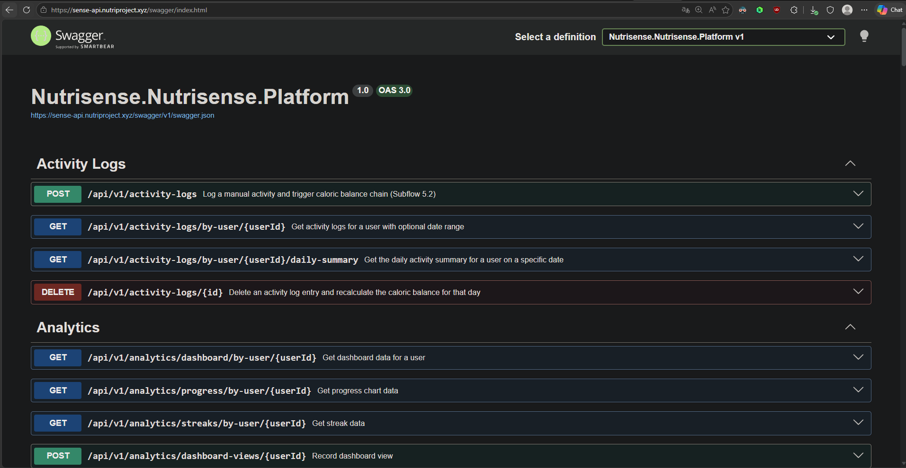

**Aplicación web integrada con el backend real**

El frontend Vue, que en el Sprint 2 operaba con datos mock de `json-server`, fue reconectado a los endpoints REST de producción. La imagen muestra la aplicación web en funcionamiento completo: el dashboard refleja datos reales calculados por los servicios de BodyHealthMetrics y AnalyticsReporting, el log nutricional persiste entradas validadas por NutritionTracking, y las recomendaciones son generadas en tiempo real por SmartRecommendations con integración de DeepSeek y OpenWeatherMap.

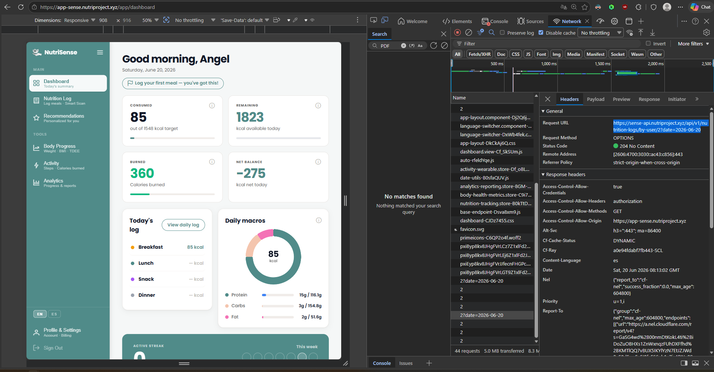

El video de demostración del Sprint 3 ilustra el flujo completo end-to-end de la plataforma: registro de usuario y disparo de la saga onboarding (IMC → BMR → TDEE → meta diaria de calorías y macros), escaneo de plato con visión por IA de Gemini y persistencia en el log nutricional, generación de recomendaciones contextualizadas con clima en tiempo real y filtro por restricciones dietéticas, activación de suscripción premium vía Stripe con habilitación automática de funciones en SmartRecommendations, sincronización de actividad desde Google Fit y recálculo del balance calórico, y exportación del reporte PDF de analíticas (función Premium). Toda la navegación ocurre sobre el frontend en producción consumiendo los endpoints reales del backend desplegado.

**URL del video de demostración del Sprint 3:** [URL del Sprint3](https://upcedupe-my.sharepoint.com/:v:/g/personal/u202417857_upc_edu_pe/IQBgEMJ6UyueRIQnRWhIuMW2AQ68s3YjwHNILv_AZIsMhBA?nav=eyJyZWZlcnJhbEluZm8iOnsicmVmZXJyYWxBcHAiOiJPbmVEcml2ZUZvckJ1c2luZXNzIiwicmVmZXJyYWxBcHBQbGF0Zm9ybSI6IldlYiIsInJlZmVycmFsTW9kZSI6InZpZXciLCJyZWZlcnJhbFZpZXciOiJNeUZpbGVzTGlua0NvcHkifX0&e=gZiw5I)

#### 5.2.3.6. Services Documentation Evidence for Sprint Review

Durante el Sprint 3, el equipo documentó la totalidad de los Web Services de la plataforma NutriSense con **OpenAPI 3**, generada automáticamente por Swashbuckle a partir de las anotaciones del código fuente (`[SwaggerOperation]`, `[SwaggerResponse]`, `[ProducesResponseType]`) y de los DTO de request/response de la capa `Interfaces/REST`. La especificación se expone mediante **Swagger UI**, habilitada de forma intencional en todos los entornos —incluido producción—, lo que permite tanto a los evaluadores como al equipo de frontend explorar y probar cada endpoint directamente desde el navegador, sin configuración adicional.

En esta iteración se documentaron los **78 endpoints REST** versionados bajo `/api/v1/`, distribuidos en los siete bounded contexts del backend. Para cada operación la documentación detalla: el verbo HTTP, la ruta y sintaxis de llamada, los parámetros (path, query y headers), el cuerpo de solicitud, el esquema de respuesta y los códigos de estado, incorporando además mensajes de error en lenguaje natural mediante un tipo `ErrorResponse` localizable por cultura (`Accept-Language`). También se documentó el esquema de seguridad **Bearer JWT** (botón *Authorize* de Swagger UI) y los content-types especiales, como `application/pdf` para la exportación de reportes de analíticas. El principal logro de documentación del sprint fue la incorporación de los códigos de estado HTTP y los `ErrorResponse` tipados a la especificación OpenAPI, entregados en la rama `feature/swagger-status-codes-natural-errors`.

**Acceso a la documentación desplegada**

| Recurso | URL |
|---|---|
| Swagger UI (producción) | [https://sense-api.nutriproject.xyz/swagger/index.html](https://sense-api.nutriproject.xyz/swagger/index.html) |
| OpenAPI JSON (producción) | [https://sense-api.nutriproject.xyz/swagger/v1/swagger.json](https://sense-api.nutriproject.xyz/swagger/v1/swagger.json) |
| API base URL | `https://sense-api.nutriproject.xyz/api/v1` |
| Repositorio del Web Service | [https://github.com/upc-pre-202610-1asi0730-12053-nutrisens/nutrisense-platform](https://github.com/upc-pre-202610-1asi0730-12053-nutrisens/nutrisense-platform) |

**Commits relacionados con Documentación (Sprint 3)**

Rama `feature/swagger-status-codes-natural-errors` del repositorio `nutrisense-platform`:

| Commit Id | Mensaje |
|---|---|
| `e817c1f` | feat(shared): add natural-language error messages and typed ErrorResponse |
| `bba2c5f` | refactor(rest): return typed ErrorResponse from result assemblers |
| `ce31275` | feat(rest): document HTTP status codes in Swagger with natural-language errors |
| `83de12f` | chore: bump version to 1.0.0 |

**Convenciones aplicables a todos los endpoints**

- **Base path:** todas las rutas cuelgan de `/api/v1/...`, con enrutamiento en minúsculas y kebab-case.
- **Content type:** `application/json` para solicitudes y respuestas (excepto la exportación de reportes, que devuelve `application/pdf`).
- **Autenticación:** los endpoints marcados como *Bearer* requieren la cabecera `Authorization: Bearer <JWT>`, obtenida desde `POST /api/v1/authentication/sign-in`. Los marcados como *Público* permiten acceso anónimo.
- **Formato de error:** los errores de negocio devuelven un `ErrorResponse` tipado `{ "message": "..." }`; los fallos de autenticación y los no controlados usan `ProblemDetails` (RFC 7807, `application/problem+json`).
- **Localización:** culturas soportadas `en`, `en-US`, `es`, `es-PE`.

**Distribución de endpoints documentados por bounded context**

| Bounded Context | Endpoints |
|---|---|
| IAM (Identity & Access Management) | 11 |
| Body Health Metrics | 8 |
| Nutrition Tracking | 14 |
| Activity & Wearable | 8 |
| Analytics & Reporting | 5 |
| Subscriptions & Billing | 11 |
| Smart Recommendations | 21 |
| **Total** | **78** |

A continuación se detalla, para cada bounded context, la relación de endpoints documentados con su verbo HTTP, sintaxis de llamada, parámetros, esquema de autenticación y respuesta de éxito. Cada grupo incluye el enlace directo a su sección en la documentación desplegada.

##### IAM — Identity & Access Management

Documentación desplegada: [Authentication](https://sense-api.nutriproject.xyz/swagger/index.html#/Authentication) · [Users](https://sense-api.nutriproject.xyz/swagger/index.html#/Users) · [Sessions](https://sense-api.nutriproject.xyz/swagger/index.html#/Sessions)

| Verbo | Sintaxis de llamada | Parámetros | Auth | Respuesta de éxito |
|---|---|---|---|---|
| POST | `/api/v1/authentication/sign-up` | Body: `RegisterUserResource` | Público | `201` · `UserResource` (perfil creado) |
| POST | `/api/v1/authentication/sign-in` | Body: `LoginUserResource` | Público | `200` · `LoginResponseResource` (userId, token JWT, sessionId) |
| GET | `/api/v1/users/{id}` | Path: `id` | Bearer | `200` · `UserResource` |
| GET | `/api/v1/users/by-email` | Query: `email` | Bearer | `200` · `UserResource` |
| PUT | `/api/v1/users/{id}/health-goal` | Path: `id`; Body: `SetHealthGoalResource` | Bearer | `200` · `UserResource` |
| PUT | `/api/v1/users/{id}/dietary-restrictions` | Path: `id`; Body: `SetDietaryRestrictionsResource` | Bearer | `200` · `UserResource` |
| PUT | `/api/v1/users/{id}/profile` | Path: `id`; Body: `UpdateProfileResource` | Bearer | `200` · `UserResource` |
| DELETE | `/api/v1/users/{id}` | Path: `id` | Bearer | `204` No Content |
| GET | `/api/v1/users/{id}/dietary-restrictions` | Path: `id` | Bearer | `200` · `string[]` |
| GET | `/api/v1/users/{userId}/sessions` | Path: `userId` | Bearer | `200` · `SessionResource[]` |
| POST | `/api/v1/users/{userId}/sessions/{sessionId}/logout` | Path: `userId`, `sessionId` | Bearer | `204` No Content |

##### Body Health Metrics

Documentación desplegada: [Body Metrics](https://sense-api.nutriproject.xyz/swagger/index.html#/Body%20Metrics)

| Verbo | Sintaxis de llamada | Parámetros | Auth | Respuesta de éxito |
|---|---|---|---|---|
| POST | `/api/v1/body-metrics` | Body: `RegisterBodyMetricsResource` | Bearer | `201` · `BodyMetricsResource` (IMC/BMR/TDEE calculados) |
| PUT | `/api/v1/body-metrics/{userId}/weight` | Path: `userId`; Body: `UpdateWeightResource` | Bearer | `200` · `BodyMetricsResource` (recalcula IMC/TDEE) |
| POST | `/api/v1/body-metrics/{userId}/body-measurements` | Path: `userId`; Body: `RegisterBodyMeasurementResource` | Bearer | `201` · `BodyMetricsResource` |
| PUT | `/api/v1/body-metrics/{userId}/health-goal` | Path: `userId`; Body: `SetHealthGoalResource` | Bearer | `200` · `BodyMetricsResource` |
| GET | `/api/v1/body-metrics/by-user/{userId}` | Path: `userId` | Bearer | `200` · `BodyMetricsResource` (`null` si no existe perfil) |
| GET | `/api/v1/body-metrics/{userId}/bmi` | Path: `userId` | Bearer | `200` · `BmiResource` (value, category) |
| GET | `/api/v1/body-metrics/{userId}/daily-caloric-goal` | Path: `userId` | Bearer | `200` · `DailyCaloricGoalResource` |
| GET | `/api/v1/body-metrics/{userId}/weight-history` | Path: `userId`; Query: `from`, `to` | Bearer | `200` · `WeightLogResource[]` |

##### Nutrition Tracking

Documentación desplegada: [Nutrition Logs](https://sense-api.nutriproject.xyz/swagger/index.html#/Nutrition%20Logs) · [Foods](https://sense-api.nutriproject.xyz/swagger/index.html#/Foods)

| Verbo | Sintaxis de llamada | Parámetros | Auth | Respuesta de éxito |
|---|---|---|---|---|
| POST | `/api/v1/nutrition-logs` | Body: `LogMealResource` | Bearer | `201` · `NutritionLogResource` |
| GET | `/api/v1/nutrition-logs/by-user/{userId}` | Path: `userId`; Query: `date` (`yyyy-MM-dd`) | Bearer | `200` · `NutritionLogResource[]` |
| PATCH | `/api/v1/nutrition-logs/{entryId}` | Path: `entryId`; Body: `UpdateNutritionLogResource` | Bearer | `200` · `NutritionLogResource` |
| DELETE | `/api/v1/nutrition-logs/{entryId}` | Path: `entryId` (owner del JWT) | Bearer | `204` No Content |
| GET | `/api/v1/nutrition-logs/by-user/{userId}/daily-summary` | Path: `userId`; Query: `date` | Bearer | `200` · `DailyMacroSummaryResource` |
| GET | `/api/v1/nutrition-logs/by-user/{userId}/history` | Path: `userId`; Query: `from`, `to` | Bearer | `200` · `NutritionLogResource[]` |
| POST | `/api/v1/nutrition-logs/scan-dish` | Body: `ScanPhotoResource` | Bearer | `200` · `ScanPreviewResource` (visión Gemini; no persiste) |
| POST | `/api/v1/nutrition-logs/scan-dish/confirm` | Body: `ConfirmScanResource` | Bearer | `201` · `NutritionLogResource` |
| POST | `/api/v1/nutrition-logs/scan-menu` | Body: `ScanPhotoResource` | Bearer | `200` · `MenuOptionsPreviewResource` (no persiste) |
| POST | `/api/v1/nutrition-logs/scan-menu/select` | Body: `SelectMenuOptionResource` | Bearer | `201` · `NutritionLogResource` |
| GET | `/api/v1/foods` | Query: `query`, `language` | Público | `200` · `FoodSearchResultResource[]` |
| GET | `/api/v1/foods/{id}` | Path: `id` | Público | `200` · `FoodResource` |
| POST | `/api/v1/foods` | Body: `RegisterFoodResource` | Bearer (admin) | `201` · `FoodResource` |
| POST | `/api/v1/foods/import` | Body: `ImportFoodsResource` | Bearer (admin) | `200` · `{ imported }` (importación USDA) |

##### Activity & Wearable

Documentación desplegada: [Activity Logs](https://sense-api.nutriproject.xyz/swagger/index.html#/Activity%20Logs) · [Wearable Connections](https://sense-api.nutriproject.xyz/swagger/index.html#/Wearable%20Connections)

| Verbo | Sintaxis de llamada | Parámetros | Auth | Respuesta de éxito |
|---|---|---|---|---|
| POST | `/api/v1/activity-logs` | Body: `LogManualActivityResource` | Bearer | `201` · `ActivityLogResource` (dispara balance calórico) |
| GET | `/api/v1/activity-logs/by-user/{userId}` | Path: `userId`; Query: `from`, `to` | Bearer | `200` · `ActivityLogResource[]` |
| GET | `/api/v1/activity-logs/by-user/{userId}/daily-summary` | Path: `userId`; Query: `date` | Bearer | `200` · `DailyActivitySummaryResource` |
| DELETE | `/api/v1/activity-logs/{id}` | Path: `id`; Query: `userId` | Bearer | `204` No Content |
| POST | `/api/v1/wearable-connections` | Body: `ConnectDeviceResource` | Bearer | `201` · `WearableConnectionResource` |
| GET | `/api/v1/wearable-connections/by-user/{userId}` | Path: `userId` | Bearer | `200` · `WearableConnectionResource[]` |
| POST | `/api/v1/wearable-connections/{id}/sync` | Path: `id` | Bearer | `200` · `WearableConnectionResource` |
| DELETE | `/api/v1/wearable-connections/{id}` | Path: `id` | Bearer | `204` No Content |

##### Analytics & Reporting

Documentación desplegada: [Analytics](https://sense-api.nutriproject.xyz/swagger/index.html#/Analytics)

| Verbo | Sintaxis de llamada | Parámetros | Auth | Respuesta de éxito |
|---|---|---|---|---|
| GET | `/api/v1/analytics/dashboard/by-user/{userId}` | Path: `userId`; Query: `date` | Bearer | `200` · `DashboardResource` |
| GET | `/api/v1/analytics/progress/by-user/{userId}` | Path: `userId`; Query: `from`, `to` | Bearer | `200` · `ProgressChartResource` |
| GET | `/api/v1/analytics/streaks/by-user/{userId}` | Path: `userId` | Bearer | `200` · `StreakResource` |
| POST | `/api/v1/analytics/dashboard-views/{userId}` | Path: `userId` | Bearer | `204` No Content |
| POST | `/api/v1/analytics/export/{userId}` | Path: `userId`; Query: `from`, `to` | Bearer | `200` · `application/pdf` (requiere Premium) |

##### Subscriptions & Billing

Documentación desplegada: [Subscription Plans](https://sense-api.nutriproject.xyz/swagger/index.html#/Subscription%20Plans) · [User Subscriptions](https://sense-api.nutriproject.xyz/swagger/index.html#/User%20Subscriptions) · [Payment Methods](https://sense-api.nutriproject.xyz/swagger/index.html#/Payment%20Methods) · [Payments](https://sense-api.nutriproject.xyz/swagger/index.html#/Payments)

| Verbo | Sintaxis de llamada | Parámetros | Auth | Respuesta de éxito |
|---|---|---|---|---|
| GET | `/api/v1/subscription-plans` | — | Público | `200` · `SubscriptionPlanResource[]` |
| GET | `/api/v1/subscription-plans/{key}` | Path: `key` | Público | `200` · `SubscriptionPlanResource` |
| POST | `/api/v1/user-subscriptions` | Body: `SelectSubscriptionPlanResource` | Bearer | `201` · `UserSubscriptionResource` (activación vía Stripe) |
| GET | `/api/v1/user-subscriptions/by-user/{userId}` | Path: `userId` | Bearer | `200` · `UserSubscriptionResource` |
| POST | `/api/v1/user-subscriptions/{id}/cancel` | Path: `id`; Body: `CancelSubscriptionResource` | Bearer | `200` · `UserSubscriptionResource` |
| POST | `/api/v1/user-subscriptions/{id}/renew` | Path: `id` | Bearer | `200` · `UserSubscriptionResource` |
| PUT | `/api/v1/user-subscriptions/{id}/plan` | Path: `id`; Body: `ChangeSubscriptionPlanResource` | Bearer | `200` · `UserSubscriptionResource` |
| POST | `/api/v1/payment-methods` | Body: `RegisterPaymentMethodResource` | Bearer | `201` · `PaymentMethodResource` |
| GET | `/api/v1/payment-methods/by-user/{userId}` | Path: `userId` | Bearer | `200` · `PaymentMethodResource[]` |
| DELETE | `/api/v1/payment-methods/{id}` | Path: `id` | Bearer | `204` No Content |
| GET | `/api/v1/payments/by-subscription/{subscriptionId}` | Path: `subscriptionId` | Bearer | `200` · `PaymentRecordResource[]` |

##### Smart Recommendations

Documentación desplegada: [Recommendations](https://sense-api.nutriproject.xyz/swagger/index.html#/Recommendations) · [Ingredient Catalog](https://sense-api.nutriproject.xyz/swagger/index.html#/Ingredient%20Catalog) · [Pantry](https://sense-api.nutriproject.xyz/swagger/index.html#/Pantry) · [Location Preferences](https://sense-api.nutriproject.xyz/swagger/index.html#/Location%20Preferences) · [Cities](https://sense-api.nutriproject.xyz/swagger/index.html#/Cities) · [Recipes](https://sense-api.nutriproject.xyz/swagger/index.html#/Recipes)

| Verbo | Sintaxis de llamada | Parámetros | Auth | Respuesta de éxito |
|---|---|---|---|---|
| GET | `/api/v1/recommendations/by-user/{userId}` | Path: `userId` | Bearer | `200` · `RecommendationCardResource[]` |
| POST | `/api/v1/recommendations/generate/{userId}` | Path: `userId`; Body: `GenerateRecommendationResource` | Bearer | `200` · `RecommendationCardResource` |
| GET | `/api/v1/ingredient-catalog` | — | Público | `200` · `IngredientCatalogItemResource[]` |
| GET | `/api/v1/pantry/by-user/{userId}` | Path: `userId` | Bearer | `200` · `PantryResource` (`null` si no existe) |
| POST | `/api/v1/pantry/{userId}/items` | Path: `userId`; Body: `RegisterPantryItemsResource` | Bearer | `200` · `PantryResource` |
| DELETE | `/api/v1/pantry/{userId}/items/{itemId}` | Path: `userId`, `itemId` | Bearer | `200` · `PantryResource` |
| PATCH | `/api/v1/pantry/{userId}/items/{id}` | Path: `userId`, `id`; Body: `UpdatePantryItemResource` | Bearer | `200` · `PantryResource` |
| GET | `/api/v1/location-preferences/by-user/{userId}` | Path: `userId` | Bearer | `200` · `LocationPreferenceResource` |
| PUT | `/api/v1/location-preferences/{userId}/travel-mode/enable` | Path: `userId`; Body: `EnableTravelModeResource` | Bearer | `200` · `LocationPreferenceResource` |
| PUT | `/api/v1/location-preferences/{userId}/travel-mode/disable` | Path: `userId` | Bearer | `200` · `LocationPreferenceResource` |
| POST | `/api/v1/location-preferences/{userId}/detect` | Path: `userId`; Body: `DetectLocationResource` | Bearer | `200` · `LocationPreferenceResource` |
| PUT | `/api/v1/location-preferences/{userId}/home-city` | Path: `userId`; Body: `SetHomeCityResource` | Bearer | `200` · `LocationPreferenceResource` |
| GET | `/api/v1/cities` | — | Público | `200` · `CityResource[]` |
| GET | `/api/v1/cities/search` | Query: `q`, `limit` | Público | `200` · `CitySearchResultResource[]` |
| GET | `/api/v1/cities/{id}` | Path: `id` | Público | `200` · `CityResource` |
| POST | `/api/v1/cities` | Body: `ImportCityResource` | Bearer | `200` · `CityResource` |
| GET | `/api/v1/cities/{id}/weather` | Path: `id` | Bearer | `200` · `WeatherResource` (OpenWeatherMap) |
| GET | `/api/v1/recipes` | Query: `goal`, `maxPrepMinutes` | Público | `200` · `RecipeResource[]` |
| GET | `/api/v1/recipes/{id}` | Path: `id` | Público | `200` · `RecipeResource` |
| POST | `/api/v1/recipes/suggest/{userId}` | Path: `userId` | Bearer | `200` · `RecipeResource` |
| POST | `/api/v1/recipes/import` | Body: `ImportRecipesResource` | Bearer (admin) | `200` · `{ generated }` (recetas IA) |

**Ejemplos de llamada y explicación del response**

A modo ilustrativo se presentan, con datos de muestra, ejemplos representativos de las operaciones más relevantes del backend, mostrando el cuerpo de solicitud, la respuesta de éxito y su interpretación.

*1. Autenticación — `POST /api/v1/authentication/sign-in`*

Solicitud:

```json
{ "email": "ana.torres@example.com", "password": "Str0ng!Pass", "deviceLabel": "iPhone 14" }
```

Respuesta `200 OK`:

```json
{ "userId": 42, "token": "eyJhbGciOiJIUzI1NiIsInR5cCI6IkpXVCJ9...", "sessionId": 1001 }
```

El response devuelve el identificador del usuario, el **token JWT** (HMAC-SHA256, emisor `nutrisense-platform`, audiencia `nutrisense-clients`) que debe enviarse como `Authorization: Bearer <token>` en los endpoints protegidos, y el `sessionId` de la sesión recién abierta. Ante credenciales incorrectas el endpoint responde `401` y, si el correo no existe, `404`.

*2. Registro de métricas corporales — `POST /api/v1/body-metrics`*

Solicitud:

```json
{
  "userId": 42, "heightCm": 168.5, "weightKg": 64.0, "dateOfBirth": "1995-04-12",
  "biologicalSex": "F", "activityLevel": "Moderate", "goal": "Lose", "weeklyRateKg": 0.5
}
```

Respuesta `201 Created` (extracto):

```json
{
  "userId": 42, "currentWeightKg": 64.0, "bmiValue": 22.5, "bmiCategory": "Normal",
  "bmr": 1395.0, "tdee": 2162.0, "activeGoal": "Lose", "activeGoalCaloricAdjustment": -550.0,
  "dailyCalories": 1612, "proteinG": 121.0, "carbsG": 160.0, "fatG": 45.0, "fiberG": 25.0
}
```

El response materializa la saga de cálculo del onboarding: a partir de los datos antropométricos el servicio computa el **IMC** y su categoría OMS, el **BMR** (Mifflin-St Jeor), el **TDEE** según el nivel de actividad y, en función de la meta, el ajuste calórico y la **meta diaria** de calorías y macronutrientes. Si el usuario ya tenía métricas registradas, devuelve `409`.

*3. Escaneo de plato con IA — `POST /api/v1/nutrition-logs/scan-dish`*

Solicitud:

```json
{ "userId": 42, "imageBase64OrUri": "data:image/jpeg;base64,/9j/4AAQSkZJRg..." }
```

Respuesta `200 OK` (extracto):

```json
{
  "items": [
    { "foodId": 88, "nameEn": "Grilled chicken", "nameEs": "Pollo a la parrilla",
      "estimatedQuantityG": 220.0, "caloriesPer100g": 165.0, "proteinPer100g": 31.0,
      "carbsPer100g": 0.0, "fatPer100g": 3.6, "isEstimate": true }
  ]
}
```

El endpoint analiza la foto del plato mediante visión por IA (Gemini) y devuelve una **vista previa** de los alimentos detectados con su cantidad estimada y aporte nutricional, sin persistir nada todavía (`isEstimate: true`). El usuario confirma posteriormente el registro con `POST /api/v1/nutrition-logs/scan-dish/confirm`. Si la imagen no puede analizarse, responde `422`.

*4. Activación de suscripción — `POST /api/v1/user-subscriptions`*

Solicitud:

```json
{ "userId": 42, "planKey": "premium", "paymentMethodId": 55, "billingPeriod": "monthly" }
```

Respuesta `201 Created` (extracto):

```json
{
  "id": 900, "userId": 42, "planKey": "premium", "status": "active", "billingPeriod": "monthly",
  "periodStart": "2026-06-20T00:00:00.000Z", "periodEnd": "2026-07-20T00:00:00.000Z",
  "stripeSubscriptionId": "sub_1Nxyz...", "paymentMethodId": 55
}
```

El response confirma la suscripción activa con su periodo de vigencia y el identificador de la suscripción en **Stripe**. Si el cobro no puede procesarse devuelve `402`, y si el usuario ya cuenta con una suscripción activa, `409`.

*5. Exportación de reporte PDF (Premium) — `POST /api/v1/analytics/export/{userId}`*

Llamada: `POST /api/v1/analytics/export/42?from=2026-06-01&to=2026-06-20`

Respuesta `200 OK`: el endpoint devuelve directamente un archivo **PDF** (`Content-Type: application/pdf`) con el reporte de analíticas del rango solicitado. Por tratarse de una función Premium, si el usuario no posee dicha suscripción responde `403`.

**Evidencia de interacción con la documentación desplegada**

La siguiente captura muestra la interfaz Swagger UI desplegada en producción, donde se exponen los siete bounded contexts con sus respectivas operaciones agrupadas por tag. Desde esta interfaz es posible expandir cada endpoint, inspeccionar sus parámetros y esquemas, autenticarse con un token JWT mediante el botón **Authorize** y ejecutar llamadas reales con datos de muestra a través de la función *Try it out*.


#### 5.2.3.7. Software Deployment Evidence for Sprint Review

Durante el Sprint 3 se realizaron los despliegues correspondientes a los tres productos que conforman la plataforma NutriSense: la Landing Page (ya publicada desde el Sprint 1 y sin cambios en este sprint), la Web Application (reconfigurada para consumir el backend real en lugar del mock), y el nuevo Web Service (`nutrisense-platform`), el backend .NET 10 desplegado por primera vez en producción. El proceso abarcó la creación del repositorio del backend, el aprovisionamiento de una base de datos MySQL en la nube, la configuración de variables de entorno para conexión con servicios externos, y el despliegue continuo del backend mediante Coolify. A continuación se describen los pasos realizados.

##### Creación del repositorio en GitHub

Se creó el repositorio público `nutrisense-platform` bajo la organización `upc-pre-202610-1asi0730-12053-nutrisens` en GitHub. Este repositorio centraliza el código fuente del backend .NET 10 organizado por bounded contexts y sirve como base para el despliegue continuo mediante Coolify.

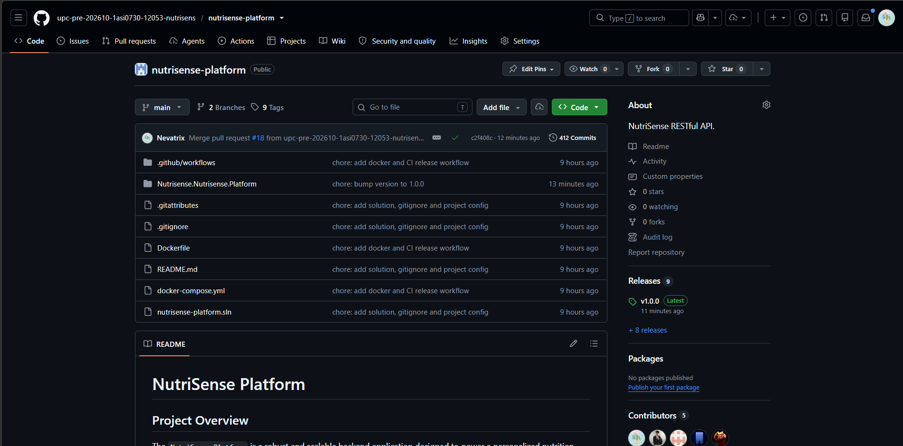

[Link del repositorio nutrisense-platform](https://github.com/upc-pre-202610-1asi0730-12053-nutrisens/nutrisense-platform)

##### Configuración de ramas bajo Gitflow

Se estableció la estructura de ramas siguiendo Gitflow:

- `main` → rama de producción (fuente de despliegue)
- `develop` → rama de integración
- `feature/*` → ramas de desarrollo por bounded context

Todo el trabajo fue integrado mediante Pull Requests desde las ramas `feature/*` hacia `develop`, y finalmente desde `develop` hacia `main` como parte del release `v1.0.0`.

##### Merge a main y creación del tag de release

Una vez completadas todas las features del sprint, se realizó el merge de `develop` a `main` mediante un Pull Request en GitHub, etiquetando el commit resultante como `v1.0.0`.

##### Aprovisionamiento de la base de datos MySQL en la nube

Para la persistencia de datos del backend se aprovisionó una instancia MySQL en la nube. Se configuraron las credenciales de acceso, el nombre de la base de datos y las reglas de red necesarias para permitir la conexión desde el servidor de Coolify. El esquema de tablas fue generado automáticamente por EF Core al iniciar la aplicación mediante `Database.EnsureCreated()`.

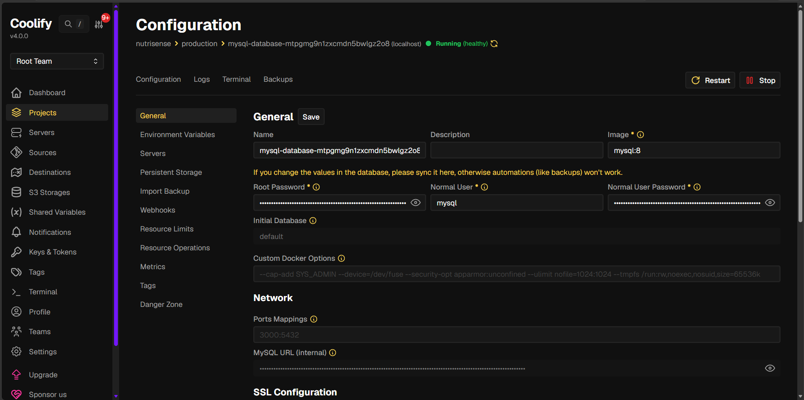

##### Configuración del despliegue del backend en Coolify

Para habilitar el despliegue continuo del backend (`nutrisense-platform`) desde el repositorio se siguieron los pasos:

1. Ingresar al panel de administración de Coolify
2. Crear una nueva aplicación seleccionando **GitHub** como fuente
3. Conectar el repositorio `nutrisense-platform` de la organización `upc-pre-202610-1asi0730-12053-nutrisens`
4. Configurar los parámetros de build:
   - **Build pack:** Dockerfile
   - **Branch:** `main`
5. Asignar el dominio personalizado `api.nutriproject.xyz` en la sección **Domains**
6. Configurar las variables de entorno necesarias (detalladas en el paso siguiente)
7. Guardar la configuración y ejecutar el primer despliegue manual

Coolify procesó el `Dockerfile` del repositorio, construyó la imagen .NET 10, y levantó el contenedor del backend bajo el dominio configurado.

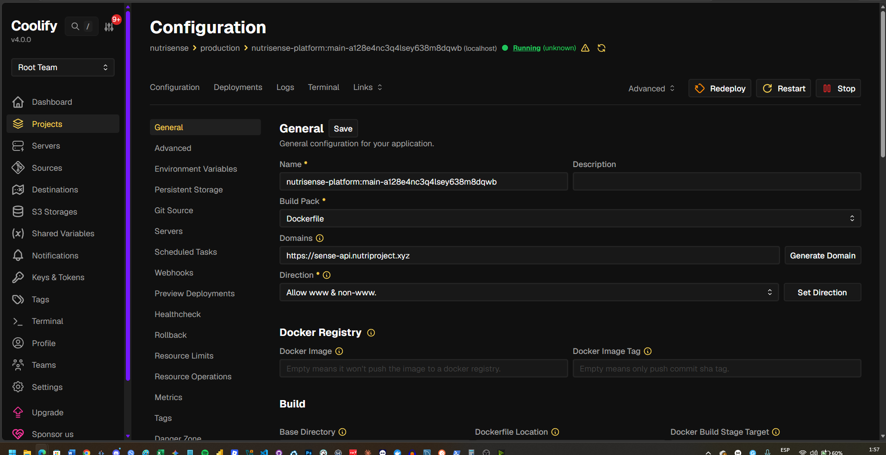

##### Configuración de variables de entorno

El backend requirió la configuración de variables de entorno para la conexión a la base de datos MySQL y para la integración con los servicios externos: Gemini (visión por IA), DeepSeek (estimación de macros y recomendaciones), USDA FoodData Central (catálogo de alimentos), OpenWeatherMap (clima en tiempo real), Google Fit (wearables) y Stripe (pagos). Estas variables fueron registradas de forma segura en el panel de Coolify bajo la sección **Environment Variables**, sin exponerlas en el código fuente.

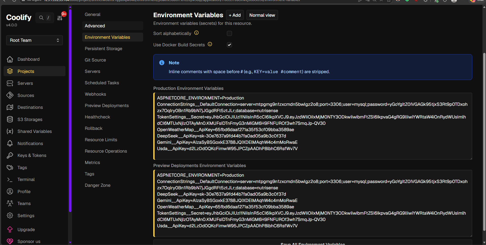

##### Reconexión del frontend al backend real

Con el backend operativo en producción, el frontend Vue (`nutrisense-webapp`) fue actualizado para apuntar a los endpoints reales de `api.nutriproject.xyz` en lugar del mock `json-server` utilizado durante el Sprint 2. Se actualizó la variable de entorno `VITE_API_BASE_URL` en la configuración de Coolify del frontend y se ejecutó un nuevo despliegue. La imagen a continuación muestra la aplicación web funcionando de extremo a extremo con datos reales.

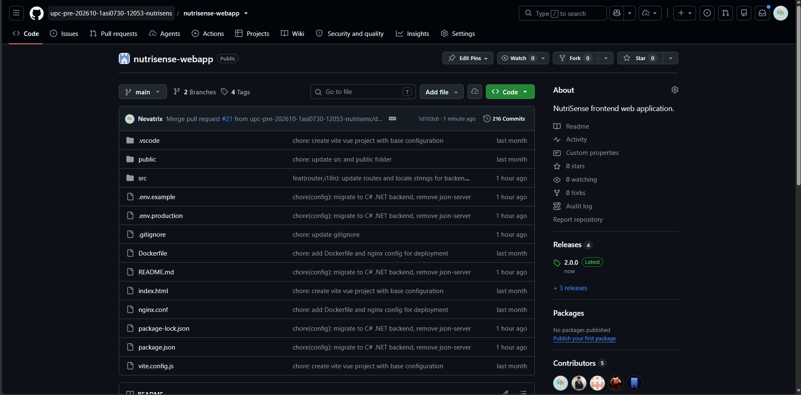

##### Swagger UI disponible en producción

La documentación OpenAPI/Swagger generada automáticamente por el backend fue habilitada en el entorno de producción, permitiendo explorar y probar los 76 endpoints REST desde el navegador sin configuración adicional.


##### URLs de despliegue

| Producto | URL |
|---|---|
| Landing Page | [https://upc-pre-202610-1asi0730-12053-nutrisens.github.io/nutrisense-website/index.html](https://upc-pre-202610-1asi0730-12053-nutrisens.github.io/nutrisense-website/index.html) |
| Web Application | [https://app-sense.nutriproject.xyz](https://app-sense.nutriproject.xyz) |
| Web Service (API) | [https://sense-api.nutriproject.xyz/api/v1](https://sense-api.nutriproject.xyz/api/v1) |
| Swagger UI | [https://sense-api.nutriproject.xyz/swagger/index.html](https://sense-api.nutriproject.xyz/swagger/index.html) |

#### 5.2.3.8. Team Collaboration Insights during Sprint

Durante el Sprint 3, todos los miembros del equipo participaron activamente en las actividades de implementación, tal como se refleja en los analíticos de colaboración de GitHub. Como se puede observar en la gráfica de contribuciones, los integrantes Nevatrix, xJoelFMRx, olenkisha14, Emy127 y roseal28 realizaron commits de manera constante a lo largo del sprint, cada uno liderando el desarrollo y refinamiento de su bounded context asignado, así como colaborando en la integración del backend con el frontend y en las correcciones derivadas de las entrevistas de validación.

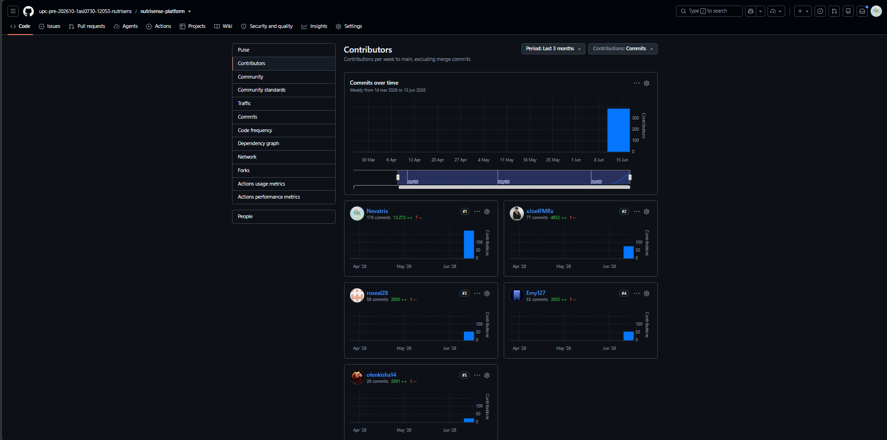

## 5.3. Validation Interviews

### 5.3.1. Diseño de Entrevistas

**Objetivo de la entrevista:**
Los objetivos son de validar la usabilidad, efectividad y claridad de NutriSense, asimismo de asegurar que los flujos de usuario sean intuitivos, prácticos y funcionales para los usuarios y su correcta interacción con la plataforma.

#### Segmento 1: Usuarios que buscan perder peso

**Preguntas de introducción:**

1. ¿Cuál es su nombre?
2. ¿Cuántos años tiene?

**Preguntas de validación del Landing Page:**
1. ¿La información presentada al seleccionar la opción "Quiero perder peso" y la redirección al registro le resulta clara y le facilita tomar la decisión correcta como usuario nuevo?
2. ¿Las funciones destacadas relacionadas con el control calórico y el seguimiento de progreso (Smart Scan, historial, métricas de salud) le parecen relevantes para su objetivo de pérdida de peso?
3. ¿La tabla de planes le permite identificar con claridad qué nivel (Basic, Pro, Premium) ofrece las herramientas que usted necesitaría para alcanzar su meta?

**Preguntas de validación del Web Application:**
1. ¿La configuración inicial (objetivo, datos corporales, restricciones alimentarias) le resulta clara para establecer correctamente una meta de pérdida de peso?
2. ¿El anillo de calorías y el gráfico de macronutrientes en el panel principal le permiten identificar de forma sencilla si va encaminado hacia su objetivo del día?
3. ¿El registro de comidas (nutrition log) y el uso del Smart Scan le resultan prácticos para llevar un control constante de lo que consume?
4. ¿El gráfico de progreso corporal (peso, IMC) y la racha semanal le motivan y le permiten visualizar con claridad su evolución a lo largo del tiempo?
5. ¿Las recomendaciones contextuales (recetas según clima, ciudad o despensa) le parecen útiles y alineadas con su objetivo de bajar de peso?

---

#### Segmento 2: Usuarios que buscan ganar masa muscular

**Preguntas de introducción:**

1. ¿Cuál es su nombre?
2. ¿Cuántos años tiene?

**Preguntas de validación del Landing Page:**
1. ¿La información presentada al seleccionar la opción "Quiero ganar masa muscular" y la redirección al registro le resulta clara y le facilita tomar la decisión correcta como usuario nuevo?
2. ¿Las funciones destacadas relacionadas con el seguimiento de proteínas, actividad física y sincronización con wearables le parecen relevantes para su objetivo de aumento de masa muscular?
3. ¿La comparación entre planes le permite identificar con claridad en qué nivel obtendría las herramientas (por ejemplo, sincronización con Google Fit o reportes en PDF) que necesitaría para entrenar y alimentarse de forma controlada?

**Preguntas de validación del Web Application:**
1. ¿La configuración inicial (objetivo, datos corporales, requerimientos calóricos y de proteína) le resulta clara para establecer correctamente una meta de ganancia muscular?
2. ¿El gráfico de macronutrientes y los indicadores de calorías (TDEE/BMR) en el panel principal le permiten identificar con facilidad si está alcanzando su meta de proteína e ingesta calórica diaria?
3. ¿El registro y la sincronización de actividad física (manual o vía Google Fit) le resultan sencillos de operar y le ayudan a relacionar su entrenamiento con su consumo nutricional?
4. ¿El gráfico de progreso corporal (peso, evolución de métricas) le permite visualizar con claridad su avance hacia el aumento de masa muscular?
5. ¿Las recomendaciones de recetas y la gestión de despensa le parecen útiles para planear comidas altas en proteína acordes a su objetivo?

### 5.3.2. Registro de Entrevistas

#### Segmento 1: Pérdida de peso

##### Entrevista 1:

- Nombres y Apellidos: Larisa Ramírez Del Aguila
- Edad: 19 
- Ocupación: Estudiante de Administración y Marketing
- Tiempo: 0:01 - 5:07
- Link: [Link de las entrevistas](https://upcedupe-my.sharepoint.com/:v:/g/personal/u202411669_upc_edu_pe/IQBU36clcWpyQI1G_5_Zchm6Aa71cKA1hiBRHnKmB93f-TA?e=psFq3e&nav=eyJyZWZlcnJhbEluZm8iOnsicmVmZXJyYWxBcHAiOiJTdHJlYW1XZWJBcHAiLCJyZWZlcnJhbFZpZXciOiJTaGFyZURpYWxvZy1MaW5rIiwicmVmZXJyYWxBcHBQbGF0Zm9ybSI6IldlYiIsInJlZmVycmFsTW9kZSI6InZpZXcifSwicGxheWJhY2tPcHRpb25zIjp7InN0YXJ0VGltZUluU2Vjb25kcyI6Mi41M319)
- Resumen: Larisa valoró positivamente la claridad del landing page y la propuesta de valor desde el inicio. Destacó el SmartScan como la funcionalidad más innovadora y práctica. Consideró que el Nutrition Log y el gráfico de macronutrientes facilitan el seguimiento diario. Le agradó que la configuración inicial solicite datos corporales y restricciones alimentarias, ya que genera sensación de personalización. Calificó la experiencia general como "10 de 10".

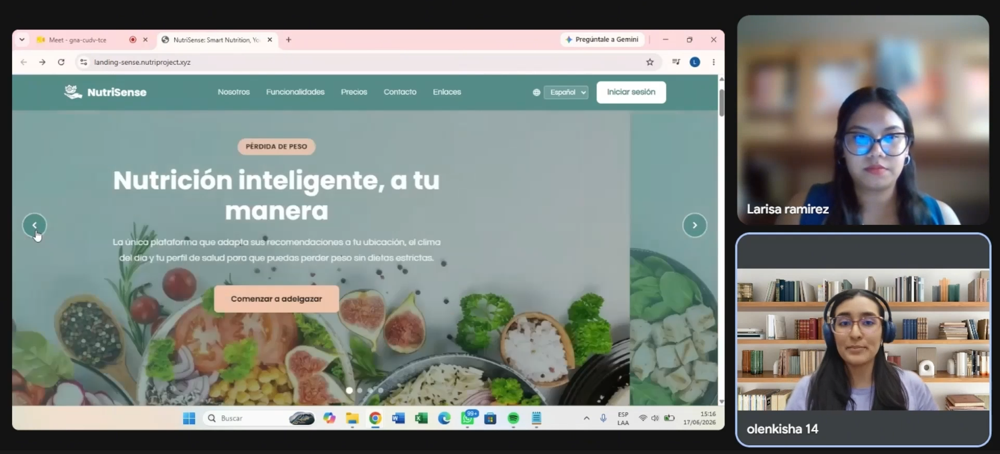

##### Entrevista 2:

- Nombres y Apellidos: Jorge Del Aguila Vacalla
- Edad: 49 
- Ocupación: Administrador de empresas y jefe de garantías y taller
- Tiempo: 5:08 - 10:05
- Link: [Link de las entrevistas](https://upcedupe-my.sharepoint.com/:v:/g/personal/u202411669_upc_edu_pe/IQBU36clcWpyQI1G_5_Zchm6Aa71cKA1hiBRHnKmB93f-TA?e=hnaWgz&nav=eyJyZWZlcnJhbEluZm8iOnsicmVmZXJyYWxBcHAiOiJTdHJlYW1XZWJBcHAiLCJyZWZlcnJhbFZpZXciOiJTaGFyZURpYWxvZy1MaW5rIiwicmVmZXJyYWxBcHBQbGF0Zm9ybSI6IldlYiIsInJlZmVycmFsTW9kZSI6InZpZXcifSwicGxheWJhY2tPcHRpb25zIjp7InN0YXJ0VGltZUluU2Vjb25kcyI6MzA4LjgyfX0%3D)
- Resumen: Jorge encontró la plataforma práctica y didáctica, accesible para cualquier tipo de público. Resaltó que el anillo de calorías y el gráfico de macronutrientes le ayudan a controlar su ingesta diaria. Valoró las recomendaciones contextuales según clima y ciudad, especialmente útiles dado que su trabajo implica viajar constantemente. Como sugerencia, propuso agregar videos testimoniales de usuarios que lograron bajar de peso para mayor motivación.

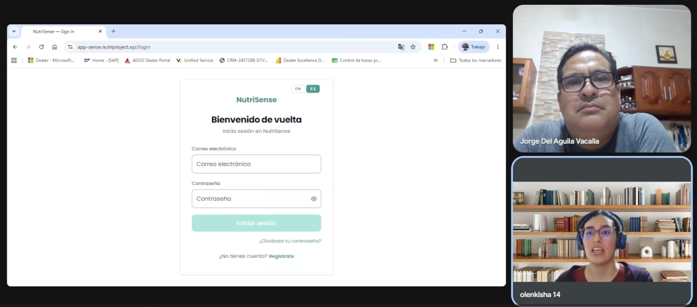

##### Entrevista 3:

- Nombres y Apellidos: Tatiana Mozombite Miranda
- Edad: 25 
- Ocupación: Estudiante de idiomas
- Tiempo: 10:06 - 14:44
- Link: [Link de las entrevistas](https://upcedupe-my.sharepoint.com/:v:/g/personal/u202411669_upc_edu_pe/IQBU36clcWpyQI1G_5_Zchm6Aa71cKA1hiBRHnKmB93f-TA?e=6f2Ocj&nav=eyJyZWZlcnJhbEluZm8iOnsicmVmZXJyYWxBcHAiOiJTdHJlYW1XZWJBcHAiLCJyZWZlcnJhbFZpZXciOiJTaGFyZURpYWxvZy1MaW5rIiwicmVmZXJyYWxBcHBQbGF0Zm9ybSI6IldlYiIsInJlZmVycmFsTW9kZSI6InZpZXcifSwicGxheWJhY2tPcHRpb25zIjp7InN0YXJ0VGltZUluU2Vjb25kcyI6NjA2LjM2fX0%3D)
- Resumen: Tatiana consideró que el landing page es claro y que las funcionalidades destacadas como Smart Scan y Nutrición Global son relevantes para su objetivo de pérdida de peso. Encontró útil la tabla de planes para comparar niveles. Dentro de la aplicación, valoró el gráfico de macronutrientes y el Smart Scan por indicarle el porcentaje de calorías y proteínas que consume. Indicó que el gráfico de progreso corporal y las recomendaciones por ubicación y despensa son funcionalidades muy útiles, y que usaría la app si estuviera disponible.

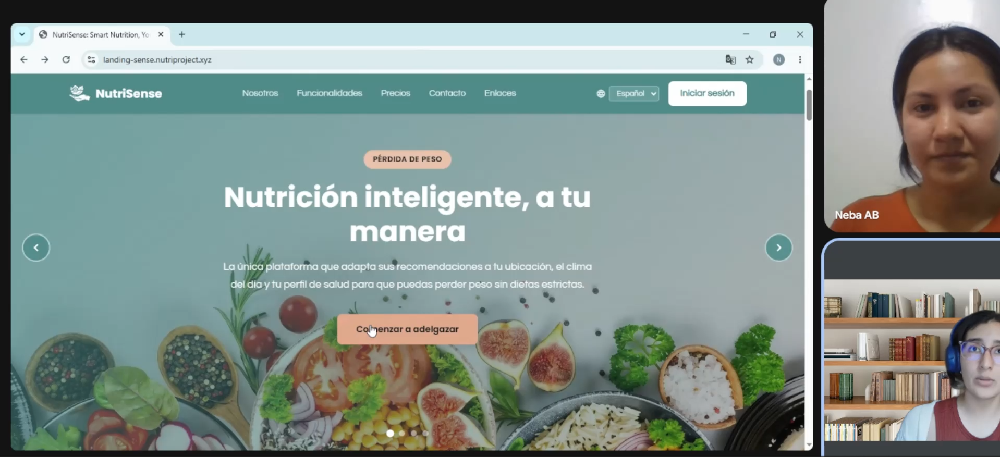

#### Segmento 2: Ganancia de masa muscular

##### Entrevista 1:

- Nombres y Apellidos: Brandon Wildersato Palacios
- Edad: 20
- Ocupación: Estudiante de ingeniería de software
- Tiempo: 14:45 - 19:47 
- Link: [Link de las entrevistas](https://upcedupe-my.sharepoint.com/:v:/g/personal/u202411669_upc_edu_pe/IQBU36clcWpyQI1G_5_Zchm6Aa71cKA1hiBRHnKmB93f-TA?e=r2xlYo&nav=eyJyZWZlcnJhbEluZm8iOnsicmVmZXJyYWxBcHAiOiJTdHJlYW1XZWJBcHAiLCJyZWZlcnJhbFZpZXciOiJTaGFyZURpYWxvZy1MaW5rIiwicmVmZXJyYWxBcHBQbGF0Zm9ybSI6IldlYiIsInJlZmVycmFsTW9kZSI6InZpZXcifSwicGxheWJhY2tPcHRpb25zIjp7InN0YXJ0VGltZUluU2Vjb25kcyI6ODg1LjQ5fX0%3D)
- Resumen: Brandon destacó que la plataforma presenta las opciones de forma clara e intuitiva desde el landing. Consideró muy relevante la sincronización con smartwatch, el seguimiento de proteínas y la actividad física, ya que le evita tener que gestionar esos datos manualmente. Valoró el gráfico circular de macronutrientes y los indicadores TDEE/BMR por ser visualmente atractivos y fáciles de interpretar. Resaltó que el registro de actividad física es sencillo e intuitivo, y que las recomendaciones de recetas según la despensa son muy útiles para cumplir su meta de proteína diaria.

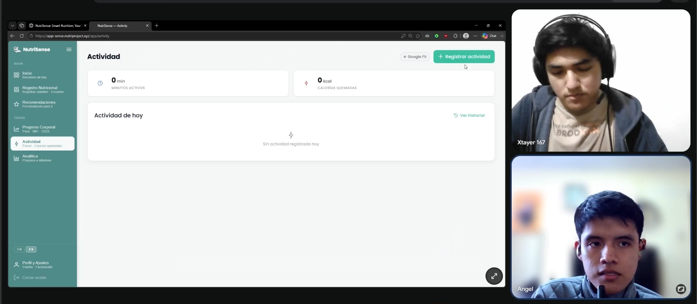

##### Entrevista 2:

- Nombres y Apellidos: David Miguel Ramos Paribón
- Edad: 19
- Ocupación: Estudiante universitario
- Tiempo: 19:48 - 24:47
- Link: [Link de las entrevistas](https://upcedupe-my.sharepoint.com/:v:/g/personal/u202411669_upc_edu_pe/IQBU36clcWpyQI1G_5_Zchm6Aa71cKA1hiBRHnKmB93f-TA?e=btmsmD&nav=eyJyZWZlcnJhbEluZm8iOnsicmVmZXJyYWxBcHAiOiJTdHJlYW1XZWJBcHAiLCJyZWZlcnJhbFZpZXciOiJTaGFyZURpYWxvZy1MaW5rIiwicmVmZXJyYWxBcHBQbGF0Zm9ybSI6IldlYiIsInJlZmVycmFsTW9kZSI6InZpZXcifSwicGxheWJhY2tPcHRpb25zIjp7InN0YXJ0VGltZUluU2Vjb25kcyI6MTE4OC4wNX19)
- Resumen: David encontró que el landing page orienta bien al usuario hacia su objetivo de ganancia muscular. Valoró positivamente la comparación entre planes, ya que permite identificar claramente las herramientas disponibles como la sincronización con Google Fit. Consideró que la configuración inicial es clara e importante para adaptar los requerimientos calóricos y de proteínas. Destacó que los gráficos de progreso corporal y los indicadores de macronutrientes son motivadores y fáciles de entender. Las recomendaciones de recetas según la despensa y ubicación le parecieron muy útiles para planificar comidas acordes a su meta.

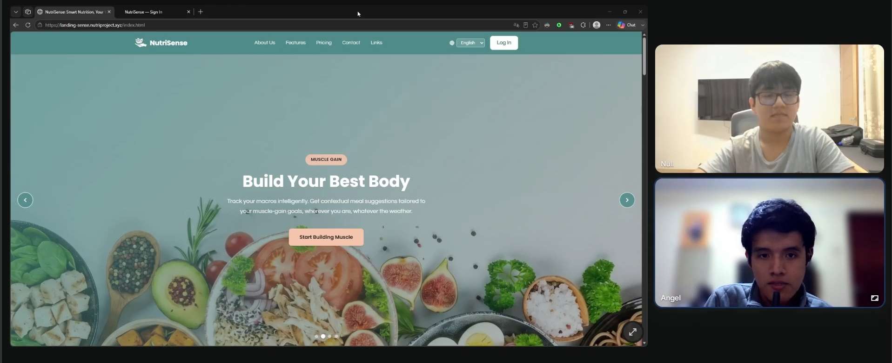

##### Entrevista 3:

- Nombres y Apellidos: Daphne Faustor
- Edad: 25
- Ocupación: Community Manager en el área de marketing (rubro gastronómico aeroportuario)
- Tiempo: 24:48 - 30:53
- Link: [Link de las entrevistas](https://upcedupe-my.sharepoint.com/:v:/g/personal/u202411669_upc_edu_pe/IQBU36clcWpyQI1G_5_Zchm6Aa71cKA1hiBRHnKmB93f-TA?e=8doez4&nav=eyJyZWZlcnJhbEluZm8iOnsicmVmZXJyYWxBcHAiOiJTdHJlYW1XZWJBcHAiLCJyZWZlcnJhbFZpZXciOiJTaGFyZURpYWxvZy1MaW5rIiwicmVmZXJyYWxBcHBQbGF0Zm9ybSI6IldlYiIsInJlZmVycmFsTW9kZSI6InZpZXcifSwicGxheWJhY2tPcHRpb25zIjp7InN0YXJ0VGltZUluU2Vjb25kcyI6MTQ4OC44Nn19)
- Resumen: Daphne resaltó que el landing page ayuda a los usuarios a identificar claramente los distintos objetivos de entrenamiento. Valoró especialmente el Travel Mode y la sincronización con wearables por ser funcionalidades muy prácticas para personas activas que viajan con frecuencia. Destacó la personalización del registro inicial, mencionando que pudo indicar su intolerancia a la lactosa y preferencias alimentarias. Consideró útiles los indicadores de macronutrientes para quienes no controlan su ingesta diaria por sus actividades laborales, y elogió la sincronización con Google Fit por agilizar el registro de actividad física.

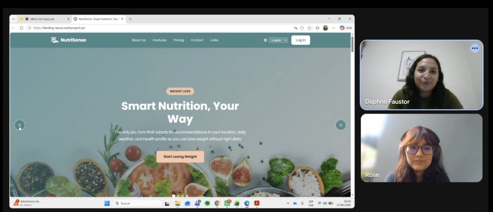

### 5.3.3. Evaluaciones según heurísticas

### UX Heuristics & Principles Evaluation
**Usability – Inclusive Design – Information Architecture**

| Campo | Detalle |
|-------|---------|
| CARRERA | Ingeniería de Software |
| CURSO | 1ASI0730 Aplicaciones Web |
| SECCIÓN | NRC 12053 |
| PROFESORES | Todos |
| AUDITOR | GoldMetrics |
| CLIENTE(S) | NutriSense Team |
| SITE A EVALUAR | Landing Page: https://landing-sense.nutriproject.xyz / Web Application: https://app-sense.nutriproject.xyz |

---

### TAREAS A EVALUAR

El alcance de esta evaluación incluye la revisión de la usabilidad de las siguientes tareas:

1. Navegación general del Landing Page (Home, About Us, Features, Pricing, Contact)
2. Selección de un objetivo desde el Hero y seguimiento del call-to-action correspondiente
3. Selección de un plan de suscripción (Basic, Pro, Premium) y seguimiento del botón "Subscribe Now"
4. Cambio de idioma entre inglés y español
5. Envío del formulario de contacto
6. Consulta de la sección de preguntas frecuentes (FAQ)
7. Registrarse como nuevo usuario y completar el onboarding
8. Flujo de pago y confirmación de suscripción
9. Registrar alimentos en el diario nutricional
10. Registrar actividad física
11. Revisar métricas corporales (IMC, TMB, TDEE)
12. Gestionar perfil, seguridad y eliminación de cuenta
13. Acceder a recomendaciones inteligentes y gestionar la despensa (Plan Pro)
14. Escanear un plato con la cámara (Plan Pro)
15. Escanear un menú de restaurante (Plan Premium)

No están incluidas en esta versión de la evaluación las siguientes tareas:

1. Integración con Google Fit (Wearable Sync)
2. Travel Mode fuera de Lima
3. Exportación de reportes en PDF
4. Analítica avanzada y reportes del plan Premium

---

### ESCALA DE SEVERIDAD

| Nivel | Descripción |
|-------|-------------|
| 1 | Problema superficial: puede ser fácilmente superado por el usuario u ocurre con muy poca frecuencia. No necesita ser corregido a menos que exista disponibilidad de tiempo. |
| 2 | Problema menor: puede ocurrir con más frecuencia o es algo más difícil de superar para el usuario. Se le debería asignar una prioridad baja resolverlo de cara al siguiente release. |
| 3 | Problema mayor: ocurre frecuentemente o los usuarios no son capaces de resolverlo. Es importante que sea corregido y se le debe asignar una prioridad alta. |
| 4 | Problema muy grave: un error de gran impacto que impide al usuario continuar con el uso de la herramienta. Es imperativo que sea corregido antes del lanzamiento. |

---

### TABLA RESUMEN

| # | Problema | Severidad | Heurística / Principio violado | Plan afectado |
|---|----------|-----------|-------------------------------|---------------|
| 1 | Todos los CTA del Landing Page redirigen a la misma URL genérica sin transferir el objetivo o plan seleccionado | 3 | Usability: Consistencia y estándares / Coherencia Landing ↔ App | Todos |
| 2 | La sección Features no indica qué plan incluye cada característica | 2 | Usability: Reconocimiento antes que recuerdo | Todos |
| 3 | Los textos de los planes en la sección Pricing no están traducidos al español | 3 | Usability: Consistencia y estándares / i18n | Todos |
| 4 | El bloque de FAQ se repite de forma idéntica en Home, Features y About Us | 2 | Information Architecture: Organization Systems | Todos |
| 5 | La página About Us no incluye información del equipo | 2 | Information Architecture: Is it useful? | Todos |
| 6 | No existe botón de "volver arriba" en páginas de contenido largo | 1 | Usability: Control y libertad del usuario | Todos |
| 7 | La etiqueta canonical de Features apunta a una URL mal formada | 1 | Information Architecture: SEO Tags and Meta Tags | Todos |
| 8 | El campo de vencimiento muestra "MM/YY" en interfaz en español | 2 | Usability: Coincidencia entre el sistema y el mundo real / i18n | Todos |
| 9 | El formulario de registro no solicita edad ni sexo biológico | 2 | Usability: Prevención de errores | Todos |
| 10 | Las restricciones alimenticias del onboarding no se persisten en el perfil | 3 | Usability: Visibilidad del estado del sistema / Prevención de errores | Todos |
| 11 | La confirmación de pago no ofrece comprobante ni confirma envío de correo | 2 | Usability: Visibilidad del estado del sistema | Pro / Premium |
| 12 | El dashboard muestra kcal disponibles sin contexto ni guía para usuario nuevo | 2 | Usability: Visibilidad del estado del sistema | Todos |
| 13 | El buscador de alimentos tiene base de datos limitada sin opción de agregar manualmente | 2 | Usability: Flexibilidad y eficiencia de uso | Todos |
| 14 | Los valores nutricionales usan abreviaciones P, C, G no explicadas | 2 | Usability: Coincidencia entre el sistema y el mundo real | Todos |
| 15 | Las siglas IMC, TMB y TDEE son inconsistentes en la interfaz en español | 2 | Usability: Consistencia y estándares / i18n | Todos |
| 16 | El registro de actividad física se duplica al confirmar | 3 | Usability: Prevención de errores | Todos |
| 17 | El mensaje de error al eliminar actividad no describe qué ocurrió ni cómo resolverlo | 3 | Usability: Ayuda al usuario a reconocer, diagnosticar y recuperarse de errores | Todos |
| 18 | El modal de eliminación de cuenta solicita escribir "DELETE" en inglés | 2 | Usability: Consistencia y estándares / i18n | Todos |
| 19 | Los filtros "Alto en" en Recomendaciones usan abreviaciones P, C, G sin etiquetas | 2 | Usability: Coincidencia entre el sistema y el mundo real | Pro / Premium |
| 20 | Recomendaciones Inteligentes muestra muy pocas opciones | 2 | Usability: Flexibilidad y eficiencia de uso | Pro / Premium |
| 21 | La despensa tiene lista de ingredientes limitada y muestra "unit" sin traducir | 2 | Usability: Flexibilidad y eficiencia de uso / i18n | Pro / Premium |
| 22 | El contenido del "Feed" en Recomendaciones no se traduce al español | 2 | Usability: Consistencia y estándares / i18n | Pro / Premium |
| 23 | El botón "Tomar foto" en Escanear plato abre el explorador de archivos en lugar de la cámara | 3 | Usability: Coincidencia entre el sistema y el mundo real / Prevención de errores | Pro / Premium |
| 24 | El botón "Tomar foto" en Escanear menú abre el explorador de archivos en lugar de la cámara | 3 | Usability: Coincidencia entre el sistema y el mundo real / Prevención de errores | Premium |

---

### DESCRIPCIÓN DE PROBLEMAS

---

## 1. Landing Page

---

**PROBLEMA #1:** Todos los CTA redirigen a la misma URL genérica sin transferir el objetivo o plan seleccionado

- **Severidad:** 3
- **Heurística violada:** Usability — Consistencia y estándares / Coherencia Landing Page ↔ Web Application
- **Plan afectado:** Todos

**Problema:**
En la sección Hero, los dos llamados a la acción dirigidos a cada segmento ("Start
Losing Weight" y "Start Building Muscle") apuntan exactamente a la misma URL
(`https://app-sense.nutriproject.xyz/`), igual que las tarjetas "Get Started" y
los tres botones "Subscribe Now" de Pricing (Basic, Pro, Premium). El visitante
elige una opción con un contexto distinto en cada caso, pero el sistema no
transfiere esa elección a la Web Application: todos terminan en el mismo punto
de entrada genérico. Esto obliga al usuario a repetir su elección de objetivo o
plan una vez dentro de la aplicación, rompiendo la coherencia entre el Landing
Page y la App.

**Recomendación:**
Pasar el objetivo o el plan seleccionado como parámetro en la URL de destino
(por ejemplo `?goal=weight-loss` o `?plan=pro`) para que la Web Application
pre-seleccione esa opción en el flujo de registro o checkout, o al menos la
recuerde durante el proceso.

---

**PROBLEMA #2:** La sección Features no indica qué plan incluye cada característica

- **Severidad:** 2
- **Heurística violada:** Usability — Reconocimiento antes que recuerdo
- **Plan afectado:** Todos

**Problema:**
La página `/features.html` lista todas las funcionalidades del producto sin indicar
a qué plan pertenece cada una (Basic, Pro o Premium). El usuario debe recordar
o volver a la sección de precios para relacionar cada característica con su plan,
aumentando la carga cognitiva innecesariamente.

**Recomendación:**
Agregar un badge junto a cada feature indicando el plan mínimo requerido, por
ejemplo `[Pro]` o `[Premium]`, o incluir un enlace directo a la sección de precios
al final de cada ítem.

---

**PROBLEMA #3:** Los textos de los planes en Pricing no están traducidos al español

- **Severidad:** 3
- **Heurística violada:** Usability — Consistencia y estándares / i18n
- **Plan afectado:** Todos

**Problema:**
En la sección de precios del Landing Page, con la interfaz configurada en español,
aparecen textos en inglés como "Everything included in the Basic Plan" y
"Everything included in the Pro Plan". Esto rompe la consistencia del idioma
dentro de la misma pantalla y evidencia una implementación incompleta del
sistema de internacionalización (i18n).

**Recomendación:**
Traducir todos los textos de la sección Pricing según el idioma activo. En español:
"Todo lo incluido en el Plan Básico" y "Todo lo incluido en el Plan Pro".

---

**PROBLEMA #4:** El bloque de FAQ se repite de forma idéntica en Home, Features y About Us

- **Severidad:** 2
- **Heurística violada:** Information Architecture — Organization Systems
- **Plan afectado:** Todos

**Problema:**
El mismo bloque de 5 preguntas frecuentes aparece, palabra por palabra, en tres
páginas distintas del Landing Page: Home, Features y About Us. Un visitante que
navegue por las tres páginas se encuentra tres veces con el mismo contenido, lo
que diluye la utilidad de la sección y sugiere que el FAQ no tiene un lugar
canónico dentro de la arquitectura de información del sitio.

**Recomendación:**
Mantener una sola página o sección de referencia para el FAQ y enlazar a ella
desde las demás páginas, o variar el contenido según el contexto de cada página
(preguntas técnicas en Features, preguntas de misión/marca en About Us).

---

**PROBLEMA #5:** La página About Us no incluye información del equipo

- **Severidad:** 2
- **Heurística violada:** Information Architecture — Is it useful?
- **Plan afectado:** Todos

**Problema:**
La sección "About Us" describe la misión y visión de NutriSense, pero no presenta
a los integrantes del equipo (nombres, fotos, roles). Para un producto de salud y
nutrición, conocer al equipo detrás del producto contribuye significativamente a
generar confianza en el usuario.

**Recomendación:**
Agregar una sección "Meet the Team" con foto, nombre, rol y breve descripción
de cada integrante.

---

**PROBLEMA #6:** No existe botón de "volver arriba" en páginas de contenido largo

- **Severidad:** 1
- **Heurística violada:** Usability — Control y libertad del usuario
- **Plan afectado:** Todos

**Problema:**
Páginas como la principal y Features tienen contenido extenso sin un botón
flotante de "volver arriba", obligando al usuario a hacer scroll manual hasta
el inicio de la página.

**Recomendación:**
Implementar un botón flotante en la esquina inferior derecha que aparezca al
hacer scroll hacia abajo y permita volver al inicio con un solo clic.

---

**PROBLEMA #7:** La etiqueta canonical de Features apunta a una URL mal formada

- **Severidad:** 1
- **Heurística violada:** Information Architecture — SEO Tags and Meta Tags
- **Plan afectado:** Todos

**Problema:**
La metaetiqueta `canonical` de la página `features.html` apunta a una URL
incorrecta (falta el segmento `.io/` del dominio de GitHub Pages). Las páginas
Home y Contact sí tienen la metaetiqueta `canonical` correctamente formada,
por lo que el error parece puntual a esta página. Aunque no es visible para
el usuario final, afecta el posicionamiento SEO del sitio.

**Recomendación:**
Corregir la URL canónica de `features.html` y verificar que todas las páginas
del sitio sigan el mismo formato antes de la entrega final.

---

## 2. Registro y Onboarding

---

**PROBLEMA #8:** El campo de vencimiento muestra "MM/YY" en interfaz en español

- **Severidad:** 2
- **Heurística violada:** Usability — Coincidencia entre el sistema y el mundo real / i18n
- **Plan afectado:** Todos

**Problema:**
El label del campo dice correctamente "Vencimiento (MM/AA)" pero el placeholder
dentro del campo muestra "MM/YY" (Year en inglés), generando inconsistencia
dentro de la misma pantalla con el idioma activo.

**Recomendación:**
Unificar el placeholder con el idioma activo. Si el idioma es español, mostrar
"MM/AA" tanto en el label como en el placeholder, manejándolo dinámicamente
junto con el resto del sistema i18n.

---

**PROBLEMA #9:** El formulario de registro no solicita edad ni sexo biológico

- **Severidad:** 2
- **Heurística violada:** Usability — Prevención de errores
- **Plan afectado:** Todos

**Problema:**
Durante el onboarding, el sistema solicita peso, altura y cintura para calcular
el TDEE, pero no solicita edad ni sexo biológico, datos necesarios en las
fórmulas estándar de cálculo de BMR (Harris-Benedict, Mifflin-St Jeor), lo que
puede resultar en cálculos calóricos imprecisos.

**Recomendación:**
Incluir campos de edad y sexo biológico en el flujo de configuración del perfil
de salud e indicar al usuario cómo estos datos influyen en el cálculo de sus
métricas.

---

**PROBLEMA #10:** Las restricciones alimenticias del onboarding no se persisten en el perfil

- **Severidad:** 3
- **Heurística violada:** Usability — Visibilidad del estado del sistema / Prevención de errores
- **Plan afectado:** Todos

**Problema:**
Durante el onboarding (Paso 4 de 4), la usuaria seleccionó "Sin lactosa" y "Sin
gluten". Sin embargo, al acceder a "Perfil y Ajustes → Dieta y Salud", ninguna
restricción aparece seleccionada. Los datos del registro no se están guardando
correctamente, lo que puede resultar en recomendaciones con alimentos que el
usuario no puede consumir, siendo crítico en una aplicación de salud y nutrición.

**Recomendación:**
Corregir la lógica de persistencia del onboarding para que las selecciones se
guarden correctamente. Mostrar un resumen de preferencias al finalizar el
registro para que el usuario confirme que sus datos fueron guardados.

---

## 3. Flujo de Pago

---

**PROBLEMA #11:** La confirmación de pago no ofrece comprobante ni confirma envío de correo

- **Severidad:** 2
- **Heurística violada:** Usability — Visibilidad del estado del sistema
- **Plan afectado:** Pro / Premium

**Problema:**
La pantalla "¡Todo listo!" confirma la suscripción y muestra los últimos 4 dígitos
de la tarjeta cobrada, pero no ofrece opción de descargar un comprobante ni
menciona si se enviará una confirmación por correo electrónico, lo que puede
generar desconfianza en el usuario tras completar el pago.

**Recomendación:**
Agregar una línea informativa como "Te enviamos un comprobante a tu correo
registrado" y/o un botón secundario "Descargar comprobante".

---

## 4. App — Todos los planes

---

**PROBLEMA #12:** El dashboard muestra kcal disponibles sin contexto ni guía para usuario nuevo

- **Severidad:** 2
- **Heurística violada:** Usability — Visibilidad del estado del sistema
- **Plan afectado:** Todos

**Problema:**
Al ingresar por primera vez, el dashboard muestra las kcal restantes del día sin
explicar de dónde proviene ese valor ni guiar al usuario nuevo sobre qué hacer
a continuación. El botón "¡Registra tu primera comida!" pasa desapercibido en
la esquina superior derecha.

**Recomendación:**
Agregar un tooltip explicando el origen del valor calculado e implementar un
banner de onboarding que guíe al usuario nuevo paso a paso hacia su primera
acción.

---

**PROBLEMA #13:** El buscador de alimentos tiene base de datos limitada sin opción de agregar manualmente

- **Severidad:** 2
- **Heurística violada:** Usability — Flexibilidad y eficiencia de uso
- **Plan afectado:** Todos

**Problema:**
El buscador no encuentra términos comunes de la dieta latinoamericana como
"huevo revuelto", mostrando "No se encontraron alimentos. Intenta otro término."
Dado que el segmento objetivo principal son usuarios de América Latina, la
ausencia de alimentos típicos de la región representa una limitación funcional
importante que impide el registro correcto de comidas diarias.

**Recomendación:**
Ampliar la base de datos con alimentos típicos de la dieta latinoamericana y
agregar la opción de registrar alimentos personalizados con valores nutricionales
propios cuando no se encuentre el alimento buscado.

---

**PROBLEMA #14:** Los valores nutricionales usan abreviaciones P, C, G no explicadas

- **Severidad:** 2
- **Heurística violada:** Usability — Coincidencia entre el sistema y el mundo real
- **Plan afectado:** Todos

**Problema:**
En el modal "Agregar al registro diario", la información nutricional base se muestra
como "P 13g · C 1.1g · G 11g" usando abreviaciones para Proteína, Carbohidratos
y Grasa. Esto es inconsistente con los bloques inferiores del mismo modal que sí
usan los nombres completos, y puede confundir a usuarios sin experiencia en
aplicaciones de nutrición (por ejemplo, "G" podría interpretarse como "gramos").

**Recomendación:**
Reemplazar las abreviaciones por los nombres completos o agregar una leyenda
explicativa, usando las mismas etiquetas que ya aparecen en los bloques inferiores
del modal para mantener consistencia interna.

---

**PROBLEMA #15:** Las siglas IMC, TMB y TDEE son inconsistentes en la interfaz en español

- **Severidad:** 2
- **Heurística violada:** Usability — Consistencia y estándares / i18n
- **Plan afectado:** Todos

**Problema:**
En la pantalla "Progreso Corporal" con interfaz en español, IMC y TMB aparecen
correctamente en español pero TDEE permanece en inglés. Además el tooltip
mezcla ambos idiomas: "Gasto Energético Total Diario — TMB ajustada por tu
nivel de actividad", usando la sigla en español (TMB) junto a la etiqueta en
inglés (TDEE).

**Recomendación:**
Unificar todas las siglas según el idioma activo. En español, TDEE debería
mostrarse como "GET" (Gasto Energético Total) o con su nombre completo,
de forma dinámica según el idioma seleccionado.

---

**PROBLEMA #16:** El registro de actividad física se duplica al confirmar

- **Severidad:** 3
- **Heurística violada:** Usability — Prevención de errores
- **Plan afectado:** Todos

**Problema:**
Al registrar una actividad (Caminar · 30 min · 120 kcal), el sistema la guarda
dos veces, mostrando la misma entrada duplicada en "Actividad de hoy". Esto
genera datos incorrectos: muestra 240 kcal quemadas y 60 minutos activos en
lugar de 120 kcal y 30 minutos, afectando directamente la precisión del balance
nutricional diario del usuario.

**Recomendación:**
Corregir el manejador del evento de confirmación para que el registro se ejecute
una sola vez. Agregar validación que detecte entradas duplicadas consecutivas
y alerte al usuario antes de guardar.

---

**PROBLEMA #17:** El mensaje de error al eliminar actividad no describe qué ocurrió ni cómo resolverlo

- **Severidad:** 3
- **Heurística violada:** Usability — Ayuda al usuario a reconocer, diagnosticar y recuperarse de errores
- **Plan afectado:** Todos

**Problema:**
Al intentar eliminar un registro de actividad física, el sistema muestra el mensaje
genérico "Ocurrió un error. Por favor intenta de nuevo." sin especificar qué
falló, si es un problema temporal o si hay que recargar la página. Como
consecuencia del bug de duplicación (#16), el usuario queda con registros
incorrectos que no puede eliminar, resultando en métricas permanentemente
erróneas.

**Recomendación:**
Reemplazar el mensaje genérico por uno descriptivo: "No se pudo eliminar el
registro. Verifica tu conexión e intenta de nuevo." Agregar además un botón
"Reintentar" dentro del mismo mensaje de error para facilitar la recuperación
sin necesidad de recargar la página.

---

**PROBLEMA #18:** El modal de eliminación de cuenta solicita escribir "DELETE" en inglés

- **Severidad:** 2
- **Heurística violada:** Usability — Consistencia y estándares / i18n
- **Plan afectado:** Todos

**Problema:**
El modal de confirmación de eliminación de cuenta muestra la instrucción
"Escribe 'DELETE' para confirmar" en una interfaz configurada en español.
Aunque el resto del modal está correctamente traducido, la palabra clave de
confirmación permanece en inglés.

**Recomendación:**
Traducir la palabra clave de confirmación al idioma activo. En español debería
solicitarse escribir "ELIMINAR" en lugar de "DELETE", manejándolo
dinámicamente según el idioma seleccionado.

---

## 5. App — Plan Pro

---

**PROBLEMA #19:** Los filtros "Alto en" en Recomendaciones usan abreviaciones P, C, G sin etiquetas

- **Severidad:** 2
- **Heurística violada:** Usability — Coincidencia entre el sistema y el mundo real
- **Plan afectado:** Pro / Premium

**Problema:**
En el panel de filtros de "Recomendaciones Inteligentes", los botones del filtro
"Alto en" muestran únicamente "P", "C" y "G" sin etiqueta explicativa. Un
usuario nuevo no puede saber con certeza si "C" significa Carbohidratos o
Calorías, y si "G" significa Grasa o Gramos.

**Recomendación:**
Reemplazar las abreviaciones por etiquetas completas o agregar un tooltip al
pasar el cursor sobre cada letra: "P → Proteína", "C → Carbohidratos",
"G → Grasa".

---

**PROBLEMA #20:** Recomendaciones Inteligentes muestra muy pocas opciones

- **Severidad:** 2
- **Heurística violada:** Usability — Flexibilidad y eficiencia de uso
- **Plan afectado:** Pro / Premium

**Problema:**
La pantalla "Recomendaciones Inteligentes" muestra únicamente 2 platos
recomendados, cantidad insuficiente para una funcionalidad que es la principal
característica diferenciadora del plan Pro. Esto reduce la percepción de valor
del plan y comparte causa raíz con el problema #13 (base de datos de alimentos
limitada).

**Recomendación:**
Ampliar la base de datos de platos y recetas recomendadas asegurando variedad
según el objetivo del usuario, sus preferencias e historial. Complementar con
paginación o botón "Ver más recomendaciones".

---

**PROBLEMA #21:** La despensa tiene lista de ingredientes limitada y muestra "unit" sin traducir

- **Severidad:** 2
- **Heurística violada:** Usability — Flexibilidad y eficiencia de uso / i18n
- **Plan afectado:** Pro / Premium

**Problema:**
El modal "Agregar ingrediente" de la Despensa muestra una lista predefinida
muy reducida de ingredientes, insuficiente para representar la variedad de
alimentos que un usuario latinoamericano típicamente tiene en casa.
Adicionalmente, la unidad de medida de varios ingredientes se muestra como
"unit" en inglés en lugar de "unidad".

**Recomendación:**
Ampliar el catálogo de ingredientes con alimentos comunes de la dieta
latinoamericana. Traducir "unit" a "unidad" dinámicamente según el idioma
activo del sistema.

---

**PROBLEMA #22:** El contenido del "Feed" en Recomendaciones no se traduce al español

- **Severidad:** 2
- **Heurística violada:** Usability — Consistencia y estándares / i18n
- **Plan afectado:** Pro / Premium

**Problema:**
En la pantalla "Recomendaciones Inteligentes", la pestaña "Feed" muestra su
contenido en inglés aunque la interfaz esté configurada en español, siendo
otro caso más del patrón de i18n incompleto identificado a lo largo de toda
la aplicación.

**Recomendación:**
Aplicar las traducciones correspondientes al contenido del Feed según el idioma
activo. Realizar una revisión integral del sistema i18n para corregir todos los
textos pendientes de traducción de forma sistémica.

---

**PROBLEMA #23:** El botón "Tomar foto" en Escanear plato abre el explorador de archivos

- **Severidad:** 3
- **Heurística violada:** Usability — Coincidencia entre el sistema y el mundo real / Prevención de errores
- **Plan afectado:** Pro / Premium

**Problema:**
En la sección "Escanear un plato" del Registro Nutricional, al hacer clic en
"Tomar foto", el sistema abre directamente el explorador de archivos del sistema
operativo en lugar de activar la cámara del dispositivo. Esto contradice
completamente la etiqueta del botón y la expectativa del usuario. La
funcionalidad "Subir archivo" ya cumple el rol de seleccionar una imagen
existente, por lo que ambos botones terminan haciendo lo mismo.

**Recomendación:**
Corregir el comportamiento del botón "Tomar foto" para que utilice el atributo
`capture="environment"` en el input de tipo file, activando la cámara trasera
en dispositivos móviles. En escritorio, mostrar un mensaje informativo:
"Esta función está disponible desde dispositivos móviles con cámara."

---

## 6. App — Plan Premium

---

**PROBLEMA #24:** El botón "Tomar foto" en Escanear menú abre el explorador de archivos

- **Severidad:** 3
- **Heurística violada:** Usability — Coincidencia entre el sistema y el mundo real / Prevención de errores
- **Plan afectado:** Premium

**Problema:**
El plan Premium incorpora una funcionalidad exclusiva: "Escanear un menú"
de restaurante para identificar las mejores opciones según el objetivo del
usuario. Sin embargo, el botón "Tomar foto" en este panel abre el explorador
de archivos en lugar de activar la cámara, repitiendo el mismo bug del
problema #23. Esto inutiliza la principal característica diferenciadora del
plan Premium, ya que la función depende de fotografiar el menú en tiempo
real.

**Recomendación:**
Aplicar la misma corrección que en el problema #23: usar `capture="environment"`
para activar la cámara en móvil. Este bug debe resolverse de forma global
para todos los botones "Tomar foto" de la aplicación, tanto en el plan Pro
como en el Premium.

---

### Conclusión general de la auditoría

La evaluación identificó **24 problemas** en total, distribuidos de la siguiente manera:

- **Severidad 3 (alta prioridad):** #1, #3, #10, #16, #17, #23, #24 — 7 problemas
- **Severidad 2 (prioridad media):** #2, #4, #5, #8, #9, #11, #12, #13, #14, #15, #18, #19, #20, #21, #22 — 15 problemas
- **Severidad 1 (baja prioridad):** #6, #7 — 2 problemas

Se identificaron tres patrones sistémicos que afectan múltiples pantallas y planes:

**1. Internacionalización (i18n) incompleta:** Se detectaron instancias en al menos
6 pantallas distintas (problemas #3, #8, #15, #18, #21, #22) donde textos, etiquetas
o palabras clave permanecen en inglés cuando la interfaz está configurada en español.
Se recomienda realizar una auditoría de i18n exhaustiva sobre todos los componentes
antes del siguiente release, en lugar de corregirlos caso por caso.

**2. Base de datos de alimentos insuficiente:** Los problemas #13, #20 y #21
comparten la misma causa raíz: el catálogo de alimentos, recetas e ingredientes
es demasiado limitado para el segmento objetivo latinoamericano. Esta limitación
escala con el plan: en Basic afecta el buscador, en Pro afecta además las
recomendaciones y la despensa, y en Premium se esperaría mayor variedad pero
el catálogo sigue siendo el mismo.

**3. Bug de cámara transversal:** Los problemas #23 y #24 comparten el mismo
origen técnico. El botón "Tomar foto" no activa la cámara en ningún flujo de
escaneo, afectando tanto el plan Pro como el Premium e inutilizando las
funcionalidades más diferenciadas de estos planes.

Los problemas más críticos a resolver con prioridad inmediata son:

- **#10:** Pérdida de datos de restricciones alimenticias durante el onboarding.
- **#16 y #17:** Duplicación de actividades sin posibilidad de corrección posterior.
- **#23 y #24:** Botón "Tomar foto" inoperativo en todos los flujos de escaneo.

## 5.4. Video About-the-Product

### Descripción General

Esta sección presenta el Video About-the-Product, una herramienta de comunicación estratégica diseñada para dos públicos objetivo principales. En primer lugar, se dirige a los visitantes del Landing Page que desean conocer sobre el modelo de negocio y las características principales de la solución de software NutriSense. En segundo lugar, se enfoca en los usuarios de la aplicación web que buscan comprender cómo realizar tareas específicas relacionadas con los procesos soportados por la plataforma.

El tono de comunicación utilizado es consistente con la identidad del producto: motivacional, directo y cercano, buscando transmitir confianza y facilidad de uso.

---

### Video

**Captura del Video:**

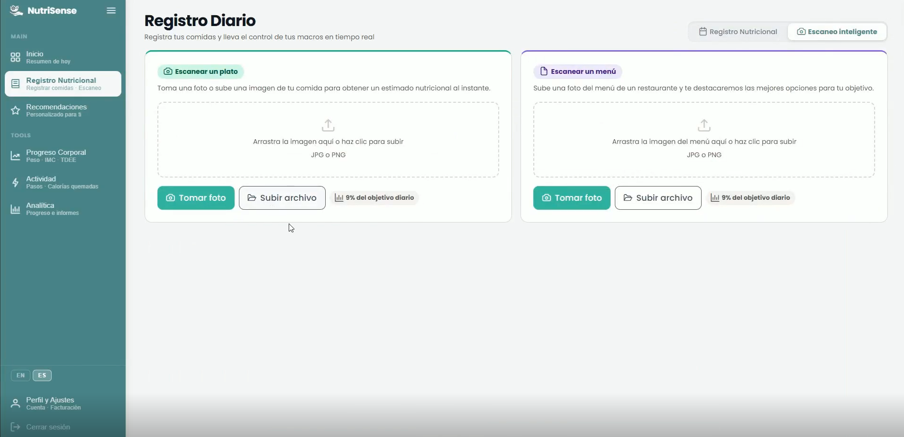

---

### Información del Video

| Atributo | Contenido |
|----------|-----------|
| **Duración** | 1:45 |
|**Link**|[Link de about the product](https://upcedupe-my.sharepoint.com/:v:/g/personal/u202417857_upc_edu_pe/IQC99Ix3H4DyTLnbPWeVDs3sAXy-3Knv6vpS8sydz-4hWSg?e=Fuc5sK&nav=eyJyZWZlcnJhbEluZm8iOnsicmVmZXJyYWxBcHAiOiJTdHJlYW1XZWJBcHAiLCJyZWZlcnJhbFZpZXciOiJTaGFyZURpYWxvZy1MaW5rIiwicmVmZXJyYWxBcHBQbGF0Zm9ybSI6IldlYiIsInJlZmVycmFsTW9kZSI6InZpZXcifX0%3D)|

---

### Resumen del Video

El video abre con una pregunta relatable para la audiencia: la dificultad de mantener una alimentación saludable sin saber por dónde empezar. Inmediatamente presenta a NutriSense como la plataforma inteligente que convierte la alimentación en un hábito sostenible, no en un esfuerzo diario.

La propuesta de valor se desarrolla de forma progresiva, mostrando cómo el usuario puede configurar su perfil en minutos, definiendo su objetivo (perder peso o ganar músculo), sus restricciones alimentarias y sus metas calóricas. Se destaca que NutriSense aprende del usuario para personalizarse desde el primer día.

Se presenta el dashboard como el centro de control del usuario, donde puede visualizar de un solo vistazo sus calorías del día, macronutrientes, calorías quemadas y racha de consistencia. El registro de alimentos se muestra como un proceso simple, ya sea mediante búsqueda manual o a través del Smart Scan, que identifica automáticamente los nutrientes apuntando la cámara al plato o a la carta del restaurante.

Un elemento diferenciador es el motor de recomendaciones inteligente, que sugiere qué comer según el clima de la ciudad del usuario, los ingredientes disponibles en su despensa y sus macronutrientes del día. Además, se presenta el modo viaje como una funcionalidad que adapta las sugerencias a la ubicación actual del usuario.

---

### Testimonios de Usuarios

El video incluye dos testimonios de usuarios reales que participaron en las entrevistas de validación, proporcionando credibilidad y validación del impacto real del producto:

> "Llevé dos meses intentando bajar de peso sin resultados claros, pero desde que uso NutriSense puedo ver qué como y cómo evoluciono semana a semana. En dos meses bajé 4 kilos y por primera vez siento que tengo control."
>
> **Brando S., usuario NutriSense, segmento pérdida de peso**

> "Vi NutriSense en redes y no creí que algo así pudiera funcionar para mí, pero el onboarding fue tan sencillo que en 10 minutos ya tenía mi plan. Lo que más me sorprendió fueron las recomendaciones: realmente considera lo que tengo en casa."
>
> **David R., usuario NutriSense, segmento ganancia muscular**
