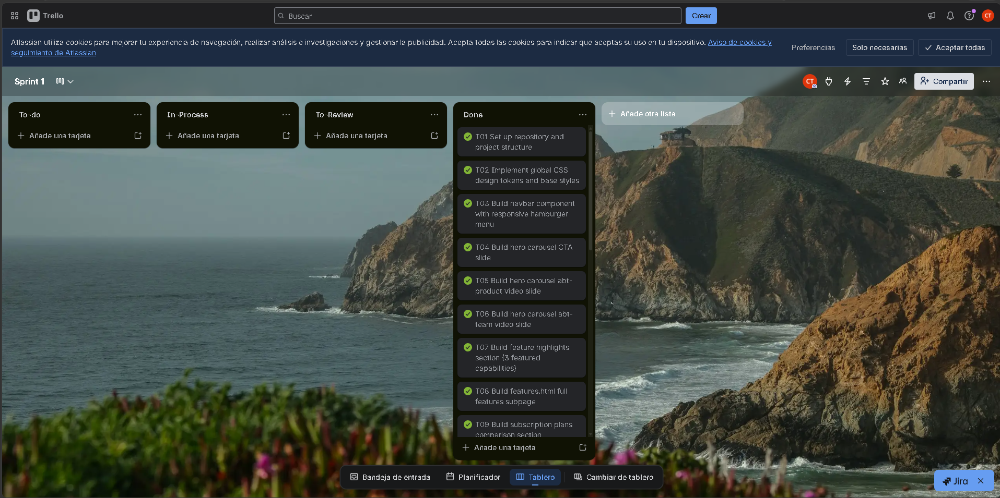

# CAPÍTULO V: Product Implementation, Validation & Deployment

## 5.1. Software Configuration Management

### 5.1.1. Software Development Environment Configuration

### 5.1.2. Source Code Management

### 5.1.3. Source Code Style Guide & Conventions

### 5.1.4. Software Deployment Configuration

## 5.2. Landing Page, Services & Applications Implementation

### 5.2.1. Sprint 1

#### 5.2.1.1. Sprint Planning 1

<table>
  <tr>
    <th colspan="2">Sprint #</th>
    <th colspan="2">Sprint 1</th>
  </tr>
  <tr>
    <th colspan="4">Sprint Planning Background</th>
  </tr>
  <tr>
    <td colspan="2">Date</td>
    <td colspan="2">2026-04-03</td>
  </tr>
  <tr>
    <td colspan="2">Time</td>
    <td colspan="2">06:00 PM (GMT-5)</td>
  </tr>
  <tr>
    <td colspan="2">Location</td>
    <td colspan="2">Reunión presencial</td>
  </tr>
  <tr>
    <td colspan="2">Prepared By</td>
    <td colspan="2">Villarreal Bazan, Angel Martin</td>
  </tr>
  <tr>
    <td colspan="2">Attendees (to planning meeting)</td>
    <td colspan="2">Del Aguila Del Aguila, Olenka Priscilla / Espinoza Cruz, Angela Milagros / Mora Rivera, Joel Fernando / Vergraray Calderon, Rose Almendra / Villarreal Bazan, Angel Martin</td>
  </tr>
  <tr>
    <th colspan="4">Sprint n – 1 Review Summary</th>
  </tr>
  <tr>
    <td colspan="4">No aplica. El Sprint 1 es el primero de la cadencia del proyecto NutriSense. No existe sprint anterior que revisar.</td>
  </tr>
  <tr>
    <th colspan="4">Sprint n – 1 Retrospective Summary</th>
  </tr>
  <tr>
    <td colspan="4">No aplica. Al ser la primera iteración, no hay retrospectiva previa documentada. El equipo acordó en esta reunión establecer como normas de trabajo el uso de GitFlow con ramas <code>feature/</code>, <code>develop</code> y <code>main</code>, Conventional Commits para todos los mensajes, y revisión de Pull Requests con mínimo un aprobador antes de hacer merge a <code>develop</code>.</td>
  </tr>
  <tr>
    <th colspan="4">Sprint Goal &amp; User Stories</th>
  </tr>
  <tr>
    <td colspan="2">Sprint 1 Goal</td>
    <td colspan="2">Our focus is on delivering a fully functional and publicly accessible NutriSense Landing Page in both English and Spanish. We believe it delivers a clear understanding of the platform's value proposition, subscription plans, and team identity to potential users from both target segments,adults seeking weight loss and young adults seeking muscle gain. This will be confirmed when any visitor can navigate all landing page sections (Hero, Features, Plans, About Us, FAQ, Contact), switch the interface language between English (en_US) and Spanish (es_419), and access the web application entry point from the landing page without any broken links or accessibility violations.</td>
  </tr>
  <tr>
    <td colspan="2">Sprint 1 Velocity</td>
    <td colspan="2">15 Story Points</td>
  </tr>
  <tr>
    <td colspan="2">Sum of Story Points</td>
    <td colspan="2">15 Story Points</td>
  </tr>
</table>

#### 5.2.1.2. Aspect Leaders and Collaborators

El Sprint 1 abarca exclusivamente la construcción del sitio web estático (Landing Page) de NutriSense. Los aspectos identificados para organizar el liderazgo y la colaboración en este sprint son los siguientes:

**Hero & Navigation:** Comprende el carrusel de la sección hero con sus tres diapositivas (call-to-action, video del producto, video del equipo), la barra de navegación y el enrutamiento entre páginas del sitio estático.

**Features, Plans & FAQ:** Comprende la sección de tres funciones principales destacadas, la subpágina de lista completa de funciones, la tabla comparativa de planes Basic / Pro / Premium y la sección de preguntas frecuentes con acordeón interactivo.

**About Us & Contact:** Comprende la subpágina About Us con la descripción de la startup, misión y visión, el formulario de contacto con validación del lado cliente y el despliegue de los enlaces a redes sociales.

**i18n & a11y:** Comprende la implementación del módulo de internacionalización (en_US / es_419) con persistencia de preferencia de idioma durante la sesión, y el cumplimiento de accesibilidad con atributos ARIA en todos los componentes interactivos (carrusel, acordeón FAQ, formulario, navegación).

**Terms of Service & Footer:** Comprende la subpágina de Términos y Condiciones, el footer global con enlaces legales, redes sociales, selector de idioma y copyright, y el vínculo del botón de login con el punto de entrada de la aplicación web.

| Team Member (Last Name, First Name) | GitHub Username | Hero & Navigation | Features, Plans & FAQ | About Us & Contact | i18n & a11y | Terms of Service & Footer |
|-------------------------------------|-----------------|:-----------------:|:---------------------:|:------------------:|:-----------:|:-------------------------:|
| Del Aguila Del Aguila, Olenka Priscilla | olenkisha_14 | C | L | C | C | C |
| Espinoza Cruz, Angela Milagros | Emy127 | C | C | L | C | C |
| Mora Rivera, Joel Fernando | xJoelFMRx | L | C | C | C | C |
| Vergraray Calderon, Rose Almendra | roseal28 | C | C | C | C | L |
| Villarreal Bazan, Angel Martin | nevatrix | C | C | C | L | C |

#### 5.2.1.3. Sprint Backlog 1

El Sprint 1 tiene como objetivo principal entregar el sitio web estático (Landing Page) de NutriSense completamente funcional, accesible y desplegado públicamente. Todos los User Stories de este sprint pertenecen al Epic EP01 Landing Page y cubren las secciones del sitio: Hero con carrusel, Funciones principales, Comparativa de planes, Cambio de idioma, Términos y condiciones, About Us, FAQ, formulario de contacto y enlaces a redes sociales. El entregable del sprint es la Landing Page publicada en GitHub Pages y accesible desde cualquier navegador de escritorio o móviL.
A continuación se presenta el board del sprint en Trello y la tabla de work-items correspondiente.

URL del Board (Trello): https://trello.com/invite/b/69e7e914df07d176838add9d/ATTIdd4dfe357744be4dc97cce9e1ff43aeeC1917E49/sprint-1

| US ID | US Title | Task ID | Task Title | Description | Est. (h) | Assigned To | Status |
|-------|----------|---------|------------|-------------|----------|-------------|--------|
| US01 | View Hero Section with Carousel | T01 | Set up repository and project structure | Create the GitHub repository, configure GitFlow with `main` / `develop` / `feature/*` branches, add `.gitignore`, `README.md`, and establish the base folder structure (`/assets`, `/css`, `/js`, `/pages`). | 2 | Villarreal Bazan, Angel Martin | To-do |
| US01 | View Hero Section with Carousel | T02 | Implement global CSS design tokens and base styles | Define CSS custom properties (color palette, typography scale, spacing, border-radius, transition) aligned with Material Design guidelines and the NutriSense style guide. | 3 | Villarreal Bazan, Angel Martin | To-do |
| US01 | View Hero Section with Carousel | T03 | Build navbar component with responsive hamburger menu | Implement the fixed top navigation bar including logo, navigation links, language selector, login button, and hamburger menu for mobile breakpoints with ARIA `role="navigation"` and `aria-label`. | 3 | Villarreal Bazan, Angel Martin | To-do |
| US01 | View Hero Section with Carousel | T04 | Build hero carousel CTA slide | Implement the first carousel slide with headline, subtitle, and CTA button that redirects to the web application authentication entry point. Apply `aria-live="polite"` and `role="region"` to the carousel container. | 3 | Villarreal Bazan, Angel Martin | To-do |
| US01 | View Hero Section with Carousel | T05 | Build hero carousel abt-product video slide | Implement the second carousel slide embedding the About-the-Product video, ensuring the video is playable and the slide is reachable via carousel navigation controls. | 2 | Villarreal Bazan, Angel Martin | To-do |
| US01 | View Hero Section with Carousel | T06 | Build hero carousel abt-team video slide | Implement the third carousel slide embedding the About-the-Team video. Add previous/next navigation buttons with `aria-label="Previous slide"` and `aria-label="Next slide"`. | 2 | Villarreal Bazan, Angel Martin | To-do |
| US02 | View Main Features Section | T07 | Build feature highlights section (3 featured capabilities) | Implement the features section on `index.html` displaying exactly three capability cards, each with an icon, title, and brief description. Add a "See all features" link pointing to `features.html`. | 3 | Del Aguila Del Aguila, Olenka Priscilla | To-do |
| US02 | View Main Features Section | T08 | Build `features.html` full features subpage | Create the complete features subpage listing all platform capabilities organised by category, each with title and functional description. Apply page hero, teal grid layout and consistent footer. | 3 | Del Aguila Del Aguila, Olenka Priscilla | To-do |
| US03 | View Subscription Plans Comparison Table | T09 | Build subscription plans comparison section | Implement the three-column plans comparison table (Basic, Pro, Premium) with feature availability indicators and a CTA button per plan that redirects to the registration flow. | 3 | Del Aguila Del Aguila, Olenka Priscilla | To-do |
| US04 | Switch Interface Language (Landing) | T10 | Implement i18n module with `en_US` and `es_419` string dictionaries | Create `i18n.js` with `en` and `es` translation maps covering all text content across all pages. Implement the `applyTranslation(lang)` function that updates all elements with `data-i18n` attributes. | 4 | Mora Rivera, Joel Fernando | To-do |
| US04 | Switch Interface Language (Landing) | T11 | Implement language toggle and session persistence | Wire the language selector in the navbar and footer to `applyTranslation()`. Persist the selected language in `sessionStorage` so the choice is maintained as the visitor navigates between pages. | 2 | Mora Rivera, Joel Fernando | To-do |
| US04 | Switch Interface Language (Landing) | T12 | Add `data-i18n` attributes to all HTML elements across all pages | Audit all pages (`index.html`, `features.html`, `about-us.html`, `contact.html`, `terms.html`) and add `data-i18n` attributes to every text node that must be translated. | 3 | Mora Rivera, Joel Fernando | To-do |
| US05 | View Terms of Service | T13 | Build `terms.html` Terms and Conditions subpage | Create the Terms of Service page with full legal content (privacy policy, data use, subscription terms). Ensure the page is linked from the footer on all pages and content renders in the active language. | 2 | Vergaray Calderon, Rose Almendra | To-do |
| US05 | View Terms of Service | T14 | Build global footer component | Implement the site-wide footer with the NutriSense tagline, navigation links, social media links, language selector, Terms and Conditions link, and copyright notice. Apply consistent styles across all pages. | 3 | Vergaray Calderon, Rose Almendra | To-do |
| US06 | View About Us Section | T15 | Build `about-us.html` — startup description, mission and vision | Implement the About Us page hero section and the startup description block with mission and vision cards. Content must be i18n-ready with `data-i18n` attributes. | 3 | Espinoza Cruz, Angela Milagros | To-do |
| US06 | View About Us Section | T16 | Add team member cards section to `about-us.html` | Implement the team member cards section displaying each member's name, role, and avatar image. | 2 | Espinoza Cruz, Angela Milagros | To-do |
| US07 | View Frequently Asked Questions Section | T17 | Build FAQ accordion component on `about-us.html` and `features.html` | Implement the FAQ section with at least five question-and-answer pairs using a keyboard-accessible accordion pattern with `aria-expanded`, `aria-controls`, and `role="region"` on each answer panel. | 3 | Espinoza Cruz, Angela Milagros | To-do |
| US08 | Access Login from Landing Page | T18 | Add persistent login access option to all page headers | Ensure the login button is present in the navbar on every page and correctly redirects to the web application authentication entry point URL. | 1 | Mora Rivera, Joel Fernando | To-do |
| US09 | Submit Contact Form | T19 | Build `contact.html` contact form with client-side validation | Create the contact page with name, email, phone, and message fields. Implement client-side validation: required fields, email format, phone format, minimum message length. Display inline error messages with `role="alert"` for each invalid field. | 4 | Espinoza Cruz, Angela Milagros | To-do |
| US09 | Submit Contact Form | T20 | Implement contact form submission confirmation feedback | On valid submission, display a success confirmation message and reset the form. Ensure the confirmation is announced by screen readers using `aria-live="assertive"`. | 2 | Espinoza Cruz, Angela Milagros | To-do |
| US10 | View Social Media Links | T21 | Implement social media links section in footer | Add at least three social media profile links to the footer. Each link must open in a new tab with `target="_blank" rel="noopener noreferrer"` and include an `aria-label` describing the destination. | 1 | Vergaray Calderon, Rose Almendra | To-do |

#### 5.2.1.4. Development Evidence for Sprint Review

#### 5.2.1.5. Execution Evidence for Sprint Review

Durante el Sprint 1, el equipo completó la implementación y despliegue público del sitio web estático (Landing Page) de NutriSense. Se entregaron las diez User Stories comprometidas (US01–US10), cubriendo la totalidad de las secciones del sitio: Hero con carrusel de tres diapositivas, sección de funciones principales con subpágina completa, tabla comparativa de planes de suscripción, módulo de internacionalización en_US / es_419 con persistencia de sesión, subpágina About Us con misión, visión y tarjetas del equipo, acordeón de preguntas frecuentes, formulario de contacto con validación del lado cliente, acceso persistente al login desde todas las páginas, sección de redes sociales y subpágina de Términos y Condiciones. El sitio fue desplegado en GitHub Pages.

A continuación se presentan screenshots de las principales vistas implementadas durante el sprint.

**Hero Section (Call to Action)**

**Main Features Section y enlace a subpágina completa**

**Subscription Plans Comparison Table**

**About Us (misión, visión y equipo)**

**FAQ accordion**

**Contact page con formulario y validación**

**Terms and Conditions subpage**

**Footer con redes sociales, selector de idioma y enlace legal**

**Cambio de idioma activo**

El video de demostración del Sprint 1 ilustra la navegación completa por todas las secciones de la Landing Page, el cambio de idioma entre inglés y español, la validación del formulario de contacto y el acceso al punto de entrada de la aplicación web desde la página de inicio.

**URL del video de demostración del Sprint 1:** *(Insertar enlace a Microsoft Stream / YouTube)*

#### 5.2.1.6. Services Documentation Evidence for Sprint Review

El Sprint 1 tuvo como único alcance la implementación del sitio web estático (Landing Page) de NutriSense. En esta iteración no se desarrollaron ni desplegaron Web Services, endpoints RESTful ni ningún componente de backend. Por ello, no existe documentación de servicios con OpenAPI que reportar en este sprint.

#### 5.2.1.7. Software Deployment Evidence for Sprint Review

#### 5.2.1.8. Team Collaboration Insights during Sprint

## 5.3. Validation Interviews

### 5.3.1. Diseño de Entrevistas

### 5.3.2. Registro de Entrevistas

### 5.3.3. Evaluaciones según heurísticas

## 5.4. Video About-the-Product