# CAPÍTULO V: Product Implementation, Validation & Deployment

El proceso de construcción, verificación y puesta en marcha de NutriSense representa la fase donde los conceptos arquitectónicos se materializan en una solución funcional. Esta etapa es determinante para transformar los modelos de diseño en una plataforma operativa, permitiendo validar la viabilidad de nuestra propuesta tecnológica y asegurar que el producto final cumpla con los estándares de calidad esperados por los usuarios en el ecosistema de salud digital.

## 5.1. Software Configuration Management

La gestión de configuración de software (SCM) en NutriSense garantiza la integridad y trazabilidad de todos los artefactos del proyecto durante su ciclo de vida. Este apartado detalla los procesos para administrar los cambios en el código fuente y la documentación, asegurando versiones reproducibles y una colaboración estructurada que minimice conflictos y optimice la calidad de las entregas finales.

### 5.1.1. Software Development Environment Configuration

En este apartado, el equipo detalla el ecosistema de herramientas digitales seleccionadas para la construcción de NutriSense. Cada solución ha sido elegida para optimizar una fase específica del ciclo de vida, garantizando la interoperabilidad y el flujo de trabajo constante entre los miembros del proyecto.

**Project Management**

Con el fin de centralizar la administración de tareas y asegurar la sincronía del grupo, se adoptaron plataformas que permiten una planificación ágil y un seguimiento detallado del backlog.

- **Trello:** Herramienta de tipo SaaS. Se utilizó como el tablero Kanban principal para la organización de las User Stories y la asignación de responsabilidades individuales. Su interfaz permitió visualizar el progreso de cada funcionalidad desde su etapa de "To Do" hasta su validación final.

    [Link de registro o inicio de sesion](https://trello.com)

    **Evidencia de uso:**  

   

 - **Microsoft Teams:** Herramienta de tipo SaaS. Se empleó como el centro neurálgico para la comunicación formal y síncrona del equipo. Esta plataforma permitió integrar las sesiones de videoconferencia con el almacenamiento compartido de archivos y el chat grupal, facilitando la toma de decisiones estratégicas y la organización de reuniones de sprint review y daily stand-ups.

    [Link de registro, inicio de sesion y descarga](https://www.microsoft.com/teams)

    **Evidencia de uso:**     

   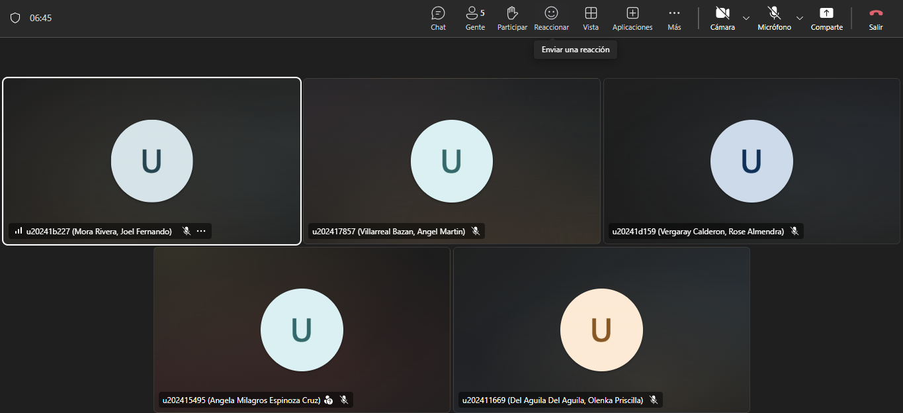

**Requirement Management**

Para la fase de análisis y especificación de los requerimientos de NutriSense, se implementaron herramientas de modelado visual que permiten transformar las necesidades del usuario en estructuras técnicas comprensibles para todo el equipo.

- **Miro:** Herramienta de tipo SaaS. Se estableció como el entorno colaborativo principal para la captura de requisitos dinámicos. A través de sesiones de EventStorming, el equipo pudo identificar los eventos de dominio, las reglas de negocio y los flujos de trabajo de los 7 Bounded Contexts. Esta herramienta facilitó la transición de las necesidades del cliente hacia una lógica de sistema reactiva. 

    [Link de registro o inicio de sesion](https://miro.com)

    **Evidencia de uso:**  

   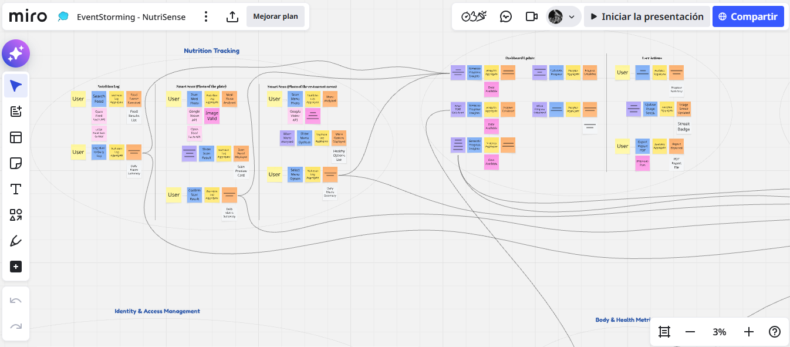

 - **Structurizr:** Herramienta de tipo SaaS. Se utilizó para la especificación técnica de los requisitos arquitectónicos mediante el modelo C4. Esta suite permitió documentar el contexto del sistema, los contenedores y los componentes de manera jerárquica, asegurando que el diseño de software esté alineado estrictamente con las capacidades funcionales exigidas por la plataforma. 

    [Link de registro o inicio de sesion](https://structurizr.com )

    **Evidencia de uso:**     

   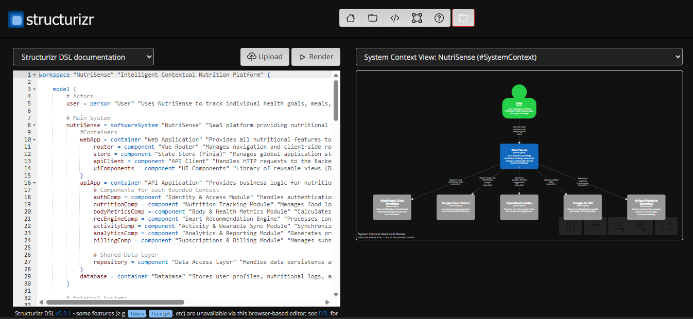

**Product UX/UI Design**

En el diseño de la interfaz y la experiencia del usuario para la salud digital, se utilizaron soluciones enfocadas en la fidelidad visual y el entendimiento de las necesidades del cliente.

- **Figma:** Herramienta de tipo SaaS. Se utilizó para la arquitectura visual de NutriSense, permitiendo la creación de prototipos interactivos de alta fidelidad. Mediante esta plataforma, se definieron los estilos, la tipografía y los componentes de UI que aseguran una experiencia coherente y atractiva. 

    [Link de registro, inicio de sesion y descarga](https://www.figma.com)

    **Evidencia de uso:**  

   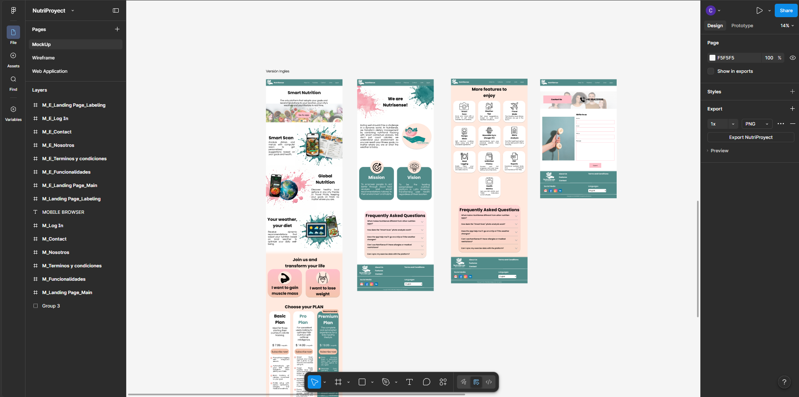

 - **UXPressia** Herramienta de tipo SaaS. Se aplicó para la construcción de los Customer Journey Maps y el análisis de los perfiles de usuario (User Personas). Permitió identificar los puntos de dolor de los usuarios al gestionar su nutrición, orientando el diseño hacia soluciones personalizadas. 

    [Link de registro o inicio de sesion](https://uxpressia.com)

    **Evidencia de uso:**   

   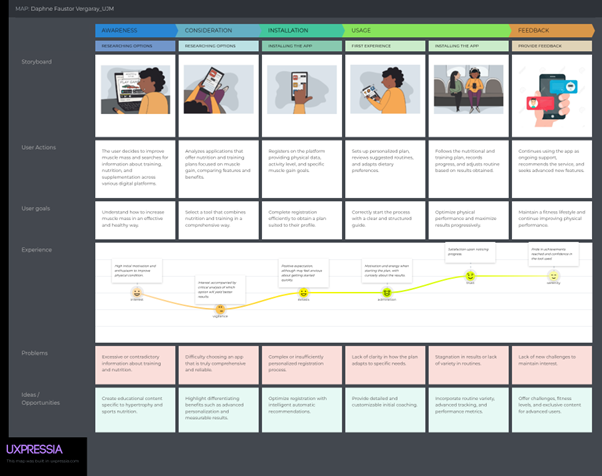

**Software Development**

Para la fase de construcción de la plataforma, se seleccionaron entornos de desarrollo integrados (IDE) que maximizan la productividad del equipo y aseguran la calidad del código fuente mediante herramientas avanzadas de depuración y autocompletado.

- **Visual Studio Code:** Herramienta de tipo Desktop (IDE). Se utilizó como el entorno de trabajo versátil para la edición de scripts, archivos de configuración y la integración de herramientas de control de versiones. Gracias a su ecosistema de extensiones, permitió una edición ágil y personalizada de los diferentes módulos del proyecto, facilitando una codificación ligera y eficiente.

    [Link de descarga](https://code.visualstudio.com/)

    **Evidencia de uso:**  

   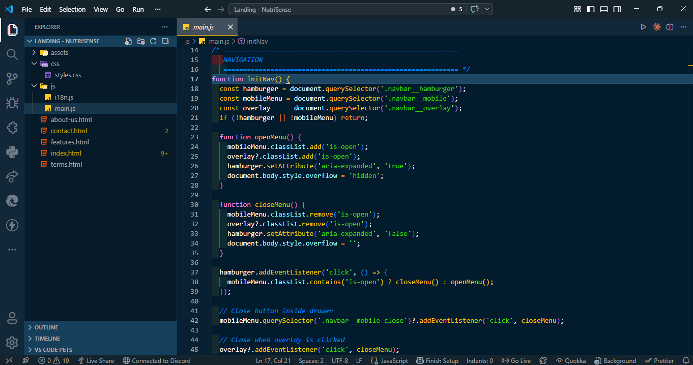

- **Rider:** Herramienta de tipo Desktop (IDE). Se empleó como el entorno de desarrollo integrado especializado para la arquitectura del backend en ASP.NET Core con C#. Su potente motor de análisis de código permitió gestionar de forma robusta los componentes del dominio y asegurar que la lógica del servidor cumpliera con los estándares de rendimiento exigidos por la plataforma.

    [Link de descarga](https://www.jetbrains.com/rider/)

 - **WebStorm** Herramienta de tipo Desktop (IDE). Se empleó como el entorno de desarrollo integrado especializado para la arquitectura del frontend en Vue.js. Su potente motor de análisis de código permitió gestionar de forma robusta los componentes reactivos de la interfaz y asegurar que la lógica de cliente cumpliera con los estándares de rendimiento exigidos por la plataforma.	

    [Link de descarga](https://www.jetbrains.com/webstorm/)

**Software Testing**

Con el objetivo de garantizar la calidad y el cumplimiento de los criterios de aceptación, se utilizó un estándar de especificación basado en el comportamiento.

- **Gherkin:** Lenguaje de especificación técnica. Se implementó para definir los escenarios de prueba bajo el formato "Dado que, Cuando, Entonces". Su uso permitió que las validaciones del sistema fueran legibles tanto para el equipo de desarrollo como para el área de negocio, asegurando que cada funcionalidad opere según lo previsto.

    [Link de la documentacion y uso](https://cucumber.io/docs/gherkin/)

    **Evidencia de uso:**  

   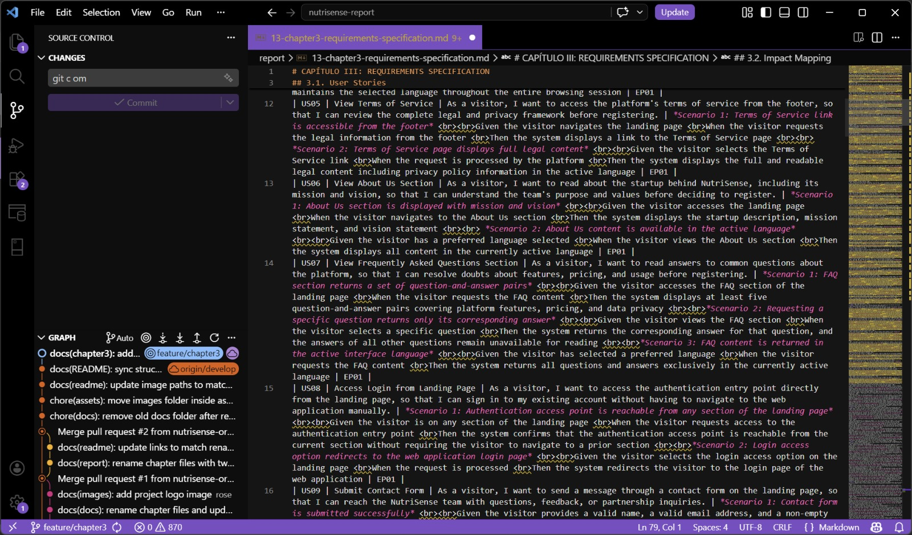

**Software Documentation**

La gestión de los activos digitales y la preservación del historial de cambios se realizó mediante una plataforma líder en el control de versiones.

- **GitHub:** Herramienta de tipo SaaS. Se utilizó como el repositorio maestro de NutriSense, donde se resguardó el código fuente, la documentación técnica y las definiciones de pruebas. Su infraestructura permitió la colaboración asíncrona entre desarrolladores y garantizó la trazabilidad total del proyecto.

    [Link de registro o inicio de sesion](https://github.com)

    **Evidencia de uso:**

   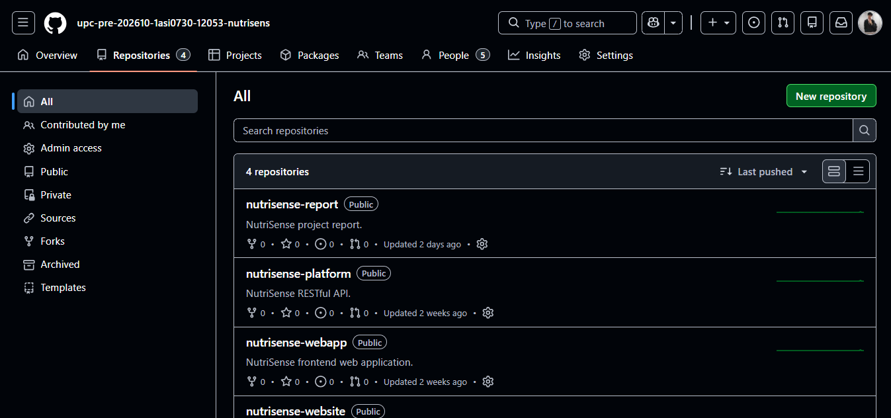

**Software Deployment**

Con el propósito de garantizar la accesibilidad de la propuesta de valor inicial y automatizar su publicación, se utilizó un servicio de alojamiento en la nube que permite el despliegue efectivo del sitio de presentación (Landing Page). Este enfoque asegura que los interesados puedan visualizar la solución preliminar de forma rápida y confiable.

- **GitHub Pages:** Herramienta de tipo SaaS. Actúa como la plataforma de publicación estática para la difusión inicial del proyecto. Su implementación permitió automatizar el ciclo de actualización a partir del código fuente resguardado en la rama principal, facilitando una sincronización inmediata entre los ajustes realizados por el equipo y la versión web disponible para los usuarios.

    [Link de la documentacion y uso](https://pages.github.com/)

### 5.1.2. Source Code Management

Para garantizar la integridad y el control total sobre las modificaciones del software, el equipo ha seleccionado GitHub como plataforma centralizada de gestión de versiones. Este sistema permite una colaboración distribuida y asíncrona, facilitando la auditoría de cambios y la integración de las diferentes capas de la aplicación NutriSense.

**Repositorios del Proyecto**

La solución se ha segmentado en repositorios independientes para mantener una arquitectura limpia y una separación de responsabilidades clara:

 - **nutrisense-website:** Repositorio dedicado al sitio de presentación estática (Landing Page).

    [Link del repositorio nutrisense-website](https://github.com/upc-pre-202610-1asi0730-12053-nutrisens/nutrisense-website)

 - **nutrisense-platform:** Contiene el núcleo de la solución (Backend), desarrollado como una API RESTful en C#. Este repositorio aloja la lógica de negocio, los servicios de dominio y las suites de pruebas automatizadas.

    [Link del repositorio nutrisense-platform](https://github.com/upc-pre-202610-1asi0730-12053-nutrisens/nutrisense-platform)

 - **nutrisense-webapp** Espacio reservado para el código del cliente web (Frontend) construido en Vue.js.

    [Link del repositorio nutrisense-webapp](https://github.com/upc-pre-202610-1asi0730-12053-nutrisens/nutrisense-webapp)

 - **nutrisense-report:** Repositorio de soporte utilizado para la gestión de la documentación técnica y los informes del proyecto.
  
    [Link del repositorio nutrisense-report](https://github.com/upc-pre-202610-1asi0730-12053-nutrisens/nutrisense-report)

**Implementación de GitFlow**

Para la organización y administración de la base de código, el equipo ha adoptado el esquema de ramificación GitFlow. Este flujo de trabajo se fundamenta en el modelo estratégico propuesto por Vincent Driessen en su publicación "A successful Git branching model", el cual proporciona una estructura robusta para gestionar el ciclo de vida del software mediante roles específicos para cada rama:

 - **Main Branch:** Resguarda el código fuente definitivo que se encuentra en el entorno de producción. Es la versión oficial y estable de NutriSense; cualquier cambio aquí representa una versión liberada al usuario.
    - **Notación:** `main o master`.
 - **Develop Branch:** Actúa como la rama matriz para la integración de todas las capacidades técnicas en desarrollo. Es el espacio donde se consolidan las funcionalidades antes de ser enviadas a la fase de publicación.
    - **Notación:** `develop`.
 - **Feature Branches:** Segmentos temporales creados para trabajar en requerimientos específicos o historias de usuario del backlog. Se originan a partir de develop y deben reintegrarse a esta misma rama una vez finalizada y validada la tarea.
    - **Notación:** `feature/US-nombre`.
 - **Release Branches:** Utilizadas para preparar un lanzamiento oficial de la plataforma. Permiten realizar auditorías finales, ajustes de configuración y correcciones menores sin interrumpir el desarrollo de nuevas funciones en la rama matriz.
    - **Notación:** `release/vX.Y.Z`.
  - **Hotfix Branches:** Ramas de corrección urgente creadas directamente desde main para resolver errores críticos detectados en producción. Una vez corregido el problema, se fusionan tanto en main como en develop para mantener la consistencia del código en todas las ramas activas.
    - **Notación:** `hotfix/nombre-del-error`.

**Conventional Commits**

Se adopta esta convención para estandarizar el historial de cambios y facilitar la generación automática de bitácoras (changelogs). Este estándar permite identificar rápidamente la intención de cada modificación mediante una estructura semántica clara.

El formato mandatorio es: `<tipo>[alcance]: <descripción>`, el cual incluye un encabezado obligatorio y, de ser necesario, un cuerpo técnico y pie de página para referencias.

Los tipos de confirmación permitidos para este proyecto son:

- **feat:** Incorporación de una nueva funcionalidad o capacidad al sistema.
- **fix:** Resolución de un error técnico, bug o comportamiento no deseado.
- **docs:** Modificaciones exclusivas en la documentación, manuales o archivos README.
- **style:** Ajustes relacionados con el formato, indentación o estética del código sin alterar su lógica funcional.
- **chore:** Labores de mantenimiento, actualizaciones de dependencias o ajustes en la configuración del entorno de compilación.
- **refactor:** Cambios en la estructura del código destinados a mejorar su legibilidad o eficiencia interna.
- **test:** Inclusión, corrección o actualización de escenarios de pruebas unitarias o de integración.

**Semantic Versioning**

Se emplea la versión 2.0.0 de Semantic Versioning bajo el esquema vX.Y.Z:

- **X (MAYOR):** Cambios grandes o incompatibles con versiones anteriores.
- **Y (MINOR):** Nuevas funcionalidades compatibles con versiones anteriores.
- **Z (PATCH):** Correcciones menores o parches que no afectan la funcionalidad.

### 5.1.3. Source Code Style Guide & Conventions

Para asegurar que el código de NutriSense sea mantenible, escalable y profesional, el equipo ha adoptado una serie de normas y guías de estilo internacionales. Como política fundamental, toda la nomenclatura técnica (variables, clases, métodos y comentarios) será redactada íntegramente en inglés, garantizando un estándar global en el desarrollo.

**Convenciones aplicadas por lenguaje:**

**HTML**

Siguiendo la "HTML Style Guide and Coding Conventions" de W3Schools y la "Google HTML/CSS Style Guide", se mantiene una arquitectura semántica y accesible. El código se escribe íntegramente en minúsculas, con una indentación de dos espacios y comentarios descriptivos para separar bloques funcionales.

**Estructura y etiquetas principales empleadas:**

- **Base:** `<!DOCTYPE html>`, `<html>`, `<head>`, `<body>` para la jerarquía global.
- **Metadatos:** `<meta>`, `<title>`, `<link>` para la configuración y vinculación de estilos.
- **Semántica:** `<nav>`, `<section>`, `<header>`, `<footer>`, `<main>` para la organización del contenido principal.
- **Contenido:** `<h1>`, `<h2>`, `
`, ``, `<a>` para la visualización de métricas y enlaces.
- **Interacción:** `<form>`, `<input>`, `<label>`, `<button>` para el registro de datos en formularios interactivos.

**CSS**

El archivo styles.css se estructuró bajo la "Google HTML/CSS Style Guide", aplicando una organización modular mediante comentarios (ej. /* NAVIGATION */, /* HERO CAROUSEL */). Se emplea kebab-case para clases y una indentación uniforme.

**Propiedades y convenciones aplicadas:**

- **Diseño y Layout:** `display: flex`, `grid-template-columns`, `position`, `z-index` para una interfaz responsiva.
- **Dimensiones:** `width`, `height`, `max-width`, `min-height`.
- **Espaciado:** `padding`, `margin`, `gap`.
- **Tipografía:** `font-family`, `font-size`, `font-weight`, `line-height`, `color`.
- **Decoración:** `background-color`, `border-radius`, `box-shadow`, `border`.
- **Interactividad:** `transition`, `transform`, `:hover` para mejorar la experiencia de usuario.

**JavaScript**

La lógica de cliente se fundamenta en las "MDN JavaScript guidelines" y la "W3C JavaScript Style Guide", priorizando un código modular, seguro y de alto rendimiento. Se emplea tanto en el desarrollo del Landing Page para la interactividad del sitio estático, como en la Web Application como base del framework Vue.js. Se aplica la convención camelCase para la nomenclatura de variables y funciones, y se utilizan comentarios descriptivos en inglés para documentar la finalidad de cada bloque funcional.

**Estructura y elementos técnicos aplicados:**

- **Selección del DOM:** Uso de métodos estandarizados como `document.getElementById()` y `document.querySelector()` para la captura de elementos de la interfaz.
- **Gestión de Eventos:** Implementación de `addEventListener()` para controlar acciones como click (botones de registro), submit (formularios de métricas) y el evento `DOMContentLoaded` para asegurar la carga del script.
- **Validaciones de Datos:** Aplicación de expresiones regulares para verificar la integridad de correos electrónicos, teléfonos y formatos de entrada.
- **Interacción Dinámica:** Manipulación de clases mediante `classList` para menús interactivos, modales de confirmación y feedback visual en formularios.
- **Control Lógico:** Empleo de condicionales `(if/else)`, bucles de iteración `(forEach)` y temporizadores `(setInterval())` para la actualización de datos en tiempo real.

**C#**

El desarrollo del backend se rige estrictamente por las "C# Coding Conventions" de Microsoft y las "Microsoft ASP.NET Core Coding Guidelines". Estas normas aseguran que la lógica de los 7 Bounded Contexts de NutriSense sea robusta, escalable y fácil de auditar por cualquier miembro del equipo técnico.

**Convenciones de tipografía y estructura:**

- **PascalCase:** Para nombres de clases, métodos e interfaces `(ej. public class UserProfile, NutritionService)`.
- **camelCase:** Para parámetros de métodos y variables locales `(ej. int currentCalories, calculateDailyGoal())`.
- **Principios SOLID:** Implementación rigurosa del Principio de Responsabilidad Única (SRP). Cada servicio, controlador o componente de .NET (o simplemente C#) gestiona una operación atómica del dominio, evitando el acoplamiento innecesario y facilitando las pruebas unitarias.
- **Formateo y Claridad:** Se emplea la sintaxis expandida, donde las llaves de apertura se ubican en una línea nueva para mejorar la legibilidad de las estructuras de control. Además, se utilizan comentarios concisos en inglés para documentar la finalidad de métodos complejos.

**Gherkin (.feature)**

Las pruebas de aceptación del sistema fueron redactadas empleando la sintaxis Gherkin, siguiendo las "Gherkin Conventions for Readable Specifications". Estos archivos se encuentran organizados por historias de usuario dentro del repositorio de GitHub, asegurando una trazabilidad total entre el requerimiento funcional y su validación técnica.

**Convenciones aplicadas:**

- **Estructura canónica Given – When – Then:** Se emplea este formato de forma estricta para mapear la secuencia lógica y las precondiciones, acciones y resultados esperados de cada caso de prueba.
- **Uso de Scenario Outline y Examples:** Se implementan plantillas de escenarios junto con tablas de datos para validar de manera eficiente diversos flujos de entrada y salida.
- **Equilibrio de lenguaje:** Se utiliza un léxico que balancea la terminología técnica con el lenguaje de negocio, facilitando que tanto analistas como desarrolladores mantengan una visión compartida del sistema.

### 5.1.4. Software Deployment Configuration

## 5.2. Landing Page, Services & Applications Implementation

La implementación del Landing Page, los servicios web y las aplicaciones representa la etapa crítica donde el equipo consolida el desarrollo de NutriSense. Este proceso permite materializar el diseño y las funcionalidades planificadas, transformando los requisitos en un producto tangible y operativo. En esta fase se traduce cada especificación técnica en código fuente, construyendo la infraestructura necesaria para satisfacer las necesidades identificadas de los segmentos objetivo.

### 5.2.1. Sprint 1

#### 5.2.1.1. Sprint Planning 1

<table>
  <tr>
    <th colspan="2">Sprint #</th>
    <th colspan="2">Sprint 1</th>
  </tr>
  <tr>
    <th colspan="4">Sprint Planning Background</th>
  </tr>
  <tr>
    <td colspan="2">Date</td>
    <td colspan="2">2026-04-03</td>
  </tr>
  <tr>
    <td colspan="2">Time</td>
    <td colspan="2">06:00 PM (GMT-5)</td>
  </tr>
  <tr>
    <td colspan="2">Location</td>
    <td colspan="2">Reunión presencial</td>
  </tr>
  <tr>
    <td colspan="2">Prepared By</td>
    <td colspan="2">Villarreal Bazan, Angel Martin</td>
  </tr>
  <tr>
    <td colspan="2">Attendees (to planning meeting)</td>
    <td colspan="2">Del Aguila Del Aguila, Olenka Priscilla / Espinoza Cruz, Angela Milagros / Mora Rivera, Joel Fernando / Vergraray Calderon, Rose Almendra / Villarreal Bazan, Angel Martin</td>
  </tr>
  <tr>
    <th colspan="4">Sprint n – 1 Review Summary</th>
  </tr>
  <tr>
    <td colspan="4">No aplica. El Sprint 1 es el primero de la cadencia del proyecto NutriSense. No existe sprint anterior que revisar.</td>
  </tr>
  <tr>
    <th colspan="4">Sprint n – 1 Retrospective Summary</th>
  </tr>
  <tr>
    <td colspan="4">No aplica. Al ser la primera iteración, no hay retrospectiva previa documentada. El equipo acordó en esta reunión establecer como normas de trabajo el uso de GitFlow con ramas <code>feature/</code>, <code>develop</code> y <code>main</code>, Conventional Commits para todos los mensajes, y revisión de Pull Requests con mínimo un aprobador antes de hacer merge a <code>develop</code>.</td>
  </tr>
  <tr>
    <th colspan="4">Sprint Goal &amp; User Stories</th>
  </tr>
  <tr>
    <td colspan="2">Sprint 1 Goal</td>
    <td colspan="2">Our focus is on delivering a fully functional and publicly accessible NutriSense Landing Page in both English and Spanish. We believe it delivers a clear understanding of the platform's value proposition, subscription plans, and team identity to potential users from both target segments,adults seeking weight loss and young adults seeking muscle gain. This will be confirmed when any visitor can navigate all landing page sections (Hero, Features, Plans, About Us, FAQ, Contact), switch the interface language between English (en_US) and Spanish (es_419), and access the web application entry point from the landing page without any broken links or accessibility violations.</td>
  </tr>
  <tr>
    <td colspan="2">Sprint 1 Velocity</td>
    <td colspan="2">15 Story Points</td>
  </tr>
  <tr>
    <td colspan="2">Sum of Story Points</td>
    <td colspan="2">15 Story Points</td>
  </tr>
</table>

#### 5.2.1.2. Aspect Leaders and Collaborators

El Sprint 1 abarca exclusivamente la construcción del sitio web estático (Landing Page) de NutriSense. Los aspectos identificados para organizar el liderazgo y la colaboración en este sprint son los siguientes:

**Hero & Navigation:** Comprende el carrusel de la sección hero con sus tres diapositivas (call-to-action, video del producto, video del equipo), la barra de navegación y el enrutamiento entre páginas del sitio estático.

**Features, Plans & FAQ:** Comprende la sección de tres funciones principales destacadas, la subpágina de lista completa de funciones, la tabla comparativa de planes Basic / Pro / Premium y la sección de preguntas frecuentes con acordeón interactivo.

**About Us & Contact:** Comprende la subpágina About Us con la descripción de la startup, misión y visión, el formulario de contacto con validación del lado cliente y el despliegue de los enlaces a redes sociales.

**i18n & a11y:** Comprende la implementación del módulo de internacionalización (en_US / es_419) con persistencia de preferencia de idioma durante la sesión, y el cumplimiento de accesibilidad con atributos ARIA en todos los componentes interactivos (carrusel, acordeón FAQ, formulario, navegación).

**Terms of Service & Footer:** Comprende la subpágina de Términos y Condiciones, el footer global con enlaces legales, redes sociales, selector de idioma y copyright, y el vínculo del botón de login con el punto de entrada de la aplicación web.

| Team Member (Last Name, First Name) | GitHub Username | Hero & Navigation | Features, Plans & FAQ | About Us & Contact | i18n & a11y | Terms of Service & Footer |
|-------------------------------------|-----------------|:-----------------:|:---------------------:|:------------------:|:-----------:|:-------------------------:|
| Del Aguila Del Aguila, Olenka Priscilla | olenkisha_14 | C | L | C | C | C |
| Espinoza Cruz, Angela Milagros | Emy127 | C | C | L | C | C |
| Mora Rivera, Joel Fernando | xJoelFMRx | L | C | C | C | C |
| Vergraray Calderon, Rose Almendra | roseal28 | C | C | C | C | L |
| Villarreal Bazan, Angel Martin | nevatrix | C | C | C | L | C |

#### 5.2.1.3. Sprint Backlog 1

El Sprint 1 tiene como objetivo principal entregar el sitio web estático (Landing Page) de NutriSense completamente funcional, accesible y desplegado públicamente. Todos los User Stories de este sprint pertenecen al Epic EP01 Landing Page y cubren las secciones del sitio: Hero con carrusel, Funciones principales, Comparativa de planes, Cambio de idioma, Términos y condiciones, About Us, FAQ, formulario de contacto y enlaces a redes sociales. El entregable del sprint es la Landing Page publicada en GitHub Pages y accesible desde cualquier navegador de escritorio o móviL.
A continuación se presenta el board del sprint en Trello y la tabla de work-items correspondiente.

URL del Board (Trello): https://trello.com/invite/b/69e7e914df07d176838add9d/ATTIdd4dfe357744be4dc97cce9e1ff43aeeC1917E49/sprint-1

| US ID | US Title | Task ID | Task Title | Description | Est. (h) | Assigned To | Status |
|-------|----------|---------|------------|-------------|----------|-------------|--------|
| US01 | View Hero Section with Carousel | T01 | Set up repository and project structure | Create the GitHub repository, configure GitFlow with `main` / `develop` / `feature/*` branches, add `.gitignore`, `README.md`, and establish the base folder structure (`/assets`, `/css`, `/js`, `/pages`). | 2 | Villarreal Bazan, Angel Martin | To-do |
| US01 | View Hero Section with Carousel | T02 | Implement global CSS design tokens and base styles | Define CSS custom properties (color palette, typography scale, spacing, border-radius, transition) aligned with Material Design guidelines and the NutriSense style guide. | 3 | Villarreal Bazan, Angel Martin | To-do |
| US01 | View Hero Section with Carousel | T03 | Build navbar component with responsive hamburger menu | Implement the fixed top navigation bar including logo, navigation links, language selector, login button, and hamburger menu for mobile breakpoints with ARIA `role="navigation"` and `aria-label`. | 3 | Villarreal Bazan, Angel Martin | To-do |
| US01 | View Hero Section with Carousel | T04 | Build hero carousel CTA slide | Implement the first carousel slide with headline, subtitle, and CTA button that redirects to the web application authentication entry point. Apply `aria-live="polite"` and `role="region"` to the carousel container. | 3 | Villarreal Bazan, Angel Martin | To-do |
| US01 | View Hero Section with Carousel | T05 | Build hero carousel abt-product video slide | Implement the second carousel slide embedding the About-the-Product video, ensuring the video is playable and the slide is reachable via carousel navigation controls. | 2 | Villarreal Bazan, Angel Martin | To-do |
| US01 | View Hero Section with Carousel | T06 | Build hero carousel abt-team video slide | Implement the third carousel slide embedding the About-the-Team video. Add previous/next navigation buttons with `aria-label="Previous slide"` and `aria-label="Next slide"`. | 2 | Villarreal Bazan, Angel Martin | To-do |
| US02 | View Main Features Section | T07 | Build feature highlights section (3 featured capabilities) | Implement the features section on `index.html` displaying exactly three capability cards, each with an icon, title, and brief description. Add a "See all features" link pointing to `features.html`. | 3 | Del Aguila Del Aguila, Olenka Priscilla | To-do |
| US02 | View Main Features Section | T08 | Build `features.html` full features subpage | Create the complete features subpage listing all platform capabilities organised by category, each with title and functional description. Apply page hero, teal grid layout and consistent footer. | 3 | Del Aguila Del Aguila, Olenka Priscilla | To-do |
| US03 | View Subscription Plans Comparison Table | T09 | Build subscription plans comparison section | Implement the three-column plans comparison table (Basic, Pro, Premium) with feature availability indicators and a CTA button per plan that redirects to the registration flow. | 3 | Del Aguila Del Aguila, Olenka Priscilla | To-do |
| US04 | Switch Interface Language (Landing) | T10 | Implement i18n module with `en_US` and `es_419` string dictionaries | Create `i18n.js` with `en` and `es` translation maps covering all text content across all pages. Implement the `applyTranslation(lang)` function that updates all elements with `data-i18n` attributes. | 4 | Mora Rivera, Joel Fernando | To-do |
| US04 | Switch Interface Language (Landing) | T11 | Implement language toggle and session persistence | Wire the language selector in the navbar and footer to `applyTranslation()`. Persist the selected language in `sessionStorage` so the choice is maintained as the visitor navigates between pages. | 2 | Mora Rivera, Joel Fernando | To-do |
| US04 | Switch Interface Language (Landing) | T12 | Add `data-i18n` attributes to all HTML elements across all pages | Audit all pages (`index.html`, `features.html`, `about-us.html`, `contact.html`, `terms.html`) and add `data-i18n` attributes to every text node that must be translated. | 3 | Mora Rivera, Joel Fernando | To-do |
| US05 | View Terms of Service | T13 | Build `terms.html` Terms and Conditions subpage | Create the Terms of Service page with full legal content (privacy policy, data use, subscription terms). Ensure the page is linked from the footer on all pages and content renders in the active language. | 2 | Vergaray Calderon, Rose Almendra | To-do |
| US05 | View Terms of Service | T14 | Build global footer component | Implement the site-wide footer with the NutriSense tagline, navigation links, social media links, language selector, Terms and Conditions link, and copyright notice. Apply consistent styles across all pages. | 3 | Vergaray Calderon, Rose Almendra | To-do |
| US06 | View About Us Section | T15 | Build `about-us.html` — startup description, mission and vision | Implement the About Us page hero section and the startup description block with mission and vision cards. Content must be i18n-ready with `data-i18n` attributes. | 3 | Espinoza Cruz, Angela Milagros | To-do |
| US06 | View About Us Section | T16 | Add team member cards section to `about-us.html` | Implement the team member cards section displaying each member's name, role, and avatar image. | 2 | Espinoza Cruz, Angela Milagros | To-do |
| US07 | View Frequently Asked Questions Section | T17 | Build FAQ accordion component on `about-us.html` and `features.html` | Implement the FAQ section with at least five question-and-answer pairs using a keyboard-accessible accordion pattern with `aria-expanded`, `aria-controls`, and `role="region"` on each answer panel. | 3 | Espinoza Cruz, Angela Milagros | To-do |
| US08 | Access Login from Landing Page | T18 | Add persistent login access option to all page headers | Ensure the login button is present in the navbar on every page and correctly redirects to the web application authentication entry point URL. | 1 | Mora Rivera, Joel Fernando | To-do |
| US09 | Submit Contact Form | T19 | Build `contact.html` contact form with client-side validation | Create the contact page with name, email, phone, and message fields. Implement client-side validation: required fields, email format, phone format, minimum message length. Display inline error messages with `role="alert"` for each invalid field. | 4 | Espinoza Cruz, Angela Milagros | To-do |
| US09 | Submit Contact Form | T20 | Implement contact form submission confirmation feedback | On valid submission, display a success confirmation message and reset the form. Ensure the confirmation is announced by screen readers using `aria-live="assertive"`. | 2 | Espinoza Cruz, Angela Milagros | To-do |
| US10 | View Social Media Links | T21 | Implement social media links section in footer | Add at least three social media profile links to the footer. Each link must open in a new tab with `target="_blank" rel="noopener noreferrer"` and include an `aria-label` describing the destination. | 1 | Vergaray Calderon, Rose Almendra | To-do |

#### 5.2.1.4. Development Evidence for Sprint Review

Durante este sprint, el equipo completó la implementación completa de la landing page de NutriSense. El desarrollo abarcó la creación de todas las secciones de la página principal (hero carousel, navegación, highlights, plans, features grid, FAQ, footer), las subpáginas (features, about us, contact, terms), la hoja de estilos global con design tokens, las interacciones en JavaScript, la internacionalización (i18n) y los assets estáticos del proyecto.

| Repository | Branch | Commit Id | Commit Message | Commit Message Body | Committed on |
|---|---|---|---|---|---|
| upc-pre-202610-1asi0730-12053-nutrisens/nutrisense-website | feature/hero-carousel | 73d0f16 | Initial commit | — | 04/04/2026 |
| upc-pre-202610-1asi0730-12053-nutrisens/nutrisense-website | feature/hero-carousel | efa2ae4 | chore: set up project structure and base HTML files | — | 20/04/2026 |
| upc-pre-202610-1asi0730-12053-nutrisens/nutrisense-website | feature/hero-carousel | 4b2924c | style: add global CSS design tokens and base styles | — | 22/04/2026 |
| upc-pre-202610-1asi0730-12053-nutrisens/nutrisense-website | feature/hero-carousel | 374fabb | feat: build responsive navbar with hamburger menu | — | 22/04/2026 |
| upc-pre-202610-1asi0730-12053-nutrisens/nutrisense-website | feature/hero-carousel | 9256286 | feat: build hero carousel with CTA slides | — | 22/04/2026 |
| upc-pre-202610-1asi0730-12053-nutrisens/nutrisense-website | feature/hero-carousel | 1a0585e | style: add style of product video slide to hero carousel | — | 22/04/2026 |
| upc-pre-202610-1asi0730-12053-nutrisens/nutrisense-website | feature/home-sections | b2867b9 | feat: build feature highlights and segments sections | — | 22/04/2026 |
| upc-pre-202610-1asi0730-12053-nutrisens/nutrisense-website | feature/home-sections | 6850adc | feat: build subscription plans comparison section | — | 22/04/2026 |
| upc-pre-202610-1asi0730-12053-nutrisens/nutrisense-website | feature/features-subpage | 1a2a62c | feat: build features subpage with grid and CTA | — | 23/04/2026 |
| upc-pre-202610-1asi0730-12053-nutrisens/nutrisense-website | feature/i18n | 21a2784 | feat: add i18n dictionaries for en language | — | 24/04/2026 |
| upc-pre-202610-1asi0730-12053-nutrisens/nutrisense-website | feature/i18n | 205893d | feat: add i18n dictionaries for es language | — | 24/04/2026 |
| upc-pre-202610-1asi0730-12053-nutrisens/nutrisense-website | feature/i18n | c0c640f | feat: implement language toggle with session persistence | — | 24/04/2026 |
| upc-pre-202610-1asi0730-12053-nutrisens/nutrisense-website | develop | 71b1947 | feat: add content in terms page | — | 24/04/2026 |
| upc-pre-202610-1asi0730-12053-nutrisens/nutrisense-website | develop | 43d818a | style: add terms styles | — | 24/04/2026 |
| upc-pre-202610-1asi0730-12053-nutrisens/nutrisense-website | develop | 5194348 | feat: add terms script | — | 24/04/2026 |
| upc-pre-202610-1asi0730-12053-nutrisens/nutrisense-website | develop | 9e01661 | feat: add content in about us page | — | 25/04/2026 |
| upc-pre-202610-1asi0730-12053-nutrisens/nutrisense-website | develop | 4a8fc11 | style: add about us styles | — | 25/04/2026 |
| upc-pre-202610-1asi0730-12053-nutrisens/nutrisense-website | develop | 505b75c | style: add grid about responsive | — | 25/04/2026 |
| upc-pre-202610-1asi0730-12053-nutrisens/nutrisense-website | feature/contact-page | 1517d4b | feat: add content in contact page | — | 25/04/2026 |
| upc-pre-202610-1asi0730-12053-nutrisens/nutrisense-website | develop | 59b46f6 | feat: add content in about us page | — | 25/04/2026 |
| upc-pre-202610-1asi0730-12053-nutrisens/nutrisense-website | develop | 49d7985 | style: add about us styles | — | 25/04/2026 |
| upc-pre-202610-1asi0730-12053-nutrisens/nutrisense-website | develop | 31d528c | style: add grid about responsive | — | 25/04/2026 |
| upc-pre-202610-1asi0730-12053-nutrisens/nutrisense-website | feature/contact-page | a49718d | style: add contact styles | — | 25/04/2026 |
| upc-pre-202610-1asi0730-12053-nutrisens/nutrisense-website | feature/contact-page | e471015 | feat: add contact form page with validations | — | 25/04/2026 |
| upc-pre-202610-1asi0730-12053-nutrisens/nutrisense-website | feature/footer | 41e10d4 | feat: add footer on index | — | 25/04/2026 |
| upc-pre-202610-1asi0730-12053-nutrisens/nutrisense-website | feature/css-footer-accessibility | 4206759 | style: add footer, page-hero, page-features, responsive and accessibility CSS | — | 25/04/2026 |
| upc-pre-202610-1asi0730-12053-nutrisens/nutrisense-website | feature/footer-subpages | 17634d8 | feat: add footer and i18n.js script to about-us, contact and terms pages | — | 25/04/2026 |
| upc-pre-202610-1asi0730-12053-nutrisens/nutrisense-website | develop | 95e4dd4 | feat: add features grid and FAQ sections to home page | — | 25/04/2026 |
| upc-pre-202610-1asi0730-12053-nutrisens/nutrisense-website | feature/skip-links | 07d9ea7 | feat: add skip-to-content accessibility link to all pages | — | 25/04/2026 |
| upc-pre-202610-1asi0730-12053-nutrisens/nutrisense-website | feature/faq-accordion | 3cfd16d | feat: add FAQ accordion interactive behaviour to main.js | — | 25/04/2026 |
| upc-pre-202610-1asi0730-12053-nutrisens/nutrisense-website | develop | 6b3f3cf | style: reorder CSS file | — | 25/04/2026 |
| upc-pre-202610-1asi0730-12053-nutrisens/nutrisense-website | develop | b15c0d9 | refactor: change structure of html files | — | 25/04/2026 |
| upc-pre-202610-1asi0730-12053-nutrisens/nutrisense-website | develop | cab2938 | chore: add images to all page | — | 25/04/2026 |
| upc-pre-202610-1asi0730-12053-nutrisens/nutrisense-website | feature/update-readme | db86c1d | docs: update README | — | 25/04/2026 |

#### 5.2.1.5. Execution Evidence for Sprint Review

Durante el Sprint 1, el equipo completó la implementación y despliegue público del sitio web estático (Landing Page) de NutriSense. Se entregaron las diez User Stories comprometidas (US01–US10), cubriendo la totalidad de las secciones del sitio: Hero con carrusel de tres diapositivas, sección de funciones principales con subpágina completa, tabla comparativa de planes de suscripción, módulo de internacionalización en_US / es_419 con persistencia de sesión, subpágina About Us con misión, visión y tarjetas del equipo, acordeón de preguntas frecuentes, formulario de contacto con validación del lado cliente, acceso persistente al login desde todas las páginas, sección de redes sociales y subpágina de Términos y Condiciones. El sitio fue desplegado en GitHub Pages.

A continuación se presentan screenshots de las principales vistas implementadas durante el sprint.

**Hero Section (Call to Action)**
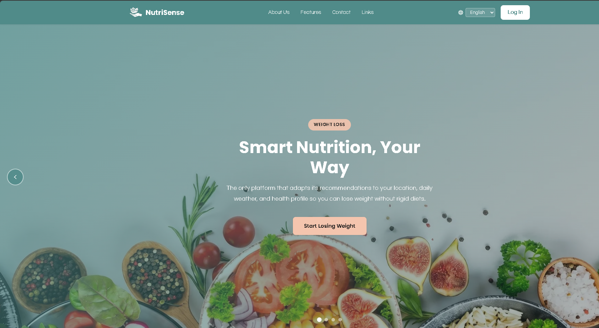

**Main Features Section y enlace a subpágina completa**
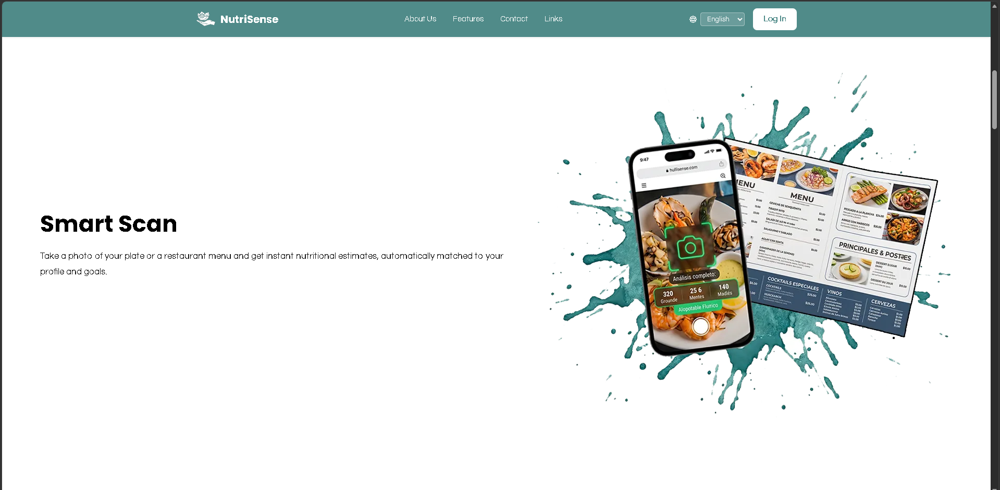

**Subscription Plans Comparison Table**
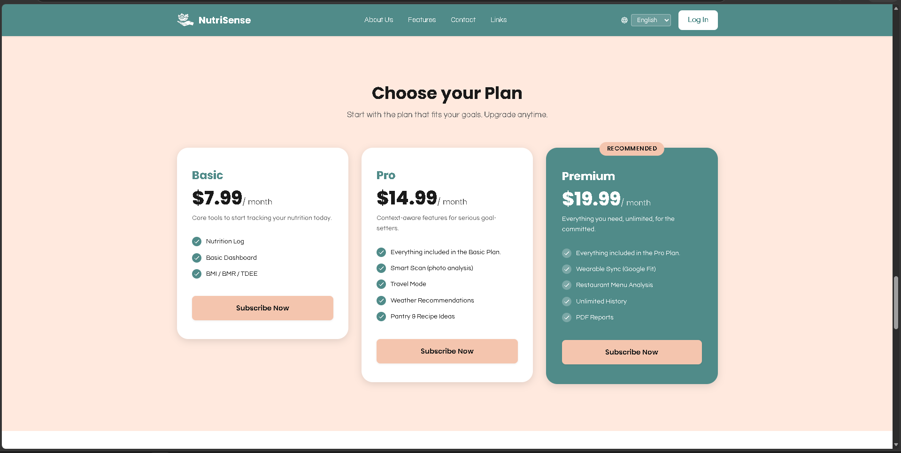

**About Us (misión, visión y equipo)**
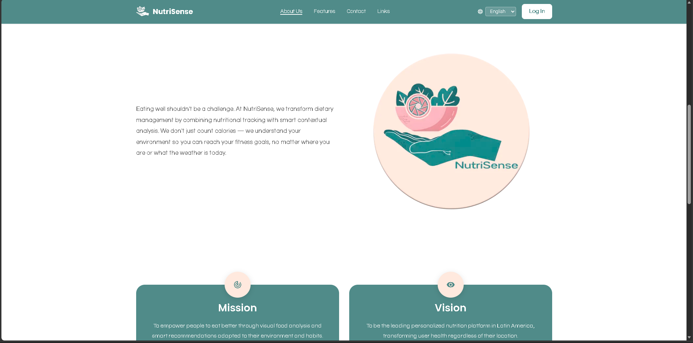

**FAQ accordion**
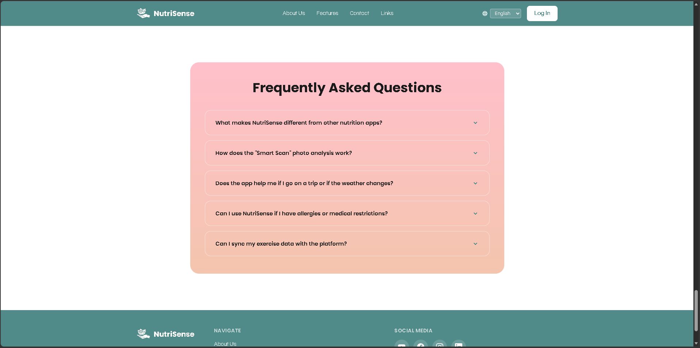

**Contact page con formulario y validación**

**Terms and Conditions subpage**
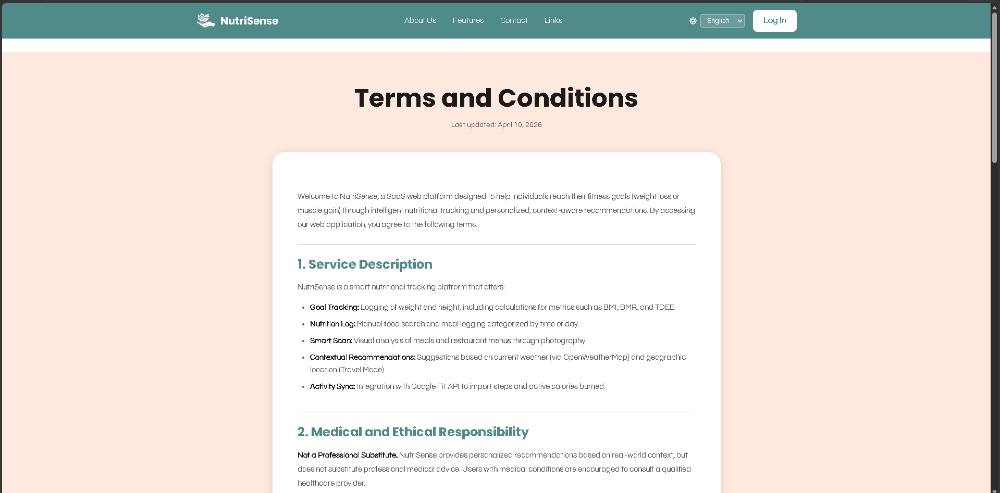

**Footer con redes sociales, selector de idioma y enlace legal**
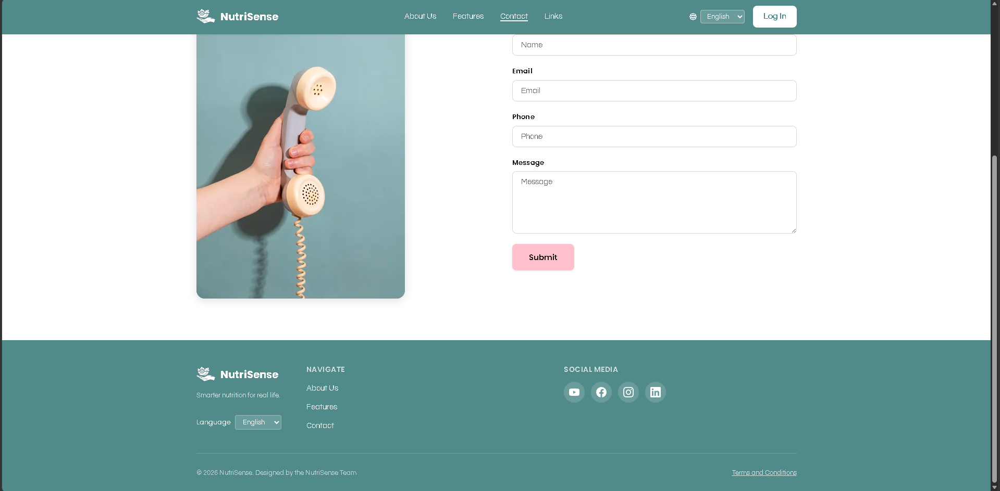

**Cambio de idioma activo**
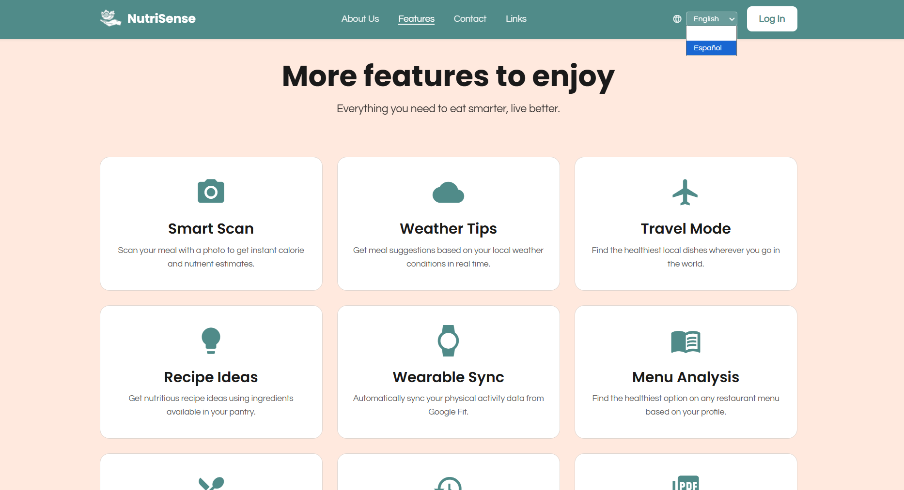

El video de demostración del Sprint 1 ilustra la navegación completa por todas las secciones de la Landing Page, el cambio de idioma entre inglés y español, la validación del formulario de contacto y el acceso al punto de entrada de la aplicación web desde la página de inicio.

**URL del video de demostración del Sprint 1:** [URL del Sprint1](https://upcedupe-my.sharepoint.com/:v:/g/personal/u202411669_upc_edu_pe/IQBsc9_NPkKFS7eT1V0JMJ6hAakJKdyqhph88Pi2lJ2uUo4?e=EWfAjD&nav=eyJyZWZlcnJhbEluZm8iOnsicmVmZXJyYWxBcHAiOiJTdHJlYW1XZWJBcHAiLCJyZWZlcnJhbFZpZXciOiJTaGFyZURpYWxvZy1MaW5rIiwicmVmZXJyYWxBcHBQbGF0Zm9ybSI6IldlYiIsInJlZmVycmFsTW9kZSI6InZpZXcifX0%3D)

#### 5.2.1.6. Services Documentation Evidence for Sprint Review

El Sprint 1 tuvo como único alcance la implementación del sitio web estático (Landing Page) de NutriSense. En esta iteración no se desarrollaron ni desplegaron Web Services, endpoints RESTful ni ningún componente de backend. Por ello, no existe documentación de servicios con OpenAPI que reportar en este sprint.

#### 5.2.1.7. Software Deployment Evidence for Sprint Review

Durante este sprint se realizó el despliegue de la landing page de NutriSmart en GitHub Pages. El proceso abarcó la configuración del repositorio remoto, la integración del flujo Gitflow con la rama `main` como fuente de despliegue, y la habilitación del servicio de hosting estático de GitHub. A continuación se describen los pasos realizados.

##### Creación del repositorio en GitHub

Se creó el repositorio público `nutrisense-website` bajo la organización `upc-pre-202610-1asi0730-12053-nutrisens` en GitHub. Este repositorio centraliza todo el código fuente de la landing page y sirve como base para el despliegue continuo.

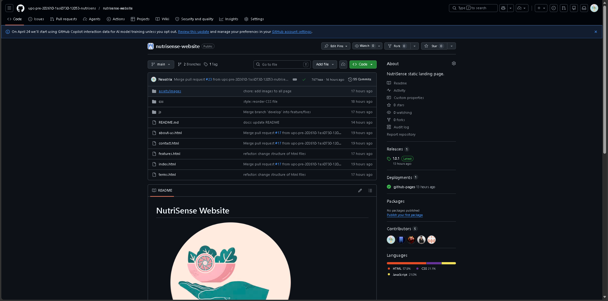

##### Configuración de ramas bajo Gitflow

Se estableció la estructura de ramas siguiendo Gitflow:

- `main` > rama de producción (fuente de despliegue)
- `develop` > rama de integración
- `feature/*` > ramas de desarrollo por funcionalidad

Todo el trabajo fue integrado mediante Pull Requests desde las ramas `feature/*` hacia `develop`, y finalmente desde `develop` hacia `main` como parte del release `v1.0.0`.

##### Merge a main y creación del tag de release

Una vez completadas todas las features del sprint, se realizó el merge de `develop` a `main` mediante un Pull Request en GitHub, etiquetando el commit resultante como `v1.0.0`.

##### Configuración de GitHub Pages

Para habilitar el despliegue se siguieron los pasos:

1. Ingresar al repositorio en GitHub
2. Ir a **Settings** > **Pages**
3. En la sección **Build and deployment**, seleccionar:
   - **Source:** Deploy from a branch
   - **Branch:** `main`
   - **Folder:** `/ (root)`
4. Hacer click en **Save**

GitHub Pages procesó el contenido de la rama `main` y generó automáticamente la URL de despliegue.

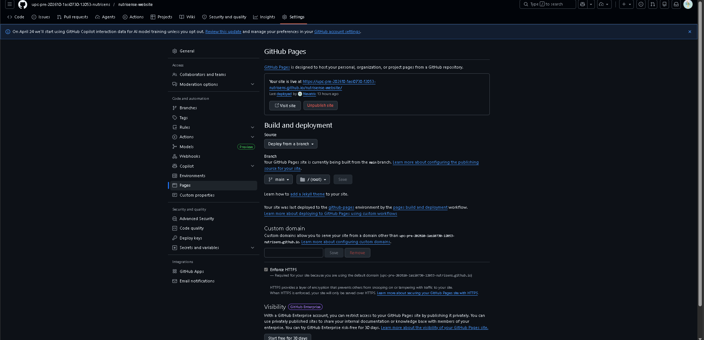

##### URL de despliegue

La landing page quedó disponible públicamente en: [Landing Page](https://upc-pre-202610-1asi0730-12053-nutrisens.github.io/nutrisense-website/index.html)

#### 5.2.1.8. Team Collaboration Insights during Sprint

Durante el Sprint, todos los miembros del equipo participaron activamente en las actividades de implementación, tal como se refleja en los analíticos de colaboración de GitHub. Como se puede observar en la gráfica de contribuciones, los integrantes Nevatrix, xJoelFMRx, olenkisha14, Emy127 y Roseal28 realizaron commits de manera constante. Cada miembro aportó al desarrollo del Sprint.

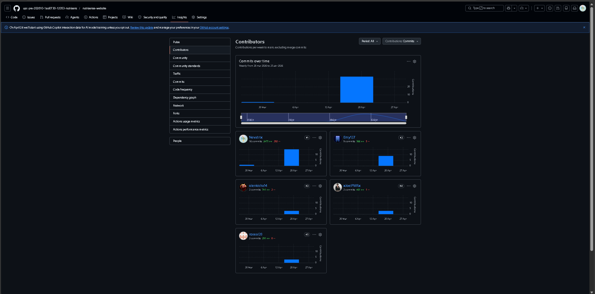

### 5.2.2. Sprint 2

#### 5.2.2.1. Sprint Planning 2

#### 5.2.2.2. Aspect Leaders and Collaborators

#### 5.2.2.3. Sprint Backlog 2

El Sprint 2 tiene como objetivo entregar el frontend completo de la aplicación web autenticada de NutriSense, cubriendo los bounded contexts de Nutrition Tracking, Body & Health Metrics, Analytics parcial e Identity & Access Management. El orden de desarrollo prioriza las funcionalidades de mayor valor para el usuario final: el dashboard principal con visión nutricional diaria, el núcleo del registro de alimentos, el seguimiento de métricas corporales, el monitoreo de déficit y macros, el historial semanal y el análisis por segmento. La gestión de identidad y el onboarding se abordan al final del sprint como capa de acceso que habilita las vistas ya construidas. El entregable del sprint es la aplicación web frontend desplegada consumiendo una capa de servicios mock con json-server, siguiendo la arquitectura DDD por bounded context (domain / application / infrastructure / presentation), con navegación completa entre vistas autenticadas, formularios validados, i18n activo en todas las vistas y atributos ARIA en todos los componentes interactivos.

URL del Board (Trello): 

| US ID | US Title | Task ID | Task Title | Description | Est. (h) | Assigned To | Status |
|-------|----------|---------|------------|-------------|----------|-------------|--------|
| US46 | View Daily Nutritional Overview in Dashboard | T01 | Scaffold frontend application with DDD folder structure and router | Initialize the Vue + Vite project following the bounded-context folder structure (`iam/`, `nutrition-tracking/`, `body-metrics/`, `analytics/`, `shared/`). Configure Vue Router with public and protected route groups, integrate PrimeVue with Material theme, set up Pinia, configure Axios `BaseApi` and `BaseEndpoint` following the Learning Center pattern, and configure `json-server` with `db.json` fixtures for all Sprint 2 endpoints. | 5 | Villarreal Bazan, Angel Martin | To-do |
| US46 | View Daily Nutritional Overview in Dashboard | T02 | Define DDD layer files for Analytics bounded context | Create the domain entity `DailySummary`, the `AnalyticsApi` infrastructure class extending `BaseApi`, the `AnalyticsAssembler`, and the `useAnalyticsStore` Pinia store with `fetchDailySummary()` and `fetchStreak()` actions following the Learning Center DDD pattern. | 3 | Villarreal Bazan, Angel Martin | To-do |
| US46 | View Daily Nutritional Overview in Dashboard | T03 | Build daily nutritional overview view | Implement the `/dashboard` view displaying real-time metric cards for calories consumed vs. target, remaining calories, protein consumed vs. target, carbohydrates and fat totals, and net caloric balance (deficit or surplus). Data sourced from `useAnalyticsStore` mock. Apply `aria-live="polite"` to dynamically updated card regions. | 4 | Villarreal Bazan, Angel Martin | To-do |
| US47 | View Consecutive Log Streak | T04 | Build consecutive log streak widget on dashboard | Implement the streak widget within the `/dashboard` view displaying the current number of consecutive days the user completed their nutrition log, sourced from `useAnalyticsStore` mock. | 2 | Villarreal Bazan, Angel Martin | To-do |
| US30 | View Weekly and Monthly Nutritional History | T05 | Define DDD layer files for Weekly History in Analytics context | Create the `WeeklyHistory` domain entity, extend `AnalyticsApi` with `getWeeklyHistory()` and `getMonthlyHistory()` methods, extend `AnalyticsAssembler`, and add `fetchWeeklyHistory()` and `fetchMonthlyHistory()` actions to `useAnalyticsStore`. | 2 | Villarreal Bazan, Angel Martin | To-do |
| US30 | View Weekly and Monthly Nutritional History | T06 | Build weekly and monthly nutritional history view | Implement the `/analytics/history` view displaying a weekly summary table (average daily calories, macro distribution, days with deficit/surplus) and a monthly summary. Provide a period selector (current week / last week / current month / last month). Apply i18n to all labels and `data-i18n` attributes to static text. | 3 | Villarreal Bazan, Angel Martin | To-do |
| US34 | Weekly Deficit and Macro Balance Analysis | T07 | Build weekly deficit and macro balance analysis view for weight-loss segment | Implement the `/analytics/deficit-analysis` view, visible to users with a weight-loss goal, displaying average caloric deficit for the week, macronutrient distribution (protein / carbs / fat) as a donut chart using Chart.js, and a consistency indicator showing the number of days the user stayed within their caloric target. | 3 | Villarreal Bazan, Angel Martin | To-do |
| US35 | Weekly Protein and Surplus Optimisation | T08 | Build weekly protein and surplus optimisation view for muscle-gain segment | Implement the `/analytics/protein-analysis` view, visible to users with a muscle-gain goal, displaying weekly average protein intake vs. target as a bar chart using Chart.js, average caloric surplus stability, and a recovery readiness indicator based on protein consistency. | 3 | Villarreal Bazan, Angel Martin | To-do |
| US36 | Nutrient Timing for Training Optimisation | T09 | Define DDD layer files for Nutrient Timing in Analytics context | Create the `NutrientTiming` domain entity, extend `AnalyticsApi` with `getNutrientTiming()` method, extend `AnalyticsAssembler`, and add `fetchNutrientTiming()` action to `useAnalyticsStore`. | 2 | Villarreal Bazan, Angel Martin | To-do |
| US36 | Nutrient Timing for Training Optimisation | T10 | Build nutrient timing analysis view for muscle-gain segment | Implement the `/analytics/nutrient-timing` view, visible to users with a muscle-gain goal, displaying a timeline of nutrient intake relative to logged workout sessions, highlighting pre-workout and post-workout macro distribution. | 3 | Villarreal Bazan, Angel Martin | To-do |
| — | Cross-cutting | T42 | Apply ARIA attributes and keyboard navigation to all Sprint 2 views | Audit all views implemented during this sprint and apply ARIA attributes: `aria-label` on icon-only PrimeVue Buttons, `aria-required` and `aria-invalid` on form fields, `aria-live="polite"` on dynamically updated metric cards and nutrition totals, `role="alert"` on PrimeVue Message error components, and `aria-expanded` on collapsible PrimeVue Panel sections. Verify full keyboard navigation (Tab, Enter, Escape, arrow keys on PrimeVue Select). | 2 | Villarreal Bazan, Angel Martin | To-do |
| US27 | Search Food Items by Name | T11 | Define DDD layer files for Nutrition Tracking bounded context | Create the `FoodItem` and `MealEntry` domain entities, the `NutritionApi` infrastructure class extending `BaseApi` with `searchFoods()`, `createMealEntry()`, `getMealEntries()`, `updateMealEntry()`, and `deleteMealEntry()` methods, the `NutritionAssembler`, and the `useNutritionStore` Pinia store following the Learning Center DDD pattern. | 3 | Mora Rivera, Joel Fernando | To-do |
| US27 | Search Food Items by Name | T12 | Build food search view with debounced query and results list | Implement the `/nutrition/search` view with a search input applying a 400 ms debounce before calling `useNutritionStore.searchFoods()`. Display results as a PrimeVue DataTable with food name, brand, and calories per 100 g. Show an empty state with an "Add manually" option when no results are found. Apply dietary restriction flags to results matching the user's configured restrictions. | 4 | Mora Rivera, Joel Fernando | To-do |
| US27 | Search Food Items by Name | T13 | Build food detail panel with full nutritional breakdown | Implement the food detail panel rendered when the user selects a result from the search list. Display the full nutritional breakdown per serving (calories, protein, carbohydrates, fat, fiber, sugar) using PrimeVue Card. Provide a serving size selector (g / ml / unit) and a quantity input that scales all values proportionally. | 3 | Mora Rivera, Joel Fernando | To-do |
| US28 | Log a Meal Entry by Meal Type | T14 | Build meal entry form with meal type selector | Implement the meal logging form within the `/nutrition/log` view with a PrimeVue Select for meal type (Breakfast / Lunch / Dinner / Snack), the selected food item display, a PrimeVue InputNumber for quantity with unit selector, and a confirm button. On confirm, call `useNutritionStore.addMealEntry()` mock, update the daily summary reactively, and display a success PrimeVue Toast. | 3 | Mora Rivera, Joel Fernando | To-do |
| US29 | View Daily Nutritional Summary | T15 | Build daily nutritional summary view grouped by meal type | Implement the `/nutrition/log` view organized into collapsible PrimeVue Panel sections per meal type (Breakfast, Lunch, Dinner, Snack). Each section displays a PrimeVue DataTable of logged entries with food name, quantity, and calorie count, plus a subtotal row. A global daily totals row at the bottom aggregates calories and macros. Apply `aria-expanded` to each collapsible section. | 4 | Mora Rivera, Joel Fernando | To-do |
| US31 | View Nutritional Detail of a Logged Meal | T16 | Build nutritional detail panel for a logged meal entry | Implement the meal detail panel rendered when the user selects a logged entry from the daily summary. Display the full macro breakdown of that specific entry (calories, protein, carbs, fat, fiber, sugar) in a PrimeVue Card. | 2 | Mora Rivera, Joel Fernando | To-do |
| US21 | Log Current Weight | T17 | Define DDD layer files for Body Metrics bounded context | Create the `BodyMetric`, `HealthMetrics`, and `BodyComposition` domain entities following DDD conventions. Create the `BodyMetricsApi` infrastructure class extending `BaseApi` with `logWeight()`, `updateHeight()`, `getMetricsHistory()`, `getTrend()`, `setHealthGoal()`, `setTargetWeight()`, and `updateBodyComposition()` methods. Create the `BodyMetricsAssembler` and the `useBodyMetricsStore` Pinia store with all corresponding actions. | 3 | Espinoza Cruz, Angela Milagros | To-do |
| US21 | Log Current Weight | T18 | Build weight logging form | Implement the weight entry form within the `/metrics/weight` view. The form uses a PrimeVue InputNumber accepting a weight value in kg defaulting to the current date. Apply validation for positive non-zero values. On submit, call `useBodyMetricsStore.logWeight()` mock, update the displayed current weight, and show a PrimeVue Toast confirmation. Handle duplicate same-day entries by displaying a PrimeVue ConfirmDialog before overwriting. | 3 | Espinoza Cruz, Angela Milagros | To-do |
| US22 | View BMI, BMR, and TDEE Calculations | T19 | Build health metrics summary view | Implement the `/metrics/summary` view displaying BMI with category label (underweight / normal / overweight / obese), BMR in kcal/day, and TDEE in kcal/day using PrimeVue Card components. Metrics recalculate reactively when a new weight entry is saved. Display a staleness PrimeVue Message warning when the last weight entry is older than 14 days. | 3 | Espinoza Cruz, Angela Milagros | To-do |
| US23 | View Weight Evolution and Goal Progress | T20 | Build weight evolution chart with date range filter | Implement the `/metrics/evolution` view displaying a Chart.js line chart of historical weight entries ordered chronologically. Provide a PrimeVue SelectButton for period (last 7 days / last 30 days / last 90 days / custom). Include a goal reference line at the target weight. | 3 | Espinoza Cruz, Angela Milagros | To-do |
| US24 | Set Target Weight | T21 | Build target weight configuration form | Implement the target weight form within `/metrics/goal` using a PrimeVue InputNumber for target weight in kg. On save, call `useBodyMetricsStore.setTargetWeight()` mock and update the goal reference line on the evolution chart reactively. | 2 | Espinoza Cruz, Angela Milagros | To-do |
| US25 | Body Fat and Lean Mass Monitoring | T22 | Build body composition view for muscle-gain segment | Implement the `/metrics/composition` view, visible to users with a muscle-gain goal, displaying estimated body fat percentage and lean body mass in kg calculated with the Navy formula. Provide PrimeVue InputNumber fields for waist and neck circumferences. On save, call `useBodyMetricsStore.updateBodyComposition()` mock. Display a PrimeVue Message alert when body fat increase exceeds the recommended lean bulk ratio. | 4 | Espinoza Cruz, Angela Milagros | To-do |
| US26 | Log Height Update | T23 | Add height update field to body metrics form | Add a PrimeVue InputNumber height field (cm) to the `/metrics/weight` view alongside the weight entry form. On save, call `useBodyMetricsStore.updateHeight()` mock and trigger recalculation of BMI, BMR, and TDEE in the health metrics summary reactively. | 1 | Espinoza Cruz, Angela Milagros | To-do |
| US32 | Caloric Deficit Monitoring | T24 | Define DDD layer files for Monitoring in Nutrition Tracking context | Create the `CaloricBalance` domain entity. Extend `NutritionApi` with `getCaloricBalance()` method. Extend `NutritionAssembler`. Add `fetchCaloricBalance()` action to `useNutritionStore`. | 2 | Vergaray Calderon, Rose Almendra | To-do |
| US32 | Caloric Deficit Monitoring | T25 | Build real-time caloric deficit monitoring widget for weight-loss segment | Implement the caloric deficit widget within `/nutrition/log`, visible to users with a weight-loss goal, displaying remaining calories before reaching the daily deficit limit, a color-coded PrimeVue Tag status indicator (on track / approaching limit / exceeded), and a surplus PrimeVue Message alert when intake exceeds the TDEE-based limit. Update reactively on every meal entry change via `useNutritionStore`. | 3 | Vergaray Calderon, Rose Almendra | To-do |
| US33 | Protein and Macro Target Tracking | T26 | Build protein and caloric surplus tracker widget for muscle-gain segment | Implement the protein tracker widget within `/nutrition/log`, visible to users with a muscle-gain goal, displaying consumed protein vs. daily target as a PrimeVue ProgressBar, consumed calories vs. surplus target, and a PrimeVue Message warning when protein falls below minimum threshold. Update reactively on every meal entry change. | 3 | Vergaray Calderon, Rose Almendra | To-do |
| US17 | Configure Dietary Restrictions and Medical Conditions | T27 | Define DDD layer files for Profile in IAM bounded context (restrictions only) | Create the `DietaryRestrictions` value object within the IAM domain. Extend the `ProfileApi` infrastructure class with `updateDietaryRestrictions()` and `getDietaryRestrictions()` methods. Add the corresponding actions to `useProfileStore`. | 2 | Vergaray Calderon, Rose Almendra | To-do |
| US17 | Configure Dietary Restrictions and Medical Conditions | T28 | Build dietary restrictions and medical conditions management panel | Implement the `/profile/restrictions` view displaying current restrictions as removable PrimeVue Chip components. Provide a PrimeVue MultiSelect input to add new restrictions from a predefined list (gluten-free, lactose-free, vegan, vegetarian, nut allergy, diabetic, hypertensive). On save, call `useProfileStore.updateDietaryRestrictions()` mock and display a PrimeVue Toast confirmation. Apply `data-i18n` attributes to all labels. | 3 | Vergaray Calderon, Rose Almendra | To-do |
| US18 | Edit Profile Information | T29 | Build user profile view and edit form | Implement the `/profile/edit` view displaying the user's name, email, avatar, health goal, and activity level. Provide an edit mode with PrimeVue InputText for full name, PrimeVue FileUpload for profile photo (preview only), and PrimeVue Select for activity level (sedentary / lightly active / moderately active / very active). On save, call `useProfileStore.updateProfile()` mock and display a PrimeVue Toast. | 3 | Vergaray Calderon, Rose Almendra | To-do |
| US20 | Manage Active Subscription Plan | T30 | Build subscription status widget in profile settings | Implement the subscription management section within `/profile/settings` displaying the current plan name (Basic / Pro / Premium) as a PrimeVue Tag, renewal date, and list of included features. Provide a "Manage subscription" PrimeVue Button that navigates to `/subscriptions` (to be fully implemented in Sprint 4). Use mock subscription data. | 2 | Vergaray Calderon, Rose Almendra | To-do |
| — | Cross-cutting | T41 | Integrate i18n module into the web application and apply to all Sprint 2 views | Port the i18n dictionaries (en_US / es_419) from the landing page to the Vue application following the Learning Center `i18n.js` pattern. Add `en.json` and `es.json` entries for all static text in all Sprint 2 views. Wire the language selector in the app Layout component. Persist language preference in `localStorage`. | 3 | Vergaray Calderon, Rose Almendra | To-do |
| US11 | Register a New Account | T31 | Define DDD layer files for IAM bounded context | Create the `User` domain entity, the `SignUpCommand` and `SignInCommand` value objects, the `IamApi` infrastructure class extending `BaseApi` with `register()`, `login()`, `logout()`, and `requestPasswordReset()` methods, the `IamAssembler`, and the `useIamStore` Pinia store with all corresponding actions following the Learning Center IAM pattern. | 3 | Del Aguila Del Aguila, Olenka Priscilla | To-do |
| US11 | Register a New Account | T32 | Build registration form view | Implement the `/iam/sign-up` view with PrimeVue InputText for full name and email, PrimeVue Password for password and confirmation, and a PrimeVue Checkbox for terms acceptance. Apply reactive validation: required fields, email format, minimum 8-character password, password match, and terms acceptance. Display PrimeVue Message inline errors with `role="alert"` for each invalid field. On success (201), redirect to onboarding. On 409, display duplicate email error. | 4 | Del Aguila Del Aguila, Olenka Priscilla | To-do |
| US14 | Complete Nutritional Profile Onboarding | T33 | Build onboarding stepper — step 1: health goal selection | Implement the first step of the `/iam/onboarding` flow using a PrimeVue Stepper. Display two goal option cards (weight loss / muscle gain) as selectable PrimeVue Cards with active state indicator. Store selection in onboarding form state. | 3 | Del Aguila Del Aguila, Olenka Priscilla | To-do |
| US14 | Complete Nutritional Profile Onboarding | T34 | Build onboarding stepper — step 2: physical data form | Implement the second onboarding step with PrimeVue InputNumber for current weight (kg) and height (cm), PrimeVue DatePicker for date of birth, PrimeVue Select for sex and activity level (sedentary / lightly active / moderately active / very active). Display a real-time BMI preview as the user fills in weight and height. Apply validation for all fields. | 3 | Del Aguila Del Aguila, Olenka Priscilla | To-do |
| US15 | Nutritional Target Configuration – Weight-Loss | T35 | Build onboarding stepper — step 3a: weight-loss caloric target | Implement the third onboarding step for users who selected weight-loss goal. Display the calculated daily caloric deficit target based on TDEE and a PrimeVue Select for target weekly rate (−0.25 kg/week / −0.5 kg/week / −0.75 kg/week). Show projected weeks to goal. On confirm, call `useBodyMetricsStore.setHealthGoal()` mock. | 3 | Del Aguila Del Aguila, Olenka Priscilla | To-do |
| US16 | Nutritional Target Configuration – Muscle-Gain | T36 | Build onboarding stepper — step 3b: muscle-gain caloric surplus and protein target | Implement the third onboarding step for users who selected muscle-gain goal. Display the calculated daily caloric surplus target and recommended protein intake in g/kg of body weight using PrimeVue Card. Provide a PrimeVue Select for target weekly gain rate (+0.1 kg/week / +0.25 kg/week). On confirm, call `useBodyMetricsStore.setHealthGoal()` mock. | 3 | Del Aguila Del Aguila, Olenka Priscilla | To-do |
| US12 | Log In to Existing Account | T37 | Build login form view and connect to IAM service | Implement the `/iam/sign-in` view with PrimeVue InputText for email, PrimeVue Password for password, a PrimeVue Checkbox for "Remember me", and a link to password recovery. On success (200), store JWT in sessionStorage or localStorage per "Remember me", redirect to `/dashboard`. On 401, display incorrect credentials PrimeVue Message. | 3 | Del Aguila Del Aguila, Olenka Priscilla | To-do |
| US13 | Recover Account Password | T38 | Build password recovery flow | Implement two views: `/iam/password-reset` with a PrimeVue InputText for email that calls `useIamStore.requestPasswordReset()` mock; and `/iam/password-reset/confirmation` displaying a PrimeVue Message indicating a reset link has been sent. Handle 404 with an email not registered PrimeVue Message. | 2 | Del Aguila Del Aguila, Olenka Priscilla | To-do |
| US19 | Log Out of Account | T39 | Implement logout action and session teardown | Add a logout PrimeVue Button to the app navbar user menu. On click, call `useIamStore.logout()` mock, clear JWT and refresh token from storage, reset Pinia state, and redirect to `/iam/sign-in`. | 1 | Del Aguila Del Aguila, Olenka Priscilla | To-do |
| — | Cross-cutting | T40 | Implement navigation guard for protected routes | Create an `authenticationGuard` following the Learning Center pattern that checks for a valid JWT before allowing access to any route outside `/iam/*`. If the token is absent or expired, redirect to `/iam/sign-in` storing the originally requested URL for post-login redirect. Wire the guard in the `router.beforeEach` hook. | 2 | Del Aguila Del Aguila, Olenka Priscilla | To-do |

#### 5.2.2.4. Development Evidence for Sprint Review

#### 5.2.2.5. Execution Evidence for Sprint Review

#### 5.2.2.6. Services Documentation Evidence for Sprint Review

#### 5.2.2.7. Software Deployment Evidence for Sprint Review

#### 5.2.2.8. Team Collaboration Insights during Sprint

## 5.3. Validation Interviews

### 5.3.1. Diseño de Entrevistas

### 5.3.2. Registro de Entrevistas

### 5.3.3. Evaluaciones según heurísticas

## 5.4. Video About-the-Product