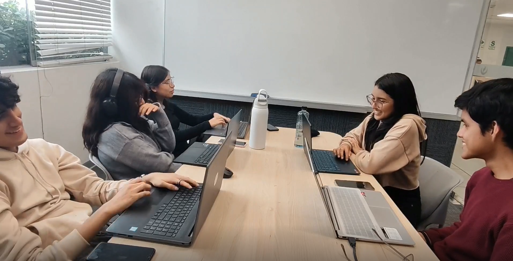

# Conclusiones
 
## Conclusiones y Recomendaciones
 
### Conclusiones
 
#### Sobre los Problem Statements y los resultados obtenidos
 
El Problem Statement 1 identificó que los adultos de 25 a 60 años que buscan perder peso tienen dificultades para mantener un control calórico consistente al comer fuera de casa, dado que las aplicaciones existentes no consideran variables contextuales como el clima, la ciudad o los platos disponibles en un restaurante. En respuesta a esto, NutriSense desarrolló un motor de recomendaciones contextuales que adapta las sugerencias alimentarias en tiempo real según la ubicación y las condiciones climáticas del usuario. El desarrollo del frontend web y el backend en ASP.NET Core evidenció la viabilidad técnica de esta solución, logrando integrar las APIs de OpenWeatherMap y Geolocation dentro del bounded context de Smart Recommendations.
 
El Problem Statement 2 señaló que los usuarios que comen fuera del hogar no pueden estimar con precisión el contenido calórico de sus comidas mediante los métodos manuales de las apps actuales, lo cual genera registros nutricionales incompletos o poco confiables. El módulo Smart Scan, desarrollado con integración a Google Cloud Vision API dentro del bounded context de Nutrition Tracking, representa la respuesta técnica directa a este problema. Su implementación en el frontend Vue y el backend demuestra que es posible reducir el esfuerzo manual del usuario al momento de registrar una comida fuera de casa.
 
El Problem Statement 3 abordó la pérdida de disciplina nutricional de los jóvenes adultos que entrenan regularmente cuando viajan o enfrentan cambios en su entorno habitual. La funcionalidad Travel Mode, integrada dentro del motor de recomendaciones, permite detectar la ciudad o país actual del usuario y sugerir platos locales saludables compatibles con su perfil nutricional activo. Esta solución responde directamente a la necesidad de continuidad en el seguimiento de macros sin importar el contexto geográfico del usuario.
 
El Problem Statement 4 señaló que los modelos freemium predominantes en el mercado latinoamericano generan bajas tasas de conversión y alta rotación. En respuesta, NutriSense diseñó una estructura de suscripción de tres niveles (Basic, Pro y Premium) sin tier gratuito permanente, diferenciada por funcionalidades de alto valor como Smart Scan, Travel Mode, análisis de menús de restaurantes y exportación de reportes en PDF. La arquitectura del bounded context de Subscriptions & Billing, con integración a Stripe, valida la implementación técnica de este modelo de negocio.
 
---
 
#### Sobre los Assumptions y el comportamiento real de los segmentos
 
Se asumió que los usuarios necesitarían tomar decisiones alimentarias inteligentes en tiempo real, especialmente al comer fuera, sin requerir conocimientos nutricionales previos. Las sesiones de validación con prototipos confirmaron que ambos segmentos valoran la reducción del esfuerzo manual, y que la interfaz diseñada sobre Material Design efectivamente minimiza los pasos necesarios para completar acciones clave como registrar una comida o consultar una recomendación.
 
Se asumió que el mayor valor percibido por los usuarios estaría en recibir recomendaciones relevantes según su contexto inmediato: ubicación, clima e ingredientes disponibles. Las pruebas de usabilidad realizadas con el prototipo de Figma mostraron que los usuarios de ambos segmentos encontraron útil y diferenciador el hecho de que las sugerencias cambiaran según su situación actual, aunque también evidenciaron que la confianza inicial en las recomendaciones generadas por IA requiere ser reforzada con explicaciones visibles del razonamiento detrás de cada sugerencia.
 
Se asumió que la precisión del Smart Scan dependería de la calidad de la fotografía y podría producir estimaciones imprecisas para platos complejos. Esta limitación fue confirmada durante las pruebas, y se validó que la estrategia de permitir al usuario confirmar o ajustar el resultado antes de guardarlo mitiga efectivamente esta restricción, manteniendo la confianza en el sistema.
 
Se asumió que la adquisición de usuarios se daría principalmente a través de redes sociales orientadas a comunidades fitness y de estilo de vida saludable. Si bien este canal no fue validado empíricamente durante el proyecto, la definición del perfil psicográfico de ambos segmentos (usuarios activos en Instagram y TikTok, con interés en fitness y nutrición deportiva) refuerza la pertinencia de este supuesto para etapas posteriores de lanzamiento.
 
---
 
#### Sobre los Hypothesis Statements y los criterios de éxito
 
La Hypothesis Statement 1 planteó que la consistencia nutricional diaria de los adultos que buscan perder peso aumentaría si utilizaban el motor de recomendaciones contextuales de NutriSense. El criterio de éxito establecido fue que al menos el 50% de los usuarios de este segmento registrara las tres comidas principales en al menos 5 de cada 7 días durante su segundo mes de uso. Si bien el proyecto no alcanzó una etapa de despliegue con usuarios reales en volumen suficiente para medir este indicador, la arquitectura desarrollada para el Dashboard & Analytics bounded context sienta las bases técnicas para su seguimiento una vez la plataforma esté en producción.
 
La Hypothesis Statement 2 afirmó que la adopción del módulo Smart Scan incrementaría la precisión y completitud de los registros nutricionales entre usuarios Pro y Premium. El criterio definido fue un incremento de al menos 35% en el promedio de comidas registradas por día dentro de los primeros 30 días de uso. La implementación funcional del módulo en el frontend web, con flujo de captura de imagen y estimación nutricional, establece la base para validar este indicador en producción.
 
La Hypothesis Statement 3 sostuvo que los jóvenes adultos que buscan ganar masa muscular mantendrían su disciplina de seguimiento de macros durante viajes si utilizaban el Travel Mode. El criterio de éxito fue una reducción de al menos 40% en la caída de la tasa de completitud del registro diario durante periodos de viaje, medida a través de los datos de uso registrados por la plataforma durante los días en que el Travel Mode se encuentre activo. Si bien el proyecto no alcanzó una etapa de despliegue con usuarios reales en volumen suficiente para medir este indicador, la arquitectura desarrollada establece las condiciones técnicas para su seguimiento en producción, permitiendo comparaciones antes-después sin depender de datos autorreportados. La medición cuantitativa del indicador queda pendiente para una etapa de validación post-lanzamiento.
 
La Hypothesis Statement 4 propuso que la tasa de conversión de Basic a Pro aumentaría si los usuarios experimentaban el valor de al menos una funcionalidad Pro en sus primeras dos semanas. El criterio fue alcanzar una tasa mensual de conversión del 15% o superior dentro de los primeros seis meses tras el lanzamiento público. La estructura de suscripción implementada en el bounded context de Billing, junto con la diferenciación clara de features entre niveles, proporciona las condiciones técnicas necesarias para alcanzar este objetivo.
 
---
 
#### Sobre los criterios de éxito del Lean UX
 
Los criterios de éxito del Lean UX Canvas establecieron cinco indicadores de negocio medibles: que el 40% de usuarios registrara al menos una comida diaria durante tres semanas consecutivas; que Smart Scan fuera utilizado en al menos el 30% de los registros de comidas de usuarios Pro y Premium; que la tasa de conversión Basic a Pro alcanzara el 15% mensual en los primeros seis meses; que la satisfacción promedio con las recomendaciones fuera de 4 sobre 5 o superior; y que el 60% de los usuarios activos habilitara el Travel Mode o las recomendaciones basadas en clima durante su primer mes.
 
El desarrollo del proyecto permitió construir la infraestructura técnica completa para medir y alcanzar estos indicadores: el bounded context de Analytics & Reporting habilita el seguimiento de rachas y gráficas de progreso; el bounded context de Subscriptions & Billing permite segmentar el comportamiento por tier; y el motor de recomendaciones permite registrar la activación y uso de las features contextuales. La validación cuantitativa de estos criterios requiere un ciclo de despliegue con usuarios reales, el cual constituye el siguiente paso natural del roadmap del producto.
 
---
 
### Recomendaciones
 
Como siguiente paso en el roadmap del producto digital, se recomienda priorizar el despliegue de la plataforma web en un entorno de producción accesible al público, con el objetivo de iniciar la validación cuantitativa de los criterios de éxito del Lean UX con usuarios reales de ambos segmentos. Esto permitirá contrastar los supuestos de comportamiento con datos empíricos y ajustar el producto de forma iterativa.
 
Se recomienda fortalecer el módulo Smart Scan incorporando un mecanismo de retroalimentación explícita del usuario (confirmación o corrección de estimaciones), lo cual permitirá, a largo plazo, afinar el modelo de reconocimiento de alimentos con datos reales del mercado latinoamericano y reducir el margen de error en platos de composición compleja.
 
En relación al modelo de negocio, se recomienda diseñar un flujo de onboarding guiado que exponga activamente al usuario Basic a al menos una funcionalidad Pro durante sus primeros siete días, como una sesión de prueba del Smart Scan o una recomendación contextual en tiempo real, con el fin de acelerar la conversión hacia suscripciones de mayor valor y alcanzar el criterio del 15% mensual establecido en las hipótesis.
 
Finalmente, se recomienda ampliar la cobertura geográfica del Travel Mode más allá de Lima, incorporando bases de datos de platos típicos de otras ciudades del Perú y de países vecinos de la región, lo que permitirá consolidar la propuesta de valor diferencial de NutriSense como plataforma de nutrición inteligente de referencia en América Latina, alineada con la visión fundacional de la startup.
 
---
 
## Video About-the-Team

### Descripción General

Esta sección presenta el Video About-the-Team, donde el equipo de NutriSense comparte los aspectos más relevantes del proceso de desarrollo del proyecto: desde la organización del trabajo y la toma de decisiones técnicas, hasta el crecimiento personal y profesional de cada integrante a lo largo de los sprints. El video refleja cómo un equipo pequeño, con roles bien definidos y una cultura de colaboración real, fue capaz de construir un producto con valor genuino.

---

### Video

**Captura del Video:**

---

### Información del Video

| Atributo | Contenido |
|----------|-----------|
| **Duración** | 9:41 |
| **Microsoft Stream** | [Link de about the product](https://upcedupe-my.sharepoint.com/:v:/g/personal/u202417857_upc_edu_pe/IQC4vXzQ6x3VSoASXKgDM-pjAcjpvxzbcAB0YCmJpnws9SE?e=RyNWWi&nav=eyJyZWZlcnJhbEluZm8iOnsicmVmZXJyYWxBcHAiOiJTdHJlYW1XZWJBcHAiLCJyZWZlcnJhbFZpZXciOiJTaGFyZURpYWxvZy1MaW5rIiwicmVmZXJyYWxBcHBQbGF0Zm9ybSI6IldlYiIsInJlZmVycmFsTW9kZSI6InZpZXcifX0%3D)|

---

### Resumen del Video

El video inicia con una reflexión sobre el origen del proyecto: la idea de ayudar a las personas a entender mejor su alimentación y su salud. El equipo explica cómo desde el primer sprint se trabajó de forma intencional, distribuyendo el liderazgo de manera que cada integrante tuviera un área de responsabilidad clara, convirtiéndose en referente de su dominio.

Se describe el proceso de las etapas tempranas del proyecto, donde el foco estuvo en comprender el problema antes de escribir código: entrevistas con usuarios, mapeo de journeys, definición de user personas y construcción de un lenguaje ubicuo compartido por todo el equipo. Este trabajo previo, aunque no siempre visible en el producto final, es lo que le brinda solidez a la solución.

Luego se presenta la etapa de diseño y desarrollo frontend, donde cada integrante lideró su propio Bounded Context, llevándolo desde cero hasta una vista funcional, navegable y visualmente coherente. El equipo reconoce los momentos de bloqueo y decisiones difíciles, pero también destaca cómo la responsabilidad compartida sobre la calidad del producto fue el verdadero diferenciador del equipo.

Finalmente, se aborda el desarrollo backend en C#, donde el equipo alcanzó un nuevo nivel de madurez técnica, diseñando la lógica de dominio, la persistencia y la exposición de servicios. El video cierra con una reflexión sobre lo aprendido: no solo conocimientos técnicos en Vue, C# y Domain-Driven Design, sino también habilidades blandas como saber ceder, liderar cuando se requiere y mantener el compromiso incluso sin supervisión.

---

### Presentación de Integrantes

**Joel Fernando Mora Rivera:**
Lideró el diseño de la arquitectura de software orientada a dominio, elaborando los diagramas de contexto, contenedores y componentes, así como el Design Level Event Storming. En el frontend condujo el Bounded Context de Nutrition Tracking, definiendo entidades del dominio, integración con APIs de alimentos, vistas de registro de comidas, Smart Scan con análisis de fotos de platos y filtro de restricciones dietéticas. En el backend desarrolló el módulo de Nutrition Tracking.

**Olenka Priscila Del Aguila Del Aguila:**
Lideró el diseño UX/UI de la Landing Page y la Web Application, incluyendo Wireframes, Mockups, Wireflow Diagrams y User Flow Diagrams. En el frontend lideró el Bounded Context de Analytics and Report, implementando resúmenes diarios, gráficas semanales y mensuales, seguimiento de déficit calórico y análisis de macros. En el backend desarrolló el módulo de Analytics and Report.

**Angel Martin Villarreal Bazan:**
Asumió el liderazgo del Product Management del informe, redefiniendo el proyecto de startup, el proceso de UX y los segmentos objetivo. En el frontend lideró el Bounded Context de AI y Subscription and Billing, implementando el proyecto base en Vue, el flujo de onboarding en cuatro pasos, el dashboard principal y la pantalla de suscripción. En el backend se encargó del módulo de Smart Recommendations.

**Rose Almendra Vergaray Calderon:**
Lideró la especificación de requisitos del proyecto, elaborando las User Stories, el Impact Mapping y el Product Backlog, además del diseño de la arquitectura de información y la base de datos. En el frontend condujo el Bounded Context de Smart Recommendations, implementando las secciones de recomendaciones basadas en clima, el panel de modo viaje con detección de ubicación y las Pantry Lists con Recipe Cards. En el backend se encargó del módulo de Body Health Metrics.

**Angela Milagros Espinoza Cruz:**
Lideró el Needfinding del proyecto, elaborando User Personas, User Journey Mappings y Empathy Maps. También guió el Big Picture Event Storming y el Ubiquitous Language del dominio. En el frontend lideró el Bounded Context de Body Health Metrics, implementando el registro de peso, los cálculos automáticos de IMC, TMB y TDEE, la gráfica de evolución de peso y la composición corporal. En el backend trabajó el módulo de Activity and Wearable.